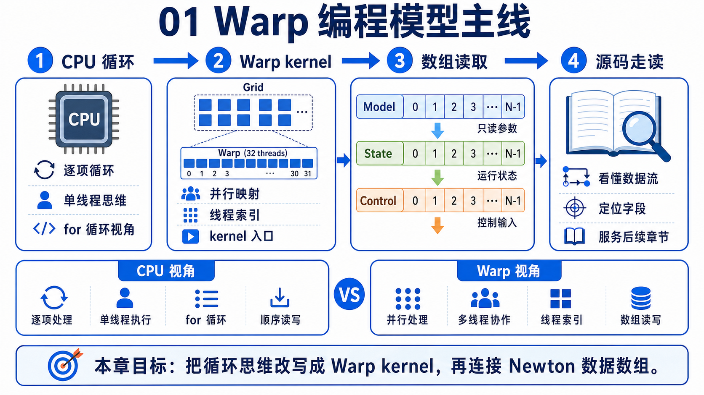
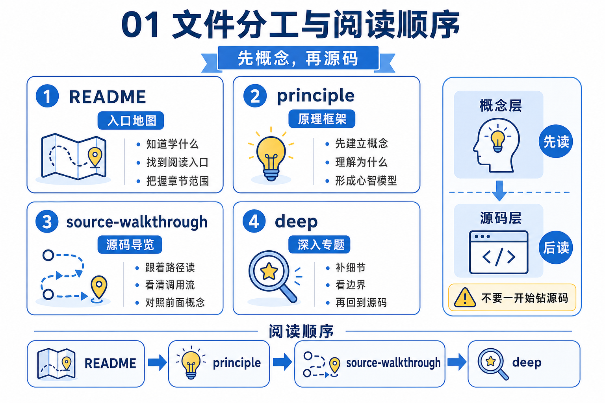
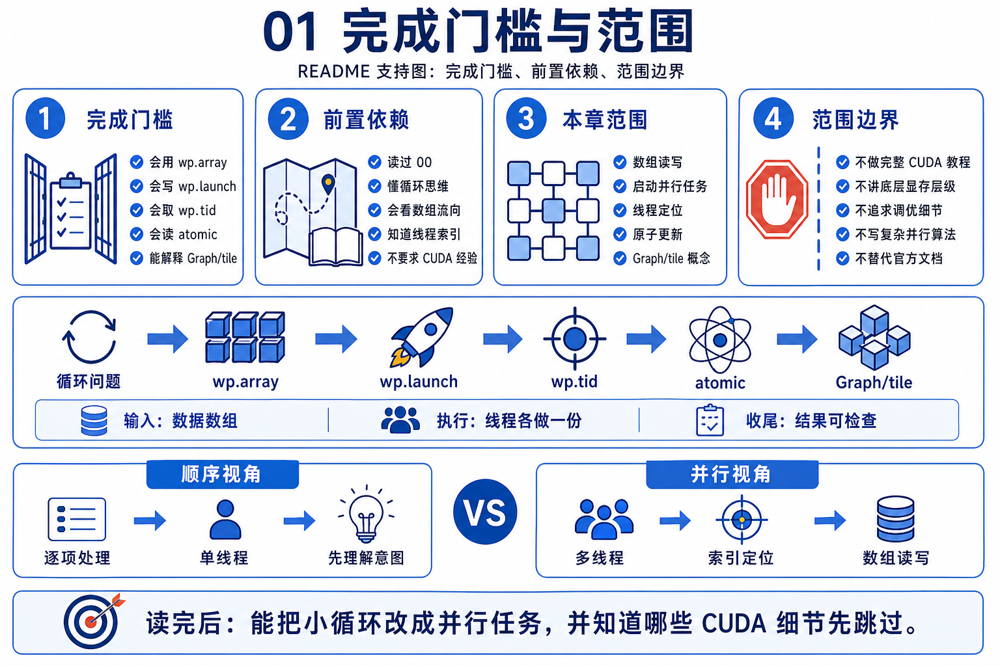

# 01 Warp 编程模型



这章不是 Warp 官方文档摘要，也不是 CUDA 速成。它只解决一个更小、但对 Newton 很关键的问题：看到 `kernel`、`wp.array`、`wp.launch`、`wp.atomic_add` 这些词时，你能先把它们放进一个稳定的执行模型里。

## 文件分工



- `README.md`：只负责本章边界、完成门槛和阅读入口。
- `principle.md`：先把 `kernel`、`wp.array`、`wp.launch`、`wp.tid()` 这些词翻译成人话。
- `source-walkthrough.md`：新手 / 主 walkthrough。第一次追 chapter 01 源码先看这一份；它会先把“为什么 Newton 里会出现 Warp”讲清，再顺着 `ordinary loop -> kernel -> launch/tid -> wp.array -> atomic -> graph/tile` 这条主线往下走。
- `source-walkthrough-deep.md`：深读锚点版。已经跟上主线后，如果你想精确追上游文件、symbol 和行号，再看这一份。

## 完成门槛



```text
[ ] 我能把普通 `for` 循环和 `kernel + wp.launch` 的关系讲清楚
[ ] 我能解释 `wp.array`、`wp.tid()`、`wp.atomic_add`、`wp.tile`、`Graph` 在第一遍阅读里的角色
[ ] 我知道进入 `02_newton_arch` 时该先看哪些关系，也知道哪些 Warp 细节现在可以先不追
```

## 本章目标

- 建立 Newton 学习者需要的最小 Warp 心智模型，而不是覆盖完整 Warp API。
- 让你分清“哪段代码是在定义单个元素的规则”“哪段代码是在发起批量执行”“哪些对象是在存批量数据”。
- 把这套心智模型直接接到 `02_newton_arch`，为读取 Newton 的对象分层和示例入口做准备。

## 前置依赖

- 建议先读 `00_prerequisites`，至少把仿真一步框架、动力学常见词和 Warp 速查过一遍。
- 不要求你先学完整 CUDA，也不要求你现在就会写自定义 Warp kernel。
- 只需要会读基本的 Python 循环、索引和数组概念，就足够进入本章。

## GAMES103 已有 vs 本章新增

| 维度 | GAMES103 已有 | 本章新增 |
|------|----------------|----------|
| 物理 / 数学视角 | 知道仿真会批量更新状态，但重点不在 GPU 执行模型。 | 解释为什么 Newton 里的同类更新会写成 kernel，而不是普通 Python `for` 循环。 |
| Newton 工程视角 | 不负责解释 Newton 为什么建立在 Warp 之上。 | 帮你先分清哪些对象是在存数据，哪些语句是在触发批量计算，为 `02` 的架构阅读铺路。 |
| GPU / Warp 视角 | 对线程索引、共享写入、调度打包通常只零散接触。 | 给出 `wp.array`、`wp.launch`、`wp.tid()`、`wp.atomic_add`、`wp.tile`、`Graph` 的第一层心智模型。 |

## 阅读顺序

1. 想先走最完整、最慢一点的概念坡道，就先读 `principle.md`。
2. 想直接从源码视角进入，也可以先读 `source-walkthrough.md`；它现在已经会把“为什么会有 Warp”这条来龙去脉先讲出来。
3. 觉得主 walkthrough 已经顺了，再回头用 `principle.md` 补更稳的概念翻译也可以。
4. 想精确追到上游文件、symbol 和行号，再看 `source-walkthrough-deep.md`。
5. 读完后再进入 `02_newton_arch`，把这套读法扩展到 Newton 的对象分层和例子入口。
6. 以后读 `11_mpm`、`13_diffsim` 时，如果又遇到更重的 Warp 细节，再回本章复看。

## 预期产出

- 你能把一段 Warp 代码先分成：数据缓冲区、kernel 本体、launch 位置、共享累加、执行打包。
- 你能用一句人话解释这些概念为什么会在 Newton 里出现，而不是只会背 API 名字。
- 你带着这套心智模型进入 `02` 时，不会再把 Warp 相关代码当成完全陌生的黑箱。
