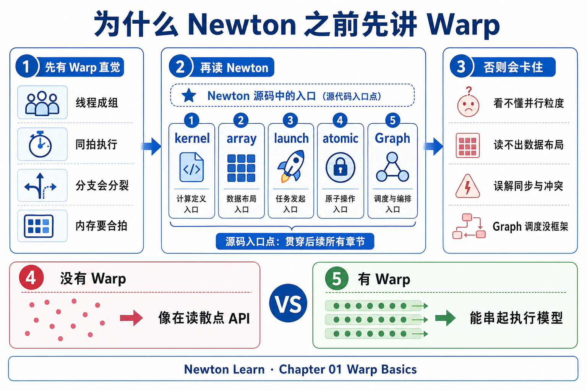
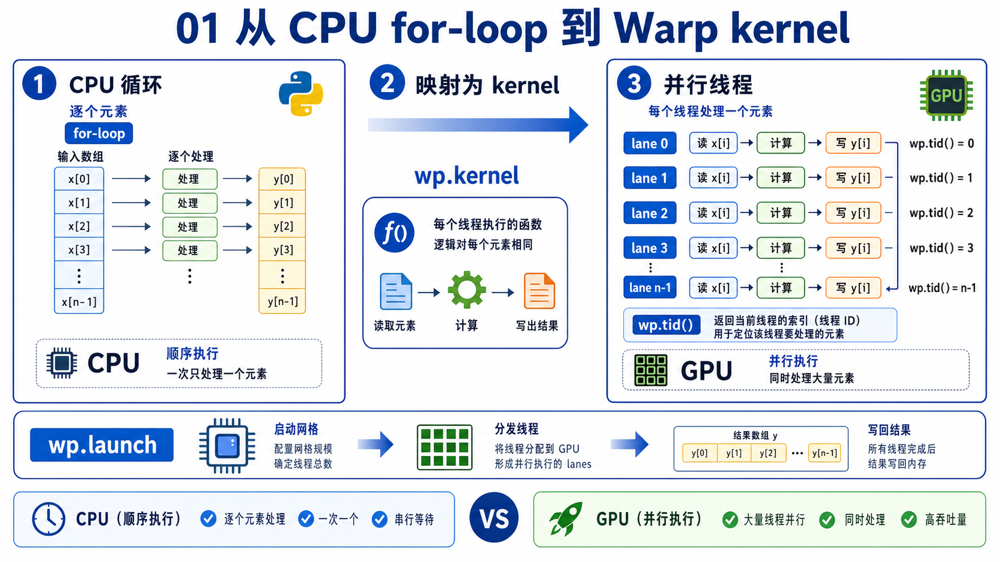
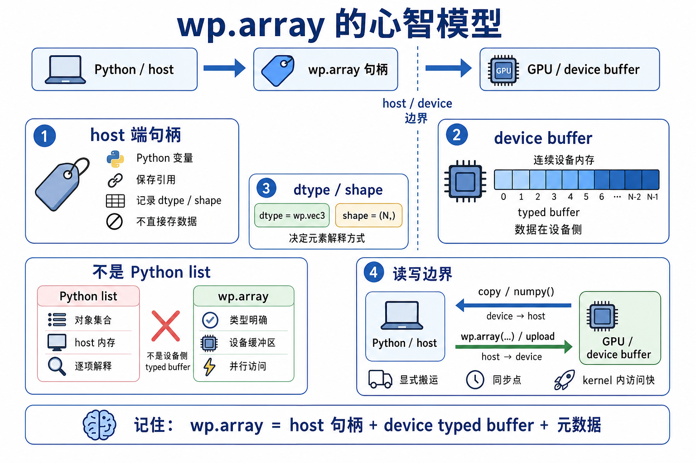
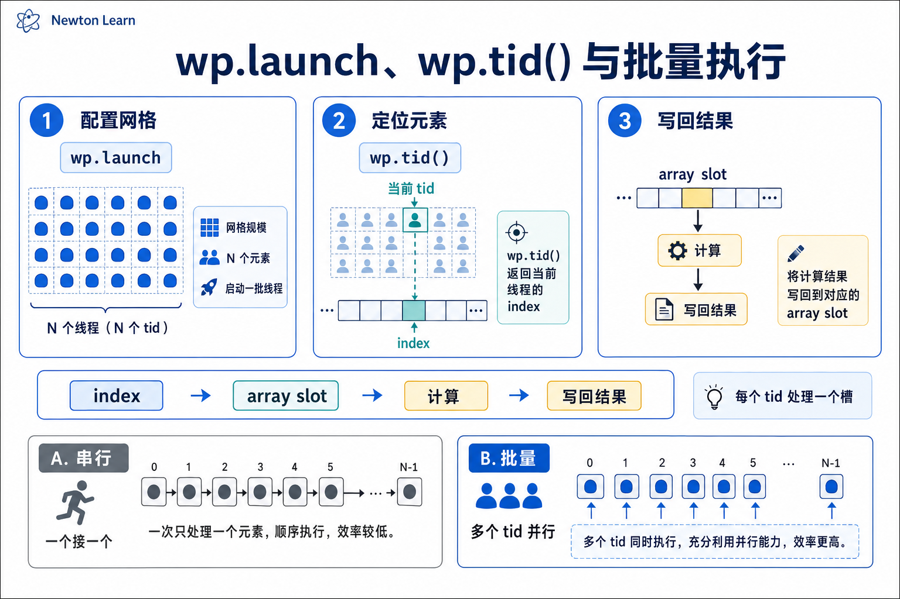
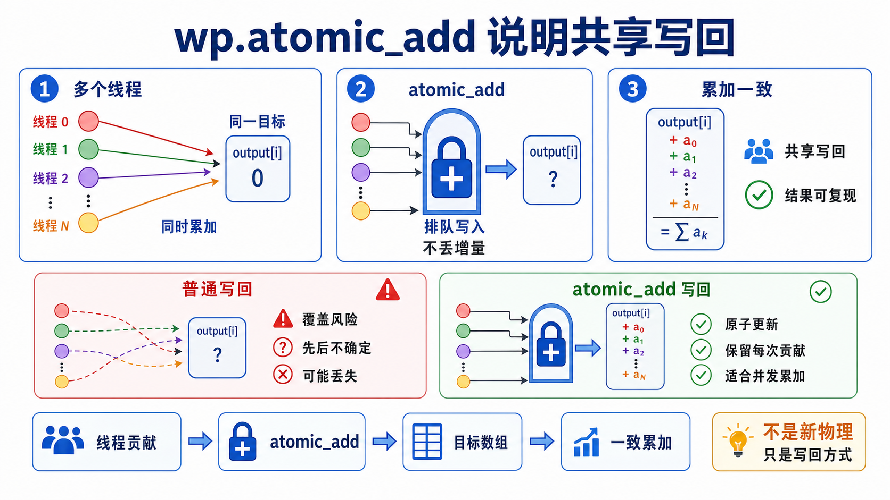
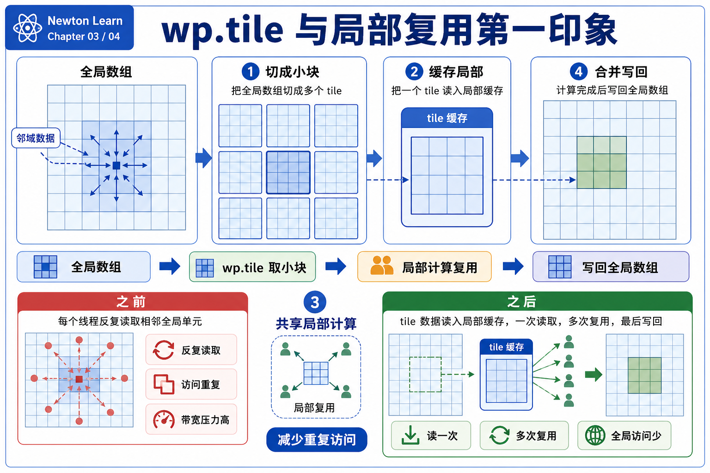
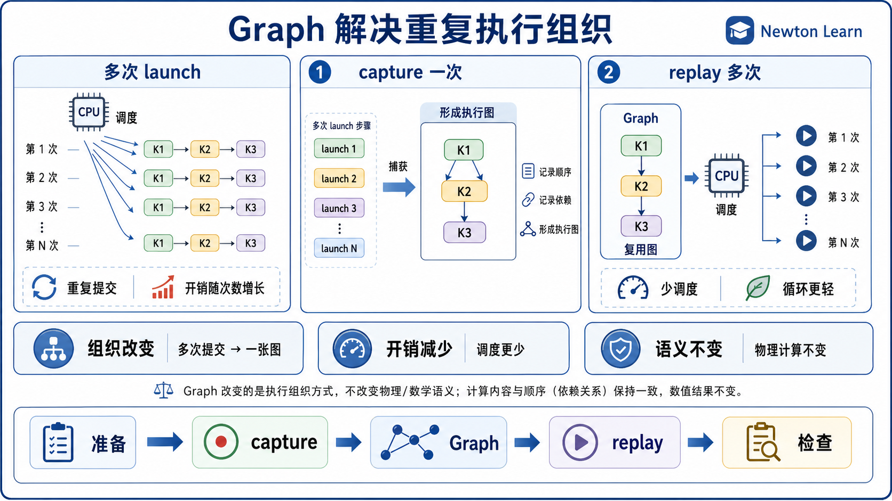
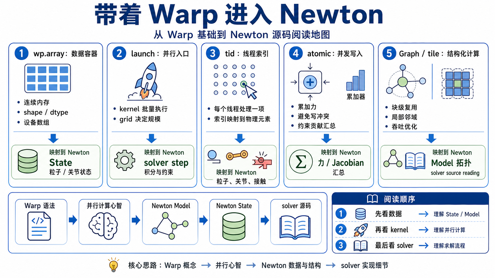

# 01 Warp 编程模型

## 0. 为什么在 Newton 之前先讲 Warp



`Newton` 不是一套只靠普通 Python 循环拼起来的教学代码。你很快就会看到 `@wp.kernel`、`wp.array`、`wp.launch` 这些名字。如果这些词对你还是黑箱，那么你读 `02` 时即使看见 `Model / State / Control / Solver`，也会很难判断“这段代码到底是在存数据，还是在真正发起计算”。

这章的任务不是把 Warp 全讲完，而是先给出一套够稳定的心智模型：什么是 kernel，数据放在哪里，批量执行是怎么发生的，为什么会有共享写入和调度打包。这样你进入 Newton 时，至少能先把代码的角色分清。

对 Newton 学习者来说，这一步现在就有用，因为 `02` 会开始真正进入仓库结构和示例入口。你不需要先会写复杂 Warp kernel，但需要先知道 Warp 在 Newton 里大概扮演什么角色。

## 1. 从 CPU for-loop 到 kernel



先从最熟悉的 CPU 写法开始想。很多计算本来都可以写成一个普通循环：

```python
for i in range(n):
    out[i] = f(x[i])
```

`kernel` 的第一层意思，就是把“单个元素该怎么处理”单独写出来，然后把这份规则批量发给很多元素一起执行。它不是一个更神秘的函数，而是“单次处理逻辑”的统一模板。

```python
@wp.kernel
def compute(x: wp.array(dtype=float), out: wp.array(dtype=float)):
    i = wp.tid()
    out[i] = f(x[i])
```

对 Newton 学习者来说，现在要懂这一点，是因为后面你看到的很多 kernel 都不是“零散的小工具函数”，而是在描述“每个刚体怎么更新”“每个约束怎么贡献一项”“每个粒子怎么做同样一套步骤”。只要你把 kernel 看成“单个对象的规则”，就更容易读懂一整批状态是如何被推进的。

## 2. `wp.array` 在心智模型里是什么



第一遍可以把 `wp.array` 看成“给 kernel 稳定读写的一块批量数据缓冲区”。它不是 Python list，也不要先把它理解成随手就能像普通脚本对象那样改来改去的容器。对初学者来说，更实用的想法是：Warp kernel 需要一块类型明确、布局稳定的数据，`wp.array` 就是在扮演这个角色。

这意味着你在看代码时，可以先问三个问题：这块数组里装的是什么量，它是输入还是输出，它会在多少次 step 之间被反复使用。只要先回答这三个问题，你就已经抓住了大部分一阶阅读需求。

Newton 学习者现在需要这个概念，是因为 `Model`、`State` 以及 solver 中间量最后都要落到某种“批量可读写的数据”上。你暂时不需要深究内存管理，但必须知道：当你看到一堆 `wp.array` 字段时，那通常不是装饰，而是 Newton 真实计算要读写的底座。

## 3. `wp.launch`、`wp.tid()` 和批量执行



如果说 kernel 是“单个元素怎么做”，那么 `wp.launch` 就是在说“把这件事按多大规模真正跑起来”。`dim` 决定这次要发出多少个逻辑执行单元，而 `wp.tid()` 则是当前这一个执行单元拿到的索引。

所以读一个 Warp kernel 时，不要只盯着函数体本身。函数体通常只写了“我负责第 `i` 个对象时该做什么”，真正决定“这里一共在处理多少个对象”的，是 launch 的地方。很多初学者会把 kernel 代码读得很认真，却漏掉了 `dim` 和输入数组的形状，结果就不知道这段逻辑到底是在按 body、joint、contact 还是 particle 批量运行。

对 Newton 学习者来说，这个概念现在就重要，因为进入 `02` 后，你会频繁遇到“代码看起来只写了几行，但其实是在整批推进系统状态”的场景。只要你养成“先看 launch，再看 tid 对应谁”的习惯，很多源码会立刻清楚很多。

## 4. 为什么会遇到 `wp.atomic_add`



当每个执行单元都只写自己的位置时，事情比较简单。但有些计算不是“一人一格”，而是“很多人都要往同一个地方累加结果”。这时如果还直接写普通加法，就会出现写冲突：多个执行单元可能同时改同一个位置，最后结果不稳定。

`wp.atomic_add` 的第一层意思，就是在这种“多对一累计”的场景下，提供一种安全的累加方式。你现在不需要先研究并发细节，只要记住：它通常在提醒你，这里存在共享目标和累加数据流。

Newton 学习者现在需要懂它，是因为接触、约束、梯度或力的汇总里，常常会出现“多个贡献回到同一个 body / dof / 缓冲区”的情况。以后你在源码里看到 `wp.atomic_add`，就可以先把它翻译成一句人话：这里不是新的物理概念，而是在解决批量执行下的共享写入问题。

## 5. `wp.tile` 与局部复用的第一印象



`wp.tile` 可以先把它理解成“为了让一小块数据在局部反复使用得更顺手，而把它们成组看待”。它服务的不是新的数学定义，而是更偏执行层面的局部复用。也就是说，同一小批数据如果会被多次用到，那么就值得用更适合局部处理的方式去组织。

第一遍读到它时，不必急着追问所有底层细节。对入门者更有用的判断是：这里作者开始关心“同一块数据会不会被重复读很多次”，所以代码从纯粹的逻辑正确，进一步走向执行效率。

这对 Newton 学习者现在有用，是因为你之后很可能会在更重的 kernel 里看到这类写法。如果你没有这层直觉，容易误以为 `tile` 代表“又出现了新的 solver 概念”。其实它更像是一个执行策略信号：物理问题没变，只是作者在想办法更高效地重复利用局部数据。

## 6. `Graph` 解决的是什么问题



很多仿真步骤会反复执行相似的 launch 序列：准备输入、跑几个 kernel、写回结果、进入下一帧。如果每次都从头调度这一整串动作，会有额外开销。`Graph` 的直觉版理解，就是把“会重复出现的一串执行关系”先打包好，后面按同样结构重复使用。

所以 `Graph` 解决的核心不是“算什么”，而是“重复算的时候怎样少做调度上的重复工作”。这点很重要，因为初学者第一次看到 graph capture 或 replay 时，很容易误以为系统换了一种算法；其实很多时候，变的是执行组织方式，不是物理更新规则本身。

对 Newton 学习者来说，这个概念现在就够用了。你读代码时只要先问一句：这里是不是在把每步都会重复的那串 Warp 工作流打包起来？如果答案是肯定的，那你就已经抓住了 `Graph` 对当前阅读最关键的意义。

## 7. 带着这些概念进入 Newton 时，先看什么，不必急着看什么



带着这章进入 `02` 时，最值得先看的不是优化细节，而是角色对应关系。你可以优先看三件事：

1. `Model / State / Control / Solver` 分别装的是什么。
2. 哪些数据是 `wp.array` 这类批量缓冲区。
3. 哪些地方在用 kernel 和 launch 把“一条规则”批量施加到很多对象上。

如果你能把这三件事对上号，Newton 的总体架构就已经开始变得可读。接下来再看到 `atomic_add`，你会知道那是共享累加；看到 `tile`，你会知道那是局部复用；看到 `Graph`，你会知道那是重复调度的打包。

现在不必急着看的内容也很明确：你还不需要自己设计复杂 Warp kernel，不需要先研究所有性能优化，也不需要先把 `tile` 或 `Graph` 的底层机制吃透。你现在真正需要的，只是一个稳定的 Warp 心智模型。

带着这个心智模型进入 `02_newton_arch` 就够了。下一章会把这些概念放回 Newton 的对象分层和示例入口里。你仍然不需要会写复杂 Warp kernel，也不需要先知道所有优化技巧；先把“数据放哪里、批量执行怎么发生、共享写入为什么出现”这三件事想稳，再进入 Newton 架构，会顺很多。
