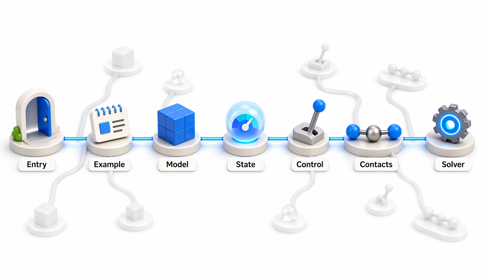
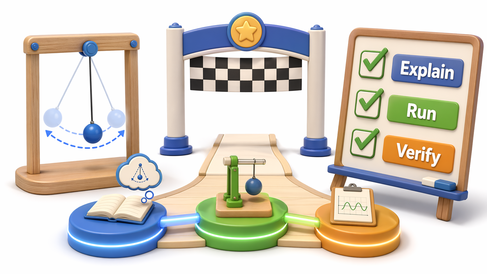
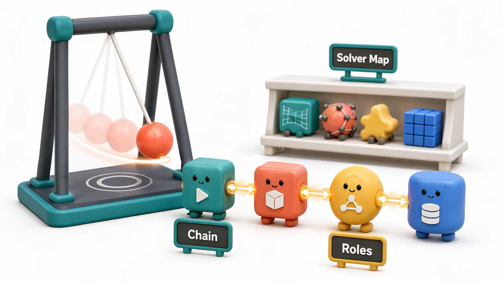
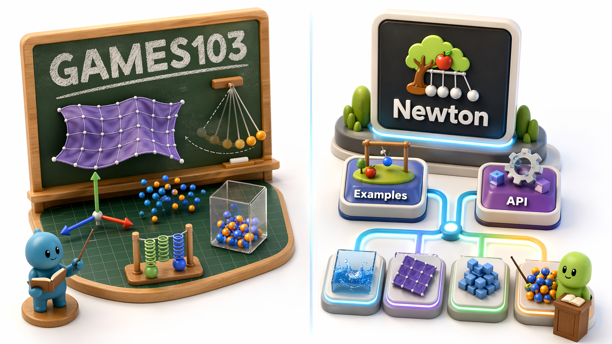
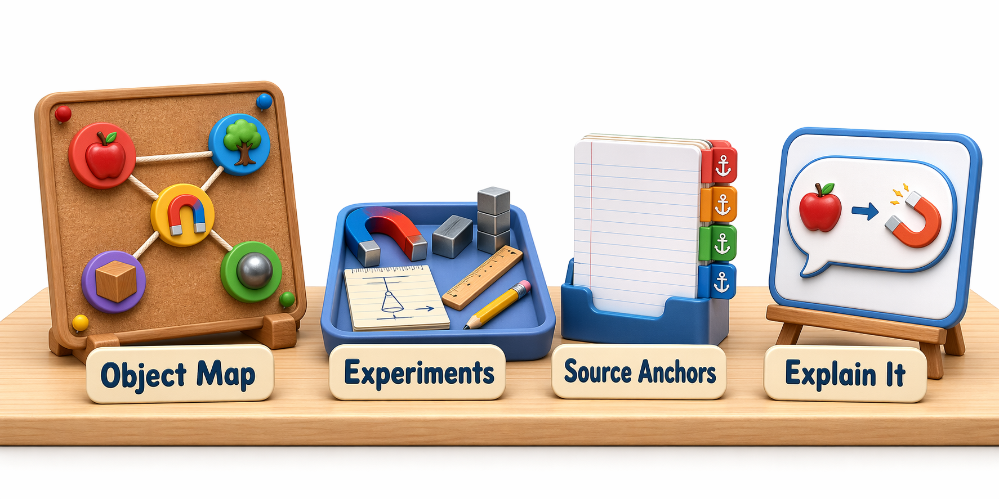

# 02 Newton 总体架构

`00_prerequisites` 先回答了“这些前置词到底是什么意思”，`01_warp_basics` 再回答了“Warp 的批量执行模型到底怎样工作”。到了这一章，才正式开始进入 Newton 本体：先从 `basic_pendulum` 和 `newton.examples` 接住读者，再把公共 API、`Model / State / Control / Solver` 这条四层主干，以及与它并列进入 step 的 `Contacts` 结果缓冲区串起来。

## Source Note


这是一张教学压缩图：它只画阅读边界，学习仓负责讲解和导航，真实源码仍然要回到并列的上游 `newton` checkout。也就是说，这个仓库主要存放的是学习文档，不是上游 Newton 源码本体；文中提到的 `newton/...` 路径，指的是 **上游 Newton 源码 checkout** 里对应的文件，而不是 `newton-learn` 仓库里的文件。线上阅读时，再用 front matter 里的 `source_paths` 和 `newton_commit` 对齐版本。

- 本地阅读时：打开与你的文档仓并列的上游 `newton` 源码仓。
- 线上阅读时：按本页 `source_paths` 和 `newton_commit` 去对照对应版本的上游源码。

## 文件分工


这是一张教学压缩图：这几份文件不是平行重复，而是按“边界说明、主线讲解、例子观察、源码 walkthrough、深读索引、疑问补图”分工。读 chapter 02 时，先把自己送到对的文档，再决定要不要展开。

- `README.md`：只负责本章边界、完成门槛和阅读入口。
- `principle.md`：先把 `basic_pendulum -> examples 入口 -> 公共 API -> Model / State / Control / Solver` 这条四层主干讲顺，并解释 `Contacts` 为什么会在 runtime loop 里并列出现。
- `examples.md`：把 `basic_pendulum`、`robot_cartpole`、`cloth_hanging` 先变成观察任务。
- `source-walkthrough.md`：新手 / 主 walkthrough。第一次追 chapter 02 源码先看这一份；它只跟 `basic_pendulum` 这条最小主线，重点讲清 launcher、`Example.__init__()`、runtime objects 和 `simulate()`。
- `source-walkthrough-deep.md`：深读锚点版。已经跟上主线后，如果你想精确追上游文件、symbol 和行号，再看这一份。
- `question-notes.md`：问题驱动补充图解。不是新的 completion gate；它专门接住学习 02 章时最常见的图像化困惑，比如双 `__main__`、`joint` 连接关系、`p / q / axis` 分工和 joint-frame 等价写法。

## Core Pass



这是一张教学压缩图：它把 first pass 限定在一条薄主线上，入口很薄，真正的组装点在 `Example.__init__()`，再落到 runtime objects 和 solver contract。chapter 02 的 first pass 不该扩成“读完整个 Newton 架构”；只要能把这条链讲顺，就已经达到本章的核心阅读目的。这轮只要求你先追下面这些锚点：

| 先看什么 | 只抓什么 |
|------|----------|
| `newton/examples/__main__.py` | 确认 CLI 入口本身极薄，只负责转发。 |
| `newton/examples/__init__.py` | 只看 `get_examples()`、`main()`、`run()`。 |
| `newton/examples/basic/example_basic_pendulum.py` | 只看 `Example.__init__()`、`simulate()`、`step()`。 |
| `newton/__init__.py` | 只看 public exports，确认 Newton 想先暴露给用户的核心对象名。 |
| `newton/_src/sim/model.py` | 只看 `state()`、`control()`、`contacts()`、`collide()`。 |
| `newton/_src/solvers/solver.py` | 只看统一的 `step(state_in, state_out, control, contacts, dt)` contract。 |

## Defer For Now


这是一张教学压缩图：这些支线不是不重要，而是现在先故意停在路边。这样做的目的，是避免 first pass 在 viewer、builder internals 或 solver internals 里失焦。下面这些内容现在先明确跳过，不属于 chapter 02 的 core pass：

| 先别追什么 | 为什么现在先跳过 |
|------|----------------|
| `newton/examples/__init__.py` 的 viewer / parser / device plumbing | 这是 examples 基础设施，不是 chapter 02 的架构主线。 |
| `example_basic_pendulum.py` 的 `capture()`、`render()`、`test_final()` | 这是 graph replay / viewer / 测试支线，不是 first pass 主问题。 |
| `newton/_src/sim/builder.py` 里 `ModelBuilder.finalize()` 的内部实现 | 这里更适合和场景构建章节一起读。 |
| `newton/_src/solvers/xpbd/solver_xpbd.py` | solver internals 应该留到 solver 章节，不在 02 展开。 |
| 其它 examples 的源码横向对读 | `basic_pendulum` 已经足够搭出 chapter 02 的最小执行链。 |

## 完成门槛



这是一张教学压缩图：完成门槛不是背 API 名字，而是能口头解释 chapter 02 的组装点、三层 step 和 state swap。最后还要能把 `basic_pendulum` 真跑一遍，把图上的链和实际执行过程对上。

```text
[ ] 我能指出 `Example.__init__()` 是 chapter 02 最关键的组装点
[ ] 我能解释 `Model / State / Control / Solver` 这条四层主干分别负责什么，以及 `Contacts` 为什么会作为并列结果缓冲区出现
[ ] 我能解释为什么 constructor 里要先调用 `eval_fk(...)`
[ ] 我能区分 `examples.run()`、`Example.step()` 和 `Solver.step()` 三层 step，并知道 `simulate()` 是 `Example.step()` 里的 substep chain
[ ] 我能解释为什么 `state_0` / `state_1` 会在 substep 末尾交换角色
[ ] 我能跑通并口述 basic_pendulum 的最小执行链
[ ] 我能指出一个具体例子如何从 examples 入口落到 runtime stack，并解释 `Contacts` 在哪里被接上
```

## 本章目标



这是一张教学压缩图：本章目标是先拉通 Newton 的最小执行链，再建立四层主干加 `Contacts` 的心智模型。8 个 solver 只保留地图感，不在这一轮变成硬性完成条件。

- 用 `basic_pendulum` 把“examples 入口 -> 公共 API -> `Model / State / Control / Solver` 四层主干 + `Contacts` 结果缓冲区 -> 一次 step”这条最小执行链先拉通，而不是一开始就陷进某个 solver 的细节。
- 建立 `Model / State / Control / Solver` 四层主干心智模型，并知道 `Contacts` 为什么作为 runtime loop 中的并列结果缓冲区出现。
- 对 8 个 solver 只保留轻量地图感；它是 second pass 导航，不算 chapter 02 core pass 的完成条件。

## 前置依赖


这是一张教学压缩图：左侧是进入本章前已经要拿稳的词和执行模型，中间是 chapter 02 自己负责的组织问题。右侧则提醒你读完后最自然的去向，不必在本章里提前展开。

- `00_prerequisites`：已经先解决“这些前置词到底是什么意思”，包括仿真一步框架、`articulation`、`M`、`J` 以及最小 Warp 词汇。
- `01_warp_basics`：已经先解决“Warp 的批量执行模型是怎么工作的”，包括 `kernel`、`wp.array`、`wp.launch`、`wp.tid()`、`wp.atomic_add` 的第一层心智模型。
- `[MUST] mujoco-warp-paper`：本章把它作为 MuJoCo Warp 路线的背景锚点，不要求现在吃透全部推导，但要知道它为何存在。

## GAMES103 已有 vs 本章新增



这是一张教学压缩图：GAMES103 给的是通用仿真视角，本章新增的是把这些抽象对象压到 Newton 的真实入口、公共 API 和 Warp-based solver 家族上。这样读者会知道自己不是在学一张抽象白板，而是在接一套真实代码库。

| 维度 | GAMES103 已有 | 本章新增 |
|------|----------------|----------|
| 物理 / 数学视角 | 知道仿真会分模型、状态、积分与约束求解。 | 把这些抽象对象对应到 Newton 的真实 API 和例子入口。 |
| Newton 工程视角 | 对具体代码库组织通常没有要求。 | 先看 `newton/__init__.py` 暴露了哪些公共对象，再看 `newton/examples/` 怎样把它们串起来。 |
| GPU / Warp 视角 | 对 GPU 数据布局和 kernel 调度着墨较少。 | 知道 Newton 不是单一 solver 教具，而是一组基于 Warp 的 solver 家族入口。 |

## 阅读顺序


这是一张教学压缩图：主线默认是 `source-walkthrough.md` 加一次真实运行，`principle.md` 只是可选预热。`question-notes.md` 和 `source-walkthrough-deep.md` 都是按需插入的支线，而不是一开始就全吃。

1. 先带着 `00` 和 `01` 的答案进入本章：这里不再重讲前置词和 Warp 执行模型，而是开始问“Newton 自己怎样把这些东西组织起来”。
2. 如果你想先做 10 分钟概念预热，就先读 `principle.md`；但 chapter 02 真正的 first-pass 主线，还是 `source-walkthrough.md`。
3. 第一次追源码时，立刻转到 `source-walkthrough.md`，只跟 `basic_pendulum` 这条 core pass，先别横向展开别的 example，也先别啃 `finalize()` 和 solver internals。
4. 再实际运行 `basic_pendulum`，把 walkthrough 里那条 `clear_forces -> apply_forces -> collide -> solver.step -> swap` 链和实际运行过程对上号。
5. 然后读 `examples.md`，把 `robot_cartpole --world-count 100`、`cloth_hanging --solver xpbd` 当成第二层观察任务，而不是 first-pass 主线。
6. 如果你在双 `__main__`、`parent=-1`、`rot` vs `axis`、`p / q / axis` 这些具体困惑上卡住了，就跳到 `question-notes.md` 看问题驱动图解，再回到源码核对。
7. 想精确追到上游文件、symbol 和行号，再看 `source-walkthrough-deep.md`。
8. 如果中途发现某个动力学词或 Warp 机制又松了，就分别回 `00_prerequisites` 或 `01_warp_basics` 补洞，再回到本章。

## 预期产出



这是一张教学压缩图：读完这一章，最好能留下几份可复用的学习产物，而不是只剩“我好像看过”。这些产物会直接成为后续 `03`、`04`、`05` 章节继续前进时的脚手架。

- 一张 `Model / State / Control / Solver` 四层主干关系图，并知道 `Contacts` 为什么在 runtime loop 里并列出现。
- 一份 `examples.md` 观察单，把三个 quick-win 命令改写成“改哪里、看哪里”的实验入口。
- 一份 `basic_pendulum` 的源码锚点清单，能指出 examples 薄入口、真实 launcher、runtime objects 分层以及一次 `step` 落在哪些文件上。
- 能在不看稿的情况下，口述 `basic_pendulum` 从 examples 入口到 solver step 的最小讲解链。
- 如果你还有余力，再把 8 个 solver 的地图当成 second-pass 导航补上，而不是 first-pass 必做项。

读完这一章后，如果你想先把 `Model` 背后的数学和场景构建补稳，就继续到 `03_math_geometry` 和 `04_scene_usd`；如果你已经确定自己要沿刚体主线往下走，就直接去 `05_rigid_articulation`，再到 `08_rigid_solvers` 看刚体 solver 家族怎样真正展开。
