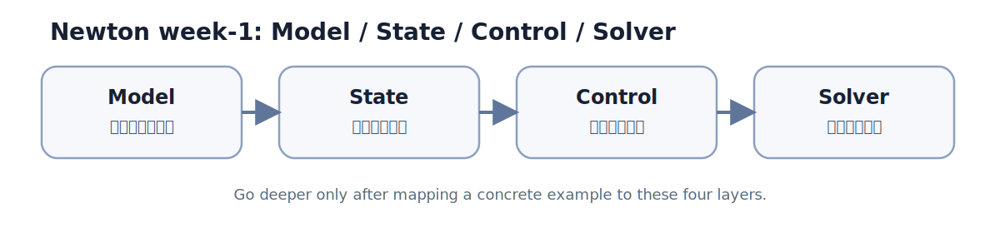
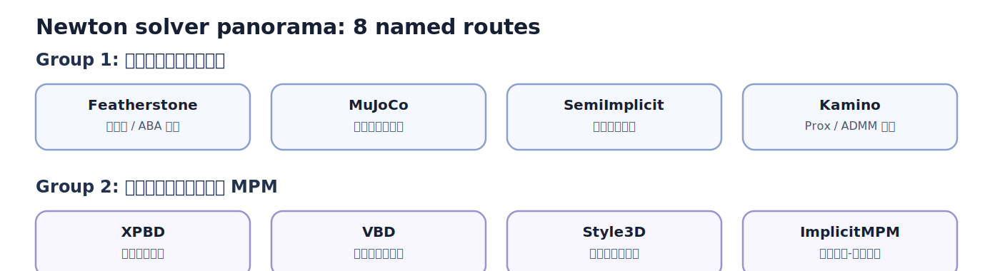

# 02 Newton 总体架构

## 0. 本章目标

- 用一个 week-1 级别的框架，把 Newton 看成“例子入口 + 四层对象 + solver 家族”，先建立方向感。
- 先能解释 `basic_pendulum` 这种最小例子为何能跑起来，再把不同 solver 分流到后续章节。
- 把 GAMES103 里的抽象概念绑到 Newton 的真实入口：`newton.examples`、`newton/__init__.py`、`newton/_src/core/`。

## 1. 从例子入口看最小执行链

`newton/examples/__main__.py` 很薄，它只是把 `python -m newton.examples <example_name>` 转发到 examples 主入口。对学习来说，这很重要：你不需要先理解整个仓库，只要知道所有 demo 都从同一个命令面板进入。

围绕 `basic_pendulum`，可以先用三步把执行链讲清楚：

1. `Model`
   `Model` 是静态描述层，回答“世界里有什么”。它包含刚体、关节、几何、质量属性以及 solver 需要读取的结构化常量。`newton/__init__.py` 也明确把 `Model` 暴露成公共 API，说明它不是内部细节。
2. `State + Control`
   `State` 是随时间变化的仿真量，回答“这一帧系统在哪里、速度是多少”；`Control` 是外部输入层，回答“这一帧我想施加什么驱动、目标或命令”。学习时可以把它们看成“系统当前快照”和“这一拍给系统的操作杆”。
3. `Solver`
   `Solver` 读 `Model`、当前 `State` 和可能的 `Control`，做一步推进，产出新的 `State`。对初学者最关键的不是每个 solver 的数学细节，而是知道 Newton 把不同物理路径都包装成可替换的求解阶段。

这三步背后其实展开成四层关系：`Model` 提供不变量，`State` 提供时变量，`Control` 提供外部输入，`Solver` 把前三者接起来完成一步更新。

## 2. 四层关系图



- `Model` 先定边界：拓扑、质量、关节、碰撞形状通常不在每步里重建。
- `State` 是时间轴上的快照：位置、速度、接触中间量等都会跟着 step 更新。
- `Control` 不是每个例子都复杂，但它给了“目标轨迹、力矩、驱动命令”一个独立入口。
- `Solver` 不是孤立算法名词，而是把前三层组装成一次数值推进的执行器。
- 真正深入某个例子前，先把例子里的变量映射到这四层，阅读成本会立刻下降。

## 3. 8 个 solver 的全景图



8 个 solver 可以先粗分成两簇：一簇偏刚体与通用动力学主线，另一簇偏约束投影、布料软体和 MPM。第一周不求精读源码，先记住地形图。

| Solver | 这一章先记住什么 | 后续章节 |
|--------|------------------|----------|
| Featherstone | 刚体 articulation 的经典主线，适合把关节树和 ABA 心智模型落地。 | `05_rigid_articulation`, `08_rigid_solvers` |
| MuJoCo | Newton 里另一条刚体接触与优化主路径，本章只先把它和 paper 关联起来。 | `07_constraints_contacts_math`, `08_rigid_solvers` |
| SemiImplicit | 最容易拿来解释“先有系统再做一步更新”的基础求解路径。 | `08_rigid_solvers`, `10_softbody_cloth_cable` |
| Kamino | 刚体求解中的优化/ADMM 路线，本章只需要知道它属于高级刚体路线。 | `08_rigid_solvers` |
| XPBD | 约束投影视角的代表，布料和软约束会频繁回到它。 | `09_variational_solvers`, `10_softbody_cloth_cable` |
| VBD | 变分块坐标下降路线，和 XPBD/Style3D 适合做并排比较。 | `09_variational_solvers`, `10_softbody_cloth_cable` |
| Style3D | 面向布料的工程化 solver 名字，先记住它是 cloth 路线里的专门选手。 | `09_variational_solvers`, `10_softbody_cloth_cable` |
| ImplicitMPM | 进入粒子-网格与隐式材料系统的入口，不属于刚体线。 | `11_mpm`, `15_multiphysics_pipeline` |

## 4. 快速胜利 demo

先把下面四条命令跑过一遍，不求一次讲透全部内部实现，只求建立“例子名字 -> 四层对象 -> solver 家族”的直觉。

```bash
uv sync --extra examples
uv run -m newton.examples basic_pendulum
uv run -m newton.examples robot_cartpole --world-count 100
uv run -m newton.examples cloth_hanging --solver xpbd
```

建议优先改三个参数，观察你改的是四层中的哪一层：

- 改 `--world-count`：观察同一套 `Model`/solver 被复制到多世界时，吞吐和心智模型怎么变化。
- 改 `cloth_hanging` 的 `--solver`：直接体会“同一类场景，不同 solver 家族”的入口切换。
- 改 `basic_pendulum` 或 `robot_cartpole` 的初始条件/驱动相关参数：区分这是在改 `State`、`Control` 还是 `Model`。

## 5. 与后续章节的接口

- `03_math_geometry`：本章只说“对象如何分层”，下一章补这些对象内部依赖的坐标、变换、几何与距离计算基础。
- `04_scene_usd`：本章先把 `Model` 当黑盒静态描述，`04` 再拆它是怎样从 USD/URDF/MJCF 之类输入被构建出来的。
- `05_rigid_articulation`：本章只把 Featherstone 放进全景图，`05` 才真正进入刚体树、关节与 ABA 的细节。
- `08_rigid_solvers`：本章给刚体 solver 地图，`08` 再正面对比 Featherstone、MuJoCo、SemiImplicit、Kamino 四条路线。

## 6. 与 Newton 实现的映射

- `newton/examples/__main__.py`：说明 examples 的运行入口非常薄，学习重点应该落在被调起的 example 和其使用的公共 API，而不是 CLI 包装本身。
- `newton/__init__.py`：这里能直接看到 Newton 暴露给用户的基础对象，包括 `Model`、`State`、`Control`、`CollisionPipeline` 等；它是“哪些概念属于公共表面”的最好目录。
- `newton/_src/core/`：当前 core 层很薄，主要暴露基础类型和少量跨模块核心常量/类型；这提醒我们 Newton 的“总体架构”并不只在某个 core 大文件里，而是分散在 public API、sim、solver 与 examples 的协作关系中。
