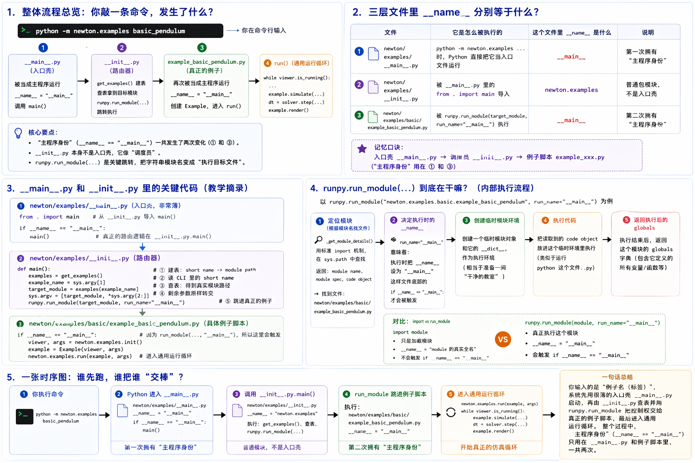
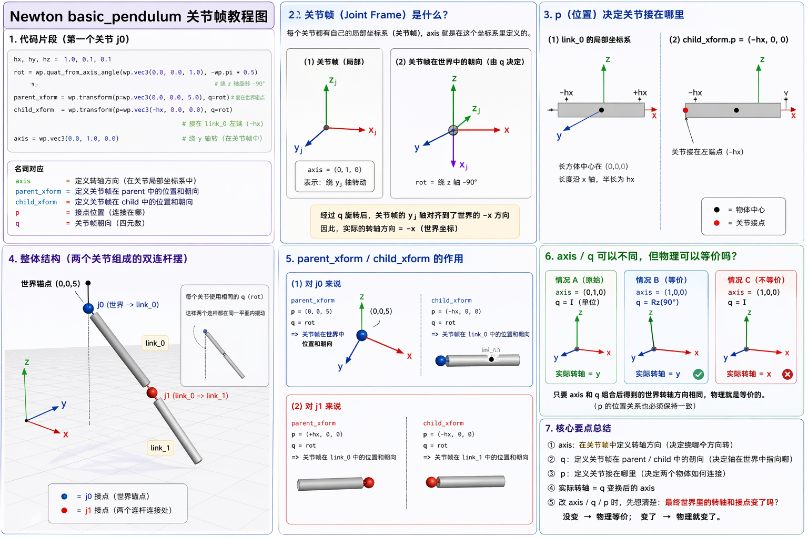
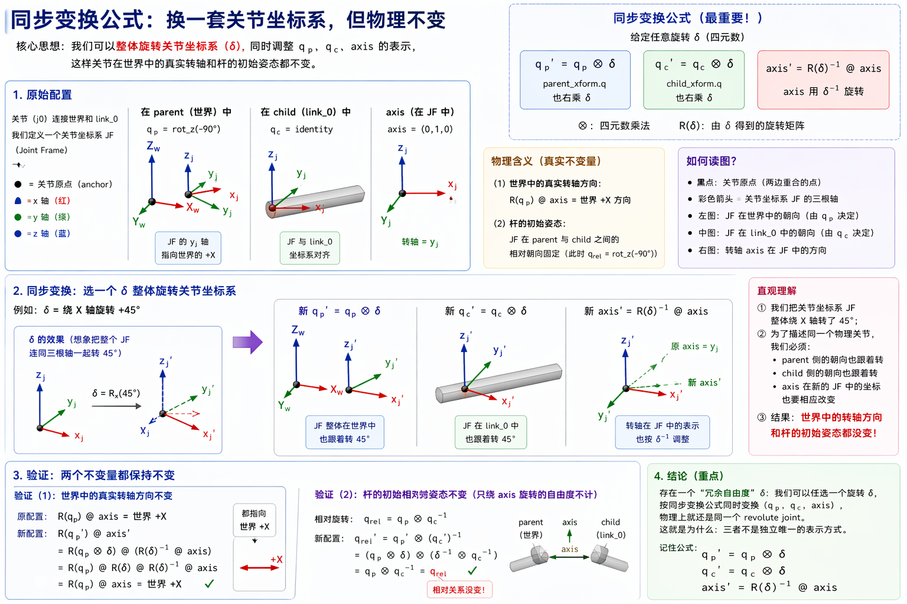

# 02 Newton 总体架构 问题驱动补充图解

这页专门接 chapter 02 学习过程中最常见的几个卡点。主 walkthrough 故意保持很窄，只守住 `examples 入口 -> Example.__init__() -> runtime objects -> simulate()` 这条主链；但真实学习时，很多困惑会以图像化问题冒出来，比如“为什么 `__main__` 会出现两次”“`joint` 到底在干嘛”“`p / q / axis` 到底谁管什么”。

所以这页的定位不是替代 `source-walkthrough.md`，而是给这些问题一个专门的图解落点。

先记一个总规则：下面几张图里，有些是**源码近似等值图**，有些是**为了解释困惑而做的教学压缩图**。如果图和 pinned source 有冲突，以本章正文和上游源码为准；这页会把冲突点直接写出来，不让你自己猜。

## 1. 为什么 `__main__` 会出现两次



这张图最有用的地方，不是第 4 格的细节，而是它把“`__main__` 身份会出现两次”这个心理坎一次讲透了：

- 第一次 `__main__`：`python -m newton.examples basic_pendulum` 让 `newton/examples/__main__.py` 作为入口模块执行。
- 第二次 `__main__`：`runpy.run_module(target_module, run_name="__main__")` 把目标 example module 当作新的主程序执行，所以 `example_basic_pendulum.py` 里的 `if __name__ == "__main__":` 也会触发。

但这张图也做了一次教学压缩：它把 `run()` 那一格画成了“通用运行循环”并顺手写了 `simulate(...)`、`solver.step(...)`。读图时要自己补上精确分层：

```text
examples.run()
-> Example.step()
-> Example.simulate()
-> Solver.step()
```

也就是说，这张图适合拿来回答“控制权是怎么一路交棒过去的”，不适合拿来背精确的 runtime layer 边界。精确边界请回 `source-walkthrough.md` 的 Stage 2 和 Stage 5。

## 2. `joint` 到底在干嘛


这张图对 chapter 02 很有价值，因为它正好补上了 main walkthrough 故意不展开的那一步：`add_joint_revolute(...)` 到底在把什么和什么连起来。

第一遍你只要带走四句：

- `j0` 用 `parent=-1` 把世界锚点接到 `link_0`。
- `j1` 用 `parent=link_0` 把 `link_1` 接到 `link_0` 的末端。
- `axis=(0, 1, 0)` 回答的是“这个 hinge 允许绕哪根轴转”。
- `parent_xform` / `child_xform` 回答的是“这个 joint 点分别在 parent / child 那一侧怎样表达”。

这张图和 pinned source 是基本对齐的，所以可以把它当成 `Example.__init__()` 的图解版。但它仍然只覆盖“构造这条两级关节链”这一层，没有把 runtime objects、`eval_fk(...)` 或 `simulate()` 拉进来；所以它是 chapter 02 的补充，不是新的主线。

这里也要补一条精确说明：图左上把 `(0, 0, 5)` 绕 `z` 轴画成了 `(5, 0, 0)`，这是为了单独强调 `q` 会改变朝向的教学示意，不是 pinned source 的字面执行结果。对 chapter 02 这里真正要守住的是：源码里 `parent_xform.p` 仍然就是 `(0, 0, 5)`，`rot` 填的是 `parent_xform.q`，不要把 `p` 和 `q` 的 job 混掉。

## 3. `p / q / axis` 为什么这么容易混



这张图有用的地方，是它把三个经常被混成一团的问题拆开了：

- `axis`：关节局部坐标里定义的转轴方向。
- `p`：关节点接在物体的什么位置。
- `q`：关节帧在 parent / child 那一侧怎样定朝向。

如果你只想带走一个判断标准，就记这句：

```text
先别盯变量名像不像，先问“最后世界里的转轴方向和关节点位置有没有变”。
```

但这张图同时也是典型的教学压缩图，不要把左上角代码框当成 pinned source 的逐行镜像。这里至少有两处必须显式纠正：

- 在 pinned source 里，`j0` 的 `child_xform.q` 是 `wp.quat_identity()`，不是图里画出的 `rot`。
- 在 pinned source 里，`j1` 的 `parent_xform.q` 和 `child_xform.q` 也都是 `wp.quat_identity()`；它不会沿用 `j0` 的 `rot`。
- 如果按 pinned source 直接算 `R(parent_xform.q) @ axis`，`j0` 的世界系转轴方向是 `+x`；所以这张图里关于 `-x` 的标注，更适合当成“`q` 会把局部 axis 带到世界里”的示意，而不是 source-exact 的符号结论。

所以最安全的读法是：

- 把这张图当成“角色分工图”，用来分清 `axis / p / q` 各回答什么问题。
- 把真正的源码值，仍然回到 `example_basic_pendulum.py` 的 constructor 去核对。

## 4. 为什么换一套 joint frame，物理还能不变



这张图解决的是 second pass 才会冒出来的问题：为什么有时你看到 `q_p`、`q_c`、`axis` 一起变了，但物理关节看起来没变？

chapter 02 这里先只要求你接受一个结论：

```text
同一个物理 joint，可能存在不止一种等价参数写法。
```

图里的“同步变换公式”想表达的是：如果你整体换了一套 joint-frame 坐标系，同时把 parent 侧朝向、child 侧朝向和 axis 的表示一起调过去，那么“世界里的真实转轴”和“parent / child 之间的真实相对姿态”仍然可以保持不变。

如果你把这张图和上一张图对着看，会发现它们对 `+X / -X` 的画法并不完全一致。这里不要背图上的符号方向本身；对 pinned source，最稳的做法还是回到源码定义去算 `R(parent_xform.q) @ axis`，确认真实世界转轴有没有变。

这张图的价值不在于让你现在就背四元数公式，而在于阻止一个常见误会：

- 误会：只要 `axis` 或 `q` 写法变了，物理就一定变了。
- 更准确的说法：先看真实转轴方向、关节点位置、相对初始姿态有没有变；只有这些变了，物理才真正变了。

如果你现在还在追 chapter 02 的 core pass，只要先把这节读成“joint parameterization 可能有等价自由度”就够了，不需要把公式推完。

## 5. 这页怎么和主线配合

- 想守住最小执行链：回 `source-walkthrough.md`。
- 想做 quick-win 观察任务：回 `examples.md`。
- 想精确追 symbol / line anchors：看 `source-walkthrough-deep.md`。
- 想解决某个具体困惑，但又不想一上来啃整段源码：先看这页对应的问题图，再回到主线文件核对。

最推荐的使用方式不是“把这页从头读到尾”，而是卡在哪个问题，就跳到对应一节。这样这些学习总结图就不会冲掉 chapter 02 的主线，反而能把本来缺的一层问题驱动补充补上。
