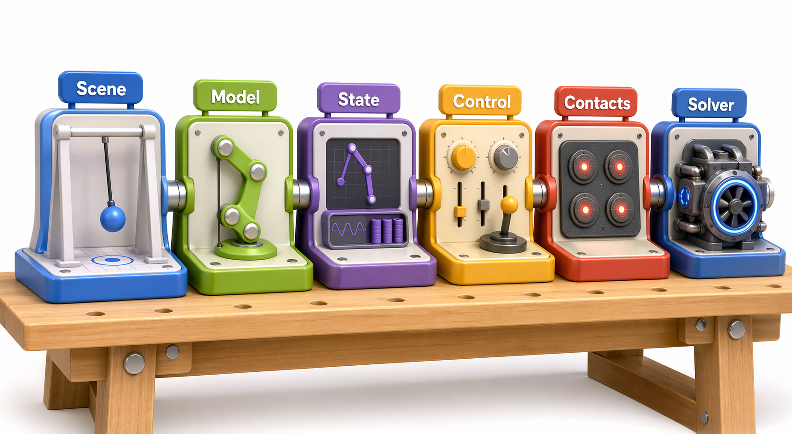
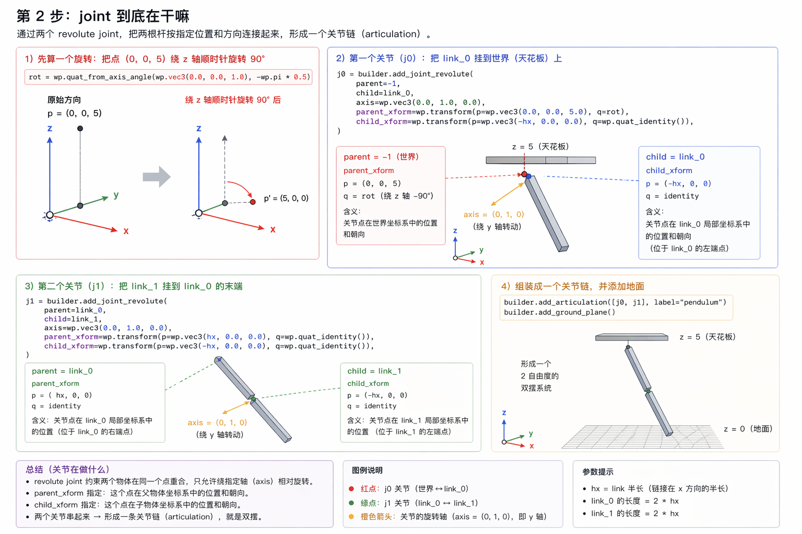
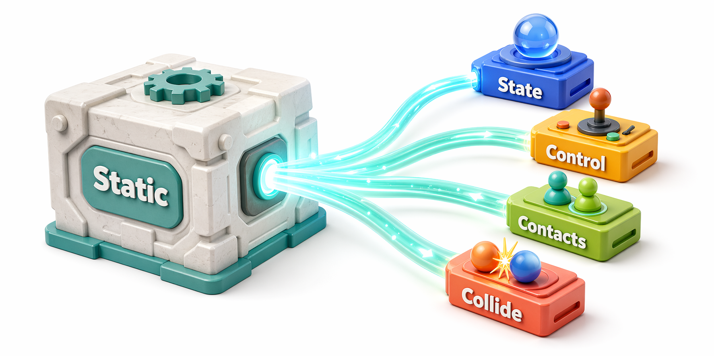
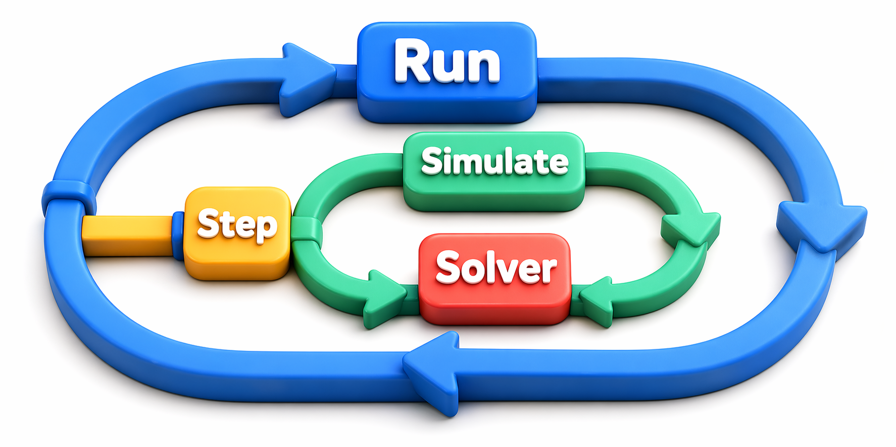
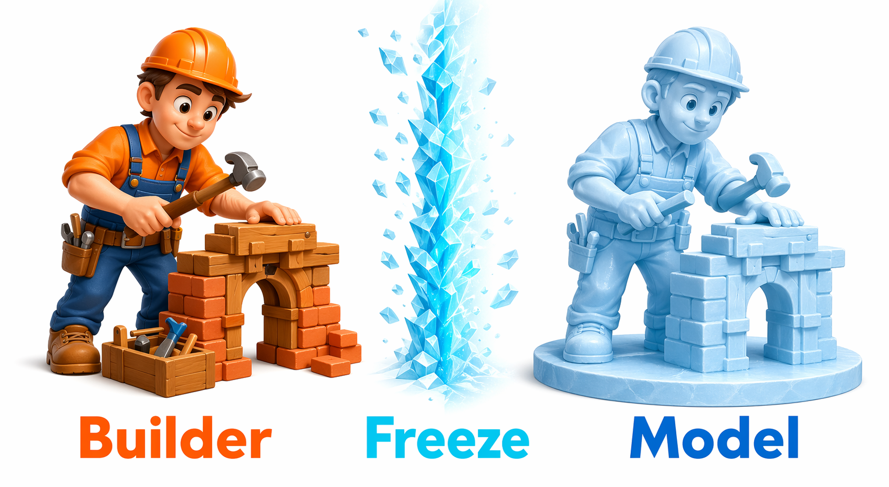
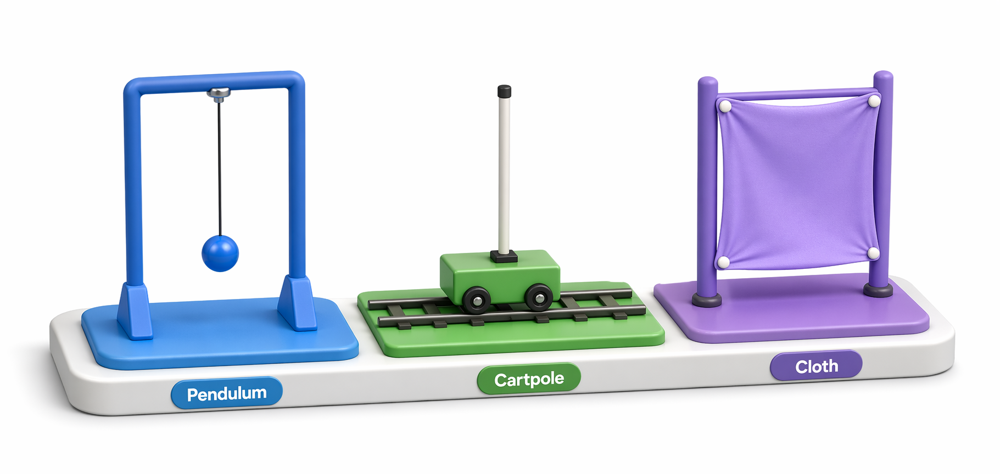

# 02 Newton 总体架构 深读锚点版

这份 deep walkthrough 把 chapter 02 的精确锚点集中在一起。第一次读本章时，建议先读完 `source-walkthrough.md`，把 `example entry -> runtime objects -> simulate loop -> solver` 这条主线读顺，再回来用这一页追具体文件和行号。

如果你现在不是想追精确行号，而是卡在某个具体问题上，比如双 `__main__`、`joint` 连接关系、`p / q / axis` 的角色区别，先去 `question-notes.md` 看图解版，再回这里追精确锚点会更顺。

## Fast Deep Index

| ID | repo@commit path | symbol | why it matters |
|----|------------------|--------|----------------|
| D1 | `newton@1a230702 newton/__init__.py`, `newton/_src/sim/__init__.py` | public exports | `Model / State / Control / CollisionPipeline / eval_fk` 怎样进入 public surface |
| D2 | `newton@1a230702 newton/examples/__main__.py`, `newton/examples/__init__.py` | `main`, `get_examples`, `run`, `init` | examples launcher 和外层 viewer loop |
| D3 | `newton@1a230702 newton/examples/basic/example_basic_pendulum.py` | `Example.__init__`, `simulate`, `step` | 具体例子怎样组装和推进 runtime 对象 |
| D4 | `newton@1a230702 newton/_src/sim/model.py` | `Model.state`, `Model.control`, `Model.contacts`, `Model.collide` | `Model` 与 runtime 对象的边界 |
| D5 | `newton@1a230702 newton/_src/sim/state.py` | `State` | 动态状态字段目录 |
| D6 | `newton@1a230702 newton/_src/solvers/solver.py` | `SolverBase.step`, `integrate_bodies`, `integrate_particles` | solver 统一 contract |
| D7 | `newton@1a230702 newton/_src/sim/builder.py` | `ModelBuilder.finalize` | `builder -> Model` 的冻结入口 |

这是一张教学压缩图：它把 D1-D7 重新压成 7 个固定入口卡，方便你先决定现在要追哪一类文件。真正查 symbol 和精确行号时，仍然以上面的 deep table 为主。

## Exact Handoff Trace

这是一张教学压缩图：它只把 1-5 号 deep zoom 串成一条连续 handoff。它不展开每个小节的细节，而是帮你先记住 chapter 02 的 deep 主脊柱。

### 1. 顶层 API 与 examples 路由

这是一张教学压缩图：它把 `import newton` 和 `python -m newton.examples basic_pendulum` 这两条入口并排放开。左边是 public names 目录，右边是 short-name route，二者在 concrete example module 处汇合。

- public sim exports：`newton/__init__.py:49-98`, `newton/_src/sim/__init__.py:4-33`
- CLI 薄入口：`newton/examples/__main__.py:4-9`
- example short-name 路由：`newton/examples/__init__.py:395-407`, `newton/examples/__init__.py:702-733`
- exact handoff：
  - `import newton` 直接拿到 `ModelBuilder / Model / State / Control / CollisionPipeline / eval_fk`
  - `python -m newton.examples basic_pendulum` 先过 `__main__.py`
  - 真正的短名解析、模块跳转和 `runpy.run_module()` 发生在 `examples.__init__.main()`

### 2. `basic_pendulum` 怎样组装 runtime stack

这是一张教学压缩图：它按 constructor 的实际组装顺序排出 `basic_pendulum` 的 runtime stack。第一遍先记住：scene build、`finalize()`、solver、state/control、`eval_fk()`、contacts 都在 `Example(...)` 这一步里完成。

- constructor：`newton/examples/basic/example_basic_pendulum.py:20-85`
- `__main__` 分支：`newton/examples/basic/example_basic_pendulum.py:148-155`
- exact handoff：
  - `builder.add_link()`、`add_shape_box()`、`add_joint_revolute()`、`add_articulation()`、`add_ground_plane()` 先建场景
  - `builder.finalize()` 产出 `Model`
  - `SolverXPBD(self.model)`、两份 `state()`、一份 `control()`、一份 `contacts()` 在同一个 constructor 里建齐
  - `eval_fk()` 在进入主循环前把 generalized state 展开到 body state

### Optional Deep Note: 怎样读一个 revolute joint

下面这段只是 second pass 抓手，不属于 chapter 02 的完成门槛；它的作用只是把你在 `basic_pendulum` 里已经看到的 `parent_xform`、`child_xform`、`axis` 往前讲半步，免得你以后回头看时完全没有抓手。

这张图复用了 canonical joint 图，仍然对应 `j0/j1`、`parent/child`、`axis`、`parent_xform/child_xform` 这几个源码抓手。这里把它放在 deep note 里，只是为了给 second pass 的 frame 读法一个现成锚点。

这里也要补一条精确说明：这张图仍然是教学压缩图，不是 pinned source 的逐行镜像。尤其是它左上角单独强调 `q` 会改变朝向的示意，不应被读成 `parent_xform.p` 也跟着改写；对 pinned source，最稳的做法仍然是回源码区分 `p` 和 `q` 各自的 job。

第一遍先只带走四件事：

- `parent=-1` 表示这个 joint 一侧接世界，`child=link_0` 表示另一侧接第一根杆。
- `parent_xform` / `child_xform` 都是在说“同一个关节点，分别在 parent / child 那一侧怎样表达”。
- `j0` 额外在 `parent_xform.q` 上用了 `rot`，把整条 pendulum 链转到更侧对 viewer 的朝向；`j1` 则两侧都还是 `quat_identity()`。
- 这里的 `transform(..., q=...)` 仍然是在写姿态四元数；它和 runtime state 里的 `joint_q` 不是同一种 `q`。

再往前半步，你会遇到“同一个物理 joint，可以换一套 joint-frame 坐标系继续描述”的情况：

有时你会看到 `parent_xform`、`child_xform`、`axis` 的表达一起变了，但物理 joint 仍然等价。这里先只记住一句话：joint parameterization 可能存在等价写法；这属于第二遍问题，不影响 chapter 02 现在这条 architecture handoff 主线。

如果你想先用图把这个困惑看顺，再回源码核对，可以直接跳到 `question-notes.md` 里对应的两节：`p / q / axis 为什么这么容易混` 和 `为什么换一套 joint frame，物理还能不变`。

### 3. `Model` 是静态描述和对象工厂

这是一张教学压缩图：它把 `Model` 的两个角色拆开，左侧是冻结后的静态描述，右侧是 `state()/control()/contacts()/collide()` 这些 runtime factory 和 entrypoint。回源码时，重点核对的就是这些方法各自分配或消费了什么。

- `Model.state()` / `control()`：`newton/_src/sim/model.py:808-902`
- `Model.contacts()` / `collide()`：`newton/_src/sim/model.py:951-1003`
- `State` 字段目录：`newton/_src/sim/state.py:9-129`
- exact handoff：
  - `State` 拿到的是 body/joint 当前快照和 force buffers
  - `Control` 拿到的是 joint target / actuation buffers
  - `Contacts` 来自 cached `CollisionPipeline`
  - `collide()` 明确消费当前 `State` 并填充 `Contacts`

### 4. 外层 run loop 与内层 substep chain

这是一张教学压缩图：它只画 `run()` 的 steady-state hot path，所以你能直接看见外层调度和内层 substep chain 的分层。真正的 physics handoff 不在 `run()` 里展开，而在 `simulate()` 里展开。

- run loop：`newton/examples/__init__.py:265-337`
- viewer init：`newton/examples/__init__.py:617-680`
- pendulum simulate/step：`newton/examples/basic/example_basic_pendulum.py:87-113`
- exact handoff：
  - `run()` 只负责 viewer 生命周期、step 和 render 的时机
  - `Example.simulate()` 决定这章真正关心的链：`clear_forces -> apply_forces -> collide -> solver.step -> swap`
  - `step()` 还可以走 graph replay，所以 outer loop 与 inner simulation chain 是分层的

### 5. solver contract 的精确入口

这是一张教学压缩图：它先把 `state_in / state_out / control / contacts / dt` 这组统一 envelope 钉住，再往下接到 XPBD 的第一层入口。chapter 02 第一遍不需要把全部 kernel 顺序背下来，但需要先认清 contract 在哪里开始。

- common contract：`newton/_src/solvers/solver.py:224-316`
- integrate helpers：`newton/_src/solvers/solver.py:10-157`, `newton/_src/solvers/solver.py:243-299`
- simulate call-site：`newton/examples/basic/example_basic_pendulum.py:102-103`
- concrete XPBD path：`newton/_src/solvers/xpbd/solver_xpbd.py:245-609`
- exact handoff：
  - 外层统一传 `state_in / state_out / control / contacts / dt`
  - `SolverBase` 先提供通用 particle/body integration helpers
  - concrete solver 再继续进入自己的 kernel launch 序列

## Optional Branches

这张图是教学压缩导航图，不新增 source semantics。它只把 A/B/C 三个旁路问题重新分流，避免它们打断 mainline handoff。

### Branch A: `examples.init()` 的 viewer/device 选择

这是一张教学压缩图：它把 `init()` 真正做的几步压成一条直线，parse args、Warp 设置、benchmark 特判、viewer 构造、返回 `(viewer, args)`。如果你只是想知道 scene 谁来组装，这个分支可以继续后看。

- first pass 可跳过：`newton/examples/__init__.py:617-680`
- 关键原因：chapter 02 真正要守住的是 architecture handoff，不是 viewer matrix

### Branch B: `ModelBuilder.finalize()` 的内部冻结细节

这是一张教学压缩图：它只摘出 `finalize()` 里 chapter 02 最值得记住的 freeze checkpoints，但每个 checkpoint 都对应真实源码步骤。第一遍先知道 builder 的 Python-side lists 是在这里被冻结成 `Model` 上的 arrays 和派生索引，就够了。

- first pass 可跳过：`newton/_src/sim/builder.py:9424-10449`
- 关键原因：这里更适合和 `04_scene_usd` 一起读，chapter 02 先知道它是 `builder -> Model` 的冻结点就够了

### Branch C: 其它 examples

这张图是教学压缩导航图，作用只是告诉你 `robot_cartpole` 和 `cloth_hanging` 各自最适合补哪种观察。它不是让你把 chapter 02 的主例子从 `basic_pendulum` 换掉。

- first pass 可跳过：比较不同 example module 怎样组织自己的 `Example`
- 关键原因：`basic_pendulum` 已经足够展示 runtime stack 的最小样板

## Verification Anchors

| 想验证的 claim | 直接打开哪里 |
|----------------|--------------|
| 顶层 public API 只是目录与 re-export | `newton/__init__.py:49-98`, `newton/_src/sim/__init__.py:4-33` |
| `examples/__main__.py` 只是转发器 | `newton/examples/__main__.py:4-9` |
| 真正的 example 路由在 `examples.__init__.py` | `newton/examples/__init__.py:395-407`, `newton/examples/__init__.py:702-733` |
| `basic_pendulum` constructor 一次性把 runtime stack 组好 | `newton/examples/basic/example_basic_pendulum.py:20-85` |
| `run()` 和 `simulate()` 分别负责外层 loop 与内层推进链 | `newton/examples/__init__.py:265-337`, `newton/examples/basic/example_basic_pendulum.py:87-113` |
| solver 统一消费 `state / control / contacts` | `newton/_src/solvers/solver.py:301-316`, `newton/_src/solvers/solver.py:243-299` |

这是一张教学压缩图：它把表里的 claim 重新按“先开哪个文件”分组，方便你卡住时快速回跳。真正逐条核对行号时，还是以上面的 verification table 为主。
