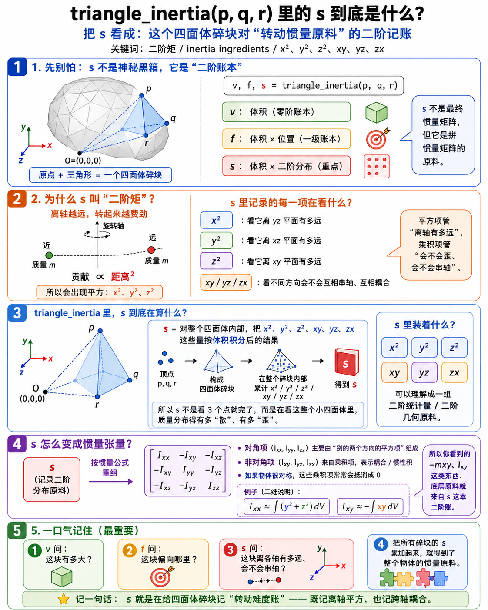
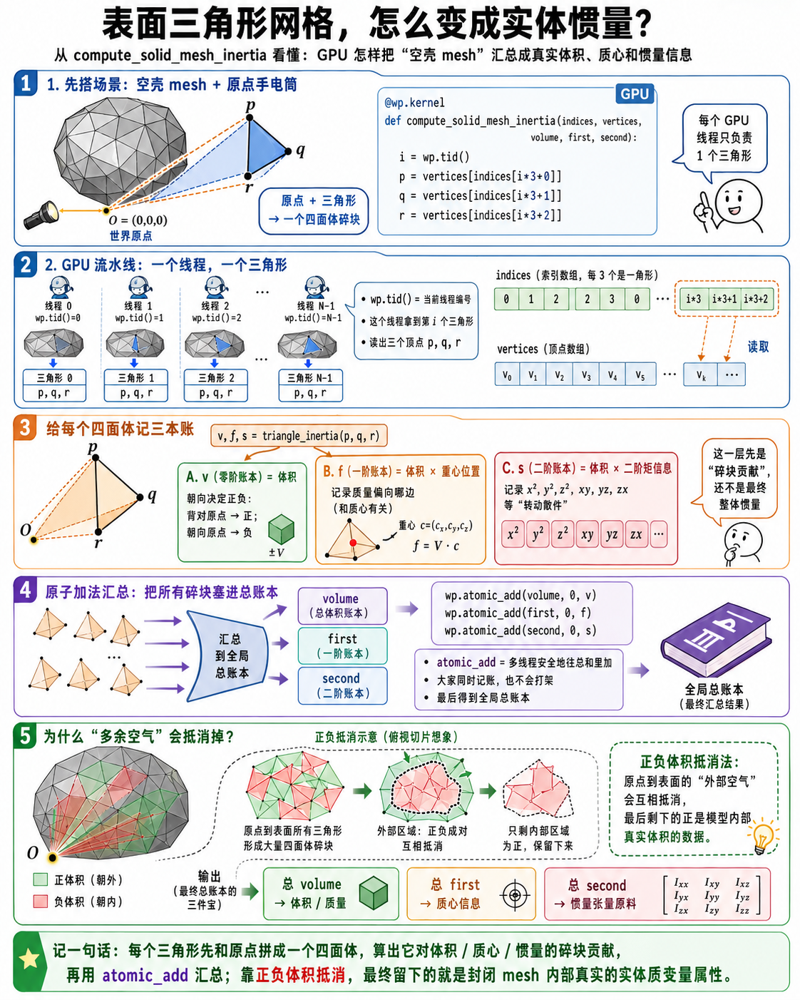
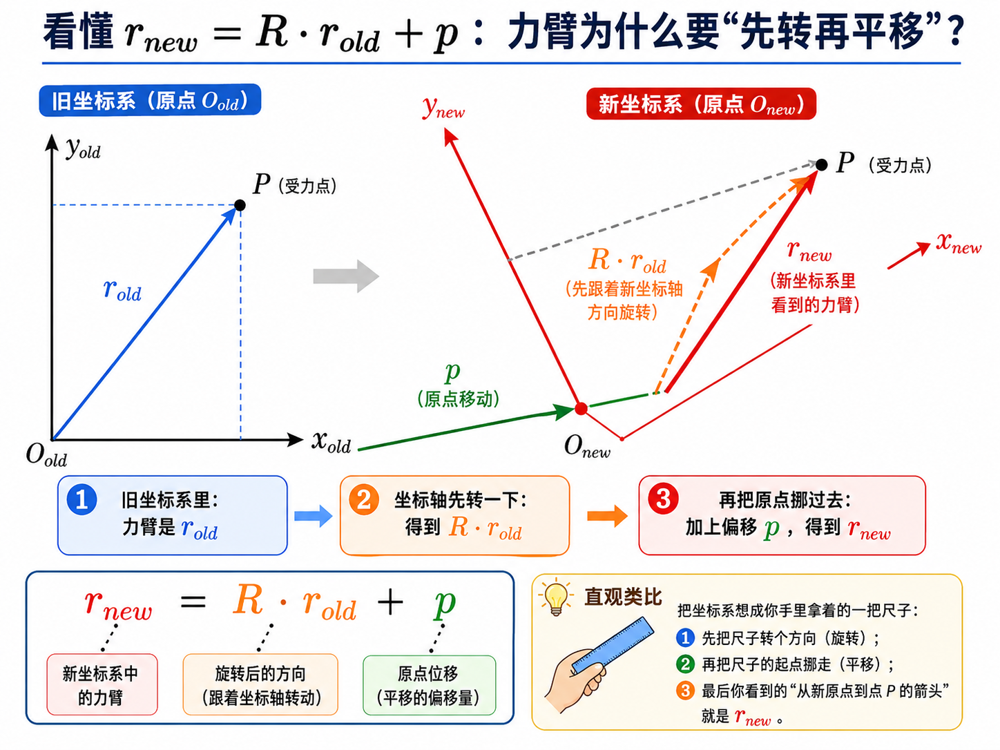
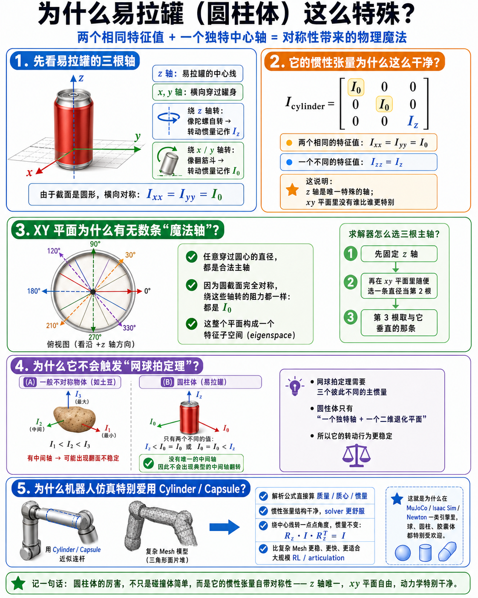
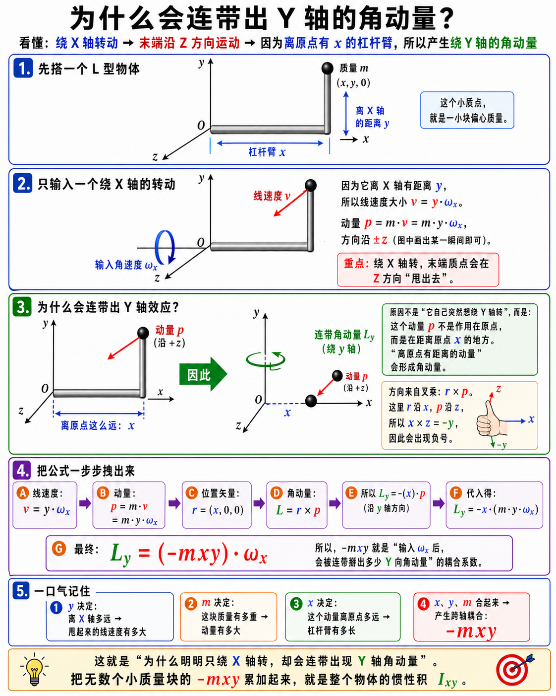
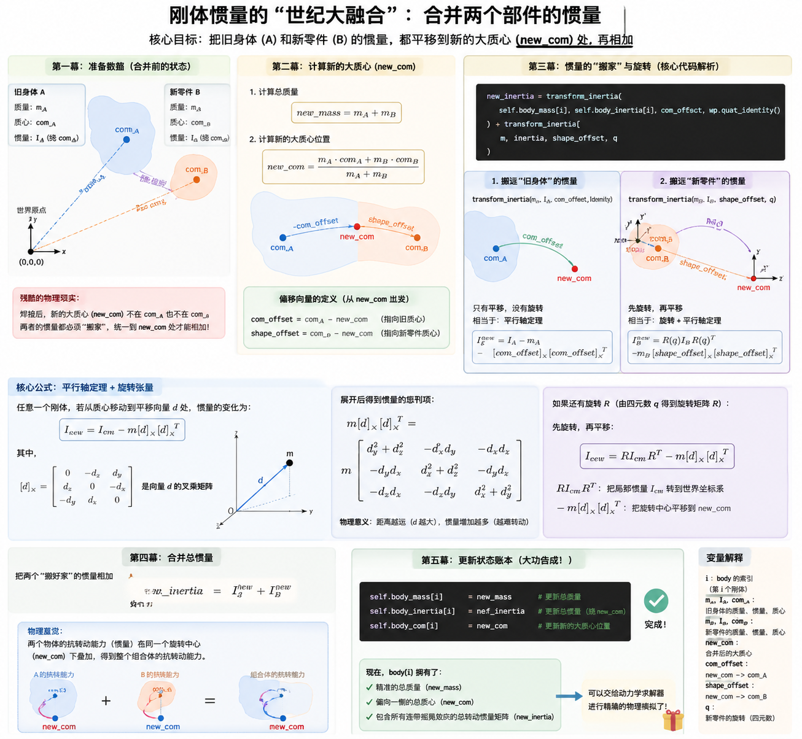

# 03 数学与几何基础 问题驱动补充图解

这页专门接住 chapter 03 学习过程中最容易卡住的几个图像化问题。主 walkthrough 仍然负责 `local relationships -> transform chains -> spatial quantities -> shape representation -> inertia` 这条线；这里负责把其中几处“第一次看很容易懵”的变量、公式和物理直觉慢下来讲。

先记一个边界：下面几张图都是**教学压缩图**。它们适合帮你建立直觉，但不替代 `source-walkthrough.md` 里的源码摘录，也不替代上游 Newton source。遇到符号、字段或精确实现细节时，仍然以正文锚点和 pinned source 为准。

## 1. `triangle_inertia(...)` 里的 `s` 到底是什么



第一次看到 `triangle_inertia(p, q, r)` 返回 `v, f, s`，很容易把 `s` 当成“已经算好的惯量矩阵”。更稳的读法是：`s` 还不是最终矩阵，它是后面拼惯量矩阵要用的二阶分布账本。

- `v` 先问这个小四面体碎块有多大。
- `f` 先问这个碎块的质量中心偏向哪里。
- `s` 再问质量离各个坐标平面有多远，以及不同方向会不会互相耦合。

所以 `x^2 / y^2 / z^2` 这类项可以先读成“离某些轴远不远”，`xy / yz / zx` 这类项可以先读成“两个方向会不会一起偏”。它们最后会按惯量公式重组，才成为 `Ixx / Iyy / Izz / Ixy / Iyz / Ixz` 这种矩阵项。

这张图的价值不是让你背公式，而是阻止一个常见误会：`s` 不是神秘黑箱，它是在给三角 mesh 切出来的小体积块记录“转动难度原料”。

## 2. mesh 表面三角形为什么能算出实体惯量



`MESH / CONVEX_MESH` 这种显式几何没有 sphere / box 那种简单解析参数，所以 inertia 分支看起来会比 primitive 重很多。第一遍不用急着推完整积分，只要先看懂这条工程路线：

```text
每个表面三角形 + 原点
-> 构成一个有符号四面体碎块
-> 每个碎块贡献 volume / first / second
-> 多线程 atomic_add 汇总
-> 正负体积抵消后留下封闭实体的质量属性
```

图里的 `volume / first / second` 对应的仍然是“零阶、一次、二次账本”：体积问总量，first 问质心趋势，second 问惯量原料。`atomic_add` 的重点也不是数学新概念，而是 GPU 上很多 triangle 同时把自己的碎块贡献加进总账本。

这张图适合和 `source-walkthrough.md` Stage 5 一起看。主线正文只要求你知道 `compute_inertia_shape(...)` 会把 shape-local geometry 压成 `mass / com / inertia`；这张图解释的是 mesh 分支为什么要绕一圈从三角面片累积出实体属性。

## 3. `r_new = R * r_old + p` 为什么是先转再平移



`wp.transform_point(xform, point)` 这类调用第一次看很容易变成公式背诵。更直观的读法是：你手里拿着一把尺子，先把尺子的方向转到新坐标系的朝向，再把尺子的起点搬到新原点。

也就是：

```text
r_old：旧 frame 里看到的向量
R * r_old：同一根向量先跟着新坐标轴旋转
p：新原点相对旧原点的平移
r_new = R * r_old + p：最后得到世界或目标 frame 里的位置
```

这和 chapter 03 后面反复出现的动作是同一类问题：shape local COM 要搬到 body frame，joint 两侧锚点要接到 parent chain，world query point 有时又要被拉回 shape local。你不必先背 4x4 矩阵，只要先守住“方向先换，原点再搬”。

## 4. 圆柱 / 胶囊惯量为什么看起来特别干净



圆柱、胶囊这类形状常常让人误以为惯量公式“被特殊照顾了”。更准确的第一遍读法是：它们的对称性太强，所以惯量张量天然会干净很多。

如果圆柱的中心轴是 `z`：

- 绕 `x` 和绕 `y` 的情况完全对称，所以 `Ixx = Iyy`。
- 绕 `z` 是沿中心轴自转，和横向翻转不是同一类转动，所以 `Izz` 可以不同。
- 因为横截面在 `xy` 平面里各方向都一样，不容易出现明显的 off-diagonal coupling。

这张图适合当成惯量张量的“干净特例”。它不是在说所有 body 的 inertia 都会这么漂亮，而是在给你一个参照：当几何高度对称时，矩阵里很多耦合项会自然消失或变小。

## 5. 为什么绕 X 转会带出 Y 方向角动量



off-diagonal inertia 最容易被新手当成矩阵里的噪声。图里的 L 型小例子想表达的是：如果质量分布既离 `x` 轴有距离，又在另一个方向上偏得很开，那么“绕一根轴转”可能会带出别的方向上的角动量。

第一遍可以先这样记：

- 对角项主要问“绕这根轴本身难不难”。
- 非对角项主要问“一个方向上的转动，会不会耦合到另一个方向”。
- `-mxy` 这种项不是凭空来的，它来自很多小质量块的“位置偏移 × 动量方向”累积。

这也是为什么上一节的圆柱图很重要：对称物体会让很多耦合互相抵消；一般 mesh 或偏心组合体则不一定。看到 `Ixy / Iyz / Ixz` 时，先把它们读成“坐标方向之间的转动耦合账本”，不要把它们当成可有可无的装饰项。

## 6. `_update_body_mass()` 合并多个 shape 的惯量时在合并什么



builder 不只是把多个 shape 的质量直接相加。只要一个 body 上挂了多个有密度的 shape，它就要重新算这个组合体的总质量、新质心，以及都搬到新质心后的总惯量。

这一步可以按五幕读：

1. 先知道旧 body 已经有一份 `mass / com / inertia`。
2. 新 shape 也贡献一份自己的 `mass / com / inertia`。
3. 用加权平均得到新的 `new_com`。
4. 把旧 body 和新 shape 的 inertia 都通过 `transform_inertia(...)` 搬到 `new_com` 这个共同参考点。
5. 两份搬好的惯量相加，写回 `body_mass / body_com / body_inertia`。

所以 `_update_body_mass()` 不是“给惯量数组补一个值”，而是在维护一个更强的约定：`body_inertia` 必须和当前 `body_com` 这套质量属性一起看。这样 chapter 05 后面的 articulation / Featherstone 路线才能直接消费 body 级质量属性，而不需要重新关心每个 shape 原来挂在哪。

## 7. 这页怎么和主线配合

最稳的读法是：主线先走 `principle.md` 和 `source-walkthrough.md`，只要遇到下面这些卡点，再回来查这页。

| 卡点 | 回来看哪一节 |
|------|--------------|
| `v, f, s` 不知道分别在记什么 | 第 1 节 |
| mesh 明明只有表面三角形，为什么能算实体质量属性 | 第 2 节 |
| `transform_point`、COM 搬运、力臂变换像公式魔法 | 第 3 节 |
| 惯量矩阵为什么有时很干净、有时又有耦合项 | 第 4、5 节 |
| `_update_body_mass()` 和 `transform_inertia()` 为什么要先算 `new_com` | 第 6 节 |

看完之后立刻回到 `source-walkthrough.md` 的 Stage 5。chapter 03 的完成门槛不是推完整惯量积分，而是能解释 geometry 怎样被压成 `body_mass / body_com / body_inertia`，再交给 chapter 05 继续消费。
