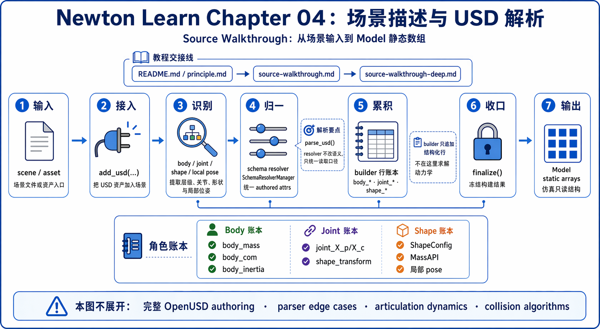
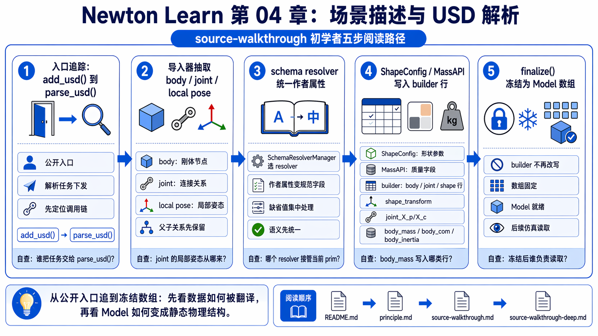
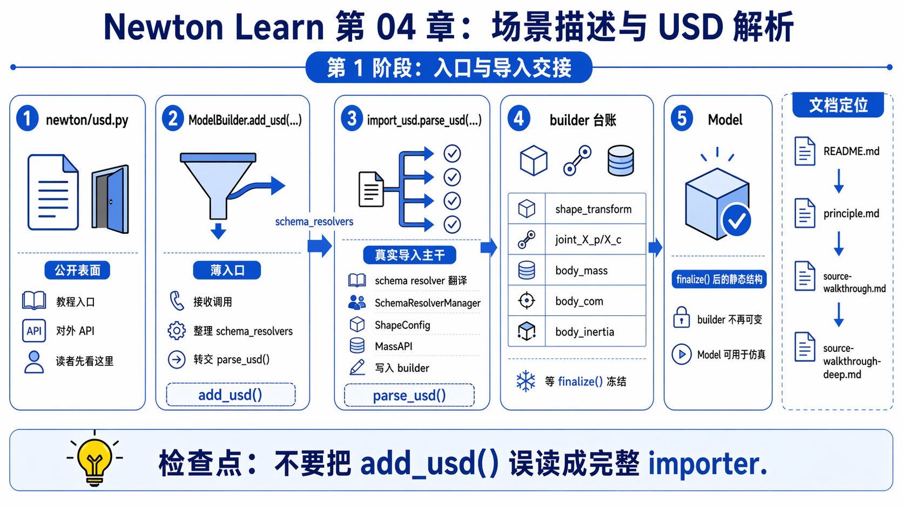
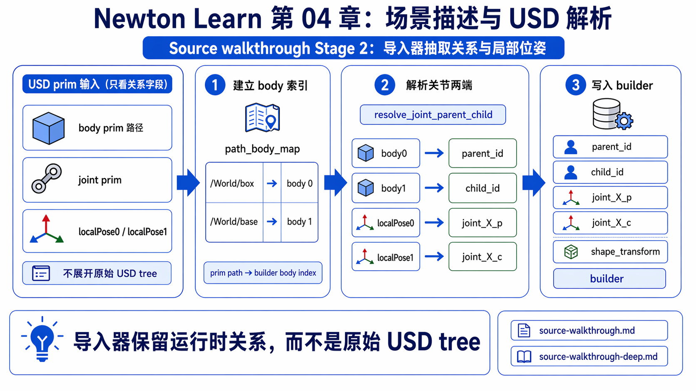
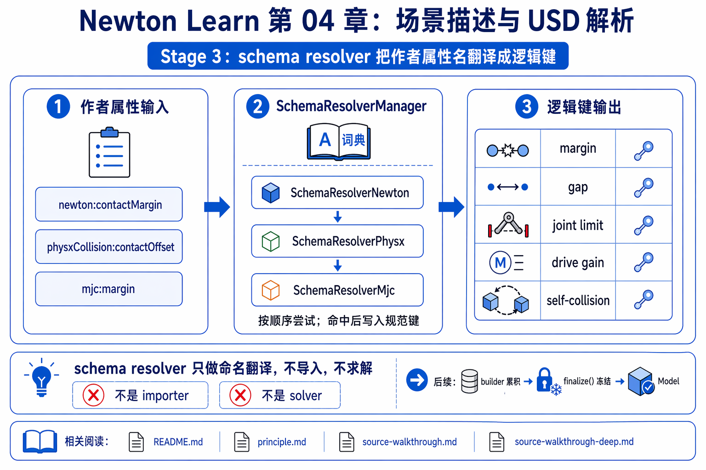
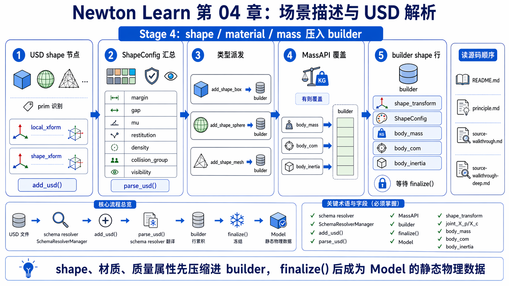
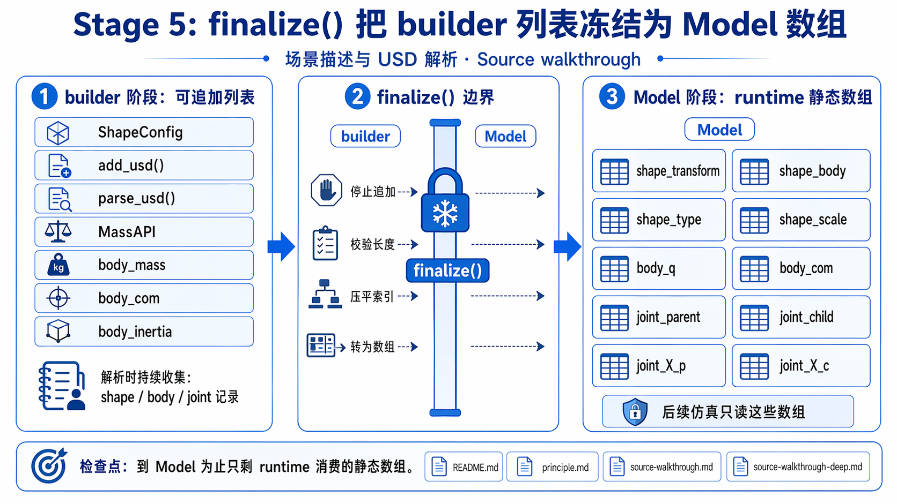
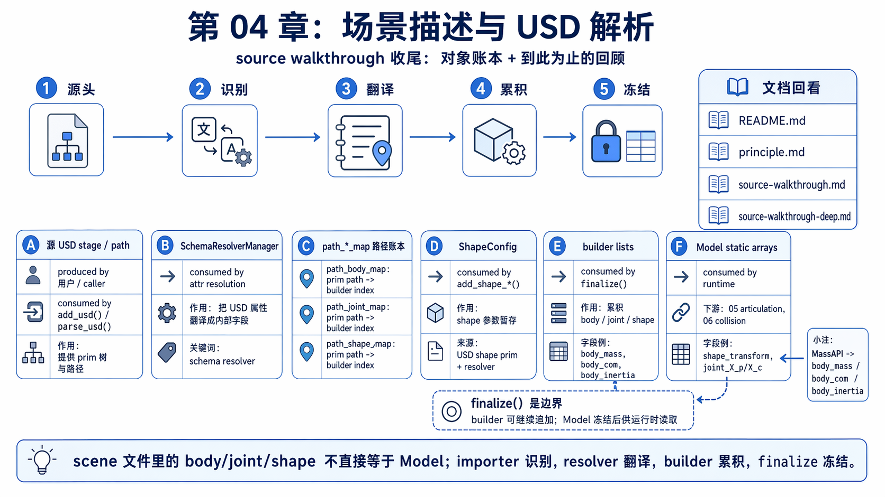

# 04 场景描述与 USD 解析 源码走读

如果你刚从 `03_math_geometry` 走到这里，最自然的问题通常是：

```text
我在 USD / 场景文件里写了一个 body / joint / shape，Newton 到底怎样把它变成 Model 里的数组？
```

先给一个不带太多术语的最短答案：

- `add_usd()` 只是公开入口，真正做导入的是 importer。
- importer 先从 scene graph 里认出 body、joint、shape、site，以及它们的局部关系。
- scene 里明确写下来的属性，也就是 `authored attrs`，先经 `schema resolver` 翻成统一逻辑键。
- builder 再把这些逻辑对象累积成 `body_* / joint_* / shape_*` lists。
- `finalize()` 最后把这些 lists 冻结成 `Model` 静态数组。

这份主 walkthrough 只追 chapter 04 的这条桥：scene / asset 输入怎样经由 importer、schema resolver、builder，最后冻结成 `Model`。目标不是把 OpenUSD 生态讲完，而是让你第一次追这条链时，能明确知道“外部场景词”是怎样变成 Newton 内部 body / joint / shape / mass 字段的。

如果你想再配一个更慢一点的概念版，可以再看 `principle.md`；但只读这一份，也应该能把 chapter 04 的主线讲顺。

第一次先把下面几个词翻成人话：

- `importer`：把外部 scene / asset 输入读成 Newton 真正关心的逻辑对象的那段导入代码。
- `authored attrs`：场景作者明确写在 prim 上的属性值。
- `schema resolver`：在不同 authoring 命名之间做“同义词翻译”的边界层。
- `MassAPI`：USD 里专门 author body 质量属性的接口。第一遍先把它读成“如果场景作者不想完全相信几何自动推出来的质量属性，就可以在这里手动覆盖”。
- `finalize()`：builder 的封板步骤，把暂存 lists 变成真正运行时数组。

## What This Walkthrough Follows

这一页只追下面这条 handoff：

```text
scene / asset input
-> add_usd(...)
-> importer identifies body / joint / shape / local pose
-> schema resolver normalizes authored attrs
-> builder accumulates Newton-side rows
-> finalize()
-> Model static arrays
```

这一页刻意不展开三类东西：

- 完整 USD authoring 工作流
- 所有 parser edge cases 和 remeshing 分支
- articulation dynamics 和 collision algorithms 本身

第一遍先守住一句话：chapter 04 真正讲的是 **scene graph 怎样被压成 Newton 可运行的静态模型结构**。



## One-Screen Chapter Map

```text
USD stage / prim attrs / authored values
        |
        v
  ModelBuilder.add_usd(...)
        |
        v
 importer / parse_usd(...)
        |
        +--> identify bodies / joints / local poses
        +--> identify shape attrs / materials / mass info
        +--> schema resolver unifies authored names
        |
        v
  builder.add_link / add_joint / add_shape
        |
        +--> body mass / material / shape config accumulate here
        |
        v
        finalize()
        |
        v
  Model.shape_* / body_* / joint_*
```

## Beginner Path

1. 先看 Stage 1。
   - 想验证什么：你真正该把“importer”这个词放在哪一层理解。
   - 看完后应该能说：`add_usd()` 只是公开入口，真正把 scene 读进来的主干在 `parse_usd()`。
2. 再看 Stage 2。
   - 想验证什么：scene graph 里最重要的 body / joint / local pose 是怎样先被 importer 认出来的。
   - 看完后应该能说：importer 真正在提取的是拓扑关系和局部 frame，不是把整棵 USD 树原封不动搬进来。
3. 再看 Stage 3。
   - 想验证什么：为什么 authored attrs 还要先过一层 `schema resolver`。
   - 看完后应该能说：importer 读的是逻辑键，比如 `margin / gap`，不是只认一种命名空间。
4. 再看 Stage 4。
   - 想验证什么：shape、material、mass property 怎样真正落到 builder 上。
   - 看完后应该能说：scene attrs 最终会被压成 `ShapeConfig`、body mass property 和 builder lists。
5. 最后看 Stage 5。
   - 想验证什么：`finalize()` 在这条链上的真正作用。
   - 看完后应该能说：到 `Model` 为止，只剩 solver 真正要消费的静态 arrays。



## Main Walkthrough

### Stage 1: `add_usd()` 是公开入口，但真正的导入主干在 `parse_usd()`



**Claim**

`ModelBuilder.add_usd()` 主要负责暴露一个稳定 public entry；真正的场景解析和 builder 累积工作，都在 importer 里继续发生。第一遍可以直接把 importer 读成“把 scene 里有物理意义的东西挑出来的那段代码”。

**Why it matters**

如果一开始把 `add_usd()` 误读成“这里已经做完全部导入”，后面就会不知道该去哪追 body / joint / shape 的真实 handoff。这里先把入口边界看清，后面 importer、resolver、builder 才会读成一条连续的必要链。

**Source excerpt**

公开入口本身非常薄：

以下摘录为教学注释版，注释非原源码。

```python
def add_usd(...):
    from ..utils.import_usd import parse_usd  # 公开入口立刻把主线移交给 importer

    return parse_usd(
        self,  # importer 后面会持续往这个 builder 里累积结果
        source,  # scene / asset 输入继续沿导入主线往下传
        ...
        schema_resolvers=schema_resolvers,  # authored 名字的翻译边界也一起下传
        ...
    )
```

而 `newton.usd` 更像是公开目录，把 resolver 类型暴露出来：

这段更像公共目录，保持干净代码即可。

```python
from ._src.usd.schema_resolver import PrimType, SchemaResolver
from ._src.usd.schemas import (
    SchemaResolverMjc,
    SchemaResolverNewton,
    SchemaResolverPhysx,
)
```

**Verification cues**

- `add_usd()` 没有自己实现一大段 importer 逻辑，它只是把参数转给 `parse_usd()`。
- `newton.usd` 暴露的是 resolver 类型和常用 helper，不是完整 importer 主干。
- 所以 chapter 04 的真正源码重心在 `_src/utils/import_usd.py`。

**Checkpoint**

如果你现在还会把 `add_usd()` 想成“导入真正发生的地方”，先不要继续。第一遍最重要的是先把入口和 importer 主干拆开。

**Output passed to next stage**

一个已经拿到 stage、resolver 配置和导入选项的 importer 调用：`parse_usd(builder, source, ...)`。

### Stage 2: importer 真正在提取 body、joint 和 local pose 关系



**Claim**

scene graph 进入 Newton 时，最先被 importer 抓住的不是“完整树结构本身”，而是后面运行一定会用到的 body、joint、parent-child 关系和两侧局部 frame。第一遍可以把这一步读成：先回答“谁是谁、谁连谁、谁相对谁写”。

**Why it matters**

这是 chapter 04 的第一层去噪：scene 里能写很多东西，但真正进入 Newton runtime 主线的，是拓扑和局部姿态关系。你先读懂 importer 在挑什么，后面 `joint_X_p / joint_X_c`、`shape_transform` 这些数组来源才会自然。

**Source excerpt**

body 会先被 importer 包成一次 `builder.add_link(...)`：

以下摘录为教学注释版，注释非原源码。

```python
def add_body(...):
    b = builder.add_link(
        xform=xform,  # 把 scene 里的 body pose 交给 builder
        label=label,  # 保留这个 body 的 scene 标签 / path
        inertia=body_inertia,  # body 质量属性也在这里一起写入
        armature=0.0 if armature is not None else None,
        is_kinematic=is_kinematic,
        custom_attributes=body_custom_attrs,
    )
    path_body_map[label] = b  # 记住 prim path -> builder body index 的映射
```

joint 则先把两侧局部 frame 和 parent / child body id 解出来：

```python
def resolve_joint_parent_child(joint_desc, body_index_map, get_transforms=True):
    parent_tf = wp.transform(joint_desc.localPose0Position, usd.value_to_warp(joint_desc.localPose0Orientation))  # joint 在 parent 侧的局部 frame
    child_tf = wp.transform(joint_desc.localPose1Position, usd.value_to_warp(joint_desc.localPose1Orientation))  # joint 在 child 侧的局部 frame

    parent_path = str(joint_desc.body0)  # scene graph 里 joint 的 parent 端连到谁
    child_path = str(joint_desc.body1)  # scene graph 里 joint 的 child 端连到谁
    parent_id = body_index_map.get(parent_path, -1)  # scene path -> builder body index
    child_id = body_index_map.get(child_path, -1)  # scene path -> builder body index
```

**Verification cues**

- `path_body_map` 明确说明 importer 在维护“scene path -> builder index”的映射。
- joint 这层最值钱的输入是 `localPose0 / localPose1`，因为它们就是后面 `joint_X_p / joint_X_c` 的来源。
- importer 这里已经在把 scene language 压缩成 body / joint / frame language。

**Checkpoint**

如果你现在还会把 importer 读成“把整棵 USD 树原样搬进来”，先停一下。这里真正被保留下来的，是 body、joint 和 local frame 这些后续 runtime 真会消费的关系。

**Output passed to next stage**

一批 builder-ready 的 body、joint 和 local pose 信息，以及路径到整数槽位的映射表。

### Stage 3: schema resolver 把 authored 名字先翻译成统一逻辑键



**Claim**

schema resolver 的职责不是再造一套 importer，而是在 importer 中间提供一个统一语义层：不同命名空间 author 的 margin、gap、joint limit、drive 参数，先被翻译成同一组逻辑键，再交给 builder 消费。这里的 `authored attrs` 可以先简单理解成“场景作者已经明确写在 prim 上的值”。

**Why it matters**

如果没有这一层，importer 就得处处写死 `newton:*`、`physx*`、`mjc:*` 的分支，chapter 04 也会变成“背属性别名”。这一层的价值不是多造一个框架，而是先把“不同 authoring 写法在说同一件事”守住。

**Source excerpt**

resolver manager 的查值顺序很直接：

以下摘录为教学注释版，注释非原源码。

```python
for r in self.resolvers:
    val = r.get_value(prim, prim_type, key)  # 让每个 resolver 试着回答同一个逻辑键
    if val is None:
        continue  # 这个命名空间没 author，就换下一个 resolver
    self._collect_on_first_use(r, prim)  # 记下这次命中的 authored schema
    return val  # 一旦找到值，就把统一逻辑值交回 importer
```

而具体 mapping 则把不同命名空间压到同一逻辑键上：

具体 attribute mapping 更像同义词词典，保持干净代码更容易看出不同 authored 名字如何归并。

```python
# Newton-authored
"margin": SchemaAttribute("newton:contactMargin", 0.0)

# PhysX-authored
"gap": SchemaAttribute(
    "physxCollision:contactOffset",
    float("-inf"),
    usd_value_getter=_physx_gap_from_prim,
    attribute_names=("physxCollision:contactOffset", "physxCollision:restOffset"),
)

# MuJoCo-authored
"margin": SchemaAttribute(
    "mjc:margin",
    0.0,
    usd_value_getter=_mjc_margin_from_prim,
    attribute_names=("mjc:margin", "mjc:gap"),
)
```

**Verification cues**

- importer 调用的是 `get_value(..., key="margin")` 这类逻辑键，而不是死盯某一个 authored attribute 名字。
- 不同 resolver 只是提供不同的 authored 来源，消费侧看到的是同一套语义。
- 这也是为什么 chapter 04 里要把 resolver 读成“属性翻译边界”。

**Checkpoint**

如果你现在还会把 resolver 理解成“又一套 importer”，先不要继续。更稳的读法是：resolver 负责把不同 authored 名字先压成统一逻辑键。

**Output passed to next stage**

一组已经规范化的 scene 属性，比如 margin、gap、joint limit、drive gains、self-collision 开关。

### Stage 4: shape、material 和 mass property 被压进 builder



**Claim**

scene 里的 shape 和 material 不会直接变成 `Model`；它们会先被 importer 压成 `ShapeConfig`、body/joint/shape 参数和必要的 mass-property 覆盖信息，再写进 builder。这里第一次遇到 `MassAPI`，先把它读成“USD 里显式 author body 质量属性的接口”。

**Why it matters**

这一步决定了后面 `05`、`06` 看到的字段是怎么来的。你要先知道 builder 在累积什么，才能看懂 runtime 在消费什么；也要先知道质量属性既可能来自几何累计，也可能来自 `MassAPI` 覆盖。

**Source excerpt**

shape attrs 会先被 importer 组装成一份统一的 `shape_params`：

以下摘录为教学注释版，注释非原源码。

```python
local_xform = wp.transform(shape_spec.localPos, usd.value_to_warp(shape_spec.localRot))  # 先把 authored shape pose 读成局部 xform
...
shape_params = {
    "body": body_id,  # 这个 shape 最终挂到哪个 body
    "xform": shape_xform,  # shape 相对 body 的局部位姿
    "cfg": ModelBuilder.ShapeConfig(  # 把 contact / material / density 参数压成统一配置
        ke=shape_ke,
        kd=shape_kd,
        margin=margin_val,
        gap=gap_val,
        mu=material.dynamicFriction,
        restitution=material.restitution,
        density=shape_density,
        collision_group=collision_group,
        is_visible=collider_is_visible,
    ),
    "label": path,  # 保留 scene path 方便后续映射
}
```

之后再分发到具体 `add_shape_*()`：

```python
if key == UsdPhysics.ObjectType.CubeShape:
    shape_id = builder.add_shape_box(**shape_params, hx=hx, hy=hy, hz=hz)  # cube prim 变成 builder 里的 box row
elif key == UsdPhysics.ObjectType.SphereShape:
    shape_id = builder.add_shape_sphere(**shape_params, radius=radius)  # sphere prim 变成 sphere row
elif key == UsdPhysics.ObjectType.MeshShape:
    shape_id = builder.add_shape_mesh(scale=wp.vec3(*shape_spec.meshScale), mesh=mesh, **shape_params)  # mesh prim 走 mesh row 分支
```

body 质量属性也可能被 authored `MassAPI` 覆盖：

```python
if has_authored_mass:
    mass = float(mass_api.GetMassAttr().Get())  # 作者显式写了质量时，优先尊重 authored 值
else:
    mass = cmp_mass  # 否则退回 geometry 累积出来的质量
builder.body_mass[body_id] = mass  # 写进 builder 的 body mass 槽位

if has_authored_com:
    builder.body_com[body_id] = wp.vec3(*mass_api.GetCenterOfMassAttr().Get())  # authored COM 直接覆盖
else:
    builder.body_com[body_id] = wp.vec3(*cmp_com)  # 否则沿用 geometry 算出来的 COM
```

**Verification cues**

- shape 层先统一落成 `ShapeConfig`，而不是直接写 `Model.shape_*`。
- geometry、自定义 material、resolver 结果，都会在这里汇总到 builder shape rows。
- MassAPI 的存在说明 body mass property 可能来自 authored 数据，也可能来自 geometry fallback，不是只有单一路径。

**Checkpoint**

如果你现在还会把 scene 里的 shape/material/mass authoring 看成会直接变成 `Model`，先停一下。chapter 04 真正发生的是“先压进 builder，再等 `finalize()` 冻结”。

**Output passed to next stage**

builder 里已经累积好的 `body_* / joint_* / shape_*` lists，以及必要的 path maps 和 schema attrs。

### Stage 5: `finalize()` 把 builder 累积结果冻结成 `Model`



**Claim**

到 `finalize()` 为止，这条导入链才真正封口：builder 里的 Python-side 累积结构会被冻结成 `Model` 的静态 arrays，供后面的 runtime、articulation 和 collision 直接消费。第一遍直接把 `finalize()` 读成“施工结束，开始封板”就够了。

**Why it matters**

这一步是 scene world 和 runtime world 的正式分界线。过了它，scene graph 的 authoring 噪音就应该退场了，留下的只该是 solver 真正按槽位去读的数组。

**Source excerpt**

`finalize()` 会把 shape、body、joint 列表统一搬到 `Model`：

这两段本质上都是字段搬运表，保持干净代码更容易扫到 `shape / body / joint` 三组静态 arrays。

```python
m.shape_transform = wp.array(self.shape_transform, dtype=wp.transform, requires_grad=requires_grad)
m.shape_body = wp.array(self.shape_body, dtype=wp.int32)
m.shape_type = wp.array(self.shape_type, dtype=wp.int32)
m.shape_scale = wp.array(self.shape_scale, dtype=wp.vec3, requires_grad=requires_grad)

m.body_q = wp.array(self.body_q, dtype=wp.transform, requires_grad=requires_grad)
m.body_qd = wp.array(self.body_qd, dtype=wp.spatial_vector, requires_grad=requires_grad)
m.body_com = wp.array(self.body_com, dtype=wp.vec3, requires_grad=requires_grad)

m.joint_parent = wp.array(self.joint_parent, dtype=wp.int32)
m.joint_child = wp.array(self.joint_child, dtype=wp.int32)
m.joint_X_p = wp.array(self.joint_X_p, dtype=wp.transform, requires_grad=requires_grad)
m.joint_X_c = wp.array(self.joint_X_c, dtype=wp.transform, requires_grad=requires_grad)
```

而 `Model` 自己最终保留的，也就是这些 solver-facing 静态字段：

```python
self.shape_transform: wp.array[wp.transform] | None = None
self.shape_body: wp.array[wp.int32] | None = None
self.shape_gap: wp.array[wp.float32] | None = None
self.shape_type: wp.array[wp.int32] | None = None
...
self.body_mass: wp.array[wp.float32] | None = None
self.body_com: wp.array[wp.vec3] | None = None
...
self.joint_parent: wp.array[wp.int32] | None = None
self.joint_child: wp.array[wp.int32] | None = None
self.joint_X_p: wp.array[wp.transform] | None = None
self.joint_X_c: wp.array[wp.transform] | None = None
```

**Verification cues**

- `Model` 保存的是静态 arrays，不再是 scene graph 的 authoring 树。
- `shape_transform`、`body_com`、`joint_X_p / joint_X_c` 到这里都已经拥有固定的 runtime 槽位。
- chapter 04 的终点不是“解析完一个文件”，而是“得到一份可被 runtime 直接消费的 `Model`”。

**Checkpoint**

如果你现在还会把 `finalize()` 看成“只是一个收尾 helper”，先停一下。chapter 04 的真正封口动作就在这里：scene-side 语言到此冻结成 runtime arrays。

**Output passed to next stage**

`Model.shape_* / body_* / joint_*` 这组三类静态 arrays。它们会在 `05` 和 `06` 里继续进入 articulation 与 collision 路径。

## Object Ledger

| 对象 | 谁生产 | 谁消费 | 盯哪些字段 |
|------|--------|--------|------------|
| `source` USD stage / path | user / caller | `add_usd()`、`parse_usd()` | root path、units、scene attrs |
| `SchemaResolverManager` | importer setup | shape/joint/material/body attr resolution | `get_value(...)` 的逻辑键 |
| `path_body_map / path_joint_map / path_shape_map` | importer | 后续 body/joint/shape 关联 | prim path 到 builder index 的映射 |
| `ShapeConfig` | importer | `builder.add_shape_*()` | `margin`、`gap`、`mu`、`density`、visibility |
| builder lists | `add_link()`、`add_joint()`、`add_shape_*()` | `finalize()` | `body_* / joint_* / shape_*` 累积项 |
| `Model` 静态 arrays | `finalize()` | runtime、articulation、collision | `shape_transform`、`body_com`、`joint_X_p / joint_X_c` 等 |



## Stop Here

读到这里就已经够 chapter 04 的 80-90% 了。

如果你现在能用自己的话讲顺下面这句话，这一章的 beginner 目标就完成了：

```text
scene 文件里 author 的 body / joint / shape 不会直接等于 Model；
importer 先把有物理意义的对象和局部关系认出来；
schema resolver 把不同命名空间的 authored attrs 翻成统一逻辑键；
builder 累积这些 body / joint / shape / mass 信息；
finalize() 最后把它们冻结成 Model 静态数组。
```

这时你已经可以更稳地进入 `05_rigid_articulation` 和 `06_collision`，知道它们读到的字段最初是从哪里来的。

## Go Deeper

如果你还想继续精确追源码，再去 `source-walkthrough-deep.md`：

- 想保留所有 file/symbol/line anchors：看 `Fast Deep Index`
- 想逐跳追 importer 到 `Model` 的 exact handoff：看 `Exact Handoff Trace`
- 想知道哪些 mesh / resolver / MassAPI 细节第一遍可以跳过：看 `Optional Branches`
- 想逐条核对这里的 claim：看 `Verification Anchors`
