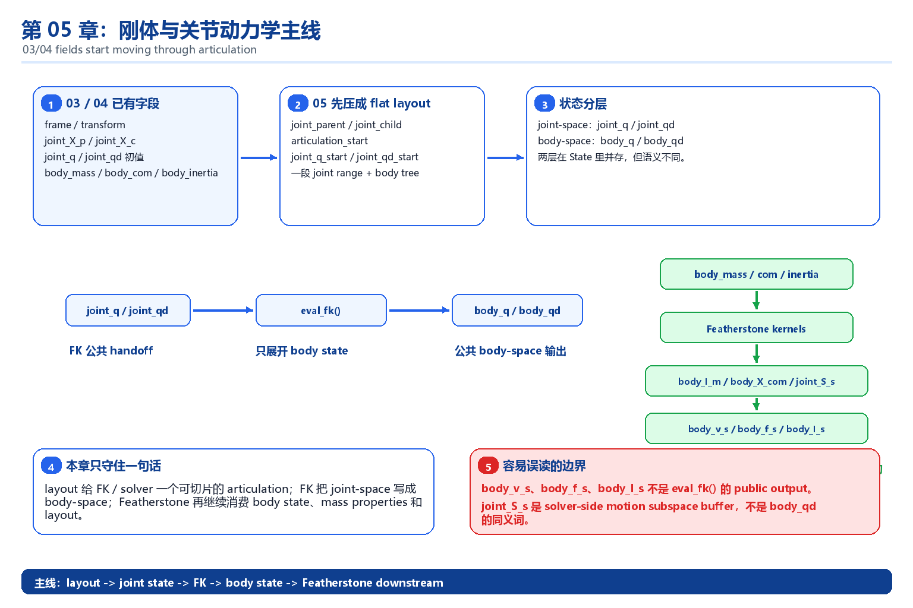
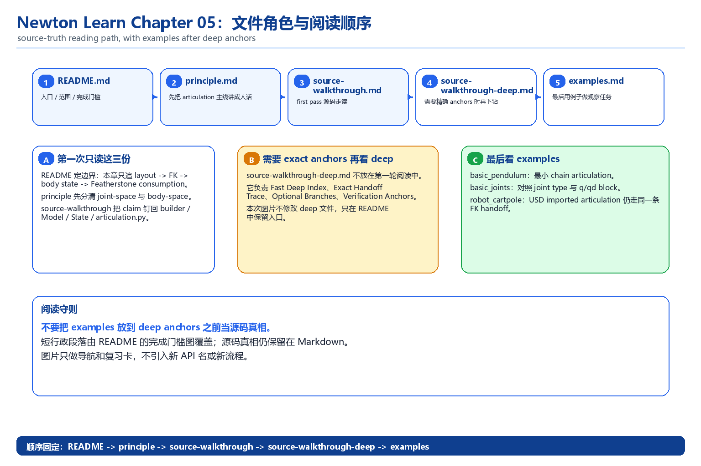
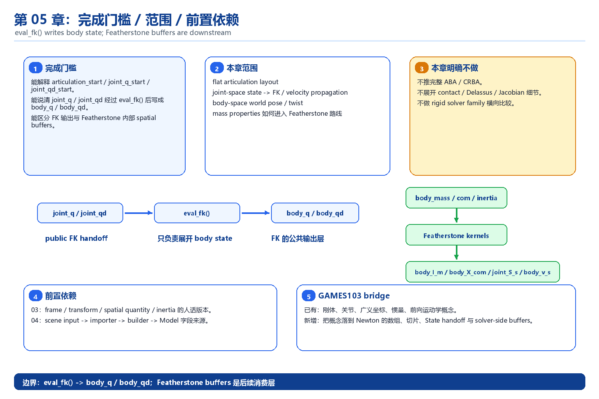

# 05 刚体与关节动力学

`03_math_geometry` 已经把 frame / transform / spatial quantity / inertia 这些词先翻译成人话，`04_scene_usd` 又把 scene input -> importer -> builder -> `Model` 这条线讲顺了：你现在至少知道 `joint_X_p / joint_X_c`、`joint_q / joint_qd`、`body_mass / body_inertia` 这些字段从哪里来。第 05 章要补上的空档是：这些字段怎样不再只是静态结构，而是长成 articulation 容器，先经过 FK 和 motion subspace 变成 `body_q / body_qd`，再继续被刚体动力学和 Featherstone 路线消费。

所以这一章站在 `03`、`04` 之后，但还没有进入完整接触数学或 solver 家族比较。它只保住第一遍读码真正需要的那层 articulation 心智模型：joint tree 怎样组织、`generalized coordinates` 怎样摆放、body mass / inertia 为什么会继续出现在 `dynamics path` 里。



## 文件分工

- `README.md`：只负责本章边界、完成门槛和阅读入口。
- `principle.md`：负责把 articulation 容器、`joint_q / joint_qd`、FK、motion subspace 和 mass / inertia 消费主线讲顺。
- `source-walkthrough.md`：新手 / 主 walkthrough。第一次追 chapter 05 源码先看这一份；它把 `layout -> FK -> body state -> Featherstone consumption` 主线直接讲顺。
- `source-walkthrough-deep.md`：深读锚点版。已经跟上主线后，如果你想精确追上游文件、symbol 和行号，再看这一份。
- `examples.md`：负责用最小 articulation 例子把 `joint_q`、`body_q`、frame 和 inertia bridge 变成可观察现象。



## 完成门槛

```text
[ ] 我能把 `joint_q / joint_qd` 说成 articulation 的关节坐标，把 `body_q / body_qd` 说成 FK / 速度传播后的 body 世界状态，并解释两者不是同一层数据
[ ] 我能顺着 `joint_parent / joint_child`、`joint_X_p / joint_X_c`、joint type / axis 讲出一条最小 FK 链：`joint_q -> joint transform -> body_q`
[ ] 我能解释为什么 `joint_qd` 不能直接拿来当 `body_qd`，而要先经过 motion subspace 才能变成 body-space 速度
[ ] 我能顺着 `body_mass / body_com / body_inertia` 解释这些量怎样继续进入 articulation / Featherstone 路线，而不是只停留在 importer 或 builder
```



## 本章目标

- 把 `04_scene_usd` 留下的静态字段，接成第 05 章真正关心的 articulation 结构与动力学入口。
- 解释 joint-space 坐标和 body-space 状态各自服务谁，以及它们之间最重要的 FK / velocity bridge。
- 只保住第一遍阅读最值钱的链路：结构先怎么组织，量先怎么流动，后续数学章和 solver 章再各自展开。

## 本章范围

- articulation 容器的第一层读法：joint tree、parent-child 结构、`generalized coordinate layout`，以及这些结构为什么适合统一前向传播。
- `joint_q / joint_qd` 与 `body_q / body_qd` 的区别和联系：前者是 joint-space 坐标，后者是 body-space world pose / twist 结果。
- FK 与 motion subspace 的第一遍读法：`joint_X_p / joint_X_c`、joint type、joint axis、`joint_q / joint_qd` 怎样一起决定 body pose 和 body velocity。
- `body_mass / body_com / body_inertia` 怎样从 body 质量属性继续变成 articulation / Featherstone 路线会消费的量。

## 本章明确不做什么

- 不展开 collision pair、几何相交或接触候选怎样生成；这些留给 `06_collision`。
- 不展开完整 ABA / CRBA 推导；这里只解释这些递推为什么会消费本章这批 articulation buffers。
- 不展开完整 Jacobian / Delassus / contact math；相关约束与接触数学留给 `07_constraints_contacts_math`。
- 不展开 solver family 横向比较；不同 rigid solver 的系统比较留给 `08_rigid_solvers`。
- 不展开大型机器人控制、增益设计、reward shaping 或调参实践。

## 前置依赖

- 建议先读完 `03_math_geometry`；如果 `joint_X_p / joint_X_c`、spatial quantity、inertia 这些词还没读顺，这一章会只剩 articulation 术语。
- 建议先读完 `04_scene_usd`；本章默认你已经知道 body / joint / mass property 是怎样进入 builder 和 `Model` 的。
- `02_newton_arch` 的最低限度心智模型也最好还在：这里默认你知道 `Model`、runtime state 和 solver path 是分层组织的，只是还没把 articulation 这一层接起来。
- 如果你在 `02_newton_arch` 里尤其卡在 `joint` 是怎么连起来的、`p / q / axis` 各负责什么、或者“换一套 joint frame 为什么物理还能不变”，先回 `02_newton_arch/question-notes.md` 的对应几节把图像化困惑清掉；chapter 05 会把这些直觉正式接到 FK、motion subspace 和 joint-space / body-space bridge 上。
- 不要求你先学完整 Featherstone 教材、机器人控制课程或接触力学；这些正是后续章节再展开的内容。

## GAMES103 已有 vs 本章新增

| 维度 | GAMES103 已有 | 本章新增 |
|------|----------------|----------|
| 物理 / 数学视角 | 知道多刚体系统会被关节连接，关节坐标会决定系统姿态与速度。 | 把这层直觉压成第 05 章的第一条工程主线：`joint_q / joint_qd` 属于 joint space，`body_q / body_qd` 是 FK 和速度传播后的 body-space 结果。 |
| Newton 工程视角 | 一般不会要求你把 joint frame、质量属性和 `generalized coordinates` 对到真实数组与 helper。 | 解释 `joint_parent / joint_child`、`joint_X_p / joint_X_c`、`joint_q / joint_qd`、`body_mass / body_inertia` 怎样一起组成 articulation 布局，并继续被 dynamics / Featherstone 路径消费。 |
| 章节衔接视角 | 不会刻意区分 articulation 结构、碰撞入口、接触数学和 solver 家族这几层阅读任务。 | 明确第 05 章只做 articulation bridge：先把结构、FK、motion subspace 和 inertia consumption 读顺，再把 collision 入口送往 `06`，把 Jacobian / contact 送往 `07`，把 solver family 送往 `08`。 |

## 阅读顺序

1. 先把当前这份 `README.md` 读完，确认第 05 章的范围、完成门槛和不展开的内容。
2. 再读 `principle.md`，把 articulation 容器、joint-space vs body-space、FK、motion subspace 和 inertia bridge 这条主线读顺。
3. 第一次追源码时，先看 `source-walkthrough.md`，把 `Model` / runtime state / articulation helper / Featherstone 消费链对到真实源码锚点。
4. 想精确追到上游文件、symbol 和行号，再看 `source-walkthrough-deep.md`。
5. 然后读 `examples.md`，用最小 articulation 例子观察 `joint_q`、`body_q`、joint frame 和质量属性是怎样联动的。
6. 如果你是从 `02_newton_arch/question-notes.md` 的 `joint 到底在干嘛`、`p / q / axis 为什么这么容易混`、`为什么换一套 joint frame，物理还能不变` 这几节跳过来的，就把这一章当成它们的系统版：这里会把图里的直觉正式落到 `joint_X_p / joint_X_c`、FK 和 motion subspace 上。
7. 后续先进入 `06_collision`，看有了 body/world 状态之后，碰撞几何、pair 和候选接触怎样开始长出来。
8. 再进入 `07_constraints_contacts_math`，看 Jacobian、约束和接触数学怎样建立在 articulation 结构和碰撞候选之上。
9. 最后进入 `08_rigid_solvers`，看不同 rigid solver 尤其是 Featherstone 路线怎样消费本章已经读顺的 articulation 结构。

## 预期产出

- `principle.md`：用一条 beginner-safe 主线解释 articulation 容器、`joint_q / joint_qd`、`body_q / body_qd`、FK、motion subspace 和 mass / inertia bridge。
- `source-walkthrough.md`：给 first pass 的主 walkthrough，用内嵌源码片段把 `layout -> FK -> body state -> Featherstone consumption` 主线直接讲顺。
- `source-walkthrough-deep.md`：保留精确 symbol、路径、行号和可选分支，给已经跟上主线后还想继续追锚点的读者。
- `examples.md`：给出最小 articulation 观察任务，帮助你在例子里对照 `joint_q -> body_q`、`joint_qd -> body_qd` 和 body mass / inertia 的变化。
- 一套可复用的后续入口：去 `06` 时先追碰撞候选怎样接在 body/world 状态之后，去 `07` 时继续追 Jacobian / contact math，去 `08` 时再追 solver 怎样消费这些结构而不是重新发明一套状态表示。
