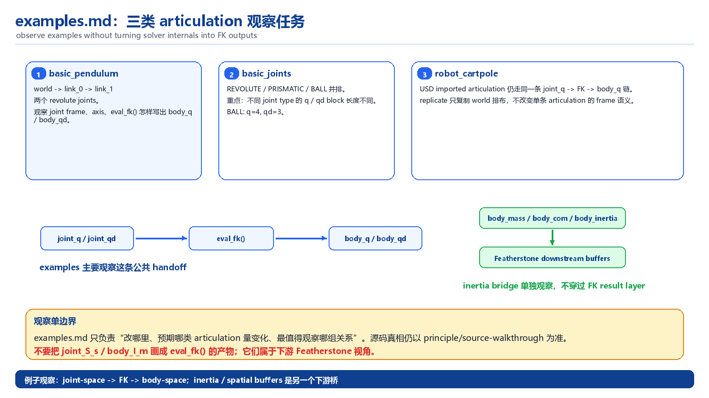
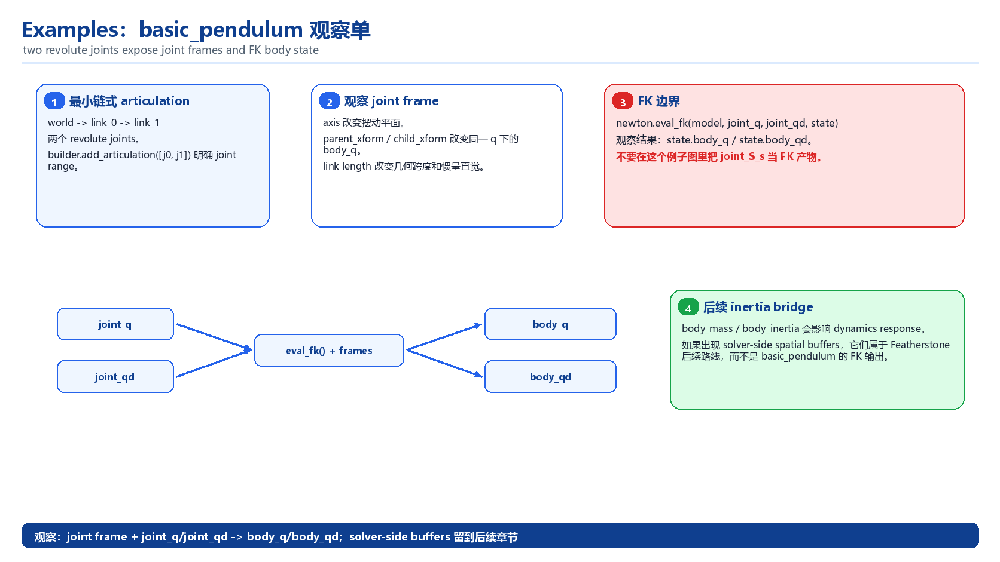
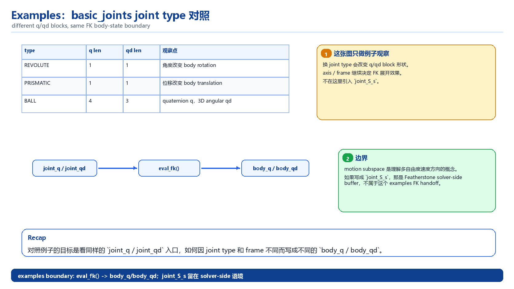
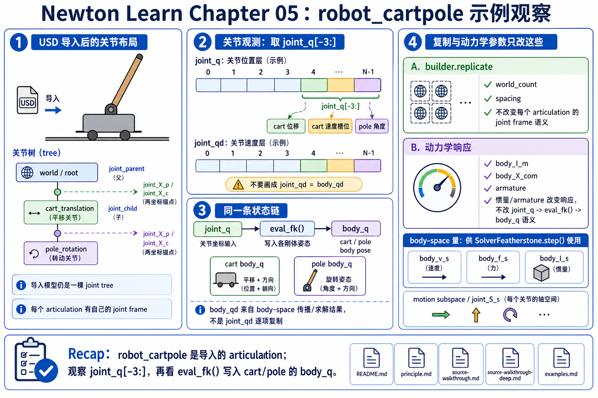

# 05 刚体与关节动力学 例子观察单

`principle.md` 负责讲清 `joint_q / joint_qd -> FK -> body_q / body_qd -> inertia bridge` 这条主线；这一页只把三个最小 articulation 例子改成观察任务。下面提到的命令只是建议入口，不代表已经执行过。chapter 05 先看 articulation bridge 本身，不展开 solver family 比较，也不把 `robot_cartpole` 读成控制案例。

## 主例子：`basic_pendulum`

### 它最适合验证什么

- 这是最小的链式 articulation：world -> `link_0` -> `link_1`，只用两个 revolute joint 就能把 `joint_parent / joint_child`、joint frame 和 FK 全连起来。
- `builder.add_articulation([j0, j1], label="pendulum")` 让你直接看到“这一段 joint 范围就是一条 articulation”。
- `newton.eval_fk(self.model, self.model.joint_q, self.model.joint_qd, self.state_0)` 是这页最值钱的代码锚点：`joint_q / joint_qd` 在这里第一次被翻成 `state_0.body_q / body_qd`。

### 先盯三处代码锚点

- `builder.add_joint_revolute(...)`：决定 joint type、axis、`parent_xform` 和 `child_xform`，也就是 `joint_q` 后面要穿过的 frame。
- `builder.add_articulation([j0, j1], ...)`：把两个 joint 打包成一条最小 articulation，而不是两段互不相干的连接。
- `newton.eval_fk(...)`：还没进入完整 solver 主线前，先把 generalized coordinates 写成 body/world pose 与 velocity。

### 改这里会怎样

| 改哪里 | 预期哪类 articulation 量变化 | 最值得观察哪组 `joint_q / body_q / frame` 关系 |
|--------|------------------------------|-----------------------------------------------|
| 在 `builder.finalize()` 前补一行 `builder.joint_q[0] = 0.3`，再试 `builder.joint_q[1] = -0.2` | `joint_q` 初值直接变化；`joint_qd` 不变时，第一次 `eval_fk()` 就会把新的 joint-space 姿态写进 `state_0.body_q`。 | 先看 `joint_q[0]` 怎样决定 `link_0` 的 `body_q`，再看 `joint_q[1]` 不是单独决定 `link_1`，而是叠在第一节 link 的 parent frame 之后。 |
| 把 `j0` 或 `j1` 的 `axis=wp.vec3(0.0, 1.0, 0.0)` 改成 `x` 或 `z` 轴 | 每个 revolute joint 仍然只占 1 个 `joint_q` 标量，但 motion subspace 方向变了，所以 FK 写出的摆动平面会变。 | 同样是一个标量 `joint_q[i]`，为什么只改 axis，`body_q` 的旋转轴与连杆轨迹就会换一个平面。 |
| 调 `parent_xform` / `child_xform` 里的 `p=wp.vec3(...)`，例如把 `child_xform` 的 `-hx` 改短一点 | `joint_q` 的维度和含义不变，但 `joint_X_p / joint_X_c` 这组 joint frame 变了，所以同一角度对应的 child 世界位置会变。 | 对比“相同 `joint_q`，不同 joint frame”时 `body_q` 平移部分怎样变化；这正是 `joint_q -> body_q` 中间必须经过 frame bridge 的原因。 |
| 改 `hx`，让 link 更长或更短 | articulation 拓扑和 `joint_q` 布局不变，但 body 形状、质量分布和 joint 锚点距离会一起变，后续 `body_qd` 与摆动节奏也会变。 | 先看同一组 `joint_q` 下 `body_q` 的几何跨度怎样变，再带着 `body_inertia` 的直觉理解为什么长杆会把 chapter 05 的 inertia bridge 拉出来。 |

## 对照例子：`basic_joints`

### 它补哪块观察

- `basic_pendulum` 只让你看见“两个 1-DOF revolute joint”；这个例子把 `REVOLUTE / PRISMATIC / BALL` 三种最小 articulation 并排摆出来，更适合对照 `joint_q` 布局不是固定长度。
- 这里最值钱的不是切 solver，而是看“换 joint type 以后，`joint_q` 怎样变，FK 写出的 `body_q` 又怎样变”。

### 改这里会怎样

| 改哪里 | 预期哪类 articulation 量变化 | 最值得观察哪组 `joint_q / body_q / frame` 关系 |
|--------|------------------------------|-----------------------------------------------|
| `builder.joint_q[-1] = wp.pi * 0.5` 这一行再改大或改小 | revolute 分支的 `joint_q` 仍是 1 个角度标量，`b_rev` 的 `body_q` 会沿铰链 frame 改变姿态。 | 看 `revolute_a_b` 的 joint frame 怎样把 1 个角度变成 `b_rev` 的世界朝向；这和 pendulum 的 hinge 读法是同一类问题。 |
| `j_prismatic` 的 `axis` 或 `limit_lower / limit_upper` | prismatic 分支的 `joint_q` 仍是 1 个标量，但它主要改 child 的平移而不是旋转；限制范围只是在 joint space 上给这 1 个坐标加边界。 | 对照 revolute 看：同样是 1 个 `joint_q`，为什么经过不同 joint type 和 frame，`b_prismatic` 的 `body_q` 主要表现成沿轴滑动。 |
| `builder.joint_q[-4:] = wp.quat_rpy(0.5, 0.6, 0.7)` 这一段 | ball joint 的位置坐标块是 4 维 quaternion，不再是单标量；FK 会把这段姿态写成 `b_ball` 的世界朝向。 | 最值得看的是“一个 joint 的 `joint_q` 块可以是 4 个数”，以及 `child_xform` 怎样让 `b_ball` 围着球铰接点改朝向而不是随便漂走。 |

## 对照例子：`robot_cartpole`

### 它补哪块观察

- 这是 chapter 05 里唯一一个从 USD 导入 articulation 的最小补充例子：重点不是机器人控制，而是确认 imported joint layout 仍然走同一条 `joint_q -> FK -> body_q` 链。
- `builder.replicate(...)` 还能顺手补上一个观察点：world 数变多，不会改变单条 articulation 内部的 frame 语义，只是把同样的关节树复制很多份。

### 改这里会怎样

| 改哪里 | 预期哪类 articulation 量变化 | 最值得观察哪组 `joint_q / body_q / frame` 关系 |
|--------|------------------------------|-----------------------------------------------|
| `cartpole.joint_q[-3:] = [0.0, 0.3, 0.0]` 这一行 | imported articulation 的初始 `joint_q` 变化；`newton.eval_fk(...)` 会据此改写 cart 和 pole 的初始 `body_q`。 | 观察同一组 imported `joint_q` 怎样分摊到 cart 的平移和 pole 的转角，而不是把 `[-3:]` 当成一串没有 frame 语义的数字。 |
| `builder.replicate(cartpole, self.world_count, spacing=(1.0, 2.0, 0.0))` 里的 `world_count` 或 `spacing` | articulation 本体的 `joint_q` 布局和 joint frame 不变，只是同一条树被复制到更多 world。 | 最值得看的是“每个 world 都在重复同样的 `joint_q -> body_q` 映射”；`spacing` 只是 world 排布，不是单个 articulation 的 frame 定义。 |
| `body_armature = 0.1` 或给 `cartpole.body_inertia[body]` 额外加的对角项 | `joint_q` 与 joint frame 都不变，但 body 质量属性变了，后续 body-space 动态响应会变；这是最直接的 inertia bridge 补充。 | 先守住“`joint_q` 没变、frame 没变”，再观察为什么后续 `body_qd` 和摆动快慢会变，这能把 `body_inertia` 接回 chapter 05 主线。 |

## 这页怎么配合其他文件

- `principle.md`：负责解释 articulation layout、`joint_q / joint_qd`、FK、motion subspace 和 inertia bridge 为什么要一起看。
- `source-walkthrough.md`：负责把这里的观察点钉回 `builder`、`Model`、`state`、`articulation.py` 和 Featherstone 路径。
- `examples.md`：只负责把三个最小例子改成“改哪里、预期哪类 articulation 量变化、最值得观察哪组关系”的观察单。
