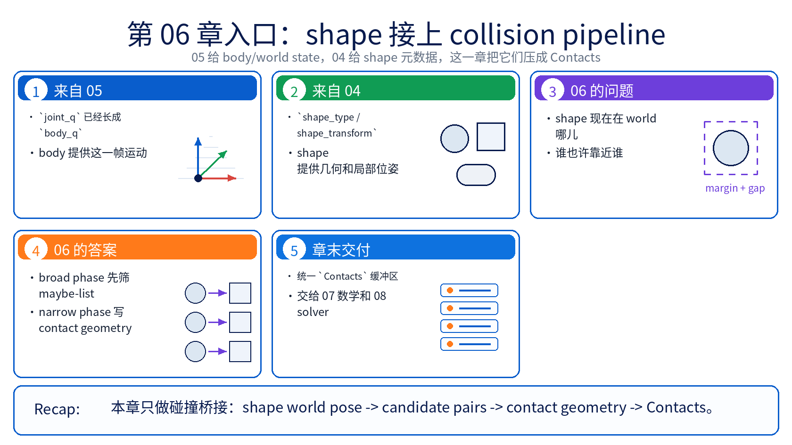
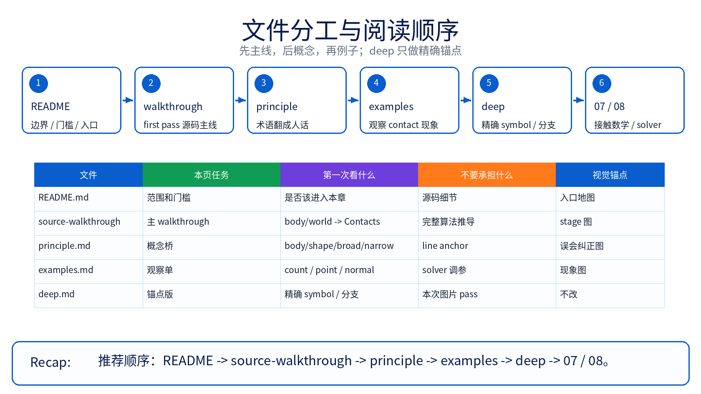
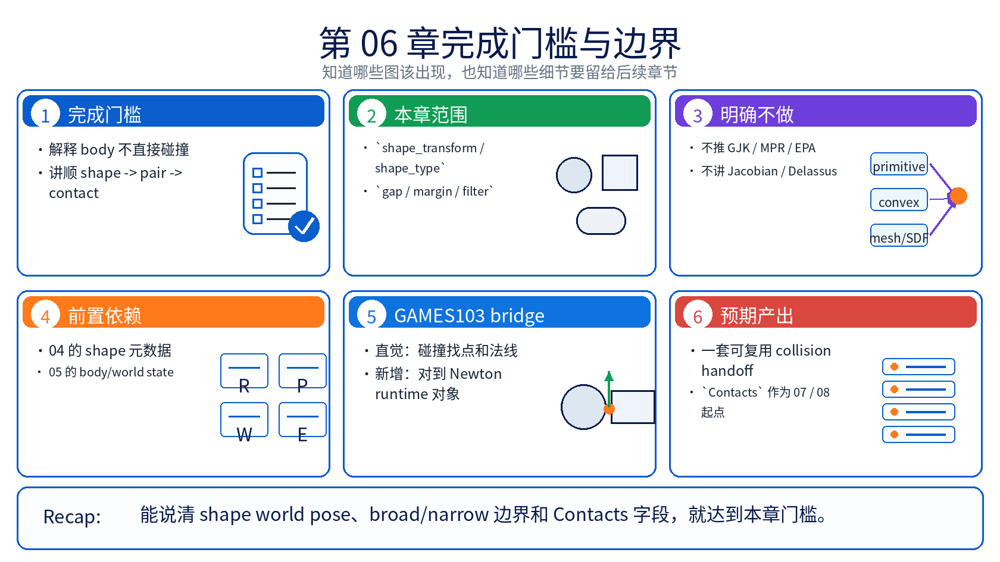

# 06 碰撞系统

`05_rigid_articulation` 已经把 `joint_q / joint_qd` 怎样长成 `body_q / body_qd` 讲顺了。第 06 章就站在它后面、`07_constraints_contacts_math` 和 `08_rigid_solvers` 前面，回答另一个马上会冒出来的问题：这些每步更新的 `body_q / body_qd`，再加上 `shape_type / shape_transform / shape_gap` 这类 shape 数据，是怎样先变成 broad phase 的候选对，再变成 narrow phase 的接触结果，最后落进 `Contacts`。

所以这一章不是碰撞算法教材，也不是接触求解器章节。它只保住第一次读 collision path 真正需要的桥：body/world state 怎样挂到 shape，shape 怎样进入 broad phase，candidate pair 怎样按 shape type 分流到 narrow phase，以及 contact data 为什么会以 `Contacts` 这种统一缓冲区的形式交给后面的章节。



## 文件分工

- `README.md`：只负责本章边界、完成门槛和阅读入口。
- `principle.md`：负责把 `body_q / body_qd`、shape world pose、broad phase、narrow phase 和 `Contacts` 这条主线讲顺。
- `source-walkthrough.md`：新手 / 主 walkthrough。第一次追 chapter 06 源码先看这一份；它内嵌关键源码片段，把 `body/world state -> candidate pairs -> ContactData -> Contacts` 主线直接讲顺。
- `source-walkthrough-deep.md`：深读锚点版。已经跟上主线后，如果你想精确追 symbol、上游路径和可选分支，再看这一份。
- `examples.md`：负责用最小 shape 例子把 candidate pair、contact 数量和 contact 几何变成可观察现象。



## 完成门槛

```text
[ ] 我能解释为什么 `body_q / body_qd` 只是 body/world state，而真正直接参加碰撞的是挂在 body 上的 shape
[ ] 我能顺着 `body_q + shape_transform + shape_type` 讲出一条最小碰撞桥：shape world pose -> AABB / filter -> candidate pair -> narrow phase -> `Contacts`
[ ] 我能说清 broad phase 只负责“便宜地找可能相撞”，narrow phase 才负责“把候选对变成具体 contact geometry”
[ ] 我能举出至少一种 shape-type branching 的例子，说明不同几何对会走不同 narrow-phase 问题，但最后仍会写成统一 contact data
[ ] 我能用人话描述 `Contacts` 至少存了 shape id、body-frame 接触点、world-frame 法线、offset / margin 这几类信息，并解释为什么 `07` / `08` 都要从这里继续读
```



## 本章目标

- 把第 05 章留下的 body/world state，真正接到 collision pipeline 的输入上。
- 解释 broad phase、narrow phase 和 shape-type branching 各自负责什么，不把它们糊成一个“碰撞黑箱”。
- 把 `Contacts` 讲成 chapter 06 的终点，也是 `07` 和 `08` 的共同起点。

## 本章范围

- `body_q / body_qd`、`shape_transform`、`shape_type`、`shape_gap`、margin / filter 这批数据怎样先确定 shape 在 world 里“现在在哪、是什么、该不该参与候选筛选”。
- broad phase 的第一遍读法：先用便宜、保守的方式找“可能相撞”的 shape 对，而不是直接给最终 contact。
- narrow phase 的第一遍读法：把 candidate pair 变成具体接触几何，并按 shape type 分流到不同几何查询分支。
- contact data 的第一遍读法：接触点、法线、shape 索引，以及 body-frame point / offset / margin 这些 handoff 字段怎样被整理进 `Contacts`，作为后续数学章和 solver 章的共同起点。

## 本章明确不做什么

- 不展开 Jacobian、Delassus、互补条件或更完整的 contact math；这些留给 `07_constraints_contacts_math`。
- 不展开 solver-specific contact handling，例如 XPBD、Featherstone 或 variational solver 怎样各自消费 contact；这些留给 `08_rigid_solvers` 及后续 solver 章节。
- 不写完整 GJK / MPR / EPA（Gilbert-Johnson-Keerthi / Minkowski Portal Refinement / Expanding Polytope Algorithm）这类 narrow phase 几何查询算法的推导；这里只把它们当成可能会路由到的具体几何分支终点。
- 不深挖 hydroelastic contact、SDF build、mesh preprocessing 或更底层几何构建 internals。

## 前置依赖

- 建议先读完 `05_rigid_articulation`；本章默认你已经知道 `body_q / body_qd` 是怎样从 articulation 状态长出来的。
- 建议先读完 `04_scene_usd`；本章默认你知道 `shape_type / shape_transform / shape_gap` 这些 shape 元数据是怎样进入 `Model` 的。
- `03_math_geometry` 最好还在脑子里：如果 local transform、AABB、法线、signed distance 这些词还没翻译成人话，本章会很快变成术语堆。
- 不要求你先会完整接触力学、约束优化或 solver 推导；这些正是后面章节再展开的内容。

## GAMES103 已有 vs 本章新增

| 维度 | GAMES103 已有 | 本章新增 |
|------|----------------|----------|
| 物理 / 几何视角 | 知道碰撞是在找交叠、接触点和法线，也知道 broad phase / narrow phase 这种分层大意。 | 把这层直觉压成一条具体桥：body 不直接碰撞，shape world pose 才进入候选筛选，再变成 contact data。 |
| Newton 工程视角 | 一般不会要求你把 shape 元数据、candidate pair、contact buffer 对到真实运行时对象。 | 解释 `body_q`、`shape_transform`、`shape_type`、gap / margin / filter 怎样接到 `Model.collide()`，并统一写进 `Contacts`。 |
| 章节衔接视角 | 不会刻意拆开 collision pipeline、contact math 和 solver consumption 这三层任务。 | 明确第 06 章只做碰撞桥接：先把 broad / narrow / contact data 读顺，再把 Jacobian / Delassus 留给 `07`，把 solver family 留给 `08`。 |

## 阅读顺序

1. 第一次追源码，先看 `source-walkthrough.md`；这一份就是给 first pass 准备的主 walkthrough。
2. 如果你想先补概念边界，或者读完主 walkthrough 还想把术语再翻成人话，再回看 `principle.md`。
3. 然后读 `examples.md`，用最小 shape 例子观察 local pose、shape type、gap / margin 改动后，候选对和 contact 几何会怎样变化。
4. 想精确追到上游文件、symbol 和行号，再看 `source-walkthrough-deep.md`。
5. 再进入 `07_constraints_contacts_math`，看 `Contacts` 怎样继续长成 Jacobian、约束和接触数学。
6. 最后进入 `08_rigid_solvers`，看不同 rigid solver 怎样消费同一份 `Contacts`，而不是各自重新发明一套碰撞输入。

## 预期产出

- `principle.md`：用一条 beginner-safe 主线解释为什么 body 不直接碰撞、shape world pose 怎样进入 broad phase，以及 narrow phase 怎样把候选对变成 contact data。
- `source-walkthrough.md`：给 first pass 的主 walkthrough，用内嵌源码片段把 `body/world state -> candidate pairs -> ContactData -> Contacts` 主线直接讲顺。
- `source-walkthrough-deep.md`：保留精确 symbol、路径、行号和可选分支，给已经跟上主线后还想继续追锚点的读者。
- `examples.md`：给出最小观察任务，帮助你看到 shape 类型、局部位姿、gap / margin 改动后，candidate pair 和 contact 结果会怎样增减或改变。
- 一套可复用的后续入口：去 `07` 时先追 contact math 怎样消费 `Contacts`，去 `08` 时再追不同 solver 怎样消费同一份 contact 缓冲区。
