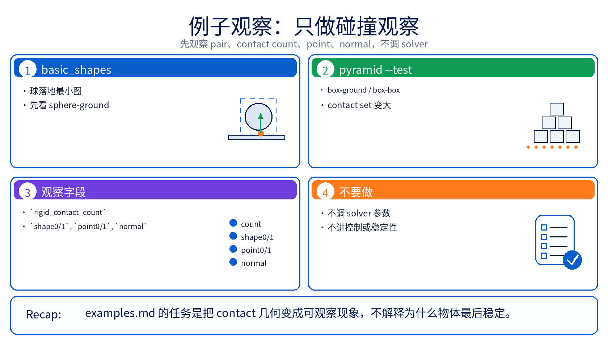
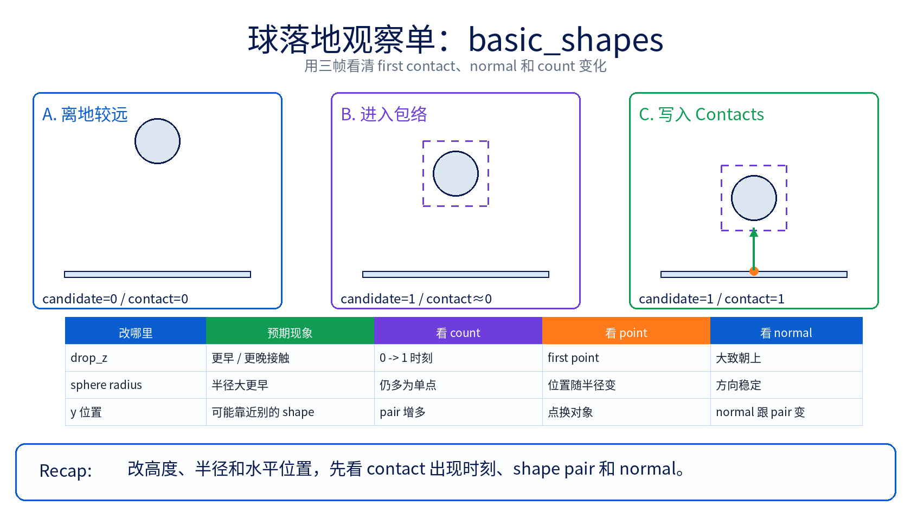

# 06 碰撞系统 例子观察单

`principle.md` 已经把 `shape world pose -> candidate pair -> contact geometry -> Contacts` 这条桥讲顺；这一页只把两个现成例子改成观察任务。下面提到的命令只是建议入口，不代表已经执行过。chapter 06 第一遍先看“哪个 shape pair 先出现、一个 pair 会长出几个 contact、法线和接触点怎样跟着几何变”，先不把注意力放到 solver 调参或控制逻辑上。

## 主例子：`basic_shapes` 里的球落地

如果你要亲自跑，建议入口还是最朴素的 `python -m newton.examples basic_shapes`，但第一遍只盯 sphere 和 ground plane，先把其他 shape 当背景。

### 它最适合验证什么

- 这是 chapter 06 最小的一张接触图：一个 sphere body 带着一个 sphere shape 落向 ground plane。
- 这个 sphere shape 没有额外局部偏移，所以最容易把“`body_q` 已经决定了 shape world pose”看成一幅具体画面。
- broad phase 在你脑中几乎只剩一组候选 pair：sphere vs ground；因此 `contact count / normal / point` 的变化最容易直接和几何位置对应起来。

### 先盯四个代码锚点

- `builder.add_ground_plane()`：给出最简单的 world shape。
- `self.sphere_pos = wp.vec3(0.0, -2.0, drop_z)`、`builder.add_body(...)`、`builder.add_shape_sphere(...)`：这是“body pose + shape 几何”最小组合。
- `self.model.collide(self.state_0, self.contacts)`：这一拍才真正把 shape world pose 送进碰撞流水线。
- `self.viewer.log_contacts(self.contacts, self.state_0)`：画面里的 contact arrow 只是 `Contacts` 的一个可视化入口，不是另一套碰撞逻辑。

### 改这里会怎样

| 改哪里 | 预期接触更早 / 更晚 / 更多 / 更少，或哪类碰撞量变化 | 最值得观察的 contact 字段或几何现象 |
|--------|--------------------------------------------------|----------------------------------|
| `drop_z = 2.0` 改成 `0.6` 或 `3.0` | 球离地更近时，sphere-ground 接触会更早出现；更高时会更晚出现。第一遍最直观的变化通常不是“解算更难”，而是 contact 从 `0` 变成 `1` 的时刻前后移动。 | `rigid_contact_count` 何时第一次非零；viewer 里 contact arrow 何时第一次出现。若你额外读 differentiable contact 输出，`rigid_contact_diff_distance` 从正到负会是最直观的距离变化。 |
| `builder.add_shape_sphere(body_sphere, radius=0.5)` 里的半径改大或改小 | 半径更大时接触更早，半径更小时更晚。对这组几何来说，contact 数通常仍接近单点，但接触位置会跟着球半径改变。 | `rigid_contact_point0 / rigid_contact_point1` 的几何位置，以及 `rigid_contact_normal` 是否仍保持稳定。 |
| 把 `self.sphere_pos` 的 `y=-2.0` 改到更靠近别的 shape，例如 `y=0.0` 或 `y=2.0` | broad phase 不再只剩 sphere-ground 这一条心智模型；sphere 还可能更早和 capsule 或 box 进入候选 pair，所以接触可能更早出现，也可能从单一地面接触变成多个不同 shape pair 的接触。 | `rigid_contact_shape0 / rigid_contact_shape1` 是否开始出现 ground 之外的 shape 组合；画面里第一根 arrow 是对着谁出现的。 |
| 先别改 solver，只把注意力切到同文件里的 `box`（`builder.add_shape_box(...)`）再对照 sphere | sphere-ground 往往更像单 contact；box-ground 更容易让你看到“同一个 shape pair 也可能产出多个 contact”。 | `rigid_contact_count` 是否从接近 `1` 变成明显更多；平面接触时 arrows 是否沿着 box 底面分布，而不是集中成一个点。 |

### 这一例子最容易看错的地方

- 这里最值钱的不是“球为什么最后停住”，而是“球对应的 shape 现在在 world 哪儿”。
- sphere 自身朝向几乎不改变接触图，所以它很适合做 chapter 06 锚点，但不适合拿来讲 orientation 对 contact multiplicity 的影响。
- `viewer.log_contacts()` 主要让你看见箭头；如果你想继续追字段，先看 `rigid_contact_count`、`rigid_contact_shape0 / shape1`、`rigid_contact_normal`、`rigid_contact_point0 / point1` 这一组。

## 对照例子：`pyramid --test --pyramid-size 4 --num-pyramids 1`

如果你要亲自跑，这个组合比默认大金字塔更适合 chapter 06 第一遍：`python -m newton.examples pyramid --test --pyramid-size 4 --num-pyramids 1`。这里故意先用 `--test` 去掉 wrecking ball，把注意力留给 box-ground 和 box-box 接触本身。

### 它最适合补哪块观察

- `basic_shapes` 让你看见“最小单 pair”；这个对照例子则让你看见 contact set 怎样因为 shape 数和面接触而长大。
- 底层 box 和 ground、相邻 box 与 box 都可能不是单点关系；一个 pair 可以写出多个 contact。
- 这也是区分“candidate pair 变多”和“最终 contact 变多”最快的对照：pair 数会长，contact 数往往会长得更快。

### 改这里会怎样

| 改哪里 | 预期接触更早 / 更晚 / 更多 / 更少，或哪类碰撞量变化 | 最值得观察的 contact 字段或几何现象 |
|--------|--------------------------------------------------|----------------------------------|
| `--pyramid-size 4` 改大到 `8`，或源码里的 `DEFAULT_PYRAMID_SIZE` 改大 | boxes 更多时，broad phase 候选 pair 和最终 contact set 都会明显增长；最底层和中间层最容易先变成“接触更多”。 | `rigid_contact_count` 的数量级变化；viewer 里 contact arrows 是否先在底层 box 周围变密。 |
| `CUBE_SPACING = 2.1 * CUBE_HALF` 往 `2.0 * CUBE_HALF` 靠近，或再拉开一点 | 盒子初始间距更紧时，相邻 box-box 接触会更早出现、更多也更持久；间距更大时则更晚、更少。 | `rigid_contact_shape0 / rigid_contact_shape1` 里相邻 box pair 是否更早反复出现；同一对 box 或同一 box-ground pair 是否一次写出多个 contact。 |
| 在理解静态堆叠后，再把 `--test` 去掉让 wrecking ball 回来 | contact set 会从“主要集中在底层支撑面”变成“瞬时增长、迅速重排”的图像；这不是给你调 solver，而是让你看到候选 pair 和最终 contact 都会随几何关系突然扩张。 | `rigid_contact_count` 的峰值变化，以及画面里 arrows 从底层局部区域扩散到整堆 boxes 的过程。 |

## 这页怎么配合其他文件

- `principle.md`：负责把 `shape world pose -> broad phase candidate -> narrow phase contact -> Contacts` 这条桥讲顺。
- `source-walkthrough.md`：负责把这里提到的观察点钉回 `compute_shape_aabbs(...)`、broad phase writer、narrow phase 和 `Contacts` 字段。
- `examples.md`：只负责把两个现成例子改成“改哪里、预期接触怎样变化、最值得观察哪个字段或几何现象”的观察单。
