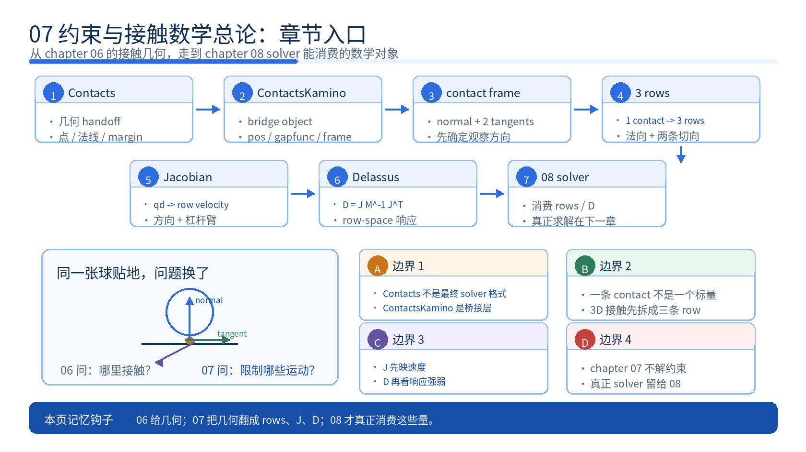
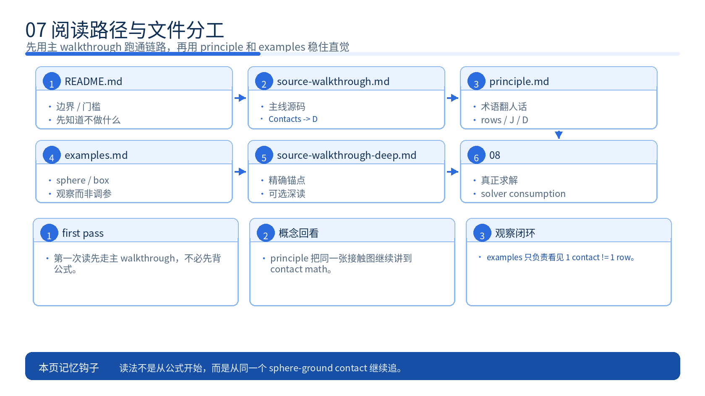
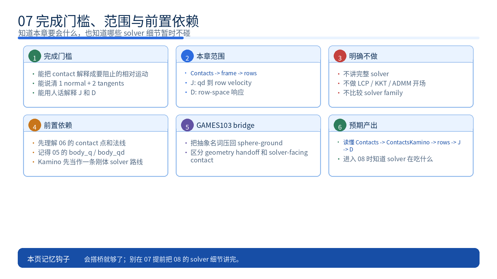

# 07 约束与接触数学总论

`06_collision` 已经把球和地面的接触写进 `Contacts` 了。第 07 章不再问“接触点在哪、法线朝哪、相对分离信息是什么”，而是接着问另一件事: 同样这一个球贴地的接触，怎样继续长成 solver 真正会吃的约束行、Jacobian 和 Delassus。再往后到 `08_rigid_solvers`，才是不同 solver 怎样消费这些对象。

所以这章不是碰撞算法复习，也不是完整求解器推导。它只做中间这座桥: `Contacts -> contact directions -> rows -> Jacobian -> effective mass / Delassus`。



## 文件分工



- `README.md`: 本章边界、完成门槛、阅读入口。
- `principle.md`: 从 chapter 06 那张球贴地的图开始，把一条 contact 怎样长成 `1` 条法向 row 和 `2` 条切向 row 讲顺，再解释 Jacobian 和 Delassus 的第一层直觉。
- `source-walkthrough.md`: 新手 / 主 walkthrough。第一次追 chapter 07 源码先看这一份；它内嵌关键源码片段，把 `Contacts -> solver-facing contact -> rows -> Jacobians -> Delassus` 主线直接讲顺。
- `source-walkthrough-deep.md`: 深读锚点版。已经跟上主线后，如果你想精确追 symbol、上游路径和可选分支，再看这一份。
- `examples.md`: 用 `sphere-ground` 和 `box-ground` 做观察任务，帮你把“接触几何”和“接触数学”连起来。

## 完成门槛



```text
[ ] 我能把 `Contacts` 里的接触点、法线和相对分离信息，翻译成“这个接触想阻止什么相对运动”
[ ] 我能解释为什么一条刚体接触通常会长成 `1` 条法向 row + `2` 条切向 row
[ ] 我能用人话描述 Jacobian 在这里做的是“哪些广义速度会影响这个接触方向”
[ ] 我能把 effective mass / Delassus 先理解成“沿这个接触方向，系统有多难被推着动”
[ ] 我能说明 chapter 06 的 `Contacts` 还是几何 handoff，而 Kamino 会再桥接成 solver-facing contact 表示
```

## 本章目标

- 把 chapter 06 的球贴地接触，继续讲到 contact frame、constraint rows 和 Jacobian，而不是让术语突然跳出来。
- 用最小例子先讲“一个接触想阻止哪种相对运动”，再介绍矩阵和公式，避免把 `J`、`D` 读成抽象名词。
- 给 `08_rigid_solvers` 留下够用的直觉入口: 你先知道 solver 在吃什么，不必现在就把 solver 家族全学完。

## 本章范围

- 从 `Contacts` 里的接触点、法线、margin / thickness 出发，解释一条 contact 怎样定义一个局部接触坐标系。
- 解释为什么一个 3D 刚体接触通常拆成 `1` 条法向 row 和 `2` 条切向 row，而不是一个标量。
- 解释 Jacobian 的第一遍读法: 哪些平移和转动速度会改变这个接触方向上的相对运动。
- 解释 effective mass / Delassus 的第一层物理意义: 沿某个接触方向推一下，系统有多容易或多不容易响应。
- 用 `box-ground` 说明一个 shape pair 可以长出多个 contact，接触点偏离质心时 Jacobian 为什么会自然带上角向部分。

## 本章明确不做什么

- 不从 `J M^{-1} J^T`、LCP、NCP、KKT 或 ADMM 开场。
- 不做完整刚体接触求解器教材，也不比较 MuJoCo、Kamino、XPBD 等 solver family。
- 不展开所有 bias、stabilization、regularization 和 warm-start 细节。
- 不把 `Contacts` 误讲成 solver 的最终内部格式; 这章只把 bridge 讲清，不把 solver internals 一次讲完。

## 前置依赖

- 建议先读完 `06_collision`。如果你还不能解释 `rigid_contact_normal`、`rigid_contact_point0 / point1` 在球贴地场景里分别代表什么，先回看 `chapters/06_collision/principle.md` 和 `chapters/06_collision/examples.md`。
- 建议 chapter 05 还在脑子里: 这章默认你已经知道 `body_q / body_qd` 是怎样长出来的，因为 Jacobian 讨论的是“哪些速度会影响接触”。
- walkthrough 里会频繁提到 `Kamino`。这里先把它当成 Newton 里一条具体的刚体 solver 路线即可; chapter 07 只是借它看清 `Contacts -> rows -> Jacobians -> Delassus` 这条桥，不要求你现在就会 solver 家族比较。
- 这章不要求你先会 solver 推导。solver 怎样真正解这些 rows，是 `08_rigid_solvers` 的任务。

## GAMES103 已有 vs 本章新增

| 维度 | GAMES103 已有 | 本章新增 |
|------|----------------|----------|
| 物理 / 数学视角 | 知道接触大意上会变成法向约束和摩擦，也知道 Jacobian、effective mass 这些词会在求解器里出现。 | 把它们压回同一个具体画面: 一个球贴地的 contact 为什么会长成 `3` 个方向，Jacobian 为什么本质上在问“哪些速度会影响这些方向”，Delassus 为什么是在看这些方向有多难推。 |
| Newton 工程视角 | 一般不会强调 `Contacts` 只是 collision handoff，也不会区分 runtime 几何记录和 solver-facing contact 容器。 | 明确 chapter 06 的统一 handoff object 是 runtime `Contacts`，而 Kamino 会把它桥接成带 `gapfunc`、contact frame、material 的 `ContactsKamino` 再进入 rows / Jacobians。 |
| 章节衔接视角 | 常把碰撞、接触数学、求解器视为一整团“接触处理”。 | 明确分层: chapter 06 负责把几何写进 `Contacts`，chapter 07 负责把几何翻译成约束数学，chapter 08 再负责 solver 怎样消费这些数学对象。 |

## 阅读顺序

1. 第一次追源码，先看 `source-walkthrough.md`；这一份就是给 first pass 准备的主 walkthrough。
2. 如果你想先补概念边界，或者读完主 walkthrough 还想把术语再翻成人话，再回看 `principle.md`。
3. 然后读 `examples.md`，用 `sphere-ground` 和 `box-ground` 把“法向 / 切向方向”“多个 contact”“偏心接触带来角向耦合”变成可观察现象。
4. 想精确追到上游文件、symbol 和行号，再看 `source-walkthrough-deep.md`。
5. 最后进入 `08_rigid_solvers`，再看不同 solver 怎样消费这些 rows、Jacobians 和 constraint-space quantities。

## 预期产出

- `principle.md`: 一条 beginner-safe 主线，能把 chapter 06 的接触几何继续讲成 constraint rows、Jacobian 和 Delassus 直觉。
- `source-walkthrough.md`: 给 first pass 的主 walkthrough，用内嵌源码片段把 `Contacts -> solver-facing contact -> rows -> Jacobians -> Delassus` 主线直接讲顺。
- `source-walkthrough-deep.md`: 保留精确 symbol、路径、行号和可选分支，给已经跟上主线后还想继续追锚点的读者。
- `examples.md`: 两个能复用的观察任务，分别守住“单接触为什么不是一个标量”和“多接触 / 偏心接触为什么会带来更强耦合”这两层理解。
