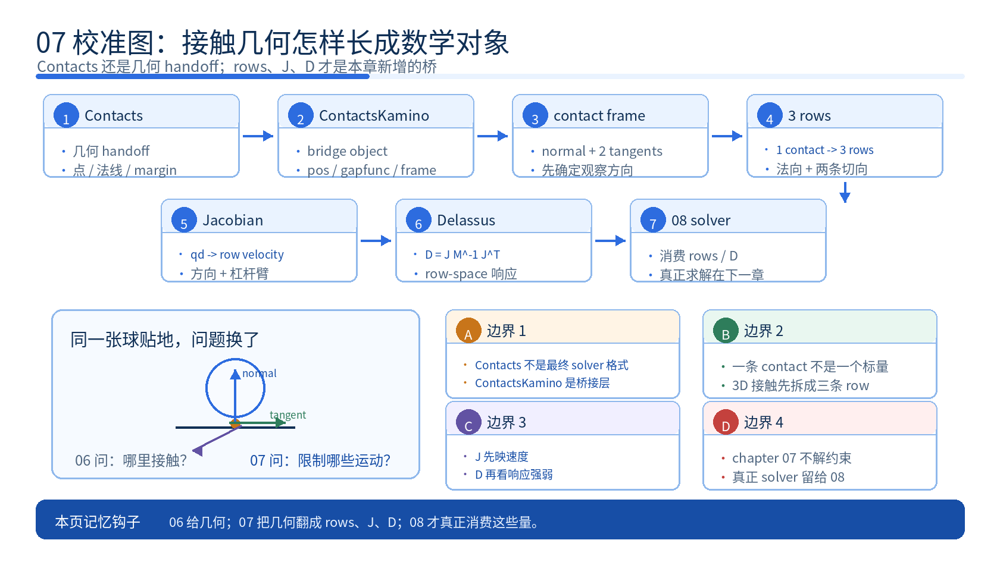
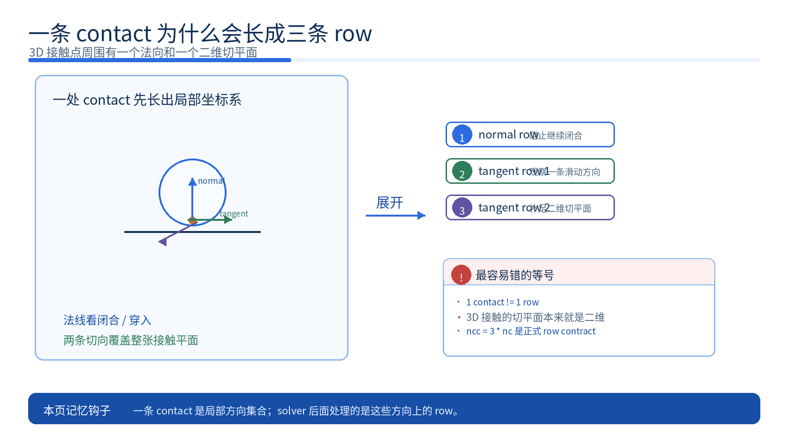
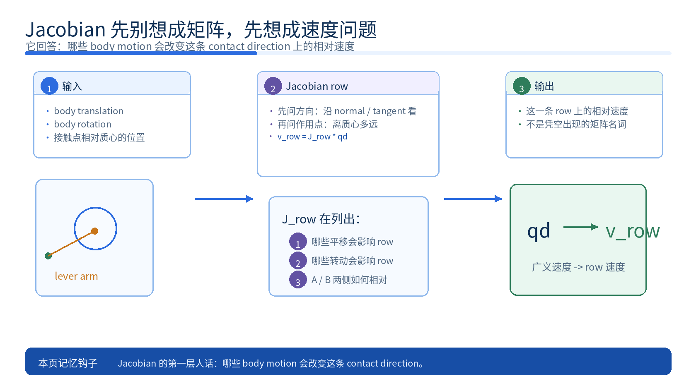
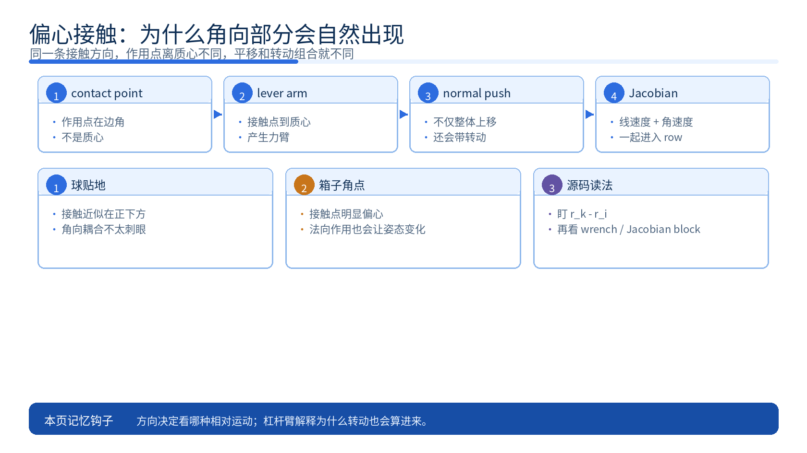
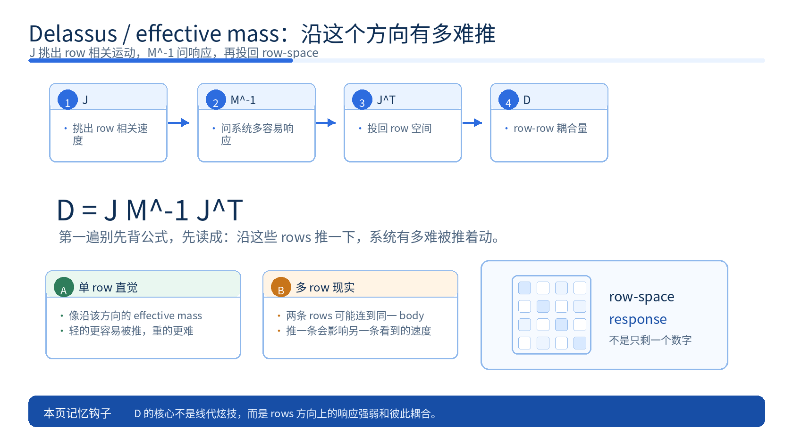
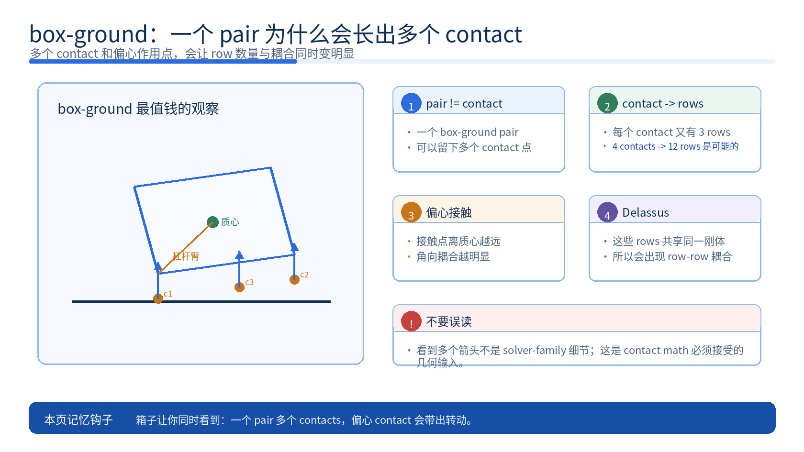
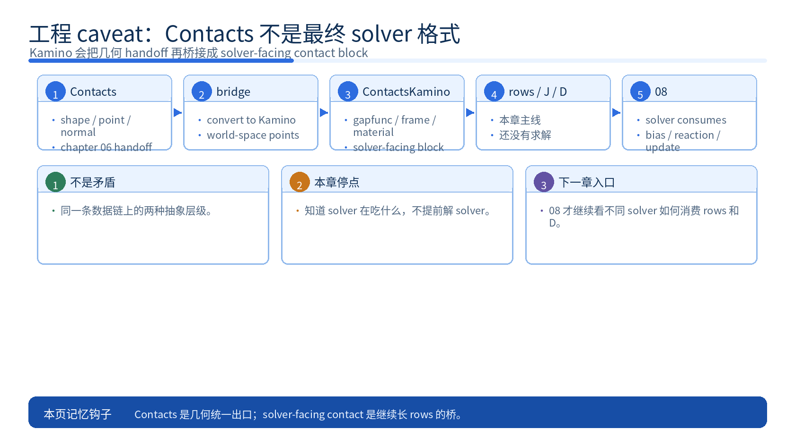

# 07 约束与接触数学总论

## 0. 先把 chapter 06 的球贴地画面带过来



chapter 06 里，你关心的是“接触点在哪、法线朝哪、两边还隔多少或已经压进多少”。所以那一章停在 `Contacts` 很合理: 到这里，碰撞器已经把几何结果交出来了。

chapter 07 只是换一个问题继续读同一张图。球已经贴到地面以后，你现在更想问的是: **这次接触到底希望系统阻止哪种相对运动，又怎样把这种“想阻止的方向”写成 solver 后面能继续用的数学对象？**

第一遍先别想矩阵。先守住一个非常具体的事实: 如果球还在沿着接触法线继续往地里钻，系统就必须想办法阻止这件事。如果球已经不再往地里钻，而是在地面上擦着滑，那系统又会关心切向的相对运动。第 07 章要做的，就是把这两件事翻译成约束方向。

## 1. 为什么一条 contact 会长成三条 row



在 chapter 06 里，你容易把“一条 contact”想成一个几何记录: 一个点、一条法线，再加上一份描述两边相对分离程度的信息。

但对 solver 来说，这还不够。solver 需要知道的是: 这次接触到底想限制哪些相对运动方向。

回到球贴地的画面，一处接触最自然会先长出一个局部接触坐标系:

- 法线方向: 垂直地面，也就是最直接阻止“继续互相压进”的方向。
- 第一条切向方向: 沿着地面的一条滑动方向。
- 第二条切向方向: 和前一条切向垂直，但也仍然躺在地面里。

于是，一条 3D 刚体接触通常不会只对应一个标量，而会对应三条约束 row:

- `1` 条法向 row: 先看有没有继续闭合、继续穿入。
- `2` 条切向 row: 给摩擦或切向限制留下两个独立方向。

为什么切向要有两条，而不是一条？因为在三维空间里，接触点附近那张“贴着表面滑”的平面本来就是二维的。你只给一条切向，就只能表达“沿这一条线怎么滑”，却表达不了整张切平面里的任意滑动。

所以这里最值钱的一句人话是: **一条 contact 不只是一个点，它还定义了一组局部方向；solver 真正在处理的，是这些方向上的相对运动。**

如果你愿意先记一个最小结论，可以先记成下面这张表:

| 词 / 对象 | 先怎么想 | 球贴地时在干嘛 | 在源码里第一次看哪里 |
|-----------|-----------|----------------|-------------------------|
| `Contacts` | 碰撞阶段交出来的几何 handoff | 记录哪两个 shape 接触、两边接触点在哪、法线朝哪、厚度是多少 | `newton/_src/sim/contacts.py` |
| contact frame | 接触点自己的小坐标系 | `z` 轴沿法线，`x / y` 轴沿两条切向 | `newton/_src/solvers/kamino/_src/geometry/contacts.py` |
| Jacobian row | 哪些速度会改变这个接触方向上的状态 | 球沿法线升降、沿地面滑动，或在偏心接触时绕着点转，都会映射进来 | `newton/_src/solvers/kamino/_src/kinematics/jacobians.py` |
| effective mass / Delassus | 沿这些方向推系统时，它有多难动 | 轻球比重球更容易被推开，偏心受力还会顺带带出转动 | `newton/_src/solvers/kamino/_src/dynamics/delassus.py` |

## 2. Jacobian 先别想成矩阵, 先想成“哪些运动会影响这个接触方向”



很多人第一次在接触里看到 Jacobian，会直接把它读成抽象矩阵名字。这里更好的顺序正好相反: **先想它在替你回答什么问题，再接受它最后被写成矩阵。**

还是看球贴地。

如果你现在只盯法向 row，那么系统要问的其实是:

- 球的哪些速度，会让这个接触沿法线方向继续闭合？
- 地面的哪些速度，会让这个接触沿法线方向继续闭合？

对静止地面来说，答案很简单: 主要就是球沿法线的平移速度。

如果你再看切向 row，问题就变成:

- 球沿地面滑动的速度，会不会让这条切向方向上的相对运动变大？
- 如果接触点不在质心上，球或箱子的角速度，会不会也让接触点沿切向扫过去？

先在这里停一下，更值得先记住的不是符号，而是一句人话:

```text
Jacobian 在回答: 哪些 body motion 会让这条 contact direction 上的相对速度变大或变小？
```

这句话稳住以后，再接受 Jacobian 最后会被写成一个映射就容易多了。它本质上是在做:

```text
广义速度 qd
-> 这个接触方向上的相对速度
```

如果一定要给一个最小公式，也应该在这个直觉后面再看。这里的 `qd` 先只把它读成“系统当前那串广义速度坐标”。

```text
v_row = J_row * qd
```

其中 `J_row` 不是凭空来的。它背后其实藏着两层非常具体的几何。第一层先只看“方向”，第二层再补“作用点离质心有多远”。

先看第一层:

- 在法向 row 里，方向就是接触法线。
- 在切向 rows 里，方向就是接触平面里的两条切向。

再看第二层:

- 只要接触点不在质心上，同样一条接触方向就会同时对平移和转动敏感。
- 这是因为接触点速度里天然有一项来自 `角速度 x 杠杆臂`。

也就是说，方向先告诉你“沿哪边看相对运动”，杠杆臂再告诉你“为什么转动也会算进来”。

如果你想把这段压成一个最小总结，可以先记成:

```text
contact direction 先决定我要看哪种相对运动
lever arm 再决定这种相对运动为什么会同时受平移和转动影响
```

所以你完全可以先把 Jacobian 读成一句人话: **它在列出“哪些 body motion 会影响这条 contact direction”。**

## 3. 接触点离质心越偏, 角向部分越重要



球贴地很适合建立第一层直觉，因为球的接触通常比较像“质心正下方附近的一点”。这时法向 row 主要让你看到平移方向，角向耦合没有那么刺眼。

但只要接触点偏离质心，这件事就完全不一样了。

想象一个箱子只用前下角先碰到地面。几何上看，你还是只有一个接触点。可一旦地面沿着法线把它顶住，这个作用点相对箱子质心就已经有明显杠杆臂了。结果就是:

- 法向方向上的作用不只会推着箱子整体上移。
- 同时还会给箱子一个转动趋势，让它绕着接触点或绕着质心重新摆正。

源码里这一层直觉对应的正是接触 wrench / lever-arm 那部分数学。它没有在说“接触突然变复杂了”，而是在老老实实回答一个物理事实: **同样一条接触方向，作用点不同，系统被推出来的平移和转动组合就不同。**

## 4. Delassus / effective mass 先看“沿这个方向有多难推”



当你已经知道每条 row 在问哪种相对运动，下一步自然就会问: 如果我真的沿这条 row 去推系统，系统到底有多容易动？

这就是 effective mass / Delassus 最值得先保住的第一层含义。

先别把它读成另一门质量矩阵课程。第一遍只记这个对照就够了:

- 同样沿法向推一下，轻球通常比重球更容易改速度。
- 同样在箱子边角处推一下，如果杠杆臂更长，角向响应也会更明显。
- 两个接触 row 如果都连到同一个 body，它们并不是彼此独立的; 推一条 row，可能会连带改变另一条 row 看到的速度。

所以 Delassus 在这里更像是“约束空间里的表观惯量”。如果只看一条 row，它给人的感觉很接近一个沿该方向的 effective mass; 如果把很多 rows 放在一起看，它又会变成 rows 之间的耦合矩阵。

这一章可以接受一个最小公式，但顺序必须放在直觉后面:

```text
D = J M^{-1} J^T
```

这条式子第一遍真正值得你读出的，不是线性代数技巧，而是下面这句人话:

```text
先用 J 挑出“会影响接触方向的运动”
再用 M^{-1} 问系统在这些运动上有多容易响应
最后再投回接触 rows 自己的坐标里
```

所以第 07 章到这里就够了。你知道为什么 solver 需要 `D`，也知道它是在描述 rows 方向上的“难不难推”；至于 solver 怎样真的解它，是第 08 章的事。

## 5. 再看 `box-ground`: 一个 pair 为什么会长出多个 contact



球最适合教“单接触 -> 三条 row”。箱子贴地则专门教两件更难的事。

第一件事是: **一个 shape pair 不一定只会产出一个 contact。**

箱子底面和地面接近共面的那一刻，narrow phase 很可能会留下多个接触点来更稳定地代表这片接触区域。于是你不能再把“一个 pair”直接等同于“一个点”。

第二件事是: **这些 contact rows 还会彼此耦合。**

如果箱子底面有四个接触点，那么从接触数学角度看，它就不只是一个接触，而是最多 `4 x 3 = 12` 条 rows。它们都连着同一个刚体，于是:

- 左前角那组 rows 推了一下，不只会改左前角的速度。
- 箱子整体的平移和转动都会变。
- 这些变化又会反过来影响右前角、左后角、右后角那几组 rows 看到的相对速度。

这就是为什么 box-ground 比 sphere-ground 更能让你接受 Delassus 不是“单个数字”，而是 rows 之间也会彼此看到对方。

## 6. 记住一个工程 caveat: `Contacts` 不是 Kamino 的最终内部格式



chapter 06 结束时，你认识的是 runtime `Contacts`。这是对的，因为它就是碰撞阶段真正交出来的统一 handoff object。

这里先补一句背景，避免名字突然跳出来: `Kamino` 可以先把它当成 Newton 里一条具体的刚体 solver 路线。chapter 07 不是在讲 solver 家族比较，而只是借这条路线把 contact geometry 怎样长成 rows / Jacobians / Delassus 这件事钉到真实源码上。

但 chapter 07 需要再补一句更准确的话: solver 路线上并不会直接把这份 `Contacts` 原封不动拿来解。

以 Kamino 为例，后面还会做一次桥接，把 chapter 06 的 `Contacts` 再整理成 solver-facing contact 表示。那份表示里会更直接地带着:

- world-space 的 `position_A / position_B`
- `gapfunc = (normal, signed_distance)`
- contact frame
- material 信息

所以最稳的理解方式是:

- `Contacts` 是 collision 章节交出来的统一几何 handoff。
- solver-facing contacts 是后续 solver 为了 rows / Jacobians / reaction bookkeeping 再做的一层桥接。

这不是前后矛盾，而是同一条数据链上两种不同抽象层级。

## 7. 这一章到这里停, 下一步去 `08`

如果你读到这里，应该已经能把同一张球贴地的图继续讲下去了:

- chapter 06 先把接触几何写进 `Contacts`
- chapter 07 再把这条接触解释成一组接触方向、三条 rows、相应 Jacobian，以及 rows 方向上的 effective mass / Delassus 直觉
- chapter 08 才继续问: 不同 solver 怎样真正消费这些 rows、bias、reaction 和 Delassus

所以这章的任务不是把 solver 解完，而是把你送到“终于知道 solver 在吃什么”的地方。只要这条桥通了，后面的求解器章节就不再像突然切题。
