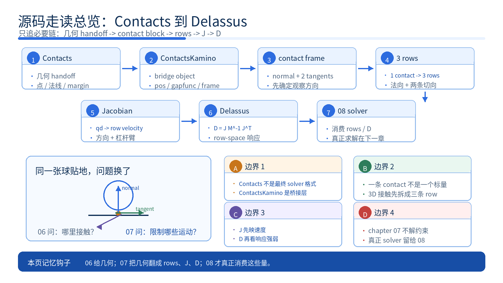
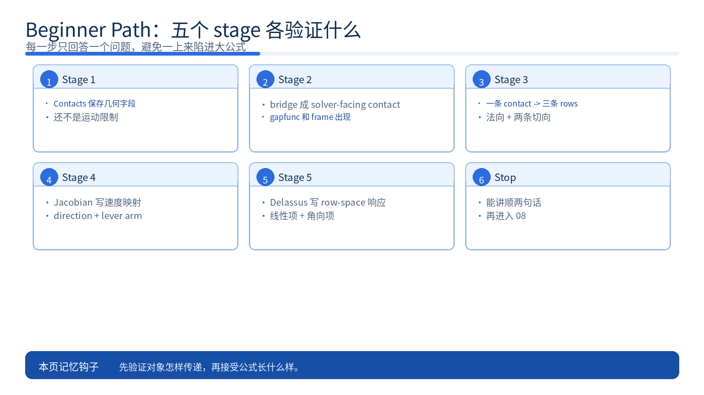
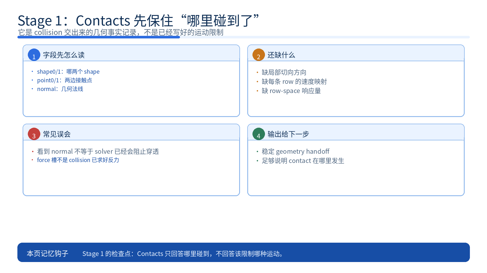
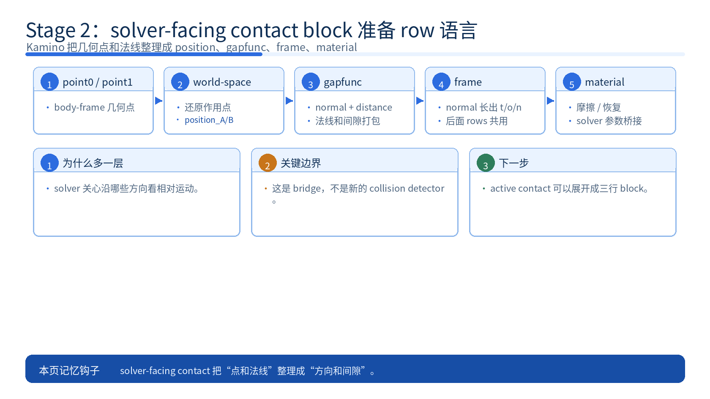
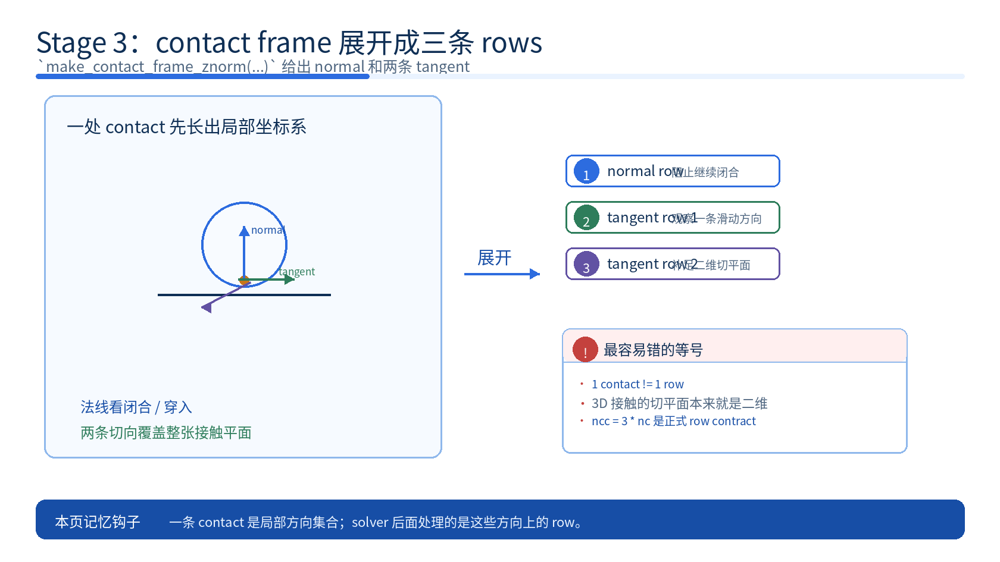
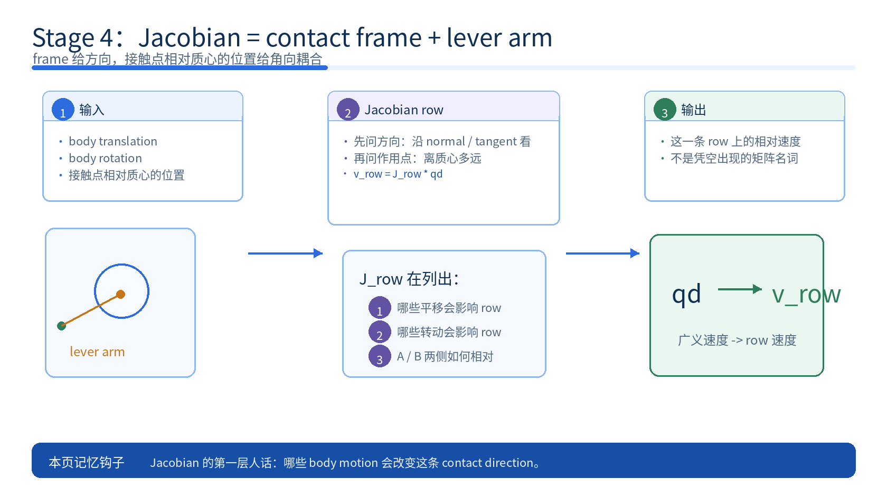
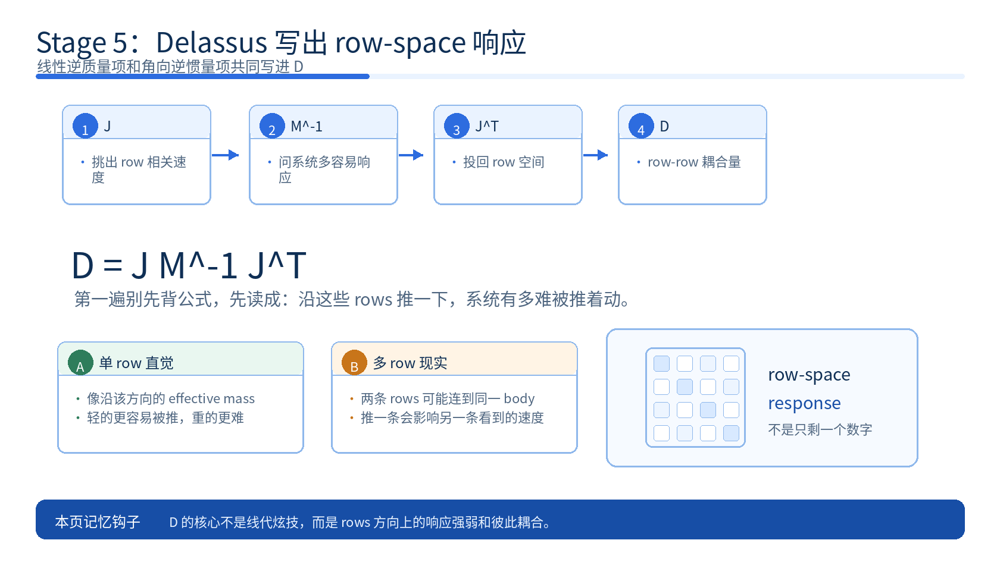
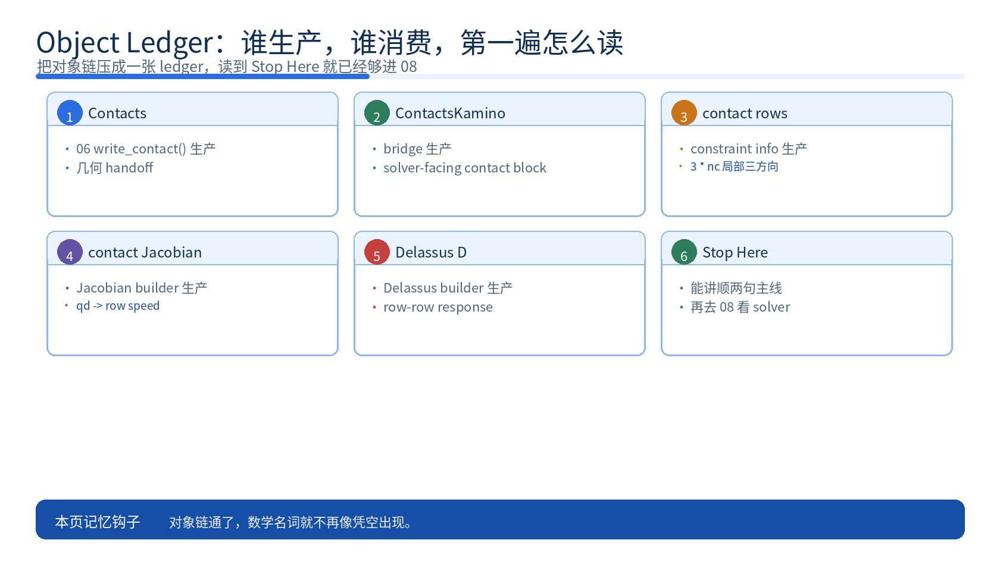

# 07 约束与接触数学总论 源码走读

这份主 walkthrough 先回答一个真正的新手会问的问题：chapter 06 明明已经给了接触点和法线，为什么 solver 还不能直接停在这里。

因为接触几何只告诉你“哪里碰到了”，solver 还需要知道“哪些相对运动必须被阻止”。只有先把这层物理故事讲顺，后面的 `row`、`Jacobian` 和 `Delassus` 才不会像凭空出现的数学名词。

如果你想先看更慢一点的概念版，可以再配合 `principle.md`；但只读这一份，也应该能把 chapter 07 的主线讲顺。

## What This Walkthrough Follows



只追这一条必要链：

```text
chapter 06 的 Contacts
-> 接触点 / 法线 / 间隙还是几何 handoff
-> solver 先把它重排成能表达“该限制什么运动”的 contact block
-> 1 contact -> 3 rows
-> Jacobian 把 body velocity 映成每条 row 的相对速度
-> Delassus 告诉你沿这些 rows 系统有多难被推着动
```

这一页刻意不展开三类东西：

- `06_collision` 之前的 narrow phase 细节；这里默认 `Contacts` 已经准备好了。
- PADMM、NCP、warm start 这类真正的求解算法；那是 `08_rigid_solvers` 继续接手的内容。
- limit constraints、sparse Jacobian 变体、unified collision pipeline 这类深读分支；它们都放到 `source-walkthrough-deep.md`。

第一遍先守住一句话：chapter 07 真正讲的是 **接触几何怎样一步步被翻译成 solver 看得懂的运动限制**，不是一上来就背大公式。

## One-Screen Chapter Map

```text
Contacts.rigid_contact_point0 / point1 / normal / margin
                        |
                        v
       几何事实：两边在哪碰到、法线朝哪、当前还隔多远
                        |
                        v
    convert_contacts_newton_to_kamino(...)
                        |
                        v
ContactsKamino.position_A / position_B / gapfunc / frame / material
                        |
                        v
     solver-facing contact block：世界系作用点 + 局部接触方向
                        |
                        v
    make_unilateral_constraints_info(...)
    update_constraints_info(...)
                        |
                        v
            1 contact -> 3 rows
       (1 normal + 2 tangent directions)
                        |
                        v
          build_contact_jacobians(...)
                        |
                        v
  J：哪些 body velocity 会改变这些 rows 的相对速度
                        |
                        v
               Delassus = J M^-1 J^T
       沿这些 rows 系统有多难被推着动
```

## Beginner Path



1. 先看 Stage 1。
   - 想验证什么：chapter 06 到底交给 chapter 07 哪些字段，以及为什么这些字段还不够 solver 直接开解。
   - 看完后应该能说：`Contacts` 里保存的是接触几何，不是已经写好的运动限制。
2. 再看 Stage 2。
   - 想验证什么：solver 为什么要先把几何改写成带局部方向和间隙的 contact block。
   - 看完后应该能说：solver 真正在意的是“沿哪些方向看相对运动”，不是只看一个接触点。
3. 再看 Stage 3。
   - 想验证什么：为什么一条 3D 接触会长成三条 rows。
   - 看完后应该能说：一条接触会被拆成 `1` 条法向 row 和 `2` 条切向 row，因为 solver 要分别看法向闭合和切向滑动。
4. 再看 Stage 4。
   - 想验证什么：Jacobian 到底在这里映射什么。
   - 看完后应该能说：Jacobian 不是抽象矩阵名词，而是“哪些 body velocity 会改变这些 rows”的代码化表达。
5. 最后看 Stage 5。
   - 想验证什么：`J` 为什么会继续长成 Delassus。
   - 看完后应该能说：Delassus 的人话含义就是“沿这些 rows，系统有多难被推着动”。

## Main Walkthrough

### Stage 1: `Contacts` 先保住“哪里碰到了”，但还没有保住“该阻止什么运动”



**Definition**

`Contacts`：chapter 06 交出来的统一接触缓冲。第一遍先把它读成“碰撞阶段留下的几何事实记录”。

**Claim**

chapter 06 交给 chapter 07 的仍然是接触几何：shape id、body-frame 接触点、world-frame 法线、接触厚度。它还不是 solver 最终要解的运动限制。

**Why it matters**

这一步最容易纠正一个新手误会：看到接触点和法线，不代表 solver 已经知道该怎么“阻止穿透”。点和法线只回答“哪里接触、朝哪边”，还没有回答“沿哪些相对运动方向要被约束”。

**Source excerpt**

先看 `newton/_src/sim/contacts.py` 里 chapter 06 留下来的核心字段：

这里先保留字段声明块干净，因为这一段的重点是确认 `Contacts` 保存的是几何槽位，而不是已经成型的约束行。

```python
self.rigid_contact_shape0 = wp.full(rigid_contact_max, -1, dtype=wp.int32)
self.rigid_contact_shape1 = wp.full(rigid_contact_max, -1, dtype=wp.int32)
self.rigid_contact_point0 = wp.zeros(rigid_contact_max, dtype=wp.vec3)
self.rigid_contact_point1 = wp.zeros(rigid_contact_max, dtype=wp.vec3)
self.rigid_contact_offset0 = wp.zeros(rigid_contact_max, dtype=wp.vec3)
self.rigid_contact_offset1 = wp.zeros(rigid_contact_max, dtype=wp.vec3)
self.rigid_contact_normal = wp.zeros(rigid_contact_max, dtype=wp.vec3)
self.rigid_contact_margin0 = wp.zeros(rigid_contact_max, dtype=wp.float32)
self.rigid_contact_margin1 = wp.zeros(rigid_contact_max, dtype=wp.float32)
self.rigid_contact_force = wp.zeros(rigid_contact_max, dtype=wp.vec3)
```

**Verification cues**

- `rigid_contact_point0 / point1` 记录的是 body-frame 点，不是 solver 已经写好的 world-space 约束。
- `rigid_contact_normal` 给的是 A-to-B 法线；它只提供法向几何方向，还没有展开成完整接触局部坐标系。
- `rigid_contact_force` 只是预留输出槽，不是 collision pipeline 已经求好的反力。

**Checkpoint**

如果你现在还会把 `point / normal / margin` 直接当成 solver 的答案，先不要继续。你至少应该能说出：`Contacts` 只回答“哪里碰到了”，还没有回答“该阻止哪种相对运动”。

**Output passed to next stage**

一份稳定的几何 handoff：它足够说明 contact 在哪里发生，但还不够直接驱动 solver。

### Stage 2: solver 先把几何改写成“沿哪些方向看相对运动”的 contact block



**Definition**

solver-facing contact：solver 更愿意消费的一条接触表示。第一遍先把它读成“除了接触点之外，还明确带上局部方向和当前间隙”的 contact block。

**Claim**

Kamino 不直接拿 `rigid_contact_point0 / point1 / normal` 做 rows，而是先把它们变成 `position_A / position_B / gapfunc / frame / material` 这套 solver-facing 语言。

**Why it matters**

solver 真正关心的不是“这里有个点”，而是“沿法线现在是在分开还是还在闭合”，“接触平面里有哪些切向方向可以用来表达滑动”。所以在 row 出现之前，系统必须先把几何记录整理成一个带局部 frame 的 contact block。

**Source excerpt**

先看 `newton/_src/solvers/kamino/_src/geometry/contacts.py` 里 `ContactsKaminoData` 真正关心什么：

这里也先保留声明块干净，因为读者第一遍只需要扫出 solver-facing contact 额外多了哪些槽位。

```python
position_A: wp.array | None = None
position_B: wp.array | None = None
gapfunc: wp.array | None = None
frame: wp.array | None = None
material: wp.array | None = None
```

再看 `convert_contacts_newton_to_kamino(...)` 怎样把 Newton 的 runtime contact 变成这套格式：

以下摘录为教学注释版，注释非原源码。

```python
p0_world = wp.transform_point(X0, newton_point0[tid])  # 先把 A 侧 body-frame 点还原到 world
p1_world = wp.transform_point(X1, newton_point1[tid])  # 再把 B 侧 body-frame 点还原到 world

d_newton = wp.dot(p1_world - p0_world, n_newton) - (
    newton_thickness0[tid] + newton_thickness1[tid]
)  # 把两点沿法线的间距改写成 signed distance

distance = d_newton  # solver 后面直接消费这个 gap
gapfunc = vec4f(normal[0], normal[1], normal[2], float32(distance))  # 法线 + 距离打包成 gapfunc
q_frame = wp.quat_from_matrix(make_contact_frame_znorm(normal))  # 由法线长出 contact local frame

kamino_position_A[mcid] = pos_A  # 写入 A 侧 world-space 作用点
kamino_position_B[mcid] = pos_B  # 写入 B 侧 world-space 作用点
kamino_gapfunc[mcid] = gapfunc  # 写入 solver-facing 法线/间隙
kamino_frame[mcid] = q_frame  # 写入后面 rows 要共享的局部坐标系
kamino_material[mcid] = vec2f(mu, rest)  # 摩擦 / 恢复参数也一起桥接过去
```

**Verification cues**

- `position_A / position_B` 是 world-space 作用点；solver 之后讨论 lever arm 和 relative motion 时更直接。
- `gapfunc.xyz` 保存法线，`gapfunc.w` 保存 signed distance；这已经比“只有点和法线”更接近 solver 的问题。
- `frame` 在桥接阶段就被正式构造出来了；后面的法向 / 切向 rows 不会是凭空新增的约定。

**Checkpoint**

如果你现在还会把 `Contacts` 和 solver-facing contact 当成同一层对象，先停一下。你应该能说出：前者是在保存几何事实，后者是在为“接下来要限制哪些运动方向”做准备。

**Output passed to next stage**

每条 active contact 现在都带着 world-space 作用点、normal + signed distance、局部 contact frame 和 material 参数；这已经足够继续长成 rows。

### Stage 3: 一条 contact 会长成三条 rows，因为 solver 要分别看法向和切向运动



**Definition**

`row`：solver 里的一条标量限制槽位。第一遍先把它读成“沿某一个固定方向，我要单独观察这一维相对运动”。

**Claim**

Kamino 把一条 3D 接触看成一个三维局部 block：一条法向 row，加两条切向 row，所以 active contact 数量会被扩成 `3 * nc`。

**Why it matters**

这一步回答了 chapter 07 的核心“为什么 contact 还不够”：一个接触点不是单个标量问题。对 3D 刚体来说，接触至少同时包含“还在不在沿法线闭合”和“在切平面里怎么滑”两层事，所以 solver 需要三个独立方向的槽位。

**Source excerpt**

局部三方向先由 `make_contact_frame_znorm(...)` 决定：

这里先保持代码干净，因为这一段的重点是看 `t / o / n` 三轴怎样一起长出来，逐行注释会打散 frame 结构。

```python
@wp.func
def make_contact_frame_znorm(n: vec3f) -> mat33f:
    n = wp.normalize(n)
    if wp.abs(wp.dot(n, UNIT_X)) < COS_PI_6:
        e = UNIT_X
    else:
        e = UNIT_Y
    o = wp.normalize(wp.cross(n, e))
    t = wp.normalize(wp.cross(o, n))
    return mat33f(t.x, o.x, n.x, t.y, o.y, n.y, t.z, o.z, n.z)
```

约束计数再明确把每条 contact 展开成三条 rows：

以下摘录为教学注释版，注释非原源码。

```python
world_maxncc: list[int] = [3 * maxnc for maxnc in world_maxnc]  # 最大容量先按每条 contact 三行扩容

nlc = nl  # limit constraints 行数保持不变
ncc = 3 * nc  # 每条 active contact -> 3 rows
ncts = njc + nlc + ncc  # 总行数 = joint + limit + contact
```

**Verification cues**

- `make_contact_frame_znorm(...)` 先从法线长出一套 `t / o / n` 局部轴；三条 rows 的方向在这里就已经埋好了。
- `ncc = 3 * nc` 同时出现在最大容量和活跃计数里，说明“一条 contact 展成三条 rows”是正式 contract，不是临时写法。
- joint limits 还是单 row，更能反衬 contact block 的特殊性：它不是一个标量，而是一个局部 3D 约束块。

**Checkpoint**

如果你现在还不能解释为什么一条 3D 接触不是一个数字，而是 `1` 条法向 row + `2` 条切向 row，就先停一下。你应该能把 row 翻译成“接触局部某个方向上的一个限制槽位”。

**Output passed to next stage**

每条 contact 现在都变成了一个三行 block。下一步不再是“有几何”，而是“哪些 body velocity 会改变这三行看到的相对速度”。

### Stage 4: Jacobian 把“哪些运动会影响这些 rows”写成速度映射



**Definition**

`Jacobian row`：把系统那串广义速度 `qd` 映成“这一条 row 上的相对速度”的 mapping。第一遍先把它读成“哪些平移和转动会影响这条 row”。

**Claim**

contact Jacobian 的核心不是抽象地产生一个矩阵，而是把 `contact frame + 接触点相对质心的位置` 写成“row relative speed 由哪些 body motion 组成”。

**Why it matters**

这一步把 chapter 05 的 `body_qd` 真正接回 contact math。只要接触点偏离质心，同一条 row 就会同时对平移和转动敏感，所以 Jacobian 里天然会出现 lever arm 和角向项。

**Source excerpt**

先看 `contact_wrench_matrix_from_points(...)` 怎样把接触点和质心之间的 lever arm 写进 screw/wrench 变换：

先加一个最小变量表，防止这两段 Jacobian 代码第一次看时只剩缩写：

- `R_k`: 当前 contact block 的局部方向基，也就是法向 + 两条切向
- `W_A_k / W_B_k`: 从接触点到 body 参考点的 wrench 映射
- `JT_c_A_k / JT_c_B_k`: 某个 contact block 对 body A / B 的 Jacobian 子块

这里先保持两段 Jacobian / wrench 代码干净，因为 lever arm 和 block 结构本身比逐行注释更重要。第一遍只盯 `r_k - r_i`、`W_*` 和 `JT_c_*` 三组名字。

```python
def contact_wrench_matrix_from_points(r_k: vec3f, r_i: vec3f) -> mat63f:
    W_ki = W_C_I
    S_ki = wp.skew(r_k - r_i)
    for i in range(3):
        for j in range(3):
            W_ki[3 + i, j] = S_ki[i, j]
    return W_ki
```

再看 `newton/_src/solvers/kamino/_src/kinematics/jacobians.py` 里 contact Jacobian block 的真正组装：

```python
R_k = wp.quat_to_matrix(q_k)
cio_k = 3 * cid_k

W_B_k = contact_wrench_matrix_from_points(r_Bc_k, r_B_k)
JT_c_B_k = W_B_k @ R_k

if bid_A_k > -1:
    W_A_k = contact_wrench_matrix_from_points(r_Ac_k, r_A_k)
    JT_c_A_k = -W_A_k @ R_k
```

**Verification cues**

- `R_k` 就是上一 stage 的 contact frame，所以 Jacobian 三列方向直接继承了法向和两条切向。
- `W_A_k / W_B_k` 把接触点到质心的偏移写进了下半块；这就是为什么偏心接触会自然带角向项。
- `cio_k = 3 * cid_k` 说明 Jacobian 也是按 contact block 在排，而不是按“一个接触一个标量”在排。

**Checkpoint**

如果你现在看到 `J` 还只会想到“一个突然出现的矩阵名词”，先不要继续。你至少应该能用人话说出：它在列出“哪些 body 的平移/转动速度会改变这些 rows 上的相对速度”。

**Output passed to next stage**

`J` 现在已经把 row-space 和 body velocity 连接起来了。下一步要问的就不是“谁会影响它”，而是“沿这些 rows 推一下，系统会多难动”。

### Stage 5: Delassus 把 Jacobian 继续压成 row-space 的“难推动程度”



**Definition**

`Delassus`：把 Jacobian 再经过 inverse mass / inverse inertia 投回约束空间后的响应量。第一遍先把它读成人话：沿这些 rows 推一下，系统有多难被推着动。

**Claim**

Delassus kernel 在代码里就是把 Jacobian row 通过 body 的逆质量和逆惯量再投一次，于是得到 `D = J M^-1 J^T` 这层 row-space 量。

**Why it matters**

前面四个 stage 都在回答“这条 contact 想看哪种相对运动”。到这里，问题变成“如果我真的沿这条 row 施加约束反力，系统会如何响应”。这正是 `08_rigid_solvers` 接下来要继续消费的量。

**Source excerpt**

`newton/_src/solvers/kamino/_src/dynamics/delassus.py` 的 dense kernel 基本把这层数学翻成了逐 body 累加：

这一段也先给一个最小变量表：

- `Jv_i / Jv_j`: row `i/j` 在线速度部分的 Jacobian 片段
- `Jw_i / Jw_j`: row `i/j` 在角速度部分的 Jacobian 片段
- `lin_ij / ang_ij`: row-row 耦合的线性项 / 角向项
- `D_ij`: row `i` 和 row `j` 的 Delassus 耦合量

这里也先保留干净代码，因为这一段最重要的是看 `lin_ij + ang_ij -> D_ij` 的结构，不是逐行翻译每个临时变量。

```python
for k in range(nb):
    for d in range(3):
        Jv_i[d] = jacobians_cts_data[jio_ik + d]
        Jw_i[d] = jacobians_cts_data[jio_ik + d + 3]
        Jv_j[d] = jacobians_cts_data[jio_jk + d]
        Jw_j[d] = jacobians_cts_data[jio_jk + d + 3]

    inv_m_k = model_bodies_inv_m_i[bid_k]
    lin_ij = inv_m_k * wp.dot(Jv_i, Jv_j)

    inv_I_k = data_bodies_inv_I_i[bid_k]
    ang_ij = wp.dot(Jw_i, inv_I_k @ Jw_j)

    D_ij += lin_ij + ang_ij

delassus_D[dmio + ncts * i + j] = 0.5 * (D_ij + D_ji)
```

**Verification cues**

- 线性项和角向项被显式分开累加，所以 `D` 不是抽象黑箱；它就是“平移惯性 + 转动惯性”在 row 空间里的合成结果。
- 如果两条 rows 作用在同一刚体上，它们就会在这里彼此耦合。
- `0.5 * (D_ij + D_ji)` 说明最终写入的是 row-row 对称耦合量，不只是单条 row 的一个数字。

**Checkpoint**

如果你现在还不能解释 `D` 为什么会跟 `J`、逆质量和逆惯量一起出现，先停一下。你应该能说出：`J` 先挑出会影响接触的运动方向，`D` 再回答系统在这些方向上有多容易响应。

**Output passed to next stage**

一份 solver 可以继续消费的 contact-space 表示：`Contacts -> solver-facing contact -> rows -> J -> D`。这正是 `08_rigid_solvers` 里 Kamino continuation 要接住的东西。

## Object Ledger



| 对象 | 谁生产 | 谁消费 | 盯哪些字段 / 第一遍先怎么想 |
|------|--------|--------|----------------------------|
| `Contacts` | chapter 06 的 `write_contact()` | `convert_contacts_newton_to_kamino(...)` | `shape0/1`、`point0/1`、`normal`、`margin0/1`；先把它读成几何 handoff |
| `ContactsKamino` | `convert_contacts_newton_to_kamino(...)` | constraint info、Jacobians、Kamino solver | `position_A/B`、`gapfunc`、`frame`、`material`；先把它读成 solver-facing contact block |
| contact row block | `make_unilateral_constraints_info(...)`、`update_constraints_info(...)` | Jacobian builder、Delassus builder | `3 * nc`、group offsets、`cio_k`；先把它读成局部三方向限制块 |
| contact Jacobian | `build_contact_jacobians(...)` | Delassus builder、Kamino dynamics solve | row 方向、body A/B block、lever arm；先把它读成 `qd -> row speed` 的映射 |
| Delassus `D` | `build_delassus_*` | chapter 08 的 constrained dynamics solve | row-row coupling、线性项、角向项；先把它读成 rows 的响应强弱 |

## Stop Here

读到这里就已经够 chapter 07 的 80-90% 了。

如果你现在能用自己的话讲顺下面这两句，这一章的 beginner 目标就完成了：

```text
chapter 06 的 Contacts 还只是“哪里碰到了”的几何 handoff，
solver 还得把它翻成“该阻止哪些相对运动”，所以一条 contact 会继续长成 rows。

Jacobian 写出哪些速度会改变这些 rows，
Delassus 再写出沿这些 rows 推系统时，它有多难被推着动。
```

这时你已经不需要先背完整求解器理论，也能解释 chapter 07 的主干为什么成立。

## Go Deeper

如果你还想继续精确追源码，再去 `source-walkthrough-deep.md`：

- 想保留 cross-repo 精确锚点：看 `Fast Deep Index`
- 想逐跳追 `Contacts -> ContactsKamino -> rows -> J -> D`：看 `Exact Handoff Trace`
- 想分清 unified pipeline、sparse Jacobian 等分支：看 `Optional Branches`
- 想逐条核对这里的 claim：看 `Verification Anchors`
