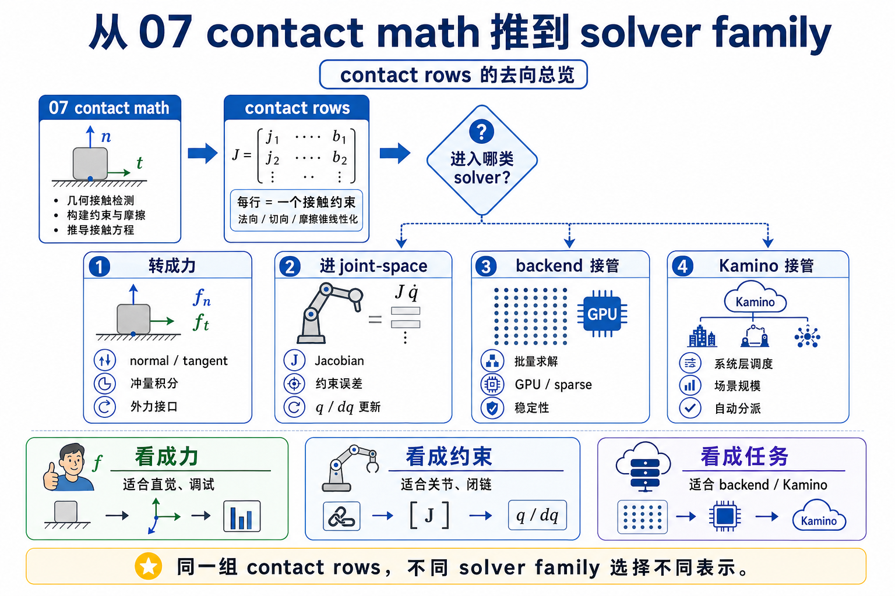
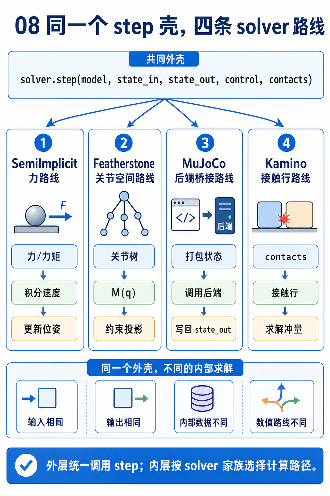
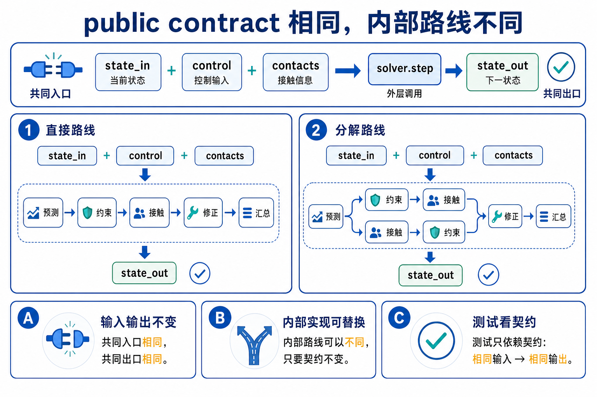
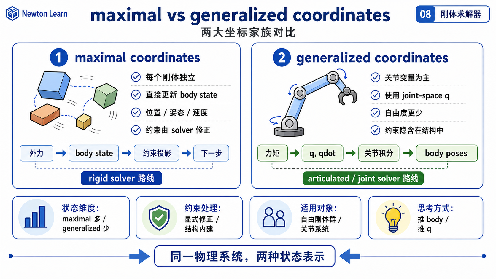
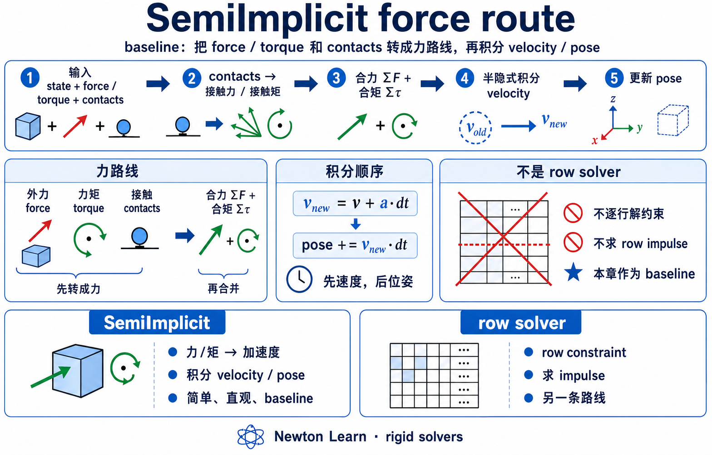
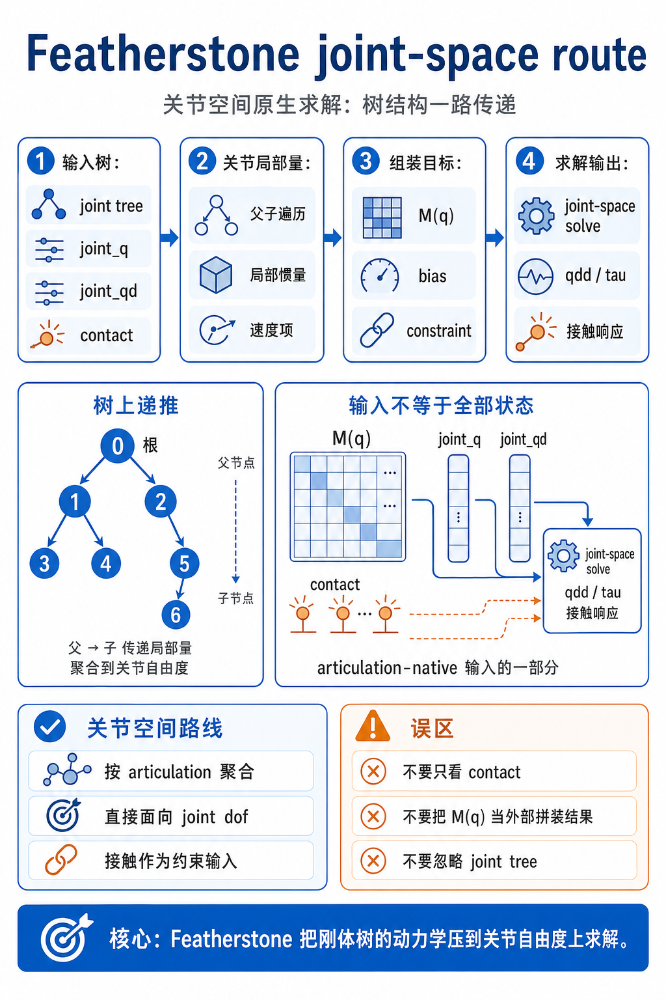
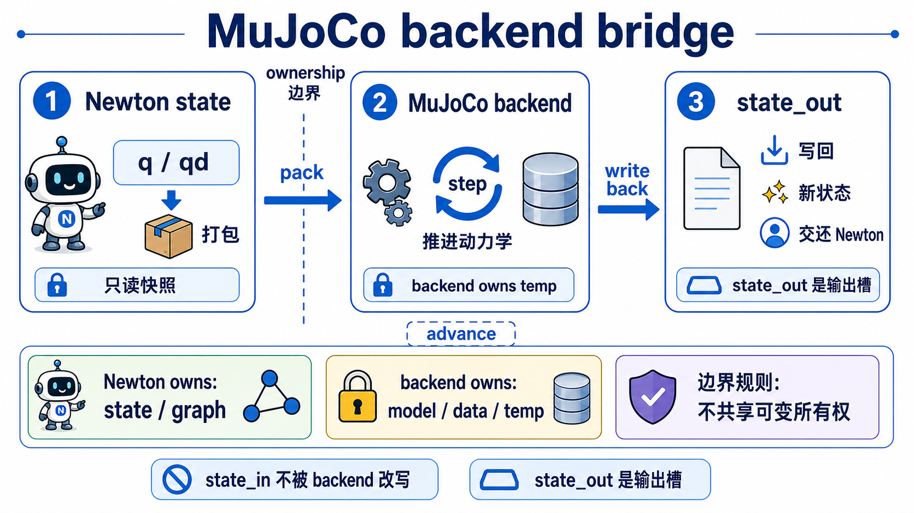
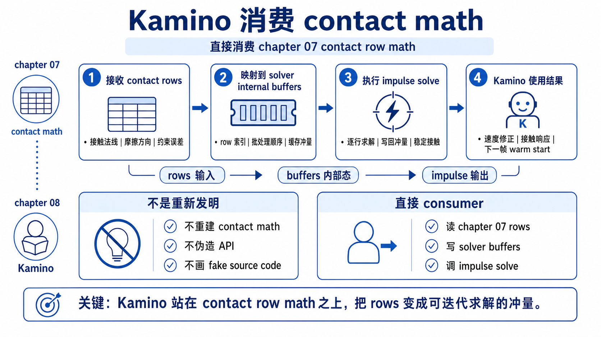
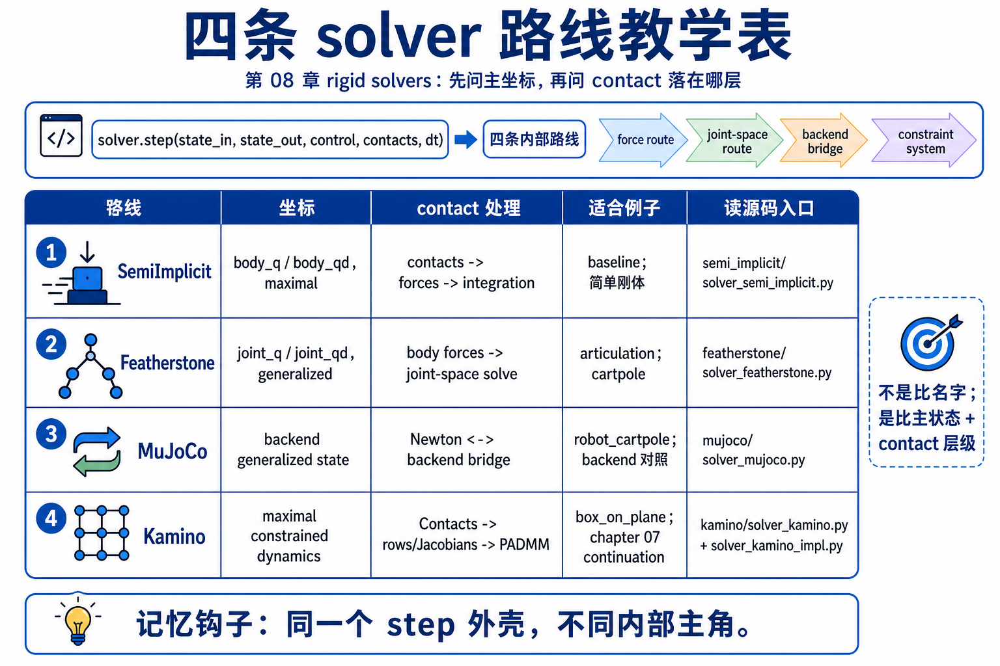
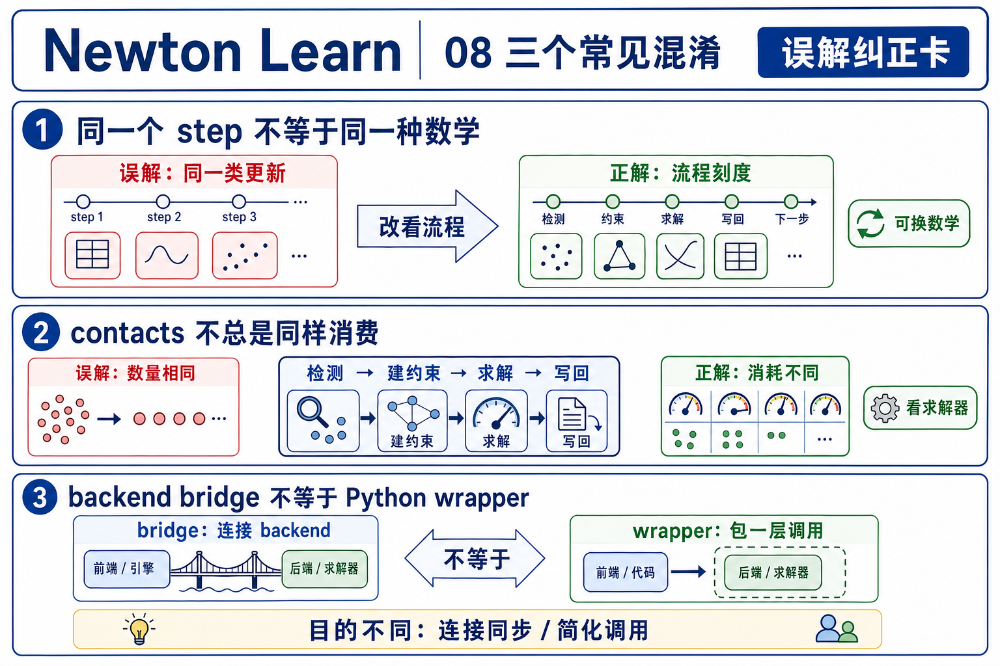

# 08 刚体求解器家族

## 0. 先把 chapter 07 的问题往后推半步



chapter 07 已经把同一个接触讲成了 rows、Jacobian 和 Delassus。那一章停在这里很合理，因为它的任务是回答: **solver 后面真正会吃什么约束对象？**

第 08 章只把这个问题再往后推半步。现在你不再问“rows 是什么”，而是问:

```text
同样这些 rows / contacts / articulation state 都准备好以后，solver 到底怎样接手？
```

这一章最容易写错的地方，是把四个 solver 平铺成四段目录。真正更稳的讲法其实只有一句:

```text
chapter 07 教你 solver 在吃什么
chapter 08 教你不同 solver 怎么吃
```

## 1. public contract 看起来一样, 内部数学却完全不同





第一遍先记住 `newton/solvers.py:L5-L8` 和 `newton/_src/solvers/solver.py:L301-L316` 共同在守的一件事:

```text
solver.step(state_in, state_out, control, contacts, dt)
```

对初学者来说，这个 public contract 很值钱，因为它先把所有 solver 摆回同一个调用面上。你总是在做同一件外层工作:

- 读入当前 `state_in`
- 写出下一步 `state_out`
- 消费 `control`
- 视情况消费 `contacts`
- 用 `dt` 前进一步

可以先把这几个对象压成一张最小表:

| 输入 / 输出 | 第一遍先怎么想 | 所有 solver 都共享的意义 |
|-------------|----------------|--------------------------|
| `state_in` | 当前时刻的系统状态 | “从哪一步开始往前推” |
| `state_out` | 下一时刻的写入目标 | “往哪里写结果” |
| `control` | 这一步施加的控制 / 驱动 | “这一步有哪些外部输入” |
| `contacts` | collision 章节交出来的几何 handoff，或 solver 的 contact bridge 起点 | “如果这条 solver 关心接触，它从哪里接手” |
| `dt` | 时间步长 | “一步有多长” |

但 shared contract 只是在守住统一外观。它并不保证下面三件事相同:

- solver 把什么当成主状态
- solver 把 constraints / contacts 当成什么对象
- solver 在哪一层真正处理它们

这也是为什么 chapter 08 的重点不该是“还有四个 solver 名字”，而该是“为什么同一个 `step(...)` 后面会分叉成完全不同的数学路线”。

顺手再记住 `SolverBase` 里另一个有用但次一级的口子: `update_contacts(contacts, state)`。它不是主求解 contract，而是给 `MuJoCo`、`Kamino` 这类内部还有自己 contact 容器的 solver，一个回写到 Newton `Contacts` 的 bridge。

## 2. 第一层大分野: maximal coordinates vs generalized coordinates



比较 solver 时，最不容易丢的两条轴是:

1. 这个 solver 把什么当成主未知量，是 `body_q / body_qd` 还是 `joint_q / joint_qd`？
2. contact / joint constraints 是被当成 force source、joint-space solve、外部 backend 黑箱，还是显式 constrained dynamics 问题？

第一遍先看这张表就够了:

| 路线 | 主状态表示 | `contacts` / constraints 最先落到哪层 | 第一遍该怎么记 |
|------|------------|----------------------------------------|----------------|
| `SemiImplicit` | maximal coordinates，围着 `body_q / body_qd` 打转 | contact force kernels，再做积分 | 它先算力，再积分，不先解 chapter 07 那种显式 row solve |
| `Featherstone` | generalized coordinates，围着 `joint_q / joint_qd` 打转 | 先把外力 / contact 变成 body forces，再进 joint-space solve | 它是 articulation-native 路线 |
| `MuJoCo` | generalized coordinates，但真正求解在外部 backend | Newton state / contacts 桥接到 MuJoCo，再由 backend 处理 | 它最像 bridge，不像 Newton 内部数学展开 |
| `Kamino` | 刚体求解主线是 maximal-coordinate constrained dynamics | `Contacts -> ContactsKamino -> constraint blocks / Jacobians / dual problem` | 它离 chapter 07 最近 |

这张表其实只在做两件事：

- 第一条轴：谁把 `body_q / body_qd` 当主角，谁把 `joint_q / joint_qd` 当主角。
- 第二条轴：constraints / contacts 是先被当成 force、backend handoff，还是显式 constrained dynamics 问题。

这里有一个容易混淆的细节，要先说清楚:

```text
“maximal vs generalized coordinates”说的是 solver 的主求解变量，
不是说 State 里绝对只能出现哪一类数组。
```

例如 `Featherstone` 最后还是会把 `body_q / body_qd` 重建出来给 public state 用；`Kamino` 也会保留 joint / actuator 相关数据接口。但它们的主解法并不一样。你比较的是“谁在当主角”，不是“谁在台上完全没出现”。

## 3. `SemiImplicit`: baseline, 但不是 row solver



`newton/_src/solvers/semi_implicit/solver_semi_implicit.py:L121-L185` 几乎把它的全部性格都写明白了。更准确的正面说法是：`SemiImplicit` 的主问题是“先把各种力和接触贡献累出来，再做 semi-implicit 积分”。

它的做法很直接:

1. 先把各种力加起来。
2. 再把这些力送进 semi-implicit Euler 积分。

在这个 `step()` 里，你能看到它依次做的事:

- `eval_spring_forces(...)`
- `eval_triangle_forces(...)`
- `eval_tetrahedra_forces(...)`
- `eval_body_joint_forces(...)`
- `eval_body_contact_forces(...)`
- `eval_particle_body_contact_forces(...)`
- `integrate_particles(...)`
- `integrate_bodies(...)`

这里最重要的教学结论不是“它也支持 contact”，而是:

```text
SemiImplicit 里的 contact 首先是 force kernel，不是 chapter 07 那种显式 row solve。
```

也就是说，chapter 07 的 `rows / Jacobians / Delassus` 在这里并不是 solver 的主可见对象。`Contacts` 到这里以后，更像是在告诉接触力 kernel:

- 接触点在哪
- 法线朝哪
- margin / stiffness / damping / friction 是多少

然后 solver 按这些信息把接触写成力，再继续做积分。

这也是为什么 `SemiImplicit` 很适合当 baseline。它让你看到一件很关键的事实: **不是所有 rigid solver 都会把 chapter 07 那条 row math 主线显式搬到台面上。**

### 用 `cartpole` 看它最顺

`newton/examples/robot/example_robot_cartpole.py:L60-L71` 把这点写得很明白:

- `L60-L62` 三行 solver 构造器可以直接切换 `MuJoCo / SemiImplicit / Featherstone`
- `L67-L68` 把 `contacts` 设成了 `None`
- `L70-L71` 明说了: 只有 maximal-coordinate solvers 需要显式 `eval_fk(...)`

这个例子里故意没有 contacts，所以你更容易看出 `SemiImplicit` 的真实角色: 它是“同一个 public contract 下的 force accumulation + integration baseline”，不是“chapter 07 的 canonical row consumer”。

### 这里最容易误解什么

- 看到它处理 `contacts`，就以为它一定在显式解 Delassus。这不对。
- 看到它也能做 articulated system，就以为它和 `Featherstone` 只是实现细节不同。这也不对。它们的主状态表示不一样。

## 4. `Featherstone`: articulation-native joint-space solve



`newton/_src/solvers/featherstone/solver_featherstone.py` 的开头 `L54-L82` 已经给了最重要的提示: 它不是围着 `body_q / body_qd` 做冗余坐标积分，而是把 `joint_q / joint_qd` 当主状态，走 articulation 的 generalized-coordinate 路线。

它的 `step()` 最值钱的读法可以分成四段:

1. `L405-L428`: 先做 `eval_rigid_fk`，把 articulation state 转成当前 body poses。
2. `L433-L585`: 累积外力、particle contact，以及 rigid contact 对 body forces 的贡献。
3. `L639-L818`: 把 joint velocities / forces 转成内部表示，构造 articulation Jacobian `J`、质量矩阵 `M`、再形成 `H` 并求 `joint_qdd`。
4. `L828-L932`: 积分 generalized joints，再重建 public `body_q / body_qd`。

这一条路径最该先守住的直觉是:

```text
Featherstone 不是“换一种写法的 maximal solver”。
它是真的把 articulation joint-space 当主求解空间。
```

这也是为什么它和 `SemiImplicit` 的差别，不应该只被讲成“内部算法不一样”。更准确的说法是:

- `SemiImplicit` 先在 body / force 层面工作，再积分。
- `Featherstone` 先把系统看成 articulation tree，再在 joint-space 上解加速度。

### contact 在这里怎么出现

这里有个很容易让人误判的地方。`Featherstone` 并没有完全无视 contacts。`L555-L585` 仍然会调用 `eval_body_contact(...)`，把 rigid contact 变成 body forces。

但它接下来的主线不是 contact rows / Delassus solve，而是:

```text
body/contact forces
-> articulation dynamics quantities
-> joint-space solve
-> generalized integration
```

所以 `Featherstone` 和 chapter 07 并不是“毫无关系”，只是它不会把 chapter 07 那套 row-space objects 当成 public 教学主线。

### 再回头看 `cartpole`

`example_robot_cartpole.py` 正好适合对照这个区别。你把 solver 切到 `SolverFeatherstone(self.model)` 时，外层 simulation loop 几乎不变，但思维方式已经应该变成:

- 主状态先看 `joint_q / joint_qd`
- solver 自己在 `step()` 里做 FK 和 joint-space solve
- `body_q / body_qd` 更像 public state 的导出结果，而不是第一主角

## 5. `MuJoCo`: external backend bridge



`SolverMuJoCo` 的教学重点不在“MuJoCo 数学内部怎么推导”，而在“为什么它虽然也长着 `step(...)`，却应该被看成 backend bridge”。

你只要先抓三处源码就够了:

- `newton/_src/solvers/mujoco/solver_mujoco.py:L2763-L2995`：构造器把 Newton model 转成 MuJoCo / `mujoco_warp` backend model。
- `L3003-L3026`：每一步先同步控制和状态，再让 backend 真正前进一步。
- `L3681-L3730`：如果需要，再把 backend contacts 转回 Newton `Contacts`。

这条路线的关键不是“MuJoCo 也支持 generalized coordinates”，而是:

```text
真正的求解数学不在 Newton 这一侧展开，
Newton 主要负责 model/state/contact 的桥接。
```

这点在 `step()` 里很清楚:

- 如果 `use_mujoco_contacts=True`，backend 自己做 collision detection。
- 如果 `use_mujoco_contacts=False`，Newton 的 `Contacts` 会先被 `_convert_contacts_to_mjwarp(...)` 桥接到 backend contact 格式。
- 然后 `_mujoco_warp.step(...)` 或 `mj_step(...)` 真正推进。
- 最后 `_update_newton_state(...)` 把结果写回 Newton `State`。

所以 `MuJoCo` 虽然也吃 `state_in / state_out / control / contacts / dt`，但你不应该把它误读成“Newton 内部对 chapter 07 row math 的完整继续展开”。它的教学角色，是让你接受另外一种很重要的工程现实:

```text
有些 solver 的主要工作不是在本库里解，
而是在本库和外部 backend 之间做高质量 handoff。
```

### 为什么 `cartpole` 还是最好的入口

`example_robot_cartpole.py:L34-L35` 先调用了 `SolverMuJoCo.register_custom_attributes(cartpole)`，随后 `L60` 把 MuJoCo 作为默认 solver。这个例子最值钱的地方就在于，它让你看到:

- 场景和外层 loop 并没有变复杂。
- 但 solver 已经从 “Newton 内部如何推进” 变成了 “Newton 怎样把 scene 交给 MuJoCo backend”。

## 6. `Kamino`: chapter 07 contact math 的直接 consumer



如果说 chapter 08 必须给 chapter 07 找一个最自然的下一站，那就是 `Kamino`。

原因很简单: rows / Jacobians / constrained dynamics 在这条路径上仍然是显式对象，而不是被力 kernel 吸收掉，也不是被外部 backend 吃掉。

### 先看 wrapper 在做什么

`newton/_src/solvers/kamino/solver_kamino.py:L403-L434` 先搭好三样东西:

- `ModelKamino.from_newton(model)`
- `ContactsKamino`
- 真正干活的 `SolverKaminoImpl`

然后 `step()` 在 `L511-L579` 里做四步桥接:

1. 把 Newton `State` / `Control` 变成 Kamino 视图。
2. 如果外部已经给了 Newton `Contacts`，就 `convert_contacts_newton_to_kamino(...)`。
3. 如果没给，就让 Kamino 自己的 collision detector 生成 contacts。
4. 做 body-origin 和 CoM frame 之间的转换，再把工作交给 `SolverKaminoImpl.step(...)`。

也就是说，这层 wrapper 最值钱的教学作用不是“再藏一层”，而是让你看清:

```text
chapter 06/07 的 Newton objects
-> Kamino 自己真正爱吃的 Model / State / Contacts containers
```

### 真正的 chapter 07 continuation 在 `SolverKaminoImpl`

`newton/_src/solvers/kamino/_src/solver_kamino_impl.py` 里，chapter 07 留下来的关键词会重新密集出现。

构造阶段 `L194-L252` 就已经在准备:

- `LimitsKamino`
- `DenseSystemJacobians` 或 `SparseSystemJacobians`
- `DualProblem`
- `PADMMSolver`
- `IntegratorEuler` 或 `IntegratorMoreauJean`

然后 `step()` 在 `L526-L593` 里保持了很清楚的一条骨架:

1. 读入当前 state / control。
2. 通过 integrator 调 `_solve_forward_dynamics(...)`。
3. 更新 joint data、metrics、time。
4. 把结果写回 `state_out`。

真正最值钱的是 `_solve_forward_dynamics(...)` 和 `_forward(...)` 这两层:

- `L1085-L1119`：更新中间量，做 contact / limit detection，更新 constraint info，构建 Jacobians，计算 actuation wrenches。
- `L1040-L1052`：更新 dynamics、constraints 和总 wrench。
- `L1000-L1032`：调用 `PADMMSolver.solve(...)`，再把 constraint multipliers unpack 回 contacts / limits，并做 warmstart 更新。

这正是 chapter 07 的直接 continuation:

```text
contacts
-> constraint info
-> system Jacobians
-> constrained dynamics / dual problem
-> solver multipliers and body wrenches
```

所以 Kamino 在本章的角色非常明确。它不是“又一个 solver 名字”，而是 chapter 07 那条 contact-math 主线在 solver 章节里的 canonical path。

### 为什么 `box_on_plane` 比 `cartpole` 更适合讲它

`newton/_src/solvers/kamino/examples/sim/example_sim_basics_box_on_plane.py` 正好把 chapter 07 的核心画面继续保住了。

- `L137-L139` 用 `build_box_on_plane` 直接搭出最简单的 box-ground 接触场景。
- `L146-L159` 配的不是“任意求解器参数”，而是 constrained dynamics / PADMM / warmstart 相关配置。
- `L61-L68` 的 control callback 甚至明确要求 `wnc > 0` 才施加外力，说明 active contacts 是 solver live data，而不是旁观信息。

这就是为什么本章要用两个例子，而不是试图让一个例子同时承担所有任务:

- `cartpole` 负责教你 shared contract 一样，但 solver family 不一样。
- `box_on_plane` 负责教你 chapter 07 的 contact math 怎样真正进入 solver。

## 7. 最后把四条路再压成一张教学表



下面这张表仍然只围着同样两条轴比较：谁在当主状态主角，constraints / contacts 又在哪一层被处理。

| Solver | 先怎么想 | 主状态是谁 | constraints 在哪一层被处理 | chapter 07 和它的距离 |
|--------|-----------|------------|----------------------------|----------------------|
| `SemiImplicit` | baseline | `body_q / body_qd` | 先变 force kernels，再做积分，而不是先解 chapter 07 那种显式 row system | 间接，只把 contact 当 force source |
| `Featherstone` | articulation-native solve | `joint_q / joint_qd` | body/contact forces 进入 joint-space dynamics | 部分相关，但不是 direct row continuation |
| `MuJoCo` | backend bridge | backend generalized state | 主要在 MuJoCo / `mujoco_warp` 内部处理 | 更远，重点在 bridge |
| `Kamino` | constrained dynamics continuation | maximal-coordinate rigid-body solve | 显式 constraint blocks、Jacobians、dual problem、PADMM | 最近，是 chapter 07 的主延续 |

如果你读完这章只能带走一条比较方法，那就带走这句:

```text
先问 solver 把什么当主状态，
再问 constraints / contacts 在哪一层被处理。
```

这比背 solver 名字稳定得多。

## 8. 这一章最容易犯的三个混淆



- 同一个 `step(...)` signature，不代表同一种求解数学。
- `contacts` 作为参数出现，不代表 solver 一定在显式解 chapter 07 那套 rows / Delassus。
- `MuJoCo` 和 `Kamino` 都可能自己维护 contact container，但两者意义完全不同: 前者是 backend bridge，后者是 Newton 内部的 constrained dynamics continuation。

如果这些混淆还没有完全消掉，下一步先去看 `source-walkthrough.md`。如果你想把差异变成可观察现象，再去看 `examples.md`。
