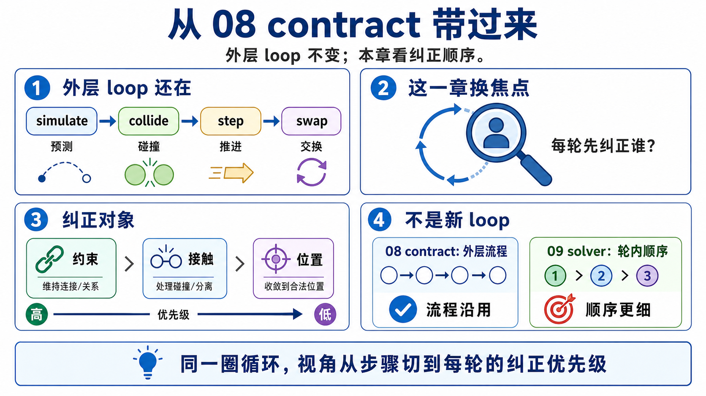
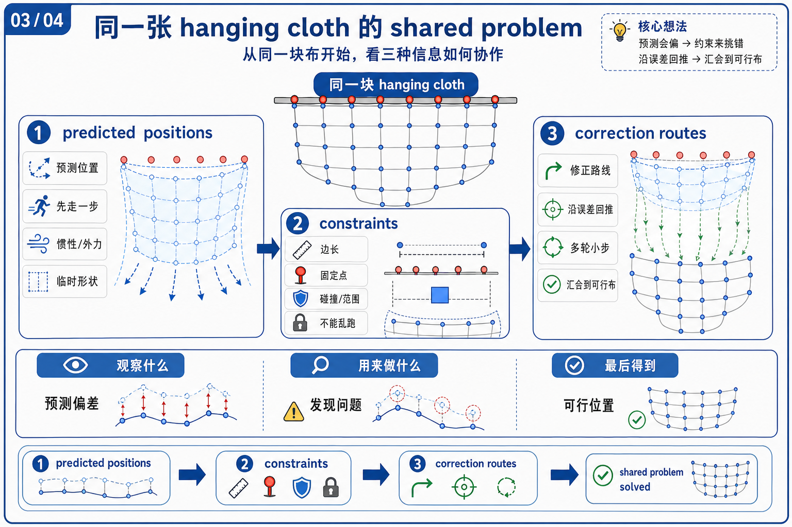
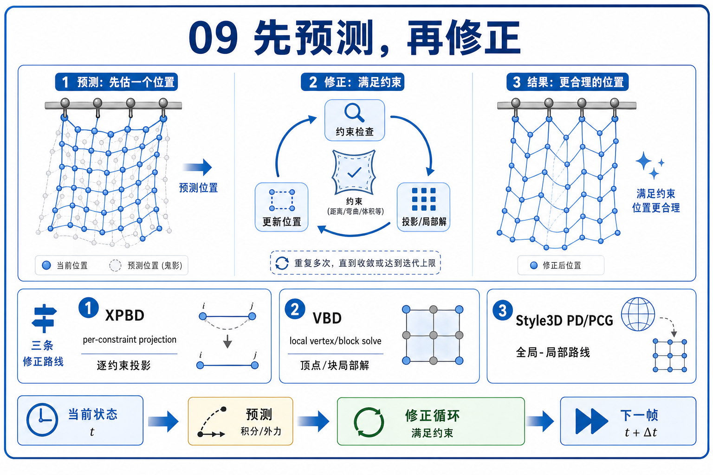
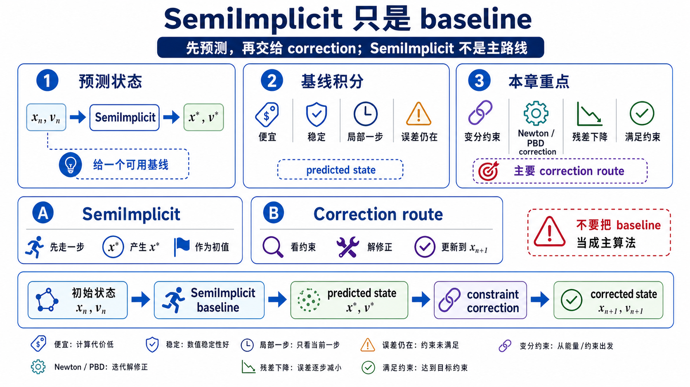
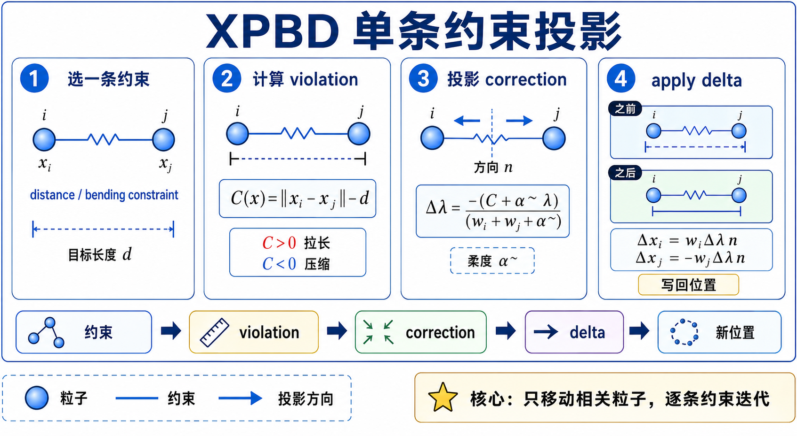
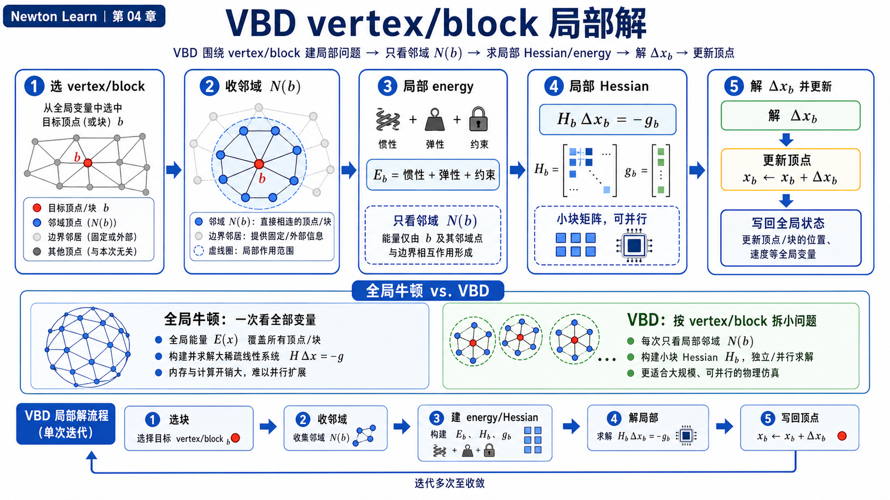
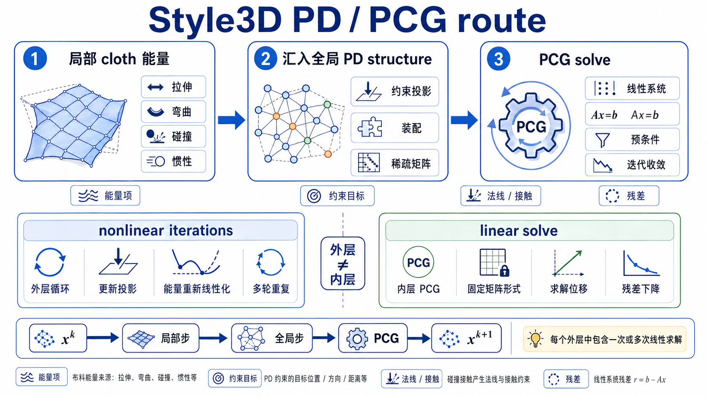
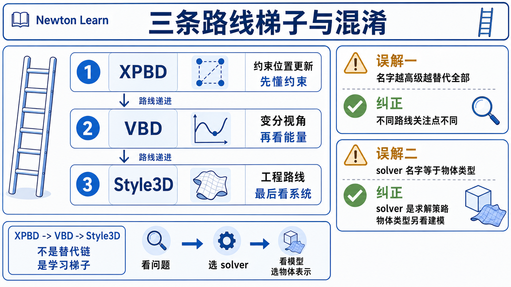

# 09 变分求解器族

## 0. 先把 chapter 08 的外层 contract 带过来



chapter 08 最值钱的结论，是所有 solver 都可以先被拉回同一个外层调用面:

```text
solver.step(state_in, state_out, control, contacts, dt)
```

第 09 章不推翻这件事，只把问题往后推半步。现在你不再主要问“不同 solver 怎么消费 rigid state / contacts”，而是问:

```text
同样一步 `dt` 里，如果 cloth / softbody 的显式更新不够稳，
solver 到底怎样把这一步修正成一个更稳定的结果？
```

这就是本章里的 variational / implicit correction 问题。第一遍不必背完整推导，先记一件事就够了:

```text
它们都不是在“凭感觉改位置”，而是在解一类稳定修正问题；
真正不同的是，每次迭代先把修正落在哪一层。
```

## 1. 先看同一张 hanging cloth 的图, 不先背 solver 名字



`newton/examples/cloth/example_cloth_hanging.py` 是本章最好的入口，因为它故意把同一个 hanging cloth scene 写成一个 shared outer loop。

它的 `simulate()` 骨架非常短:

```python
self.state_0.clear_forces()
self.viewer.apply_forces(self.state_0)
self.model.collide(self.state_0, self.contacts)
self.solver.step(self.state_0, self.state_1, self.control, self.contacts, self.sim_dt)
self.state_0, self.state_1 = self.state_1, self.state_0
```

你一上来最该注意的不是内部细节，而是两层同时成立的事实:

- 外层 scene / loop 几乎一样。
- 内层 solver setup 明显不一样。

同一个脚本里，`--solver` 可以切到 `semi_implicit / xpbd / vbd / style3d`。但脚本又在几处故意把差异暴露出来:

- `L40-L45`: `SemiImplicit` 用 32 个 substeps，`Style3D` 用 2 个，其余用 10 个。
- `L52-L57`: 只有 `Style3D` 先注册 custom attributes。
- `L82-L109`: `XPBD` 走 spring-oriented 参数，`VBD` 走 triangle stiffness / damping 参数。
- `L111-L117`: `Style3D` 不走通用 `builder.add_cloth_grid(...)`，`VBD` 还要求 `builder.color(include_bending=True)`。
- `L124-L144`: 四种 solver 构造器并列摆在一起。

这已经在暗示 chapter 09 的主线了:

```text
同一块布
-> 共同的问题是“这一步怎么更稳”
-> 真正分叉的是“每次修正先在什么层面发生”
```

## 2. shared problem: 先做一份预测, 再把它修正回稳定状态



第一遍可以把三家都压成同一张心智图:

```text
当前状态
-> 先得到一份惯性 / 积分预测
-> 再处理 stretch / bend / contact / volume 这些约束或能量
-> 得到更稳定的下一步状态
```

如果你更喜欢一句稍微“数学化”但仍然安全的人话，可以这样记:

```text
三家都在解“预测状态离可接受状态还有多远, 应该怎样修正”这个问题。
```

如果还觉得抽象，可以先把它翻译成一个更具体的画面：

```text
比如一条布边被拉得过长了，solver 要回答的就是“这一步应该往哪边拉回去，才能既更接近目标长度，又不把整块布拉炸”。
```

只是它们说这件事的语言不同:

- `XPBD` 更像在说: 我有一堆约束，要逐条投影、逐条修。
- `VBD` 更像在说: 我围着一个 vertex / block 累计 force + Hessian，再做局部 Newton 步。
- `Style3D` 更像在说: 我把 cloth 的局部弹性能量整理成全局线性 solve，反复做 PD / PCG 迭代。

这就是“同一类问题，不同组织方式”的最短版本。

## 3. 为什么 `SemiImplicit` 在这章里只是 baseline



`example_cloth_hanging.py` 里保留了 `SemiImplicit`，这很有教学价值，但它不是本章的 main trio。

它在这里更像一个对照问题:

```text
如果我主要还是“先算力, 再积分”, 会发生什么？
如果我开始显式做隐式修正, 又会发生什么？
```

所以这章提 `SemiImplicit` 的目的只有两个:

- 它提醒你: 同一个 cloth scene 里，不是所有 solver 都会先做 variational / implicit correction。
- 它帮你看懂为什么 chapter 09 要把重心放在 `XPBD / VBD / Style3D` 身上。

更短地说:

```text
`SemiImplicit` 负责对照。
chapter 09 真正要建立的是三条隐式修正路线。
```

## 4. `XPBD`: 从“单条约束怎么修”开始最容易入门



`XPBD` 是 chapter 09 最适合作为 canonical entry 的那条路，因为它最容易把复杂问题压回一句简单的话:

```text
一次先看一条约束, 算这条约束还差多少, 再投影回去。
```

在 `newton/_src/solvers/xpbd/solver_xpbd.py` 里，这条气质很明显:

- `L281-L299`: 先对 particles 做前向积分，并准备可能需要的粒子邻域结构。
- `L300-L341`: 再对 bodies 做前向积分，把 joint forces 先并进临时 body force。
- `L350-L609`: 进入主迭代循环，每一轮把 `particle_deltas` 和 `body_deltas` 清零，再逐类约束做修正。
- `L483-L485`、`L565-L609`: 每类约束累积完 delta 以后，再把位置 / 姿态更新回状态数组。

如果把它再压得更短一些，`XPBD` 的每轮迭代像这样:

```text
contact / spring / bending / tet / joint
-> 为当前这类约束算一个 delta
-> 把 delta 写回位置或刚体变换
```

它为什么比普通 “PBD 口号” 更值得 chapter 09 认真讲？因为在 kernel 里你能看到它不是纯硬投影，而是把 compliance / damping 和当前这轮约束乘子更新一起带进修正公式里。

比如:

- `xpbd/kernels.py:L293-L355` 的 `solve_springs(...)` 用 `alpha`、`gamma` 和 `lambdas[tid]` 计算 `dlambda`。
- `L359-L456` 的 `bending_constraint(...)` 也是同样的思路，只是对象换成弯曲约束。
- `L460-L562` 的 `solve_tetrahedra(...)` 把体积 / 拉伸误差压成约束修正。

这就是本章对 `XPBD` 的核心理解:

| 你该先记什么 | 对应源码气质 |
|---------------|--------------|
| 它先按约束想问题 | `solver_xpbd.py` 主循环里是一类约束一类约束地过 |
| 它的隐式味道来自 compliance 和当前乘子更新 | `kernels.py` 里持续出现 `alpha`、`gamma`、`dlambda` |
| 它最适合当 chapter 09 入口 | 因为“逐约束修正”比 “局部 Hessian” 或 “全局 PCG” 更容易先建立直觉 |

这里最容易误解的是把它写扁成“只是更复杂的 PBD”。更稳的说法应该是:

```text
XPBD 是从约束投影角度来做隐式修正。
它的主问题不是“先建全局矩阵”，而是“每条约束怎样贡献一次可控的修正”。
```

## 5. `VBD`: 不再围着一条约束转, 而是围着一个 vertex / block 求局部步



到了 `VBD`，chapter 09 的比较轴要往前走一步。现在最值钱的变化不是“约束种类更多了”，而是:

```text
局部子问题换了。
不再是一条约束一条约束地修, 而是围着一个 vertex / block 累计 force + Hessian 再解。
```

`newton/_src/solvers/vbd/solver_vbd.py` 自己就在 `step()` 文档字符串里把骨架写得很直白:

- `L1346-L1355`: 三阶段结构是 initialize -> iterate -> finalize。
- `L1373-L1381`: 每一步先初始化，再在 `iterations` 里交替做 rigid / particle solve，最后更新速度。

对 chapter 09 来说，第一遍应优先读 particle 路线，而不是掉进 AVBD 刚体扩展里。所以最该盯的是 `_solve_particle_iteration(...)`:

- `L1727-L1733`: 如有需要，先做 self-contact collision detection。
- `L1735-L1737`: 每轮先把 `particle_forces`、`particle_hessians` 清零。
- `L1739-L1888`: 逐个 color group 处理当前颜色的粒子。
- `L1742-L1822`: body contact、spring、自碰撞等贡献都被累计成 force + Hessian。
- `L1823-L1888`: 再调用 `solve_elasticity_tile(...)` 或 `solve_elasticity(...)` 做局部 block solve。

这里 `builder.color(include_bending=True)` 很关键，因为 VBD 需要 coloring 来并行做这种近似 Gauss-Seidel 的局部更新。`example_cloth_hanging.py:L116-L117` 就是专门为它准备的。

真正让 `VBD` 和 `XPBD` 分家的是 `particle_vbd_kernels.py` 的写法。你能看到它不是直接把“某条约束误差”转成投影，而是在局部累计更丰富的对象:

- `L860-L1022`: `evaluate_stvk_force_hessian(...)` 为三角形弹性提供力和 Hessian。
- `L1055-L1187`: `evaluate_dihedral_angle_based_bending_force_hessian(...)` 为弯曲项提供力和 Hessian。
- `L335-L462`: `evaluate_volumetric_neo_hookean_force_and_hessian(...)` 为体单元提供体积弹性项。
- `L3135-L3272`: `solve_elasticity(...)` 最后把惯性项、局部弹性项、接触项全部加起来，再做 `h_inv * f` 的局部更新。

所以 chapter 09 对 `VBD` 的最短总结应该是:

```text
XPBD 问的是“这条约束怎么投影回去？”
VBD 问的是“围着这个 vertex / block, 局部 Newton 步长该是多少？”
```

这也是为什么 `VBD` 不能被写成“更复杂的 XPBD”。它不是把同一件事堆得更复杂，而是换了一种局部求解组织方式。

### 为什么 `softbody_hanging` 只作为 VBD 的补充例子

`newton/examples/softbody/example_softbody_hanging.py` 的价值，不是拿来和 `XPBD / Style3D` 做横向 PK，而是给 `VBD` 补一件 chapter 09 很重要的事实:

```text
VBD 不只是 cloth solver。
它还能把同样的局部 force + Hessian 视角延伸到 tet softbody。
```

这个例子里有三个最重要的细节:

- `L32-L33`: 脚本直接限制只支持 `vbd`。
- `L48-L65`: 场景不是布片，而是四组 `add_soft_grid(...)` 体网格。
- `L68-L80`: 仍然要 `builder.color()`，solver 仍然是 `SolverVBD(...)`。

这正好说明 `VBD` 的核心不是“适合布”，而是“适合围着局部 block 累计力和 Hessian 再解”。cloth 只是其中一个最自然的入口。

## 6. `Style3D`: 把局部 cloth 能量收束成全局 PD / PCG solve



`Style3D` 换了一层组织方式。它最值钱的差别不是“参数更奇怪”，而是:

```text
它把 cloth 的隐式修正推成了全局线性 solve。
```

`newton/_src/solvers/style3d/solver_style3d.py` 开头就把这条路写得很坦白:

- `L42-L57`: 文档字符串直接给出 implicit Euler 非线性方程，以及 `P` 作为 PD 近似 Hessian。
- `L131-L147`: solver 内部预分配了固定 PD 矩阵、右端项、Jacobi 预条件器和线性求解缓存。

这里的 PD 可以先只记成一句 beginner-safe 的人话：Projective Dynamics 用一份固定近似 Hessian 来代替每轮都重建完整 Hessian，这样每轮非线性更新都能更稳定地落成一个全局线性子问题。

它的外层 workflow 也和前两家明显不同:

- `example_cloth_hanging.py:L52-L55`: 必须先 `SolverStyle3D.register_custom_attributes(builder)`。
- `L111-L113`: 不能直接走通用 cloth builder，而是要用 `style3d.add_cloth_grid(...)`。
- `L126-L131`: solver 构造之后还要 `_precompute(builder)`，把固定 PD 矩阵先搭好。

到了 `step()` 里，这条路径就更像 textbook PD / global solve:

- `solver_style3d.py:L173-L194`: `init_step_kernel(...)` 先建立 `x_prev`、`x_inertia` 和静态对角项。
- `L211-L323`: 每轮 nonlinear iteration 都会先重建 `rhs`，再累计 stretch、bend、contact 的贡献。
- `L300-L309`: 真正的线性子问题交给 `PcgSolver.solve(...)`。
- `L324-L333`: 最后根据位置变化更新速度，并结束 collision frame。

`style3d/kernels.py` 又把这条主线拆得很清楚:

- `L149-L180`: `init_step_kernel(...)` 先做惯性预测 `x_inertia`。
- `L187-L196`: `init_rhs_kernel(...)` 建立右端项。
- `L18-L58` 和 `L61-L86`: stretch / bend 力逐步加进 `rhs`。
- `L238-L246`: `nonlinear_step_kernel(...)` 把这轮求出的 `dx` 写回位置。

而 `style3d/linear_solver.py:L236-L379` 的 `PcgSolver` 进一步说明了 chapter 09 最该看懂的那件事:

```text
Style3D 不是“cloth-only 的 VBD”。
它的主角已经从局部 block 变成整张 cloth 的线性系统和 PCG 迭代。
```

所以这条路最适合这样记:

| 你该先记什么 | 对应源码气质 |
|---------------|--------------|
| 它是 cloth-specialized solver | builder 和 solver 都要求 Style3D custom attributes |
| 它依赖固定 PD matrix + 每轮线性 solve | `_precompute(builder)` 和 `PcgSolver.solve(...)` 是核心锚点 |
| 它比较像 global solve endpoint | 读者在这里第一次看到真正成型的全局 PCG workflow |

## 7. 最后把三条主路线压成一张梯子表



从 chapter 09 带走的最重要比较方法，不是 solver 名字，而是“每步修正先落在哪层”。

| Solver | shared problem 里的角色 | 每步局部更新落在哪 | 你脑中的第一张图 |
|--------|-------------------------|--------------------|------------------|
| `XPBD` | 把预测状态拉回约束可接受区域 | 单条约束 | constraint projection + lambda |
| `VBD` | 把预测状态围着 vertex / block 做局部 Newton 修正 | 单个 vertex / block | force + Hessian 累计后解一个小块 |
| `Style3D` | 把 cloth 的局部弹性和接触整理成全局线性问题 | 整张 cloth 的线性系统 | fixed PD matrix + PCG |

如果你只记一句话，就记这句:

```text
chapter 09 比较的不是“谁支持哪些功能”，
而是“面对同一个隐式修正问题, 每家先把修正落在哪一层”。
```

## 8. 这一章最容易犯的四个混淆

- 同一个 `cloth_hanging` 外层 loop 一样，不代表内部数学一样。
- `XPBD` 不是“只是简单版 cloth solver”；它是逐约束的隐式修正路线。
- `VBD` 不是“更复杂的 XPBD”；它换成了局部 block / Hessian 视角。
- `Style3D` 不是“只给衣服用的 VBD 特例”；它真正不同的是全局 PD / PCG solve。

如果这些混淆还没完全消掉，下一步先看 `source-walkthrough.md`。如果你想把它们变成可观察现象，再去看 `examples.md`。
