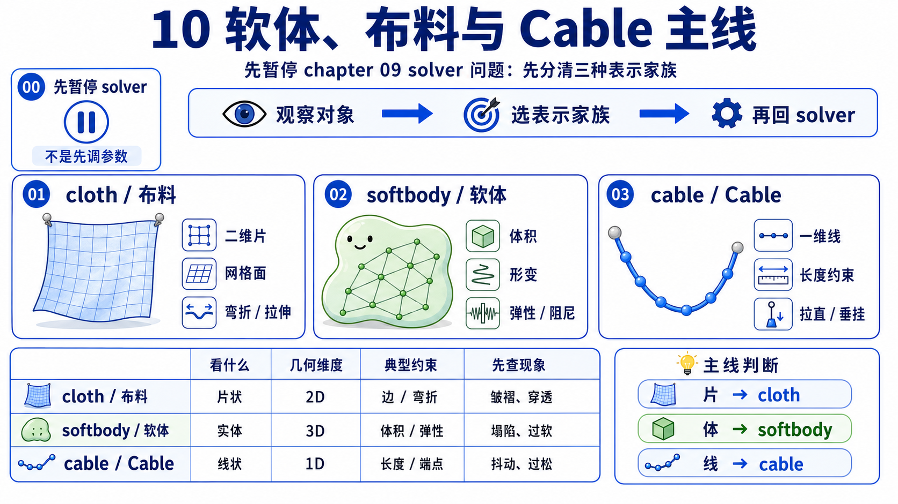
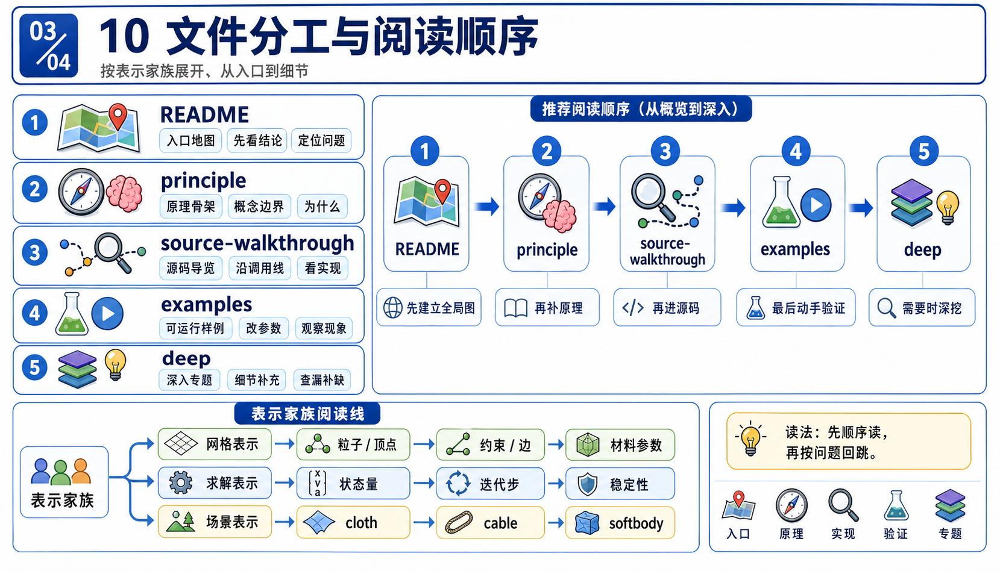
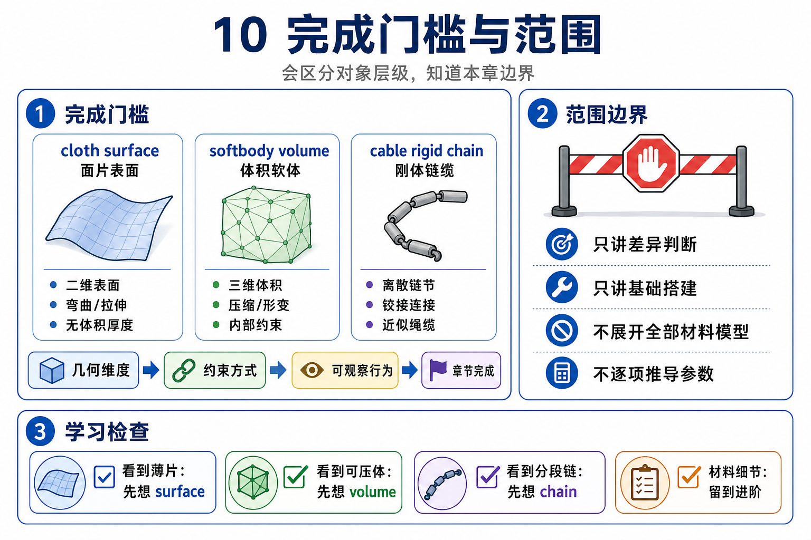

# 10 软体、布料与 Cable



`09_variational_solvers` 刚把一个更窄、但很重要的问题讲顺: **同一块 hanging cloth 进入 shared `collide -> step -> swap` loop 之后，Newton 可以怎样组织稳定修正？**

第 10 章把镜头再往前挪一步，不再先问 solver，而是先问对象本身:

```text
cloth、softbody、cable 看起来都“会变形”，
但它们在 Newton 里其实是同一种对象吗？
```

这章的 main answer 是否定的。chapter 10 要先建立三种内部对象家族，再谈 solver 只是怎样消费这些对象:

```text
cloth    = particles + triangles + bending edges / optional springs
softbody = particles + tetrahedra + generated surface collision mesh
cable    = capsule rigid bodies + cable joints (+ articulation)
```

这就是本章为什么必须是 representation-first，而不是 solver-first。

## 文件分工



- `README.md`: 本章范围、阅读顺序、完成门槛。
- `principle.md`: 解释为什么这三类“看起来都可变形”的东西，在 Newton 里其实属于不同内部对象家族。
- `source-walkthrough.md`: beginner / main walkthrough。第一次追 chapter 10 源码，先看这一份。
- `source-walkthrough-deep.md`: deep walkthrough。main walkthrough 读完后，用这一份钉住 builder handoff、optional branches 和 exact anchors。
- `examples.md`: 三个教学锚点各司其职，分别守住 cloth、softbody、cable 三条主入口。

这章现在有 main walkthrough + deep walkthrough；第一次追源码先看 main，再用 deep 固定精确 handoff。

## 完成门槛



```text
[ ] 我能把 `09 -> 10` 的桥讲清: 上一章先问“谁来解”，这一章先问“到底在解什么对象”
[ ] 我能解释为什么 cloth 和 softbody 虽然都基于 particles，但在 Newton 里仍然不是同一种对象家族
[ ] 我能解释为什么 cable 在 Newton 里不是 particle softbody，而是 capsule rigid body chain + cable joints
[ ] 我能各指出一条主源码入口: `add_cloth_grid`、`add_soft_grid`、`add_rod`
[ ] 我能说明三个例子的分工，而不是把它们混成一个“deformable demo catalog”
```

## 本章目标

- 建立 chapter 10 的第一比较轴: `内部表示是什么`，而不是 `solver 叫什么`。
- 让你看到 cloth、softbody、cable 虽然都能呈现柔性行为，但在 builder、状态、拓扑、碰撞和固定方式上并不相同。
- 给后续读源码留下一条稳定心智图: 先认对象家族，再看 solver 怎样更新它。

## 本章范围

- 主教学例子只用三个 upstream anchors:
  - `newton/examples/cloth/example_cloth_hanging.py`
  - `newton/examples/softbody/example_softbody_hanging.py`
  - `newton/examples/cable/example_cable_twist.py`
- 主源码锚点只守住 `newton/_src/sim/builder.py` 里的三条 helper:
  - `add_cloth_grid`
  - `add_soft_grid`
  - `add_rod`
- 会顺手提到 `add_joint_cable()` 和 `add_articulation()`，但只作为 `add_rod()` 背后的必要 handoff，不单独展开成 joint 数学课。

## 本章明确不做什么

- 不重讲 chapter 09 的 XPBD / VBD / Style3D 数学和迭代层级。
- 不做 cloth / softbody / cable 的参数大词典。
- 不展开 Style3D 服装特化细节，也不展开 cable 的 quaternion / parallel transport 细节。
- deep walkthrough 不会替代 main walkthrough；这一章仍然先把 mainline 建稳。

## 前置依赖

- 建议先读完 `09_variational_solvers`。如果你还会把 solver 名字和对象家族混成一件事，先回看 chapter 09。
- 默认你已经接受 chapter 08/09 的最小外层 contract: 场景会走 `collide -> solver.step -> swap states` 这一类 shared loop。
- 不要求你先会 tetrahedral elasticity、rod theory 或 cable twist 数学；chapter 10 先解决对象识别，不先做推导。

## 阅读顺序

1. 先读本文件，把 chapter 10 的问题改写成“内部对象家族识别”。
2. 第一次追源码时，直接读 `source-walkthrough.md`。
3. 读完主 walkthrough，如果你想核对精确 handoff，再读 `source-walkthrough-deep.md`。
4. 再回 `principle.md` 把 cloth / softbody / cable 的差别翻成人话。
5. 最后用 `examples.md` 做三次分开的观察，不要一次混着看。

如果你读完还会把三者统称成“deformable object”，就回到 `principle.md` 的对照表再看一遍。

## 预期产出

- `principle.md`: 一张 beginner-safe 对照图，讲清三种对象家族及其后果。
- `source-walkthrough.md`: 一条 main walkthrough，把 `chapter 09 的 solver 问题 -> chapter 10 的 representation 问题` 顺下来。
- `source-walkthrough-deep.md`: 一条 deep walkthrough，把 builder handoff、state ledger 和 optional branches 钉到精确源码锚点上。
- `examples.md`: 三个独立教学锚点，分别回答“cloth 是什么”“softbody 是什么”“cable 是什么”。

读完 chapter 10 后，你最该带走的不是一串参数名，而是这句更短的话:

```text
在 Newton 里，
cloth 是表面粒子网格，softbody 是体粒子网格，cable 是由 rigid capsules 和 cable joints 组成的链。
```
