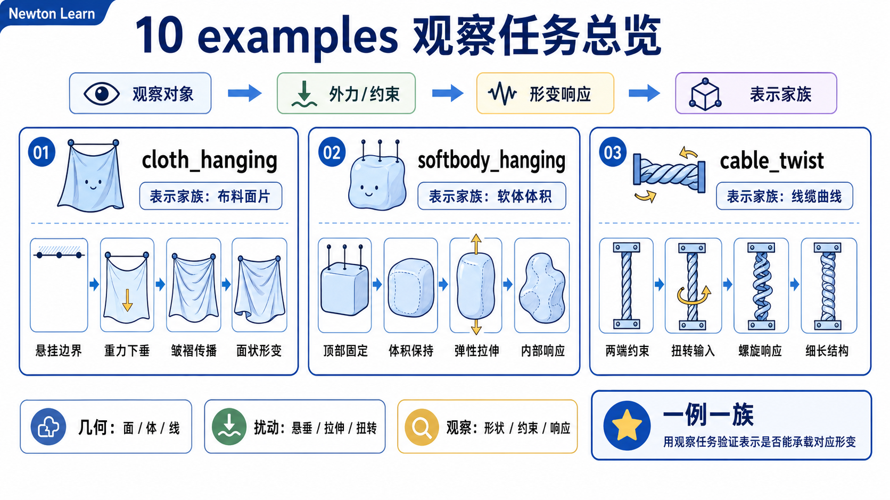
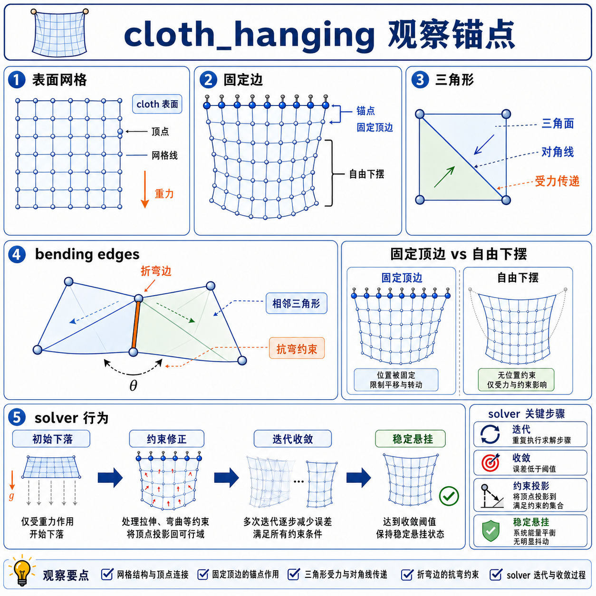
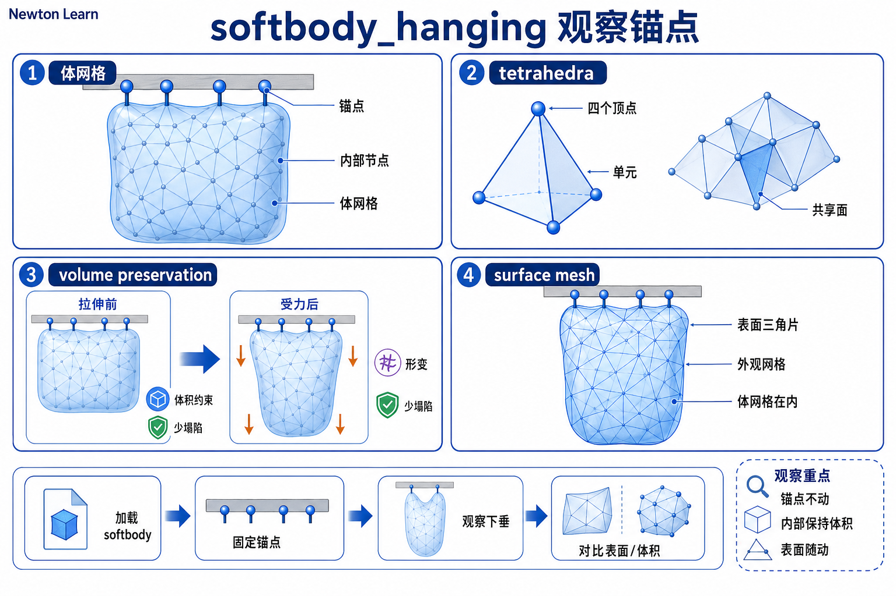
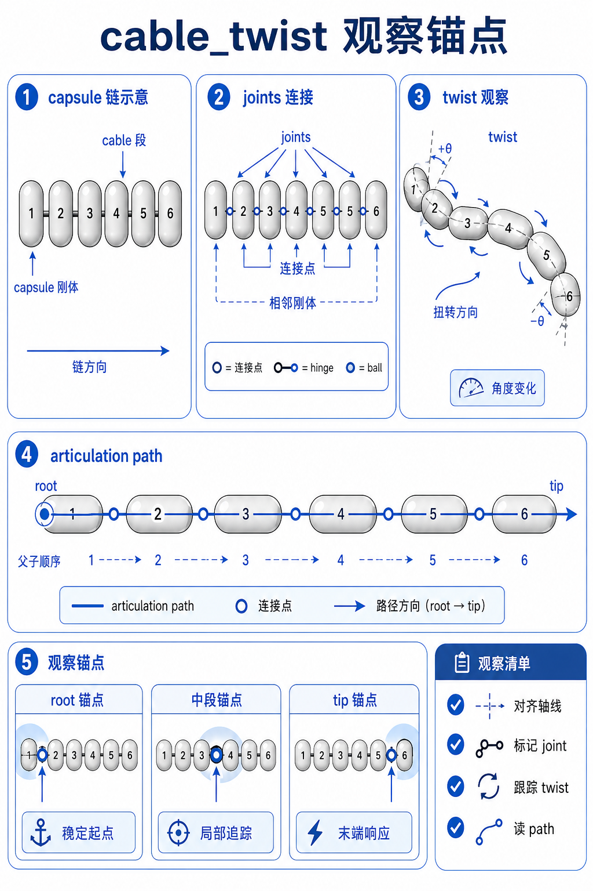
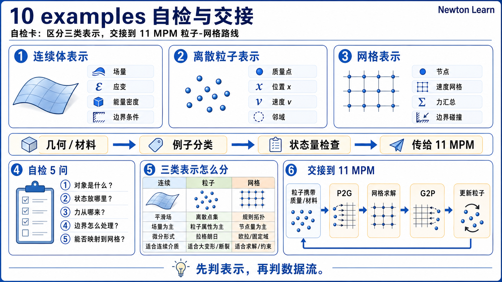

# 10 软体、布料与 Cable 例子观察单



这一页不是“deformable demos catalog”。它只做一件事: **给 chapter 10 的三种对象家族各找一个教学锚点。**

所以三个例子不要混着用。每个例子只承担一个 job。

## 总表

| 例子 | 这页给它的唯一 job | 主源码锚点 |
|------|---------------------|------------|
| `newton/examples/cloth/example_cloth_hanging.py` | 让你看见 cloth 是表面粒子网格，solver 切换是第二层问题 | `builder.add_cloth_grid(...)` |
| `newton/examples/softbody/example_softbody_hanging.py` | 让你看见 softbody 是体粒子网格，表面 collision mesh 是从体网格边界长出来的 | `builder.add_soft_grid(...)` |
| `newton/examples/cable/example_cable_twist.py` | 让你看见 cable 是 rigid capsule chain，不是 particle softbody | `builder.add_rod(...)` |

## 教学锚点 1: `example_cloth_hanging.py`



**唯一 job**

把 cloth 定位成一张 surface particle mesh，而不是先把它当“某个 solver 的 demo”。

**建议入口**

```bash
python -m newton.examples cloth_hanging --solver vbd
```

第一遍先用 `vbd` 或默认设置看结构；等 cloth 身份稳定了，再切 `xpbd` 或 `style3d`。

**先盯哪几处**

- `common_params` 里那组 `dim_x / dim_y / cell_x / cell_y / fix_left`。
- `builder.add_cloth_grid(...)` 或 `style3d.add_cloth_grid(...)` 的调用点。
- `builder.color(include_bending=True)` 只在 `vbd` 路线出现。

这里顺手记一件事：`style3d.add_cloth_grid(...)` 只是 cloth family 的 specialized helper，不是另一种对象家族。

**你要从它身上验证什么**

- cloth 的主 builder 入口是网格化布片，不是 tet volume，也不是 rigid link chain。
- 同一个 cloth scene 可以切多种 solver，但 cloth 的内部家族没有变。
- `include_bending=True` 是 solver 需要的 coloring 信息，不是 cloth 身份本身。

**看完后应该能说**

```text
cloth 在 Newton 里首先是 particles + triangles + bending edges；
solver 只是随后如何更新这张布。
```

**不要拿它做什么**

- 不要拿它替代 softbody 入口。
- 不要第一遍就把注意力全部放到 `XPBD / VBD / Style3D` 差别上；那是 chapter 09 的主问题。

## 教学锚点 2: `example_softbody_hanging.py`



**唯一 job**

把 softbody 定位成体粒子网格，并让你看到它会自动生成表面 collision mesh。

**建议入口**

```bash
python -m newton.examples softbody_hanging
```

**先盯哪几处**

- `builder.add_soft_grid(...)` 那段 3D grid 参数。
- `fix_left=True` 怎样固定最左侧一层体粒子。
- `builder.color()` 和 `SolverVBD(...)` 的配对。

**你要从它身上验证什么**

- softbody 的核心不是布面，而是 tetrahedral volume。
- surface triangles / edges 会被生成出来，但它们在这里主要服务碰撞与表面表示。
- 这个例子只支持 `vbd`，不代表 softbody 的身份来自 solver；它只是说明当前教学入口选择了哪条 solver path。

**看完后应该能说**

```text
softbody 在 Newton 里是 particles + tetrahedra，
并会从 tet boundary 自动长出 surface collision mesh。
```

**不要拿它做什么**

- 不要把它当成“加了厚度的 cloth demo”。
- 不要把它当成 chapter 10 的 cross-solver 比赛场；它的 job 是认对象，不是比 solver。

## 教学锚点 3: `example_cable_twist.py`



**唯一 job**

把 cable 定位成 capsule rigid bodies + cable joints 组成的链，彻底打掉“它也是 particle softbody”这个误会。

**建议入口**

```bash
python -m newton.examples cable_twist
```

**先盯哪几处**

- `create_cable_geometry_with_turns(...)` 只负责给出中心线和每段朝向。
- `builder.add_rod(...)` 返回 `rod_bodies` 和 `_rod_joints`。
- 第一段 capsule 被设成 kinematic 的那几行 `body_mass / body_inertia = 0`。
- `spin_first_capsules_kernel(...)` 最终改的是 `self.state_0.body_q` / `self.state_1.body_q`，不是 `particle_q`。

这里也顺手接受一个命名事实：Newton 在 builder 里用 `add_rod(...)` 作为这条 cable helper 的名字，但它创建的就是 chapter 10 这里说的 cable family。

**你要从它身上验证什么**

- cable 的基本单元是 rigid body，不是 particle。
- 整条 cable 的柔性表现来自 joint stretch / bend / twist，而不是 tet 或 triangle 弹性。
- 即使这个例子也用 `SolverVBD`，它更新的对象家族已经和 softbody 不同了。

**看完后应该能说**

```text
cable 在 Newton 里首先是一串 capsules，
它的“变形”是 joint motion 累积出来的外观。
```

**不要拿它做什么**

- 不要把它当作 quaternion 细节教程。
- 不要把它重新翻译成“线状 softbody”；这样会直接丢掉 chapter 10 最重要的对象分界线。

## 推荐顺序

1. 先看 cloth。
2. 再看 softbody。
3. 最后看 cable。

这个顺序最稳，因为它先让你在 particle family 内部分清 `surface vs volume`，再跳到完全不同的 rigid-body cable family。

## 自检



- 现在只看 `cloth_hanging`，你能不能不提 solver 名字，也说清它为什么是 cloth？
- 现在只看 `softbody_hanging`，你能不能解释为什么 surface mesh 是“长出来的”，而不是它的核心体表示？
- 现在只看 `cable_twist`，你能不能解释为什么它的柔性外观不等于 particle deformable？
