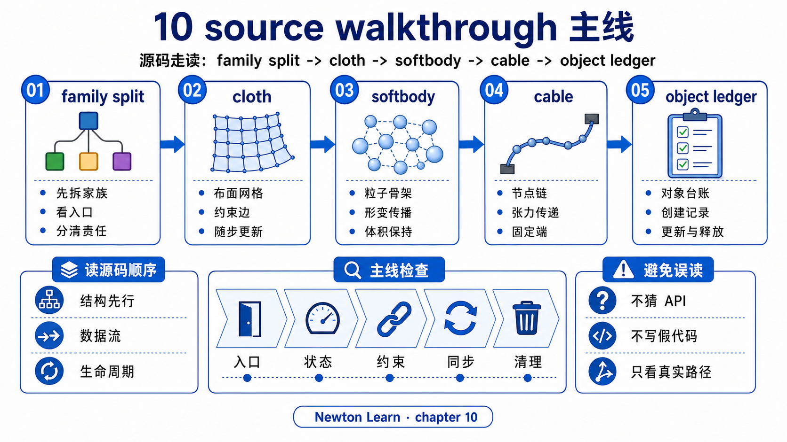
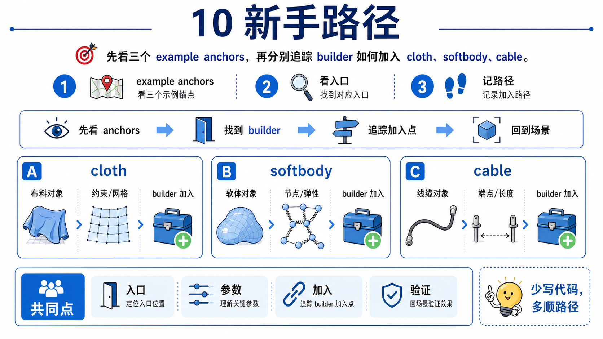
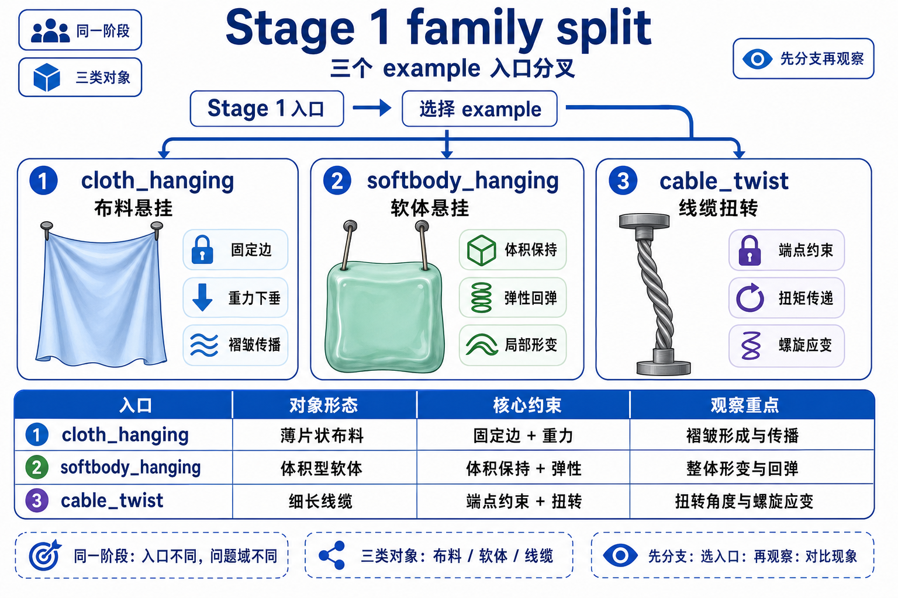
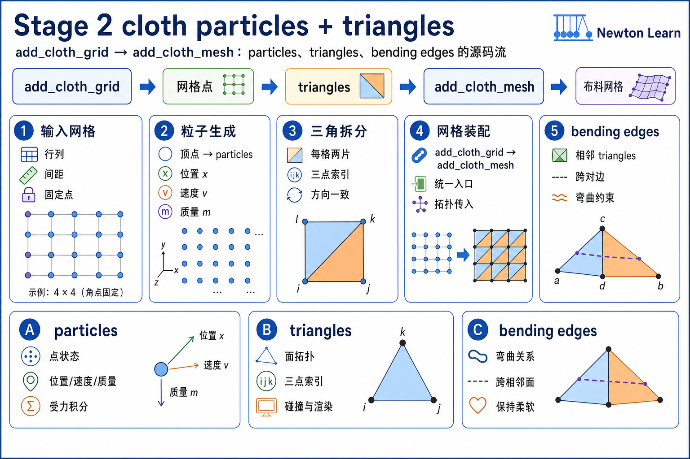
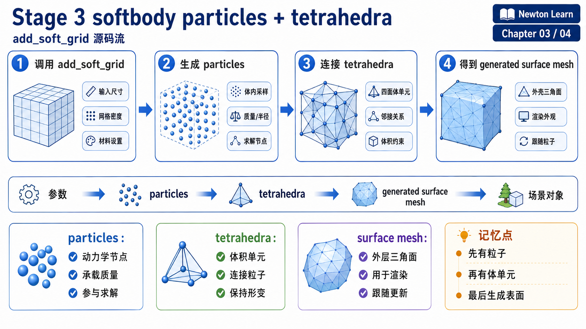
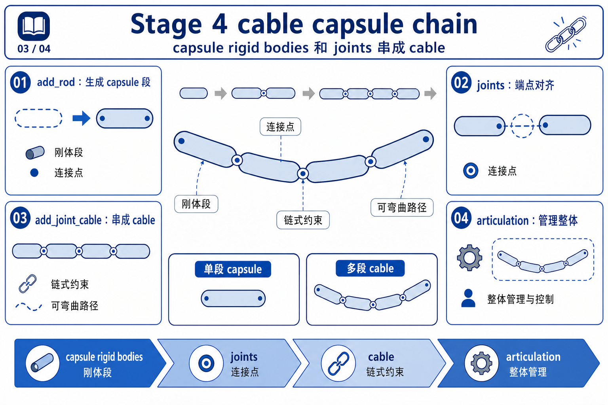
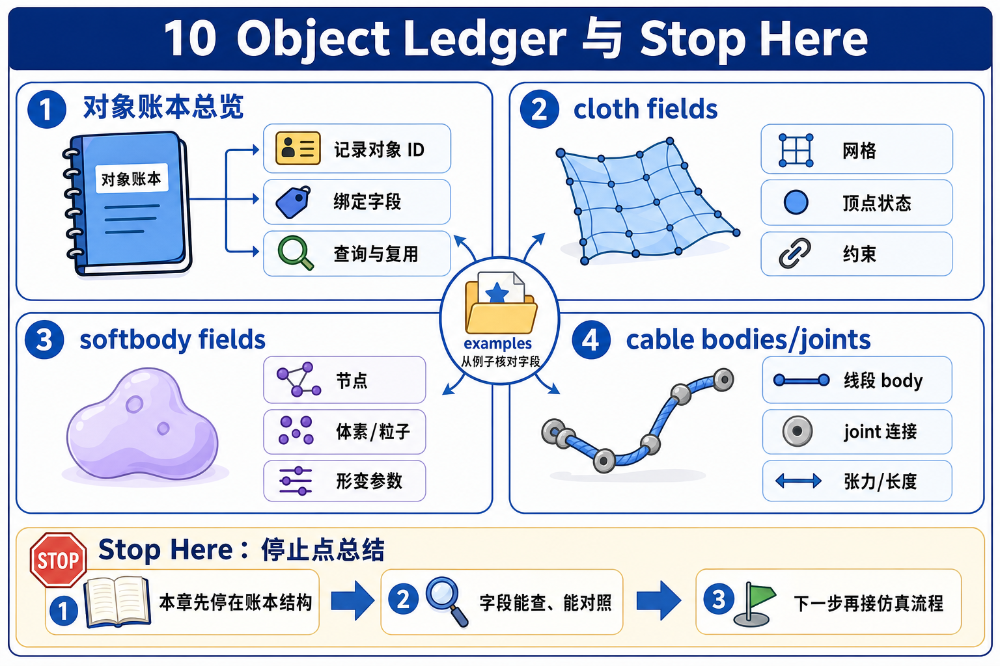

# 10 软体、布料与 Cable 源码走读

如果 chapter 09 结束时你脑中还在想“下一章是不是再多几个 solver 名字”，这一页的任务就是把那个方向掰回来。

chapter 10 的 first-pass 走读只守一个问题:

```text
这些看起来都能变形的东西，
在 Newton 里到底是不是同一种内部对象？
```

答案是否定的，而且差别在 builder 层就已经写得很清楚了。

## What This Walkthrough Follows

只追这一条主线:

```text
chapter 09: who organizes the correction?
-> chapter 10: what kind of object is being corrected?
-> cloth: surface particle mesh
-> softbody: volumetric particle mesh
-> cable: capsule rigid-body chain
```

这份 main walkthrough 刻意不展开三类东西:

- 不重讲 chapter 09 的 XPBD / VBD / Style3D 数学。
- 不展开 Style3D clothing pipeline 或 cable quaternion 细节。
- 不做参数大全；这里只抓对象家族、builder 真正造出的核心对象，以及最小状态差异。

第一遍先守住一句话:

```text
chapter 10 比较的不是“谁更会解 deformable”，
而是“被解的对象到底是表面粒子、体粒子，还是刚体链”。
```

## One-Screen Chapter Map



```text
same visual impression: all look deformable
                 |
                 v
        builder 入口已经把对象类型分开
                 |
     +-----------+------------+
     |                        |
     v                        v
 cloth_hanging          softbody_hanging          cable_twist
 add_cloth_grid         add_soft_grid             add_rod
     |                        |                       |
     v                        v                       v
 particles               particles               capsule rigid bodies
 + triangles             + tetrahedra            + cable joints
 + bending edges         + generated surface     + articulation
 (+ optional springs)      collision mesh
```

一眼最该看出的结论是:

- cloth 和 softbody 虽然都在 particle family 里，但一个是 surface，一个是 volume。
- cable 则直接换成 rigid body family。

## Beginner Path



1. 先看 Stage 1。
   - 想验证什么: chapter 10 为什么必须从表示而不是 solver 开始。
   - 看完后应该能说: 三个例子共享“看起来会变形”的外观，但 builder 入口已经分家。
2. 再看 Stage 2。
   - 想验证什么: cloth 为什么是 surface particle mesh。
   - 看完后应该能说: cloth 的基本语言是 particles + triangles + bending edges。
3. 再看 Stage 3。
   - 想验证什么: softbody 为什么是 volumetric particle mesh。
   - 看完后应该能说: tet 是核心，surface mesh 是从 tet boundary 生成出来的。
4. 最后看 Stage 4。
   - 想验证什么: cable 为什么不是 particle deformable。
   - 看完后应该能说: cable 的柔性外观来自 capsule rigid bodies 之间的 cable joints。

## Main Walkthrough

### Stage 1: chapter 09 的 solver 问题先停一下，先认对象家族



**Definition**

`对象家族`：第一遍先把它读成“builder 最终真正造出来的那套核心对象组合”。chapter 10 里，它比 solver 名字更值得先看。

**Claim**

chapter 10 的真正开场不是“又有哪些 solver”，而是“同样看起来会垂、会弯、会扭的物体，在 builder 里其实已经分成不同家族”。

**Why it matters**

如果这一层不先立住，你后面会把 cloth、softbody、cable 全都误读成“deformable object 的不同 demo”，从而看不见它们的内部结构差别。

**Source excerpt**

三个教学例子的入口其实已经把 chapter 10 的答案写出来了:

以下摘录为教学注释版，注释非原源码。

```python
# example_cloth_hanging.py
builder.add_cloth_grid(...)  # 从一张表面粒子网格开始

# example_softbody_hanging.py
builder.add_soft_grid(...)  # 从一块体粒子网格开始

# example_cable_twist.py
rod_bodies, _rod_joints = builder.add_rod(...)  # 直接得到刚体段和连接它们的 joints
```

这三行不只是三个 helper 名字，而是三条不同表示路线。

**Verification cues**

- `add_cloth_grid(...)` 的参数中心是二维网格尺寸和边界固定，所以它在搭一张表面网格。
- `add_soft_grid(...)` 明确多了 `dim_z / cell_z` 这一整层体网格参数，所以它在搭 3D volume。
- `add_rod(...)` 的返回值已经不是 particle index，而是 `rod_bodies` / joints，这说明状态单位已经换了。

**Checkpoint**

如果你现在还会把这三行 helper 调用看成“只是三个 demo 入口”，先停一下。第一遍要先接受：builder 入口已经在替你决定对象家族了。

**Output passed to next stage**

先接受一件事: chapter 10 要先辨认对象家族，再去看 solver 怎样消费它们。

### Stage 2: cloth 先被表示成 particles + triangles + bending edges



**Definition**

`surface particle mesh`：以粒子为顶点、以三角网格为主拓扑的一层表面对象。第一遍先把它想成“只有皮，没有体积厚度”的粒子网格。

**Claim**

cloth 在 Newton 里首先是一张 surface particle mesh。triangle 和 bending edge 是它的核心组织方式，spring 只是 optional add-on。

**Why it matters**

这一步会纠正一个常见误会: `cloth_hanging.py` 虽然可以切 solver，但 cloth 的身份不是由 solver 决定的，而是由 builder 里的表面网格结构决定的。

**Source excerpt**

例子里先把 cloth 参数收成一组 common surface-grid 参数:

以下摘录为教学注释版，注释非原源码。

```python
common_params = {
    "dim_x": self.sim_width,
    "dim_y": self.sim_height,
    "cell_x": 0.1,
    "cell_y": 0.1,
    "mass": 0.1,
    "fix_left": True,
    "edge_ke": 1.0e1,
}

builder.add_cloth_grid(**common_params, **solver_params)  # 把这组表面网格参数交给 cloth builder 入口
```

而 `builder.add_cloth_grid(...)` 会继续把它 handoff 给 `add_cloth_mesh(...)`:

以下摘录为教学注释版，注释非原源码。

```python
self.add_cloth_mesh(  # 从规则 grid 进入通用 cloth-mesh 构造路径
    pos=pos,
    rot=rot,
    scale=1.0,
    vel=vel,
    vertices=vertices,
    indices=indices,
    density=density,
    edge_ke=edge_ke,
    edge_kd=edge_kd,
    add_springs=add_springs,
)
```

接着 `add_cloth_mesh(...)` 里真正落地的是:

以下摘录为教学注释版，注释非原源码。

```python
self.add_particles(...)  # 先把顶点落成粒子状态
self.add_triangles(...)  # 三角形定义 cloth 的表面主拓扑
self.add_edges(...)  # bending edge 补上相邻关系 / 弯曲结构

if add_springs:
    self.add_spring(...)  # 需要时再额外挂 spring 路线
```

**Verification cues**

- cloth 的核心元素是 particles、triangles、edges；这已经足够定义它是一个表面对象。
- `add_springs` 是显式可选项，所以 spring 不是 cloth 身份的必要条件。
- `fix_left=True` 固定的是布边界粒子，不是 rigid link 或 tet volume。
- `builder.color(include_bending=True)` 只在某些 solver path 需要，但 cloth 在 color 之前就已经是 cloth。

**Checkpoint**

你现在应该能说：cloth 的核心身份不是“某个 solver 的布 demo”，而是很具体的 surface particle mesh，也就是 particles + triangles + bending edges。

**Output passed to next stage**

你现在应该把 cloth 想成“表面粒子网格”。接下来只要换掉核心元素，就会得到完全不同的 softbody family。

### Stage 3: softbody 还是 particles，但核心已经换成 tetrahedra



**Definition**

`volumetric particle mesh`：以粒子为顶点，但真正的核心拓扑已经延伸到体单元。第一遍先把它想成“不是一张皮，而是一整块体积网格”。

**Claim**

softbody 和 cloth 都会用 particles，但 softbody 的核心元素是 tetrahedra；表面三角网格只是从体网格边界长出来的 collision / surface layer。

**Why it matters**

这是 chapter 10 最容易被忽略的细分: 如果你只记得“两个例子都有 particles”，你会错过 surface family 和 volumetric family 的关键分界线。

**Source excerpt**

`example_softbody_hanging.py` 的 builder 入口从一开始就是 3D grid:

以下摘录为教学注释版，注释非原源码。

```python
builder.add_soft_grid(  # 一开始就是体网格入口
    pos=wp.vec3(0.0, 1.0 + y_offset, 1.0),
    dim_x=12,
    dim_y=4,
    dim_z=4,
    cell_x=0.1,
    cell_y=0.1,
    cell_z=0.1,
    density=1.0e3,
    k_mu=1.0e5,
    k_lambda=1.0e5,
    k_damp=k_damp,
    fix_left=True,
)
```

`builder.add_soft_grid(...)` 的内部骨架则是:

以下摘录为教学注释版，注释非原源码。

```python
self.add_particle(...)  # 先放体网格顶点
...
self.add_tetrahedron(i, j, k, l, k_mu, k_lambda, k_damp)  # tet 才是 softbody 的主单元
...
self.add_triangle(v[0], v[1], v[2], tri_ke, tri_ka, tri_kd, tri_drag, tri_lift)  # 再把边界面生成为 surface triangles
...
self.add_edge(o1, o2, v1, v2, None, edge_ke, edge_kd)  # 可选给表面 / 碰撞补边
```

而文档字符串还直接提醒了一句:

```text
The generated surface triangles and optional edges are for collision purposes.
```

**Verification cues**

- 这条路径先加 particle，再加 tet，最后才把 boundary faces 变成 surface triangles。
- 所以 softbody 的主表示是 volume，不是 surface。
- surface triangles / edges 的默认角色偏向 collision robustness，而不是主弹性来源。
- `builder.color()` 和 `SolverVBD(...)` 说明 solver 还能继续消费这类对象，但并没有把它改写回 cloth。

**Checkpoint**

如果你现在还会说“softbody 就是厚一点的 cloth”，先停在这里。第一遍最该稳住的是：tetrahedra 才是 softbody 的主表示，surface mesh 只是后来长出来的表层。

**Output passed to next stage**

现在你已经把 particle family 内部的两种对象分开了。下一步要再跨一层: cable 连状态单位都变了。

### Stage 4: cable 不是 particle deformable，而是 capsule rigid-body chain



**Definition**

`cable joint`：连接相邻 capsule 刚体段的 joint。第一遍先把它读成“允许这条刚体链拉伸、弯曲、扭转的连接件”。

**Claim**

cable 的柔性外观并不来自 particle elasticity，而是来自一串 capsule rigid bodies 之间的 cable joints。

**Why it matters**

这是 chapter 10 最重要的反直觉点。只有把 cable 看成 rigid chain，你才不会把 `add_rod(...)` 误读成“另一种 softbody helper”。

**Source excerpt**

`example_cable_twist.py` 先生成中心线路径和每段朝向，然后直接调用 `add_rod(...)`:

以下摘录为教学注释版，注释非原源码。

```python
cable_points, cable_edge_q = self.create_cable_geometry_with_turns(...)  # 先生成中心线和每段朝向

rod_bodies, _rod_joints = builder.add_rod(  # 把这条路径交给 rigid-body rod builder
    positions=cable_points,
    quaternions=cable_edge_q,
    radius=cable_radius,
    bend_stiffness=bend_stiffness,
    bend_damping=1.0e-2,
    stretch_stiffness=stretch_stiffness,
    stretch_damping=1.0e-4,
)
```

`builder.add_rod(...)` 的文档字符串则直接定义了它:

```text
Adds a rod composed of capsule bodies connected by cable joints.
```

内部又会继续走到 joint / articulation 这条路:

以下摘录为教学注释版，注释非原源码。

```python
link_bodies, link_joints = self.add_rod_graph(...)  # 先生成 capsule 刚体段和相邻 joints

if wrap_in_articulation and link_joints:
    self.add_articulation(link_joints, label=rod_art_label)  # 再把整串 joints 收成一条 articulation
```

而 `add_joint_cable(...)` 进一步说明 joint 自己有两层自由度:

```text
one linear (stretch) DOF + one angular (bend/twist) DOF
```

例子里固定第一段的方法也再次暴露了 rigid-body 身份:

以下摘录为教学注释版，注释非原源码。

```python
builder.body_mass[first_body] = 0.0  # 把第一段设成固定刚体
builder.body_inv_mass[first_body] = 0.0  # 线动质量也随之锁死
builder.body_inertia[first_body] = wp.mat33(0.0)  # 转动惯量清零
builder.body_inv_inertia[first_body] = wp.mat33(0.0)  # 转动自由度也锁死
```

甚至 twist 驱动最终也是直接改 `self.state_0.body_q` / `self.state_1.body_q` 这两份 rigid-body transform。

**Verification cues**

- `rod_bodies` 和 `_rod_joints` 的返回值已经说明这条路在管理 rigid entities，不是 particle entities。
- `add_articulation(...)` 出现后，说明这不仅是“几段东西碰巧连起来”，而是明确组织成 joint tree/chain。
- 例子里真正被驱动的是 rigid body transform，所以你要盯的是 `body_q`，不是 `particle_q`。

**Checkpoint**

你现在应该能说：Newton 虽然用 `add_rod(...)` 这个名字，但 chapter 10 这里讲的 cable family 本质上是一条 capsule rigid-body chain，它的柔性外观来自 cable joints，不来自 particle elasticity。

**Output passed to next stage**

到这里，chapter 10 的三条主家族已经分清楚了: cloth 是表面粒子网格，softbody 是体粒子网格，cable 是刚体链。

## Object Ledger



| 对象 | 谁生产 | 谁消费 | 盯哪些字段 / 关系 |
|------|--------|--------|------------------|
| cloth grid particles | `add_cloth_grid(...)` / `add_cloth_mesh(...)` | cloth solvers | `particle_q`、边界固定粒子 |
| cloth triangles | `add_cloth_mesh(...)` | cloth elasticity / surface behavior | `tri_indices` |
| cloth bending edges | `MeshAdjacency(...) -> add_edges(...)` | cloth bending / coloring | `edge_indices` |
| optional cloth springs | `add_cloth_mesh(..., add_springs=True)` | spring-based cloth path | `spring` connectivity |
| softbody particles | `add_soft_grid(...)` | volumetric softbody update | `particle_q` |
| softbody tetrahedra | `add_tetrahedron(...)` inside `add_soft_grid(...)` | volume elasticity | `tet` connectivity |
| generated softbody surface mesh | boundary faces inside `add_soft_grid(...)` | collision / surface representation | generated `triangles` and optional `edges` |
| cable segment bodies | `add_rod(...)` / `add_rod_graph(...)` | rigid-body solver path | `body_q` |
| cable joints | `add_joint_cable(...)` via `add_rod(...)` | stretch / bend / twist coupling | joint chain between adjacent capsules |
| cable articulation | `add_articulation(...)` | articulation-safe joint organization | contiguous joint group |

如果只想用一张表记住 chapter 10，就记这张 ledger。

## Stop Here

读到这里已经够 chapter 10 的 first pass 了。

如果你现在能顺着说出这句话，本章主线就已经稳了:

```text
chapter 09 先比较 solver 怎样组织修正；
chapter 10 先比较被修正的对象是什么。
在 Newton 里，cloth 是 particles + triangles + bending edges，
softbody 是 particles + tetrahedra + generated surface collision mesh，
cable 是 capsule rigid bodies + cable joints (+ articulation)。
```

到这一步，你已经不会再把三者写成一个平面的“deformable object catalog”。

## Go Deeper

chapter 10 的 deep walkthrough 已经写好：见 `source-walkthrough-deep.md`。

这份 main walkthrough 的角色不变，仍然负责 first pass。读完这里后，如果你想核对精确 builder handoff，建议按这个顺序继续：

- 先看 `source-walkthrough-deep.md` 的 `Fast Deep Index`，挑你要核对的 upstream anchor。
- 再读 `source-walkthrough-deep.md` 的 `Exact Handoff Trace`，把 cloth / softbody / cable 的 builder handoff 固定下来。
- 最后回看 `principle.md`，确认你不会再把 `surface particle mesh`、`volumetric particle mesh` 和 `capsule rigid-body chain` 混成一件事。

如果你只想查某条支线，不必整页重读，直接跳 `source-walkthrough-deep.md` 的 `Optional Branches` 和 `Verification Anchors` 即可。
