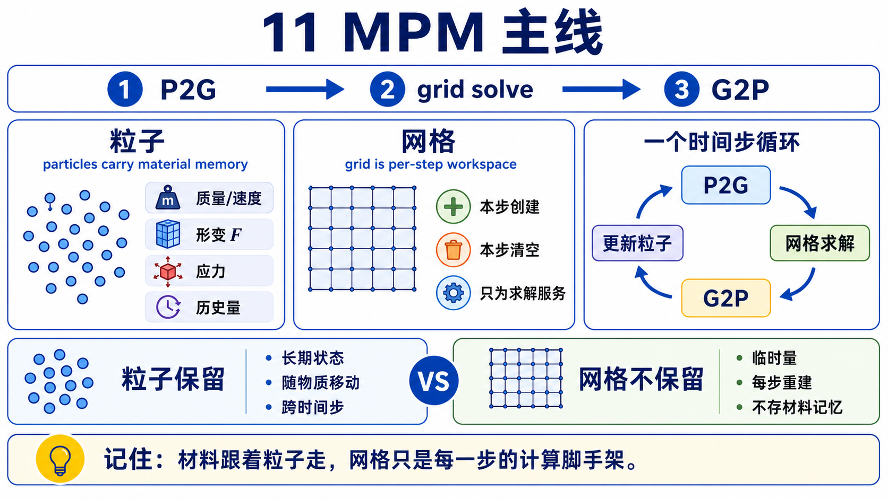
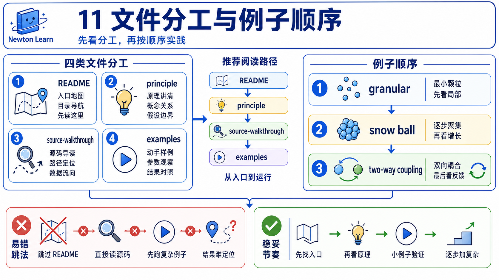
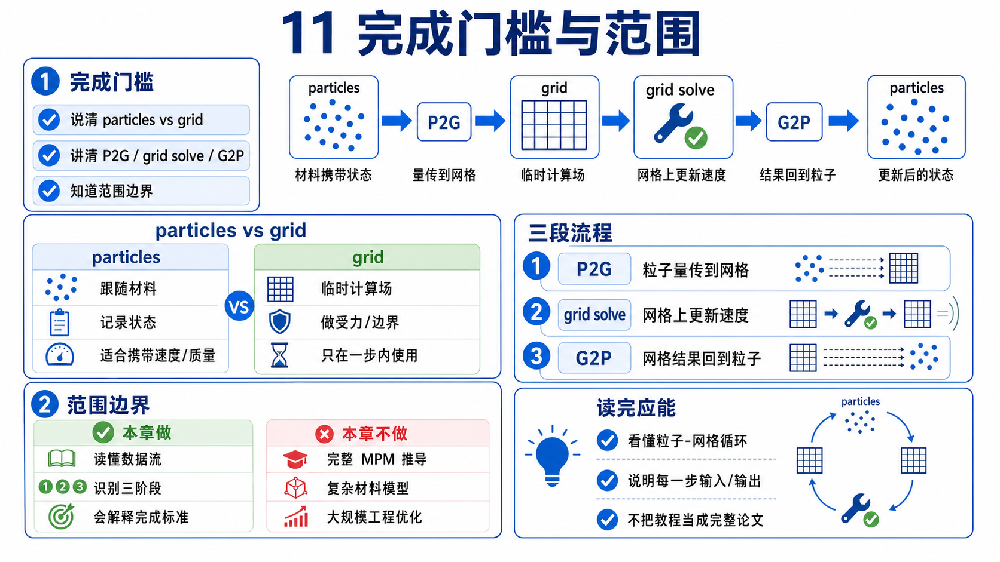

# 11 MPM：粒子携材，网格求解



`10_softbody_cloth_cable` 刚把一个重要误会拆开: 共享 `particle` 这个词，不代表内部对象家族相同。chapter 11 要继续纠正另一层常见误读:

```text
MPM 不是在 “APIC solver” 和 “implicit solver” 之间二选一。
```

在 Newton 这条主线上，`APIC`（Affine Particle-In-Cell）先是 `P2G / G2P` transfer 的语言，`implicit` 说的是 grid-side rheology / collision solve。它们属于同一条 timestep 数据流，不是两个互斥阵营。

第一遍只守住这条 spine:

```text
particles carry material/history
-> P2G / APIC transfer to per-step grid workspace
-> implicit grid-side rheology / collision solve
-> G2P / APIC transfer back to particles
-> particle position / velocity / stress / strain update
```

这里的 MPM particles 也不是 chapter 10 里 cloth / softbody 那种 mesh vertex family。它们首先是持久的 material carriers；第一遍可以把 grid 读成每一步围着粒子重建的工作区。实现里确实还会复用或暂存一些 grid-derived fields 去服务 warmstart、coupling、rendering 分支，但对象身份仍然先站在粒子这边。

## 文件分工



- `README.md`: 本章范围、阅读顺序、例子分工、完成门槛。
- `principle.md`: 把 persistent particles / per-step grid 这条原理主线讲顺，并说明 `register_custom_attributes`、`model.mpm.*`、`state.mpm.*` 各放什么。
- `source-walkthrough.md`: beginner-safe 的 main walkthrough。第一次追 chapter 11 源码，先读这一份。
- `examples.md`: 三个 upstream 例子各担一个 teaching job，避免被误读成平面的 demo catalog。

这章暂时只有 mainline，没有 deep walkthrough。

## 例子分工

| 例子 | 这章给它的唯一 job | 何时使用 |
|------|---------------------|----------|
| `newton/examples/mpm/example_mpm_granular.py` | main example。先让你看完整条 `particles -> grid -> particles` 数据流 | 第一遍必看 |
| `newton/examples/mpm/example_mpm_snow_ball.py` | material / history branch。让你看见 `model.mpm.*` 和 `state.mpm.*` 怎样真正承载材料差异与历史变量 | mainline 稳后再看 |
| `newton/examples/mpm/example_mpm_twoway_coupling.py` | advanced coupling branch。只负责证明 grid 侧冲量还能回馈到另一套 rigid-body world | 最后再看 |

## 本章目标

- 建立 chapter 11 的第一比较轴: `persistent particles` 和 `per-step grid workspace` 如何分工，而不是先背 solver 名字。
- 让你明确知道 `APIC` 说的是 transfer，`implicit` 说的是 grid-side solve，它们不是假二选一。
- 把 Newton 的 MPM-specific state placement 讲清: `register_custom_attributes`、`model.mpm.*`、`state.mpm.*`。
- 把 MPM particles 和 chapter 10 的 cloth / softbody particle mesh family 明确分家。

## 本章范围

- 主教学锚点只守住 3 个 examples: `newton/examples/mpm/example_mpm_granular.py`、`newton/examples/mpm/example_mpm_snow_ball.py`、`newton/examples/mpm/example_mpm_twoway_coupling.py`。
- 主源码锚点只守住 3 个 MPM 核心文件: `newton/_src/solvers/implicit_mpm/solver_implicit_mpm.py`、`newton/_src/solvers/implicit_mpm/implicit_mpm_model.py`、`newton/_src/solvers/implicit_mpm/implicit_mpm_solver_kernels.py`。
- 主线只覆盖 dataflow、state placement、example roles、以及 first-pass 必需的 object ledger。

## 本章明确不做什么

- 不把 chapter 11 写成 `APIC vs implicit` 的假对立教程。
- 不展开 Drucker-Prager / hardening / viscosity 等高级本构推导。
- 不做 basis catalog、config table、warmstart 模式大全。
- 不把 `example_mpm_twoway_coupling.py` 的 two-way internals 塞进 main walkthrough。

## 前置依赖

- 建议先读完 `10_softbody_cloth_cable`。如果你还会把所有 particle-based thing 混成一个对象家族，先回看 chapter 10。
- 默认你已经接受 chapter 08/09 的最小外层 contract: 场景会不断推进 `state_0 -> solver.step(...) -> state_1 -> swap`。
- 不要求你第一遍就会完整本构数学；chapter 11 先建立数据流和对象放置，再决定是否下潜到 constitutive details。

## 完成门槛



```text
[ ] 我能解释为什么 chapter 11 不是 “APIC solver vs implicit solver” 二选一
[ ] 我能顺着说出本章主 spine: P2G / APIC -> grid solve -> G2P / APIC -> particle updates
[ ] 我能说明为什么 MPM particles 不是 chapter 10 的 cloth / softbody mesh vertex family
[ ] 我能指出 `register_custom_attributes`、`model.mpm.*`、`state.mpm.*` 各自负责什么
[ ] 我能说出三个例子的分工，而不是把它们混成一个 “MPM demos catalog”
```

## 阅读顺序

1. 先读本文件，把 chapter 11 的问题改写成“persistent particles 和 per-step grid 如何分工”。
2. 读 `principle.md`，先把 object family 和 state placement 讲顺。
3. 再读 `source-walkthrough.md`，把这条原理主线真正串进源码。
4. 最后用 `examples.md` 分三次看 `granular -> snow_ball -> twoway_coupling`，不要一开始就混着看。

如果你更习惯先看代码，也可以把第 2 步和第 3 步对调；但第一遍不要跳过其中任一份。

## 预期产出

- `principle.md`: 讲清粒子为什么是 material carriers，grid 为什么是 per-step workspace。
- `source-walkthrough.md`: 留下一条稳定的 main walkthrough，把 `register -> carry -> P2G -> solve -> G2P -> update` 串起来。
- `examples.md`: 给三个 upstream anchors 各自分配唯一 teaching job。

读完 chapter 11 后，你最该带走的不是一串参数名，而是这句更短的话:

```text
MPM 的主线不是 “APIC solver vs implicit solver”。
而是持久粒子携带材料与历史，每一步把信息送到临时网格求解，再把结果带回粒子。
```
