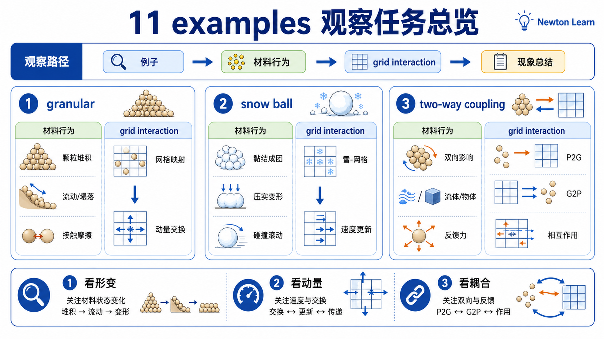
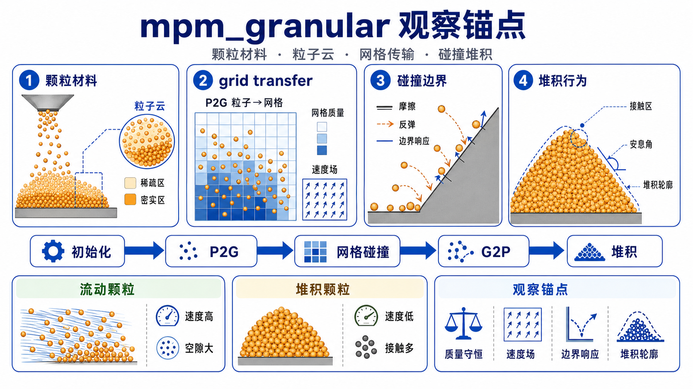
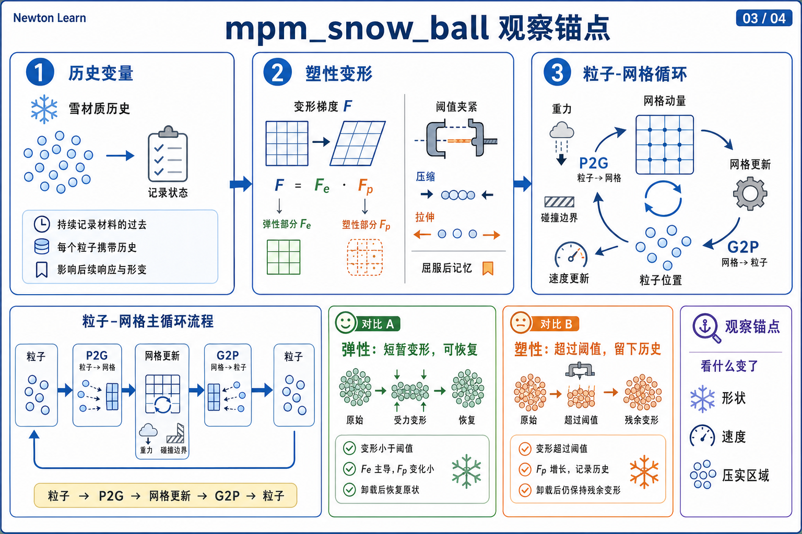
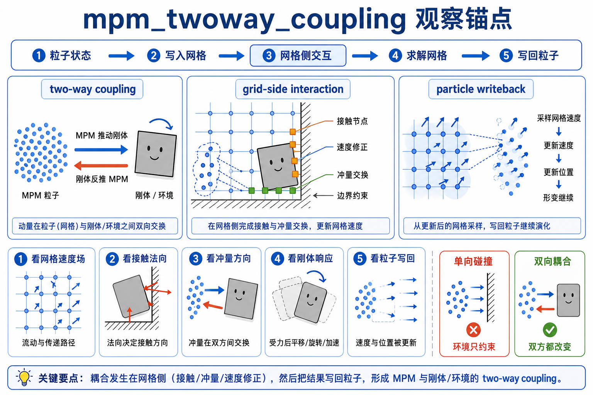
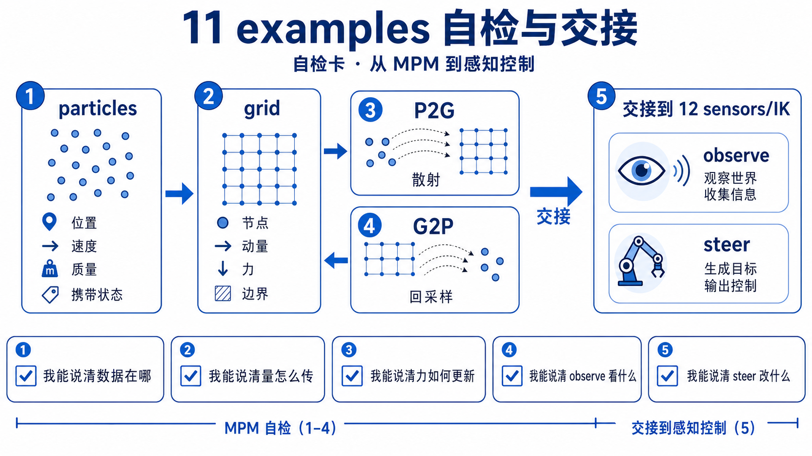

# 11 MPM 例子观察单



这一页不是 `MPM demos catalog`。它只做一件事: **给 chapter 11 的三个 upstream anchors 各分配一个明确 teaching job。**

所以第一遍不要把三个例子混着看。每个例子只负责回答一个问题。

## 总表

| 例子 | 这页给它的唯一 job | 主看点 |
|------|---------------------|--------|
| `newton/examples/mpm/example_mpm_granular.py` | main example。建立 chapter 11 的主数据流 | `register_custom_attributes -> emit particles -> solver.step -> swap` |
| `newton/examples/mpm/example_mpm_snow_ball.py` | material / history branch。证明粒子真的在携带材料差异和历史变量 | `model.mpm.*`、`state.mpm.particle_Jp` |
| `newton/examples/mpm/example_mpm_twoway_coupling.py` | advanced coupling branch。证明 grid side 冲量还能反馈到 rigid bodies | `setup_collider(...)`、`collect_collider_impulses(...)` |

## 教学锚点 1: `example_mpm_granular.py`



**唯一 job**

把 chapter 11 的 mainline dataflow 先立起来，让你看到这章真正想讲的是:

```text
persistent particles -> per-step grid -> updated particles
```

**建议入口**

```bash
python -m newton.examples mpm_granular
```

第一遍先用默认设置。不要一上来就在 CLI 参数海里游泳。

**先盯哪几处**

- `SolverImplicitMPM.register_custom_attributes(builder)`。
- `Example.emit_particles(...)` 里怎样发射粒子。
- `for key in vars(args): ... if hasattr(self.model.mpm, key)` 这段参数 handoff。
- `self.solver.step(self.state_0, self.state_1, None, None, self.sim_dt)`。
- `self.state_0, self.state_1 = self.state_1, self.state_0`。

**你要从它身上验证什么**

- MPM 不是 mesh-first，而是先有一批 material particles。
- solver 每步会从粒子出发，把信息送到 grid，再把结果带回粒子。
- `model.mpm.*` 不是纸面上的 namespace，而是真的从 example 参数直接流向 solver。
- 例子里额外调用 `project_outside(...)`，只说明碰撞后可再做投影修正；它不是 chapter 11 主 spine 的第一关键词。

**看完后应该能说**

```text
`example_mpm_granular.py` 的教学价值不是“沙子场景很好看”，
而是它最直白地把 chapter 11 的完整 step 数据流摆到了你面前。
```

**不要拿它做什么**

- 不要把它读成“参数越多越高级”的配置演示。
- 不要把它当成本构数学入口；它的 job 是先让数据流稳下来。

## 教学锚点 2: `example_mpm_snow_ball.py`



**唯一 job**

证明 MPM particles 不是空壳点，而是真的在携带材料差异和历史变量。

**建议入口**

```bash
python -m newton.examples mpm_snow_ball
```

**先盯哪几处**

- `SolverImplicitMPM.register_custom_attributes(builder)` 之后的 `self.model = builder.finalize()`。
- `self.state_0 = self.model.state()` / `self.state_1 = self.model.state()`。
- `self.state_0.mpm.particle_Jp.fill_(0.975)`。
- `model.mpm.young_modulus.fill_(...)`、`model.mpm.friction.fill_(...)` 这一串。
- render 里根据 `self.state_0.mpm.particle_Jp` 着色的逻辑。

**你要从它身上验证什么**

- `model.mpm.*` 真的是 per-particle material storage，而不是只给 solver constructor 看一眼的 config。
- `state.mpm.particle_Jp` 这种量会跨 timestep 持续存在，所以它更像 particle-carried history。
- 这个例子把“材料参数”和“历史变量”两条线都放在粒子身上，而不是放在 grid 上。

**看完后应该能说**

```text
`example_mpm_snow_ball.py` 不是另一个“下坡场景”。
它的 job 是教你: MPM particle 真正在背材料和历史账本。
```

**不要拿它做什么**

- 不要第一遍就把注意力全部放到 snow rheology 的高级细节上。
- 不要把 `Jp` 读成单纯的可视化变量；这里它首先是 history carrier 的证据。

## 教学锚点 3: `example_mpm_twoway_coupling.py`



**唯一 job**

证明 chapter 11 的 grid workspace 不只会把结果送回粒子，还能把 collider impulse 反馈到另一套 rigid-body world。

**建议入口**

```bash
python -m newton.examples mpm_twoway_coupling
```

但请在 mainline 已经稳定之后再看它。

**先盯哪几处**

- `builder` 和 `sand_builder` 分别创建 rigid world 与 sand world。
- `SolverImplicitMPM.register_custom_attributes(sand_builder)` 只作用在 sand particles 上。
- `self.mpm_solver.setup_collider(model=self.model)`。
- `self.mpm_solver.collect_collider_impulses(self.sand_state_0)`。
- `compute_body_forces(...)` 怎样把 grid-side impulse 转回 rigid body force / torque。

**你要从它身上验证什么**

- MPM 主线仍然是 `particles -> grid -> particles`，但 grid side 还能导出 collider impulse 给别的系统。
- two-way coupling 的核心不是“又一种 MPM solver”，而是 grid solve 产物与 rigid-body world 之间的接口。
- `custom_attributes={"mpm:friction": 0.75}` 也再次说明材料信息是 per-particle 挂在 `mpm` namespace 上的。

**看完后应该能说**

```text
`example_mpm_twoway_coupling.py` 的 job 不是替代主教程，
而是告诉你 chapter 11 的 grid 产物还能跨系统流动。
```

**不要拿它做什么**

- 不要用它当第一份 MPM walkthrough。
- 不要把 `compute_body_forces`、`subtract_body_force` 这些细节塞回 mainline 里；它们是 advanced branch。

## 推荐顺序

1. 先看 `example_mpm_granular.py`。
2. 再看 `example_mpm_snow_ball.py`。
3. 最后看 `example_mpm_twoway_coupling.py`。

这个顺序最稳，因为它先建立主数据流，再补“粒子携带材料 / 历史”这条线，最后才扩展到跨系统 coupling。

## 自检



- 现在只看 `example_mpm_granular.py`，你能不能不提高级本构，也说清它的 step 数据流？
- 现在只看 `example_mpm_snow_ball.py`，你能不能解释为什么 `model.mpm.*` 和 `state.mpm.*` 要分开放？
- 现在只看 `example_mpm_twoway_coupling.py`，你能不能说明它为什么是 advanced branch，而不是 mainline 本体？
