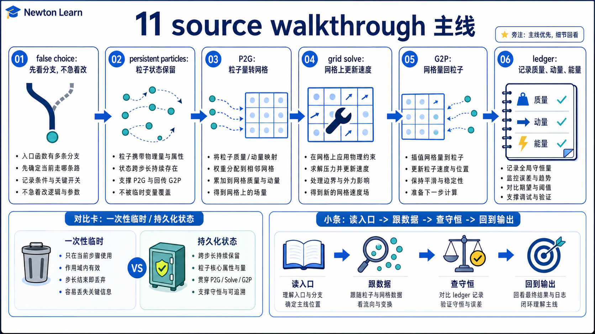
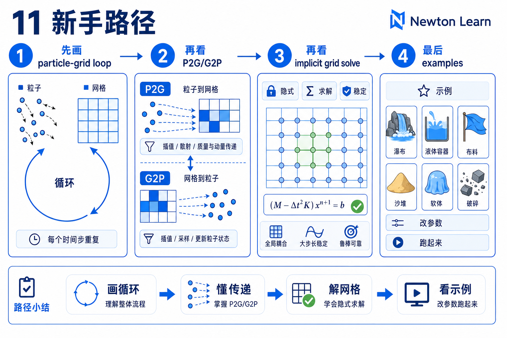
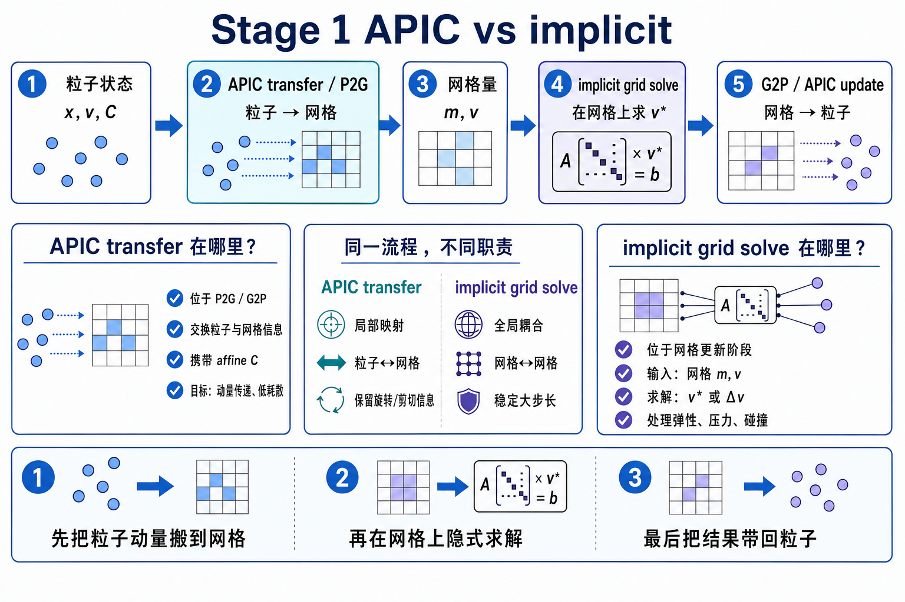
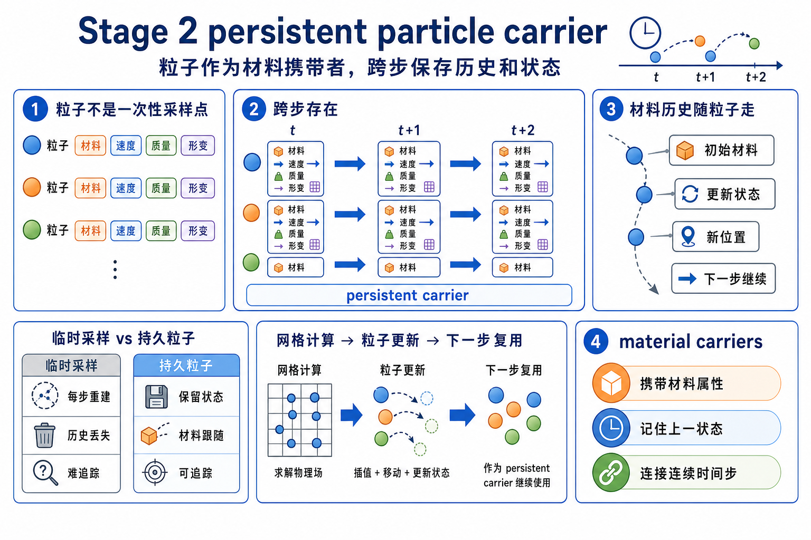
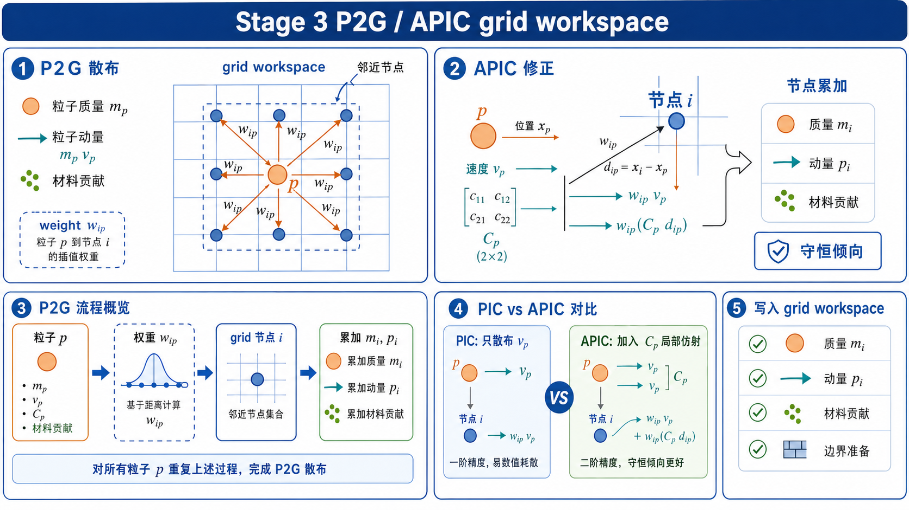
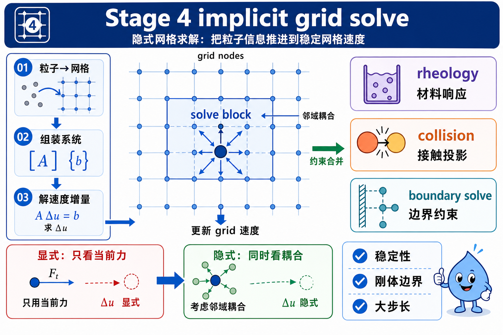
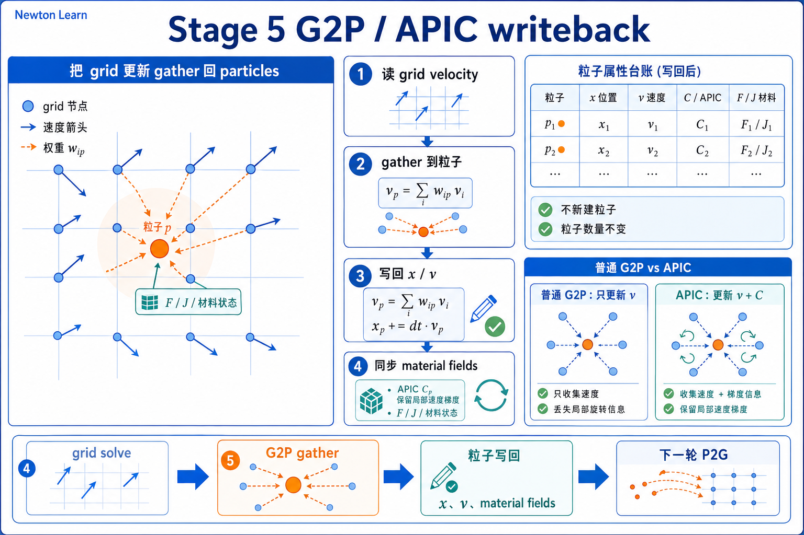
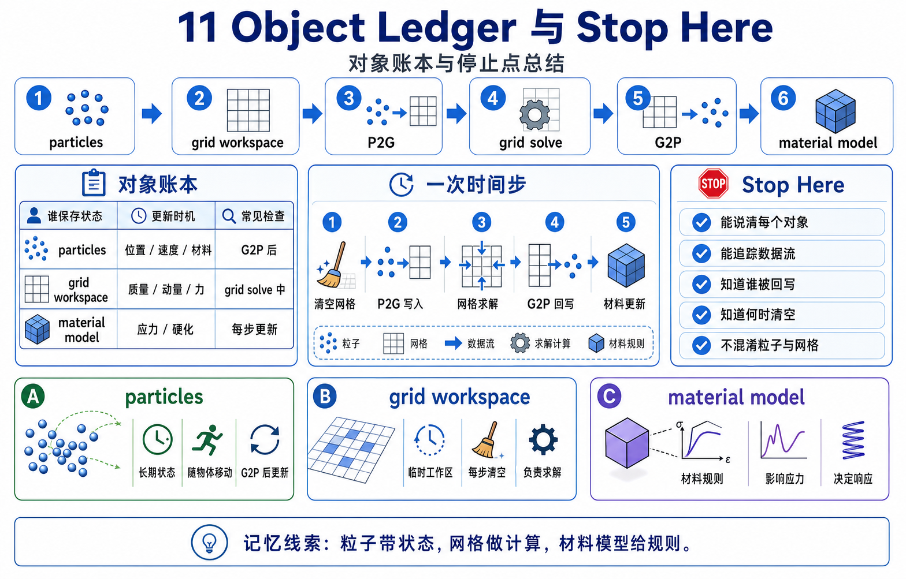

# 11 MPM 源码走读

这份 main walkthrough 只回答一个 first-pass 问题: **Newton 里的 implicit MPM，一步 `dt` 到底怎样在持久粒子和临时网格之间来回搬运信息？**

第一遍先不做几件事:

- 不把本章读成 `APIC solver vs implicit solver` 的假对立。
- 不展开本构推导、basis 菜单、config 全表。
- 不把 `example_mpm_twoway_coupling.py` 的 advanced internals 混进 mainline。

## What This Walkthrough Follows

只追这一条主线:

```text
chapter 10: particle-based things can still be different object families
-> chapter 11: MPM particle is yet another family
-> persistent particles carry material/history
-> each step bins them into a temporary grid workspace
-> P2G / APIC transfer
-> implicit grid-side rheology / collision solve
-> G2P / APIC transfer back
-> particle position / velocity / stress / strain update
```

这份 main walkthrough 刻意不展开四类东西:

- Drucker-Prager、hardening、viscosity 的完整 constitutive math。
- strain / velocity / collider basis 的 catalog。
- warmstart 模式和每个 config 开关的大全。
- two-way coupling 的力回传细节。

第一遍先守住一句话:

```text
chapter 11 比较的不是 “APIC solver vs implicit solver”，
而是 “同一条 MPM step 里，粒子怎样把信息交给网格求解，再把结果带回自己”。
```

## One-Screen Chapter Map



```text
persistent particle carriers
(`particle_q`, `particle_qd`, `model.mpm.*`, `state.mpm.*`)
                       |
                       v
      `_particles_to_cells(...)` + `_rebuild_scratchpad(...)`
                       |
                       v
             per-step grid workspace
                       |
          +------------+-------------+
          |                          |
          v                          v
   P2G / APIC transfer        collider rasterization
   mass + velocity +          + elasticity / plasticity
   optional velocity grad     + implicit rheology solve
          |                          |
          +------------+-------------+
                       |
                       v
                 G2P / APIC back
                       |
                       v
updated `particle_q`, `particle_qd`, `particle_qd_grad`,
`particle_elastic_strain`, `particle_Jp`, `particle_stress`
```

## Beginner Path



1. 先看 Stage 1。想验证什么: 为什么 chapter 11 不能开成 “APIC solver vs implicit solver”。看完后应该能说: `APIC` 是 transfer 语言，`implicit` 是 grid-side solve，它们在同一条 step 数据流里协作。
2. 再看 Stage 2。想验证什么: MPM particle 到底是什么对象。看完后应该能说: 它是 persistent material carrier，不是 chapter 10 的 cloth / softbody mesh vertex family。
3. 再看 Stage 3。想验证什么: P2G / APIC 具体把什么送到了哪里。看完后应该能说: 每一步先围着当前粒子重建 grid，再把质量、速度、速度梯度贡献到 grid workspace。
4. 再看 Stage 4。想验证什么: implicit solve 究竟发生在什么对象上。看完后应该能说: collider、elasticity、plasticity 都在 grid side 组装并求解。
5. 最后看 Stage 5。想验证什么: 结果怎样回到粒子。看完后应该能说: G2P / APIC 会把 velocity、stress、strain、history 写回 `state_out`；真正持续承载材料与历史语义的仍然是粒子状态。

## Main Walkthrough

### Stage 1: 先把 “APIC solver vs implicit solver” 这个假二选一掰回来



**Definitions**

- `APIC`（Affine Particle-In-Cell）：这里先把它读成 `particle <-> grid` transfer 的一种写法，粒子除了平移速度，还带一份局部速度梯度。
- `implicit grid solve`：在 grid side 做的稳定 rheology / collision solve。
- `rheology`：材料在受力下怎样流动、变形、屈服的规则；第一遍先把它读成 grid side 的材料响应问题。
- `MPM step`：同一条 `particles -> grid -> particles` 数据流，而不是两套彼此竞争的 solver identity。

**Claim**

chapter 11 的真正开场不是“APIC 和 implicit 哪个赢”，而是“同一条 MPM timestep 里，APIC 在 transfer 层做什么，implicit 在 grid solve 层做什么”。

**Why it matters**

如果这一层不先立住，你后面会把 chapter 11 误读成 solver 品牌对比，从而看不见最重要的对象分工: 粒子负责持续携带材料与历史，grid 负责本步离散求解。

**Source excerpt**

`solver_implicit_mpm.py` 的 config 和 `step(...)` 文档已经把两件事并排写出来了:

以下摘录为教学注释版，注释非原源码。

```python
transfer_scheme: Literal["apic", "pic"] = "apic"  # APIC / PIC 先决定 particle <-> grid 的 transfer 写法

def step(...):
    """Advance the simulation by one time step.

    Transfers particle data to the grid, solves the implicit rheology
    system, and transfers the result back to update particle positions,
    velocities, and stress.
    """
```

**Verification cues**

- `transfer_scheme` 是 config 的一个字段，说明 `APIC / PIC` 先是 transfer choice。
- `step(...)` 的文档直接给出了完整顺序: `particle -> grid -> solve -> back to particles`。
- `contacts` 参数在这个 solver 里是 unused，碰撞是在内部 grid side 处理的，不是沿用 chapter 08/09 那套外部 contact 对象主导。

**Checkpoint**

如果你现在还会把 chapter 11 的标题改写成 “APIC solver vs implicit solver”，先停一下。第一遍最重要的是接受: 这是一条数据流，不是两派互斥路线。

**Output passed to next stage**

既然 chapter 11 先讲的是同一条数据流，那下一步就该问: 这条流里哪些东西是持久存在的，哪些只是本步临时工作区？

### Stage 2: MPM particle 是 persistent material carrier，不是 chapter 10 的 mesh vertex family



**Definitions**

- `persistent carrier`：跨 timestep 持续存在、会把状态带到下一步的对象。
- `register_custom_attributes(...)`：在 builder 阶段先声明 MPM 需要的 model / state arrays。

**Claim**

chapter 11 的 MPM particles 首先是一批持久的材料载体。材料参数放在 `model.mpm.*`，历史和附加粒子状态放在 `state.mpm.*`；它们不是 chapter 10 里 surface mesh 或 tet mesh 的 vertex family。

**Why it matters**

只有先把这层对象身份稳住，你后面看到 `P2G / G2P` 才会读成“粒子把自己携带的材料和历史送去网格做一步求解”，而不是误读成“粒子本身就是一张显式 mesh”。

**Source excerpt**

examples 入口先把 MPM namespace 注册进 builder:

以下摘录为教学注释版，注释非原源码。

```python
builder = newton.ModelBuilder()
SolverImplicitMPM.register_custom_attributes(builder)  # 先给 builder 挂上 MPM 专用 model/state 命名空间
```

`register_custom_attributes(...)` 里又明确区分了 model-side 和 state-side 数据:

以下摘录为教学注释版，注释非原源码。

```python
name="young_modulus", assignment=newton.Model.AttributeAssignment.MODEL  # 材料刚度放在 model.mpm
name="friction", assignment=newton.Model.AttributeAssignment.MODEL  # 摩擦等材料配方也是 model-side

name="particle_qd_grad", assignment=newton.Model.AttributeAssignment.STATE  # APIC 速度梯度是会随时间更新的 state
name="particle_elastic_strain", assignment=newton.Model.AttributeAssignment.STATE  # 弹性应变历史挂在 state.mpm
name="particle_Jp", assignment=newton.Model.AttributeAssignment.STATE  # 塑性历史 / 体积变化账本也挂在 state.mpm
name="particle_stress", assignment=newton.Model.AttributeAssignment.STATE  # 当前粒子应力同样随 timestep 改写
```

而例子里会真的去填这些数组:

以下摘录为教学注释版，注释非原源码。

```python
if hasattr(self.model.mpm, key):
    getattr(self.model.mpm, key).fill_(getattr(args, key))  # 先把材料配置灌进 model.mpm

self.state_0.mpm.particle_Jp.fill_(0.975)  # 再给初始粒子历史一个起点
```

**Verification cues**

- `model.mpm.*` 更像 per-particle material recipe。
- `state.mpm.*` 更像 per-particle history / auxiliary state。
- `state.particle_q` 和 `state.particle_qd` 仍然留在基础 particle namespace 里，说明 MPM 不是把所有东西都重新造一套对象，而是在 Newton particle 上叠加材料 / 历史语义。
- chapter 10 的 cloth / softbody particles 需要显式 triangles / tetrahedra 才能定义对象身份；chapter 11 的 mainline 没有先给你一套持久 mesh connectivity，它先给你的是 particle carriers + temporary grid。

**Checkpoint**

如果你现在还会把 MPM particles 想成 “softbody tet vertex 的另一种 solver 版本”，先停在这里。chapter 11 的粒子身份首先是 material carrier，而不是显式 mesh vertex。

**Output passed to next stage**

现在你已经知道哪些信息长期挂在粒子上了。下一步要看的就是: 这些信息怎样在每一步被送到临时 grid workspace。

### Stage 3: `P2G / APIC` 把粒子信息送到 per-step grid workspace



**Definitions**

- `P2G`：particle-to-grid transfer。第一遍就把它读成“粒子把自己的质量、速度和附加动量信息送给网格”。
- `pic`：这里是 `_particles_to_cells(...)` 产出的 particle-in-cell / quadrature 视图。第一遍先把它读成“这一步粒子落在哪些 cells 上、怎样参与插值”的账本。
- `scratchpad`：本步 grid 求解用的 fields / matrices / buffers。第一遍把它读成这一步的主要工作区；某些分支里也会复用或保存 grid-derived fields。
- `fem.integrate / fem.interpolate`：Warp FEM 提供的积分 / 插值 helper。第一遍只要把它们读成“把粒子贡献送上 grid”或“把 grid 结果采样回粒子”的工具。

**Claim**

每一步都会先围着当前粒子位置组织起 grid 和 scratchpad，然后把粒子的质量、速度以及可选 APIC 速度梯度贡献到 grid node。第一遍可以把这理解成“grid workspace 每步都从粒子这边重新长出来”；更细的 fixed-grid / warmstart 分支放到 second pass 再看。

**Why it matters**

这一步会纠正另一个常见误会: 你看到 grid 之后，很容易把它当成一个长期存在、和粒子平起平坐的对象家族。其实在这条主线上，grid 是围着粒子组织起来的主要求解工作区。

**Source excerpt**

`step(...)` 的第一动作就是先把粒子塞回 cell，再重建 scratch:

以下摘录为教学注释版，注释非原源码。

```python
pic = self._particles_to_cells(state_in.particle_q)  # 先按当前粒子位置重建这一步的 PIC / cell 归属
scratch = self._rebuild_scratchpad(pic)  # 再按这份归属重建 grid workspace
self._step_impl(state_in, state_out, dt, pic, scratch)  # 后面的整步都围着这份临时 grid 工作
```

`_particles_to_cells(...)` 的文档字符串也把这层关系写死了:

```python
def _particles_to_cells(...):
    """Rebuild the grid and grid partition around particles,
    then assign particles to grid cells."""
```

而 `_compute_unconstrained_velocity(...)` 则展示了标准 P2G 和 APIC 附加项:

以下摘录为教学注释版，注释非原源码。

```python
velocity_int = fem.integrate(  # 先把粒子速度 / 质量贡献累计到 grid velocity 积分量
    integrate_velocity,
    quadrature=pic,
    values={
        "velocities": state_in.particle_qd,
        "particle_density": mpm_model.particle_density,
        ...
    },
)

if self.apic:
    fem.integrate(  # APIC 再补一份 affine velocity 梯度贡献
        integrate_velocity_apic,
        quadrature=pic,
        values={
            "velocity_gradients": state_in.mpm.particle_qd_grad,
            ...
        },
        output=velocity_int,
        add=True,  # 叠加到同一个 grid velocity 积分量
    )
```

**Verification cues**

- grid 会围着当前 `state_in.particle_q` 重建，而不是在某份持久 mesh 上原地求解。
- P2G 的输入来自粒子: `particle_qd`、`particle_density`、以及 APIC 用的 `particle_qd_grad`。
- `scratch.velocity_field`、`scratch.inv_mass_matrix` 这些对象首先服务本步 grid solve；即使某些分支会复用或暂存它们，它们也不是 chapter 11 的长期对象身份中心。

**Checkpoint**

如果你现在还会把 grid 想成“第二份持久状态”，先停一下。第一遍要先接受: grid 是本步围着粒子重建出来的 workspace，而 P2G 是把粒子携带的信息送进去。

**Output passed to next stage**

现在 grid workspace 已经接住了粒子信息。下一步要问的就是: implicit solve 到底在这里做了什么。

### Stage 4: implicit rheology / collision solve 真正发生在 grid side



**Definition**

`grid-side solve`：用 grid / strain spaces 上的离散变量来组织 momentum、rheology、collision 的联合求解。

`rasterize collider`：把碰撞体几何变成 grid fields 上可用的距离、法线、摩擦等数据。

**Claim**

chapter 11 的 implicit 求解并不是直接在粒子上做“隐式积分”，而是在 P2G 之后的 grid workspace 上 rasterize collider、组装 elasticity / plasticity system，并在 grid side 进行 coupled solve。

**Why it matters**

只有把 solve 的位置看对，你后面才不会把 `implicit` 误读成“粒子身上又开了另一种时间推进公式”。chapter 11 真正想教的是: 粒子把材料与历史送到 grid，上面才发生稳定求解。

**Source excerpt**

`_step_impl(...)` 的核心骨架非常直接:

以下摘录为教学注释版，注释非原源码。

```python
self._rasterize_colliders(state_in, dt, last_step_data, scratch, inv_cell_volume)  # 先把碰撞体烘到 grid fields
self._compute_unconstrained_velocity(state_in, dt, pic, scratch, inv_cell_volume)  # 再做 P2G，得到未受约束的 grid velocity

self._build_elasticity_system(state_in, dt, pic, scratch, inv_cell_volume)  # 组装本步弹性系统
self._build_plasticity_system(state_in, dt, pic, scratch, inv_cell_volume)  # 组装本步塑性 / 屈服系统

self._load_warmstart(state_in, last_step_data, scratch, pic, inv_cell_volume)  # 有可复用信息时先回填到 scratch
self._solve_rheology(pic, scratch, rigidity_operator, last_step_data, inv_cell_volume)  # 最后在 grid side 联合求解 rheology / collision
```

而 `_solve_rheology(...)` 又把 solve 组织成三类 grid-side data:

以下摘录为教学注释版，注释非原源码。

```python
momentum_data = MomentumData(...)  # 动量侧数据
rheology_data = RheologyData(...)  # 材料响应侧数据
collision_data = CollisionData(...)  # 碰撞侧数据

solve_rheology(..., momentum_data, rheology_data, collision_data, ...)  # 把三类 grid-side 数据一起送进本步求解
```

同时，`implicit_mpm_model.py` 里明确说明材料参数来自 `model.mpm.*`:

以下摘录为教学注释版，注释非原源码。

```python
self.material_parameters.young_modulus = model.mpm.young_modulus  # 刚度配方来自持久粒子材料参数
self.material_parameters.poisson_ratio = model.mpm.poisson_ratio  # 泊松比同样来自 model.mpm
self.material_parameters.friction = model.mpm.friction  # 摩擦参数也是粒子材料配方的一部分
self.material_parameters.viscosity = model.mpm.viscosity  # 黏性参数继续从 model-side 读入
```

**Verification cues**

- collider 不是在粒子侧零散处理，而是先 rasterize 到 grid fields。
- `elasticity / plasticity` 的组装和 solve 都在 scratch 的 grid / strain spaces 上进行。
- 粒子提供材料与历史，grid 提供本步离散求解平台，这就是 chapter 11 的核心分工。
- 也正因为如此，这一页可以先不展开高级本构细节；你先知道 solve 的位置和数据流就够了。

**Checkpoint**

如果你现在还会说 “implicit MPM 就是在粒子上做隐式解”，先停一下。更稳的说法是: 粒子先把材料与历史送到 grid，implicit solve 发生在 grid side。

**Output passed to next stage**

现在 grid 上已经完成了本步求解。最后一步就只剩下: 这些结果怎样回到粒子，并成为下一步的输入。

### Stage 5: `G2P / APIC` 把 solved grid fields 写回粒子状态



**Definitions**

- `G2P`：grid-to-particle transfer。第一遍把它读成“网格把本步求解结果返还给粒子”。
- `particle history update`：把应力、应变、`Jp`、速度梯度这些量重新写回 particle-carried state。

**Claim**

chapter 11 的 timestep 在 `G2P / APIC` 才真正闭环: grid solve 的结果会写回 `state_out` 中的粒子位置、速度、速度梯度、应力、应变和历史变量。虽然实现里也会把少量 grid-derived fields 暂存在 `state_out` 里服务 coupling / rendering 分支，但真正持续承载材料与历史语义的仍然是粒子状态。

**Why it matters**

如果你只看到 P2G 和 grid solve，却没盯住 `state_out` 的写回位置，就会把 grid 误当成主角。其实 chapter 11 的主角始终是粒子，只是它们需要借助 grid 完成每一步求解。

**Source excerpt**

`_update_particles(...)` 先更新应变 / 应力 / `Jp`，再做 advection:

以下摘录为教学注释版，注释非原源码。

```python
state_out.mpm.particle_Jp.zero_()  # 先准备重写这一拍的塑性历史
state_out.mpm.particle_stress.zero_()  # 准备重写粒子应力
state_out.mpm.particle_elastic_strain.zero_()  # 准备重写弹性应变历史

fem.interpolate(  # 先把 grid solve 的应变 / 应力结果采样回粒子历史
    update_particle_strains,
    at=pic,
    values={
        "elastic_strain": state_out.mpm.particle_elastic_strain,
        "particle_stress": state_out.mpm.particle_stress,
        "particle_Jp": state_out.mpm.particle_Jp,
        ...
    },
    fields={
        "grid_vel": scratch.velocity_field,
        "plastic_strain_delta": scratch.plastic_strain_delta_field,
        "elastic_strain_delta": scratch.elastic_strain_delta_field,
        "stress": scratch.stress_field,
    },
)

state_out.particle_qd.zero_()  # 再准备重写粒子速度
state_out.mpm.particle_qd_grad.zero_()  # 也准备重写下一步 APIC 要用的速度梯度
state_out.particle_q.assign(state_in.particle_q)  # 从旧粒子位置出发做 advection

fem.interpolate(  # 再把 grid velocity 回写成粒子位置 / 速度 / APIC 梯度
    advect_particles,
    at=pic,
    values={
        "pos": state_out.particle_q,
        "vel": state_out.particle_qd,
        "vel_grad": state_out.mpm.particle_qd_grad,
        ...
    },
    fields={"grid_vel": scratch.velocity_field},
)
```

主 example 里，这之后才会发生 state swap:

以下摘录为教学注释版，注释非原源码。

```python
self.solver.step(self.state_0, self.state_1, None, None, self.sim_dt)  # 先完成一次 particles -> grid -> particles step
self.state_0, self.state_1 = self.state_1, self.state_0  # 再把写好的新粒子状态换到前台
```

**Verification cues**

- `particle_q` 和 `particle_qd` 在 advection 阶段被更新。
- `particle_qd_grad` 会继续作为下一步 APIC transfer 的输入存在下来。
- `particle_elastic_strain`、`particle_stress`、`particle_Jp` 会继续作为 particle-carried history 存在下来。
- `state_out` 里也可能挂上一些 grid-derived fields 给后续分支使用，但 swap 的核心仍然是两份 particle state 在交接下一步的主语义。

**Checkpoint**

如果你现在还能顺着说出 “P2G -> grid solve -> G2P -> state swap”，chapter 11 的 mainline 就已经稳了。

**Output passed to next stage**

到这里，chapter 11 的 first-pass 主链已经闭环: 粒子携材，网格求解，结果回粒子。

## Object Ledger



| 对象 | 谁生产 | 谁消费 | 第一遍最该盯什么 |
|------|--------|--------|------------------|
| `register_custom_attributes(builder)` | `SolverImplicitMPM` | `builder.finalize()` 之后的 `model` / `state` | 先声明 `mpm` namespace 里到底有哪些 model/state arrays |
| `model.mpm.*` | example 初始化 / builder custom attributes | `ImplicitMPMModel.setup_particle_material()`、grid solve | per-particle material recipe |
| `state.particle_q` / `state.particle_qd` | `model.state()` + advection | `P2G` 输入、渲染、下一步继续推进 | 粒子通用位置 / 速度 |
| `state.mpm.particle_qd_grad` | G2P / APIC 写回 | 下一步 `integrate_velocity_apic(...)` | APIC 的粒子速度梯度账本 |
| `state.mpm.particle_elastic_strain` | `update_particle_strains(...)` | 下一步弹性 / 塑性系统组装 | 粒子弹性应变历史 |
| `state.mpm.particle_Jp` | `update_particle_strains(...)` | yield / hardening 路线 | 粒子塑性历史 / 压缩账本 |
| `state.mpm.particle_stress` | `update_particle_strains(...)` | warmstart / 可视化 / 下一步 | 粒子应力 |
| `pic` / cell assignment | `_particles_to_cells(...)` | 全部 P2G / G2P interpolation | 本步粒子和 cell 的对应关系 |
| `scratch.velocity_field` / `inv_mass_matrix` | `_compute_unconstrained_velocity(...)` | implicit solve、advection | grid velocity workspace |
| `scratch.stress_field` / `elastic_strain_delta_field` / `plastic_strain_delta_field` | system assembly + solve | `update_particle_strains(...)` | 本步 grid-side rheology solve 的结果 |

如果只想用一张表记住 chapter 11，就记这张 ledger。

## Stop Here

读到这里已经够 chapter 11 的 first pass 了。

如果你现在能顺着说出这句话，本章主线就已经稳了:

```text
chapter 11 不是 “APIC solver vs implicit solver”。
它讲的是: 持久粒子携带材料与历史，
每一步先通过 P2G / APIC 进入临时 grid workspace，
在 grid side 完成 implicit rheology / collision solve，
再通过 G2P / APIC 把位置、速度、速度梯度、应力、应变和历史写回粒子。
```

到这一步，你已经不会再把 MPM 粒子误读成 chapter 10 的 cloth / softbody mesh vertex family，也不会再把 chapter 11 开成一场 solver 名字对抗赛。

## Go Deeper

chapter 11 的 deep walkthrough 还没有写；现在这份就是 main version。

如果你还想继续加深，但暂时不需要 deep 文档，推荐只做这三件事:

- 回看 `principle.md`，确认你能稳定地区分 `model.mpm.*`、`state.mpm.*` 和 grid scratch fields。
- 读 `examples.md`，按 `granular -> snow_ball -> twoway_coupling` 的顺序进入三条 branch。
- 只有当你真的需要解释 constitutive math、basis choices 或 two-way coupling internals 时，再下潜到 `implicit_mpm_model.py` 和 `implicit_mpm_solver_kernels.py`。
