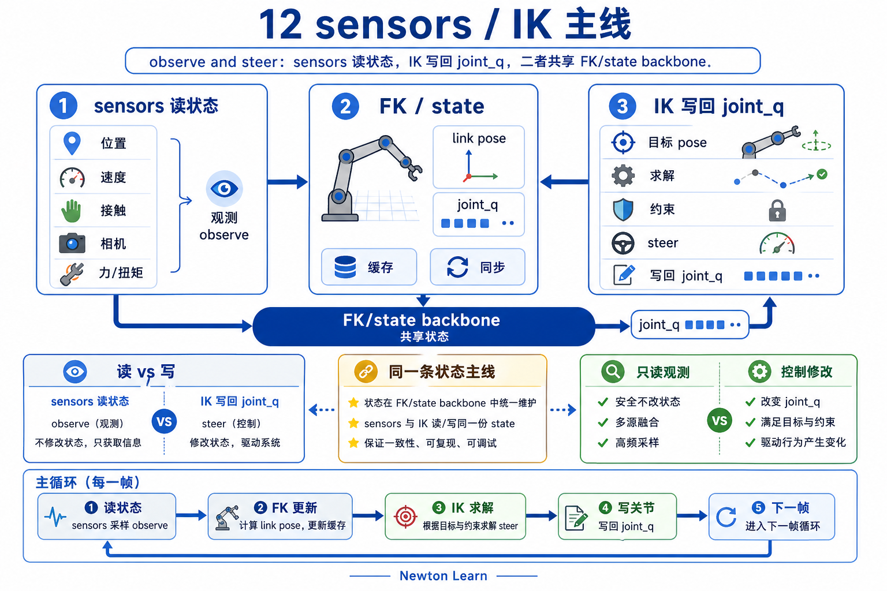
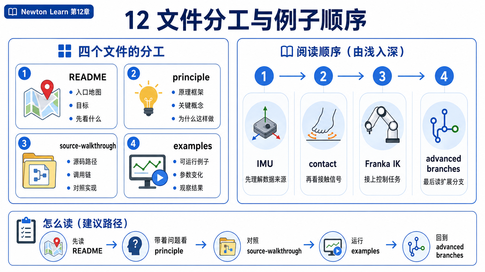
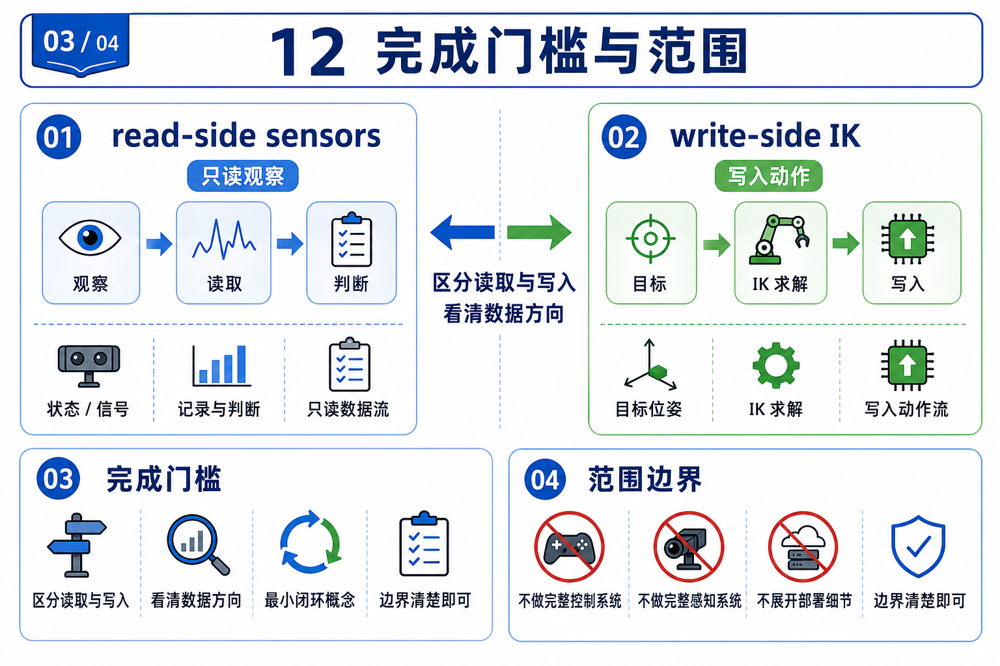

# 12 传感器与逆运动学：observe and steer



chapter 11 刚把一个 solver step 里的状态流讲顺。chapter 12 的自然下一问不是“再背几类 sensor”和“再学一种 optimizer”，而是更直接的一句:

```text
状态既然已经存在，
我怎样读它？又怎样朝目标去改它？
```

这就是本章的统一标题:

- sensors = `read-side adapters`，把 state / contacts / rendered scene 变成观测量。
- IK = `write-side adapters`，把 task-space goal 变成 joint-space 解。

第一遍只守住这条 shared backbone:

```text
joint_q
-> eval_fk
-> state.body_q / state.body_qd / state.body_qdd / contacts
```

这里最好把它读成一条 shorthand，而不是字面上“一次 `eval_fk(...)` 直接产出后面四样东西”。更细的拆法放在 `principle.md`，但 first pass 先记这条中轴就够了。

然后两边分叉:

- sensors 从这条中轴往外读。
- IK 从任务目标沿着这条中轴往回写到 `joint_q`。

所以这章不是 `sensor chapter + IK chapter`，而是一个更短的主题:

```text
observe and steer
```

## 文件分工



- `README.md`: 建立 chapter 12 的问题、范围、阅读顺序、完成门槛。
- `principle.md`: 先讲 `read-side vs write-side`，再讲 shared FK/state backbone 和 update order。
- `source-walkthrough.md`: beginner-safe main walkthrough。第一遍先沿 `sensor_imu -> sensor_contact side branch -> ik_franka` 走完一条主线。
- `examples.md`: 给每个 upstream example 分配一个唯一 teaching job，避免 flatten 成 demo catalog。

这轮先不写 deep walkthrough。

## 例子分工

| 例子 | 这章给它的唯一 job | 角色 | 何时使用 |
|------|---------------------|------|----------|
| `newton/examples/sensors/example_sensor_imu.py` | mainline read anchor。讲清 state-based sensor 怎样从 body state 读出观测 | 第一主例子 | 第一遍必看 |
| `newton/examples/sensors/example_sensor_contact.py` | timing side branch。证明有些 sensor 读的是 `contacts` 侧账本，不是只读 `body_q` | 必要分支 | mainline 稳后立刻看 |
| `newton/examples/ik/example_ik_franka.py` | mainline write anchor。讲清 task-space target 怎样通过 objective 和 solver 写回 `joint_q` | 第一主例子 | 第一遍必看 |
| `newton/examples/ik/example_ik_h1.py` | scaling branch。证明同一套 IK API 可以同时约束多个 end-effector | 第二遍扩展 | `ik_franka` 稳后再看 |
| `newton/examples/sensors/example_sensor_tiled_camera.py` | rendered-sensor branch。说明有些观测来自 rendered scene，而不是几个低维 state array | 高级分支 | 最后再看 |
| `newton/examples/ik/example_ik_custom.py` | custom-objective branch。说明 objective 是可扩展 residual block | 高级分支 | 最后再看 |
| `newton/examples/ik/example_ik_cube_stacking.py` | systems branch。说明 IK 输出还能继续喂给更大的 task / control loop | 高级分支 | 最后再看 |

## 本章目标

- 把 chapter 12 的核心比较轴立成 `read-side` 和 `write-side`，而不是 `sensors list` 和 `IK solver list`。
- 让你记住 sensors 和 IK 共享同一条 articulated-state backbone，而不是两个互不相干的系统。
- 讲清三个 first-pass 必须记住的 update-order gotcha: `SensorIMU/body_qdd`、`SensorContact/update_contacts`、`IK/eval_fk/objectives`。
- 给 chapter 12 留下一条稳定的 walkthrough spine，后面看 tiled camera、多目标 IK、custom objective 时都能回到同一张底图。

## 本章范围

- 主教学锚点只守住三个 examples: `example_sensor_imu.py`、`example_sensor_contact.py`、`example_ik_franka.py`。
- 主源码锚点只守住六个文件: `newton/sensors.py`、`newton/ik.py`、`newton/_src/sensors/sensor_imu.py`、`newton/_src/sensors/sensor_contact.py`、`newton/_src/sim/ik/ik_solver.py`、`newton/_src/sim/ik/ik_objectives.py`。
- 第一遍只覆盖 shared backbone、example roles、update order、以及一条 beginner-safe source walkthrough。

## 本章明确不做什么

- 不把这章拆成“两篇互不来往的小章节”。
- 不把 sensors 写成 constructor args tour。
- 不把 IK 写成 `LM vs L-BFGS`、`analytic vs autodiff` 的 optimizer catalog。
- 不把 `sensor_tiled_camera`、`ik_custom`、`ik_cube_stacking` 强塞进 first-pass mainline。

## 前置依赖

- 建议先读完 `05_rigid_articulation`。如果你还不稳 `joint_q`、link、body frame 这些词，先回去补这章。
- 默认你已经接受 chapter 08/09 的最小 contract: scene 会持续推进 state，而 contact / control / solve 会围绕这个 state 工作。
- chapter 11 提供的是“状态已经存在，接下来要怎么用”的视角延续；不要求你会 MPM 细节，但建议带着那条 dataflow 脑图进入 chapter 12。

## 完成门槛



```text
[ ] 我能用一句话解释 sensors 为什么是 read-side adapters，IK 为什么是 write-side adapters
[ ] 我能顺着说出本章 shared backbone，并知道那条 `joint_q -> FK/state pipeline -> body/account ledgers` 只是 shorthand，不是单个调用返回一切
[ ] 我能解释为什么 SensorIMU 需要 body_qdd，为什么 SensorContact 需要 update_contacts，为什么 IK 仍然依赖 eval_fk 和 objectives
[ ] 我能说出 `sensor_imu`、`sensor_contact`、`ik_franka` 三个主锚点各自负责什么
[ ] 我不会再把 chapter 12 误读成一个平铺的 sensor / IK feature catalog
```

## 阅读顺序

1. 先读本文件，把本章问题改写成“once state exists, how do I read it and steer it”。
2. 再读 `principle.md`，把 `read-side vs write-side` 和 update-order 先讲顺。
3. 再读 `source-walkthrough.md`，沿 `sensor_imu -> sensor_contact side branch -> ik_franka` 真正串一次源码。
4. 最后用 `examples.md` 按角色去看 seven examples，不要一开始就把它们混成平面 catalog。

如果你更习惯先看代码，可以把第 2 步和第 3 步对调；但第一遍不要跳过其中任一份。

## 预期产出

- `principle.md`: 讲清 read-side / write-side 对称关系，以及 shared FK/state backbone。
- `source-walkthrough.md`: 留下一条稳定的 main walkthrough，把 `observe -> timing branch -> steer` 串进源码。
- `examples.md`: 给 seven upstream anchors 各分配唯一 teaching job，并明确 advanced branches。

读完 chapter 12 后，你最该带走的不是一串 API 名字，而是这句更短的话:

```text
sensors 从已有状态里读出观测，
IK 把任务空间目标写回 joint-space 解；
两者都依赖同一条 FK / body-state backbone。
```
