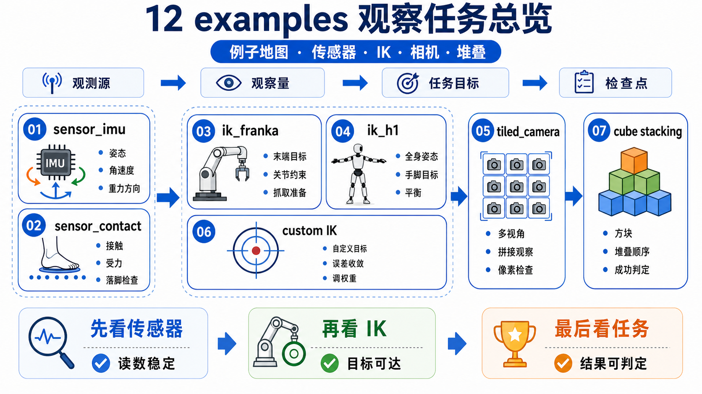
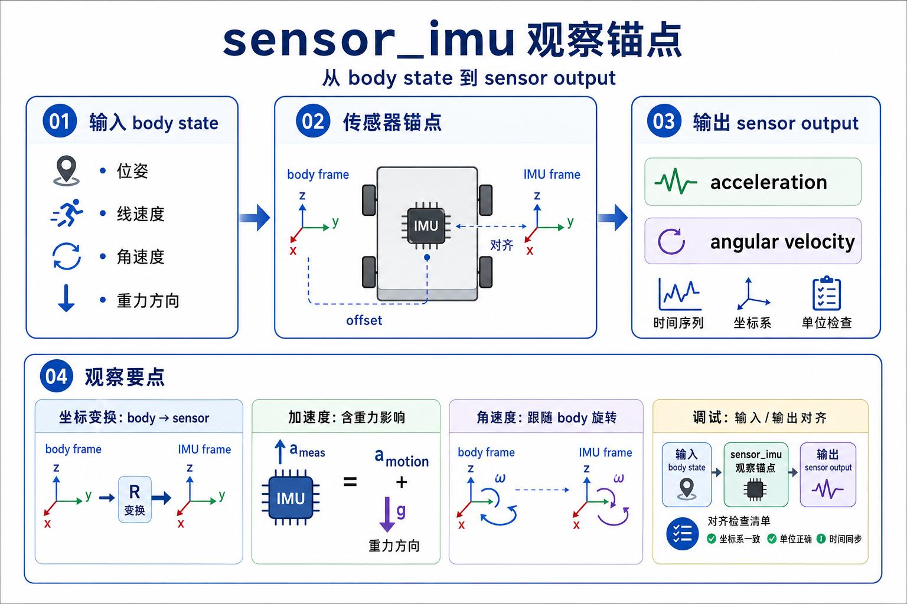
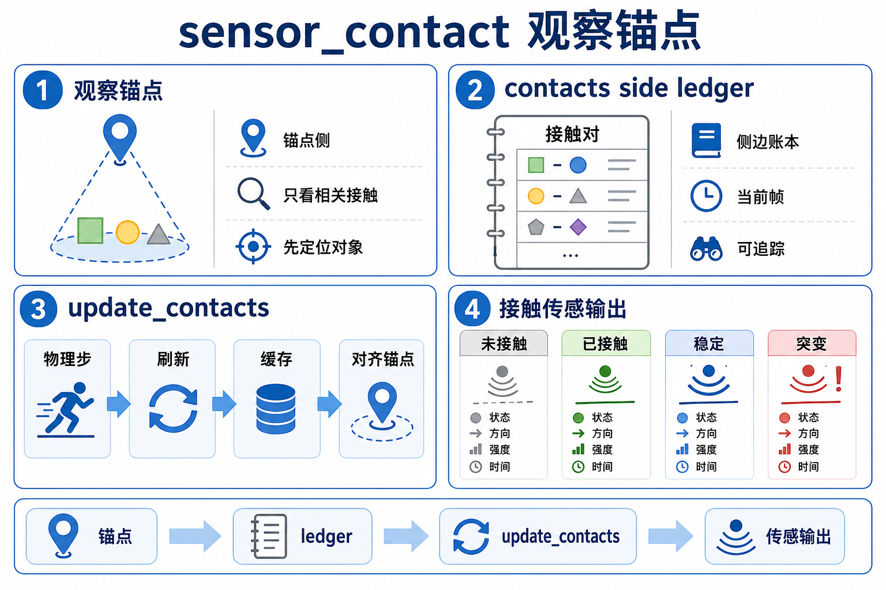
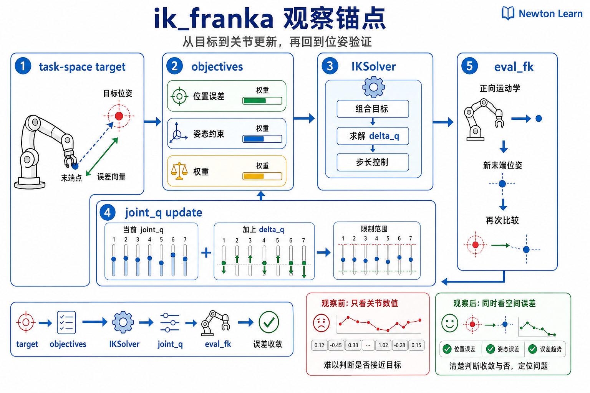
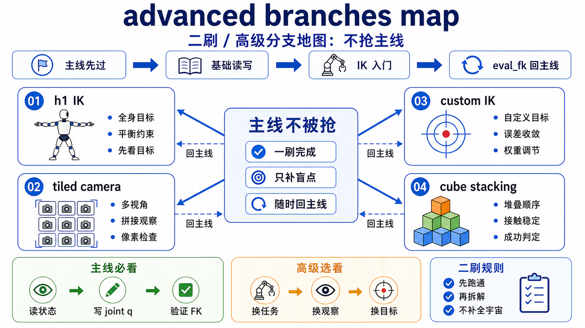
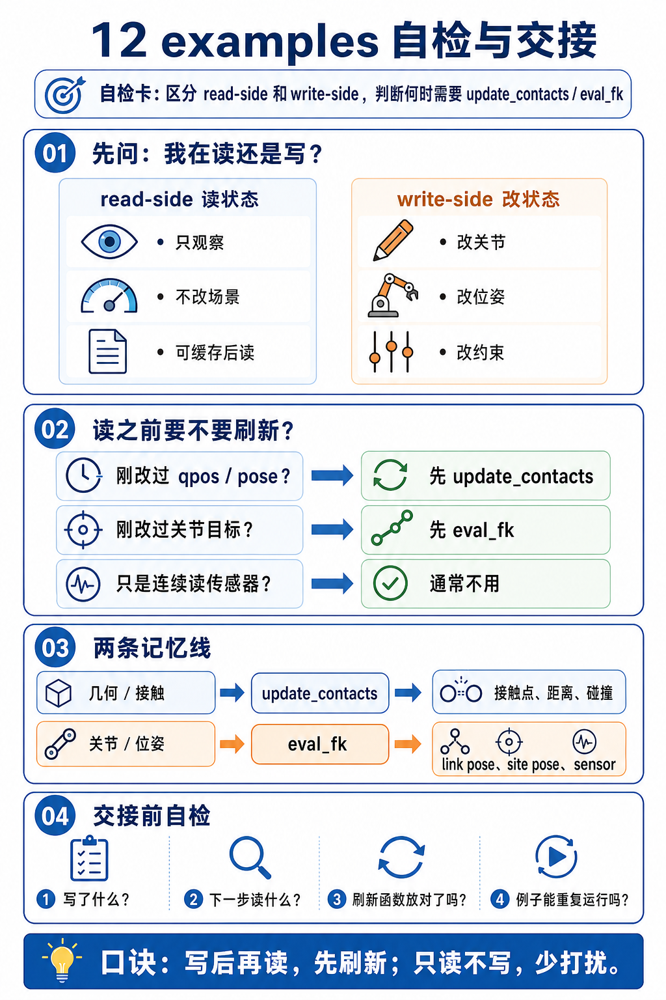

# 12 传感器与逆运动学例子观察单



这页不是 `sensors + IK demos catalog`。它只做一件事: **给 chapter 12 的 seven upstream anchors 各分配一个明确 teaching job。**

所以第一遍不要把这些例子混着跑。每个例子只负责回答一个问题。

## 总表

| 例子 | 这页给它的唯一 job | 角色 | 主看点 |
|------|---------------------|------|--------|
| `newton/examples/sensors/example_sensor_imu.py` | 建立最干净的 read-side anchor | mainline | `solver.step -> swap -> imu.update` |
| `newton/examples/sensors/example_sensor_contact.py` | 讲清 `contacts` side ledger 和 update timing | necessary side branch | `solver.update_contacts -> sensor.update` |
| `newton/examples/ik/example_ik_franka.py` | 建立最干净的 write-side anchor | mainline | `objectives -> IKSolver.step -> eval_fk` |
| `newton/examples/ik/example_ik_h1.py` | 证明同一套 IK API 能同时管多个末端 | second-pass branch | 多个 `IKObjectivePosition/Rotation` |
| `newton/examples/sensors/example_sensor_tiled_camera.py` | 说明有些 measurement 来自 rendered scene | advanced branch | `SensorTiledCamera.update(...)` |
| `newton/examples/ik/example_ik_custom.py` | 说明 objective 是可扩展 residual block | advanced branch | 自定义 `IKObjective` |
| `newton/examples/ik/example_ik_cube_stacking.py` | 说明 IK 输出还能喂给更大的 control/task loop | advanced systems branch | `ik_solver.step -> control.joint_target_pos` |

## Mainline Anchor 1: `example_sensor_imu.py`



**唯一 job**

把 chapter 12 的 read-side mainline 先立起来，让你看到最干净的一种 sensor 更新方式:

```text
solver produces state
-> SensorIMU reads that state
-> measurement is expressed in the sensor frame
```

**建议入口**

```bash
python -m newton.examples sensor_imu
```

**先盯哪几处**

- `self.imu = newton.sensors.SensorIMU(self.model, self.imu_sites)`。
- `self.state_0 = self.model.state()` / `self.state_1 = self.model.state()`。
- `self.solver.step(...)` 和紧接着的 state swap。
- `self.imu.update(self.state_0)`。
- `self.imu.accelerometer` 怎样被拿去着色。

**你要从它身上验证什么**

- `SensorIMU` 读的是 solver 刚刚更新好的 body state，不是单独跑一份 dynamics。
- `imu.update(...)` 发生在 swap 之后，说明它要读的是当前最新 state。
- measurement 可以再被下游逻辑消费，这里用的是颜色映射。

**不要拿它做什么**

- 不要把它读成“如何调 IMU 可视化参数”的例子。
- 不要第一遍就钻进加速度公式；它的 job 是先让 read-side identity 稳下来。

## Necessary Side Branch: `example_sensor_contact.py`



**唯一 job**

证明 chapter 12 里不是所有 sensor 都只读 `body_q` / `body_qd`；有些读的是 `contacts` side ledger，而且 timing 很关键。

**建议入口**

```bash
python -m newton.examples sensor_contact
```

**先盯哪几处**

- `SensorContact(self.model, ...)` 的创建时机。
- `self.contacts = Contacts(... requested_attributes=...)`。
- `self.solver.update_contacts(self.contacts, self.state_0)`。
- `self.plate_contact_sensor.update(self.state_0, self.contacts)`。
- `force_matrix` 和 `total_force` 怎样被下游逻辑消费。

**你要从它身上验证什么**

- contact sensor 的关键输入不是 `joint_q`，而是 `contacts.force`。
- `update_contacts(...)` 是真正让接触账本变新的那一步。
- `state` 仍然参与 sensing object transform 的更新，所以这是“state + contacts”双输入分支。

**不要拿它做什么**

- 不要把它当成“接触 API 总览”。
- 不要跳过 update timing 去记输出矩阵形状；顺序比表结构更重要。

## Mainline Anchor 2: `example_ik_franka.py`



**唯一 job**

把 chapter 12 的 write-side mainline 先立起来，让你看到最短的一条 IK 闭环:

```text
task-space target
-> objectives
-> IKSolver.step
-> updated joint_q
-> eval_fk for viewer/state consumers
```

**建议入口**

```bash
python -m newton.examples ik_franka
```

**先盯哪几处**

- `self.pos_obj`、`self.rot_obj`、`self.obj_joint_limits`。
- `self.joint_q = self.model.joint_q.reshape((1, ...))`。
- `self.solver = ik.IKSolver(...)`。
- `_push_targets_from_gizmos()`。
- `self.solver.step(self.joint_q, self.joint_q, iterations=self.ik_iters)`。
- render 里的 `newton.eval_fk(...)`。

**你要从它身上验证什么**

- IK 不直接改 link pose；它先把目标写成 objectives。
- solver 更新的是 `joint_q`。
- 外部 render 仍然要用 `eval_fk(...)` 刷新 `state.body_q`，这说明 write-side 没有绕开 shared backbone。

**不要拿它做什么**

- 不要第一遍就把它读成 LM 参数教程。
- 不要把 gizmo 交互当成重点；gizmo 只是一个方便推送 target 的输入口。

## Second-Pass Branch: `example_ik_h1.py`



**唯一 job**

说明 `ik_franka` 不是只会解一个 TCP。相同的 write-side pattern 可以同时约束多只手脚。

**建议入口**

```bash
python -m newton.examples ik_h1
```

**先盯哪几处**

- `self.ee = [("left_hand", ...), ...]` 这组 end-effector 列表。
- 循环里创建的多个 `IKObjectivePosition` / `IKObjectiveRotation`。
- `objectives=[*self.pos_objs, *self.rot_objs, self.obj_joint_limits]`。
- render 里多个 gizmo 的回写与 snap。

**你要从它身上验证什么**

- chapter 12 的主线没有变，仍然是 `target -> objectives -> solver -> joint_q`。
- 变化只在于 objective 数量增加了，problem framing 没变。

**不要拿它做什么**

- 不要把它当成新的 chapter mainline。
- 不要第一遍就把注意力全放在 humanoid asset 上；这里的重点是多 end-effector scaling。

## Advanced Branch: `example_sensor_tiled_camera.py`

**唯一 job**

说明 read-side adapters 不一定都输出低维向量；有些 sensor 读的是 rendered scene，并输出高带宽图像张量。

**建议入口**

```bash
python -m newton.examples sensor_tiled_camera
```

**先盯哪几处**

- `self.tiled_camera_sensor = SensorTiledCamera(model=self.model)`。
- `newton.eval_fk(self.model, self.state.joint_q, self.state.joint_qd, self.state)`。
- `self.tiled_camera_sensor.update(...)` 的输入: state、camera transforms、camera rays。
- 输出图像 buffer 怎样再被 UI / texture 消费。

**你要从它身上验证什么**

- sensor family 里还有一条“rendered scene -> images”的读分支。
- 这条分支仍然依赖同一个 scene/state backbone，只是 measurement 形式更宽。

**不要拿它做什么**

- 不要把它塞进第一遍 main walkthrough。
- 不要第一遍就试图读完所有 image output mode。

## Advanced Branch: `example_ik_custom.py`

**唯一 job**

说明 objective 不是封闭白盒；你可以自己定义 residual block，再把它挂进同一个 IK solve loop。

**建议入口**

```bash
python -m newton.examples ik_custom
```

**先盯哪几处**

- `class CollisionSphereAvoidObjective(ik.IKObjective)`。
- `compute_residuals(...)` 怎样把 obstacle 约束写进 residual。
- `objectives=[self.pos_obj, self.rot_obj, *self.collision_objs, self.obj_joint_limits]`。
- `set_obstacle_center(...)` 怎样把 gizmo 更新重新写回 objective state。

**你要从它身上验证什么**

- IKObjective 真正的扩展点是 residual definition，而不是单纯多几个参数。
- custom branch 仍然遵守 chapter 12 主线: 目标先写成 objective，再通过 FK/solver 回到 `joint_q`。

**不要拿它做什么**

- 不要第一遍就把 softplus penalty、LBFGS line search 作为学习入口。
- 不要用它替代 `ik_franka` 做 first pass。

## Advanced Systems Branch: `example_ik_cube_stacking.py`

**唯一 job**

说明 IK 不只服务互动 gizmo；它还能当作更大任务系统中的中间写入器，把 task-space plan 持续翻译成 `control.joint_target_pos`。

**建议入口**

```bash
python -m newton.examples ik_cube_stacking --world-count 16
```

**先盯哪几处**

- `setup_ik()` 里 `self.pos_obj` / `self.rot_obj` / `self.obj_joint_limits`。
- `set_target_pose_kernel(...)` 怎样从任务阶段生成 EE targets。
- `self.ik_solver.step(self.joint_q_ik, self.joint_q_ik, iterations=self.ik_iters)`。
- `wp.copy(dest=joint_target_pos_view[:, :7], src=self.joint_q_ik[:, :7])`。
- physics simulate 再怎样消费这些 joint targets。

**你要从它身上验证什么**

- IK 输出可以继续当控制参考，而不是只停留在可视化 pose。
- 这说明 chapter 12 的 write-side adapter 还能嵌进更大的 task loop。

**不要拿它做什么**

- 不要把它当第一份 IK walkthrough。
- 不要在 mainline 里展开任务调度 kernel 和多 world 系统细节；它们是 systems branch。

## 推荐顺序

1. 先看 `example_sensor_imu.py`。
2. 紧接着补 `example_sensor_contact.py`。
3. 再看 `example_ik_franka.py`。
4. 第二遍再看 `example_ik_h1.py`。
5. 最后按需要进入 `sensor_tiled_camera -> ik_custom -> ik_cube_stacking` 三条高级分支。

这个顺序最稳，因为它先建立最干净的 read-side anchor，再马上补上 contact timing 这个必须知道的 side branch，然后再切到 write-side mainline，最后才扩展到宽传感器、多末端、custom objective 和 systems loop。

## 自检



- 现在只看 `example_sensor_imu.py`，你能不能不展开数学，也说清它为什么是最干净的 read-side anchor？
- 现在只看 `example_sensor_contact.py`，你能不能解释为什么 `solver.update_contacts(...)` 不能省？
- 现在只看 `example_ik_franka.py`，你能不能解释为什么 render 里还要再 `eval_fk(...)` 一次？
- 你能不能明确指出哪三个例子是 first pass，哪三个例子应该留到 advanced branch？
