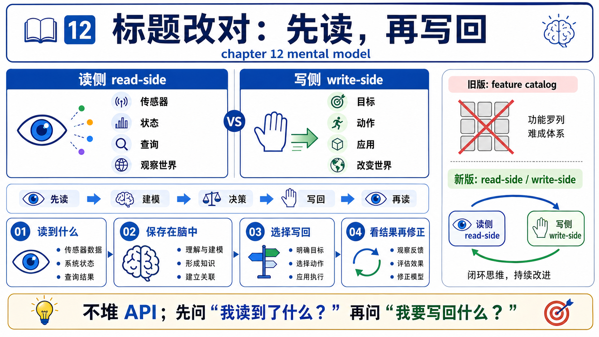
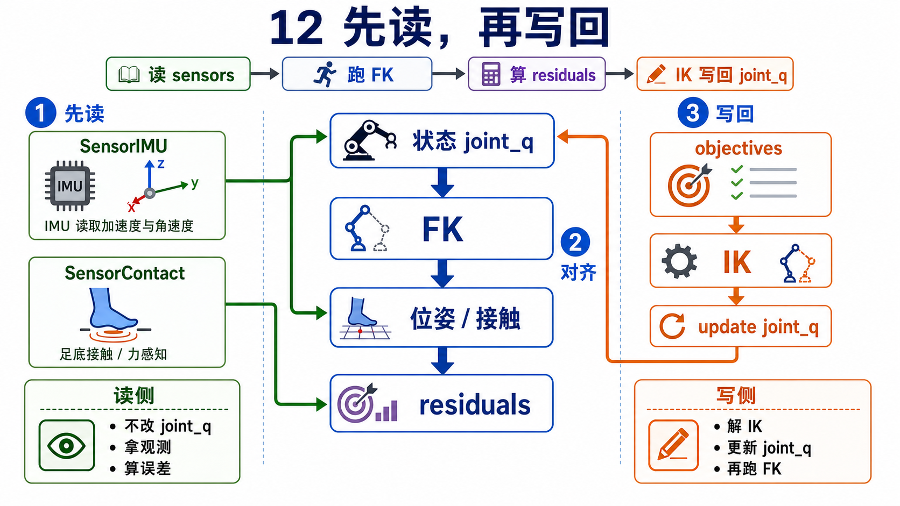
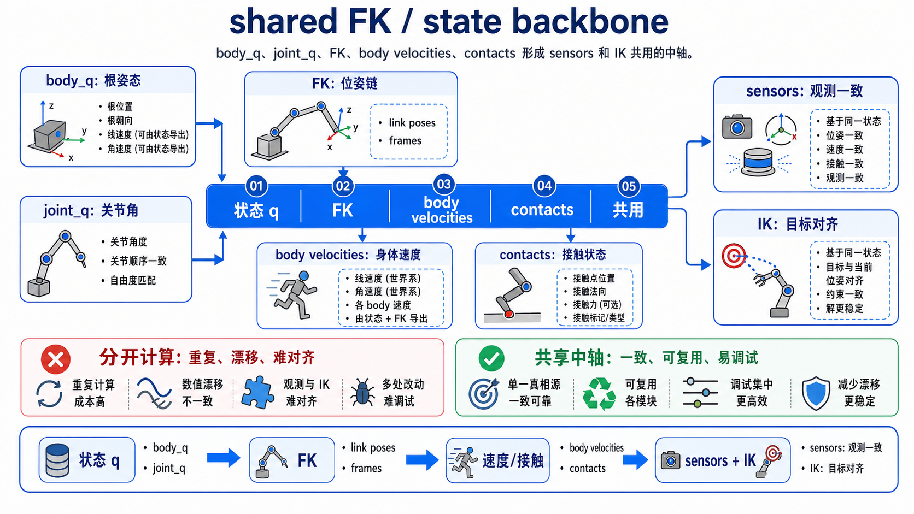
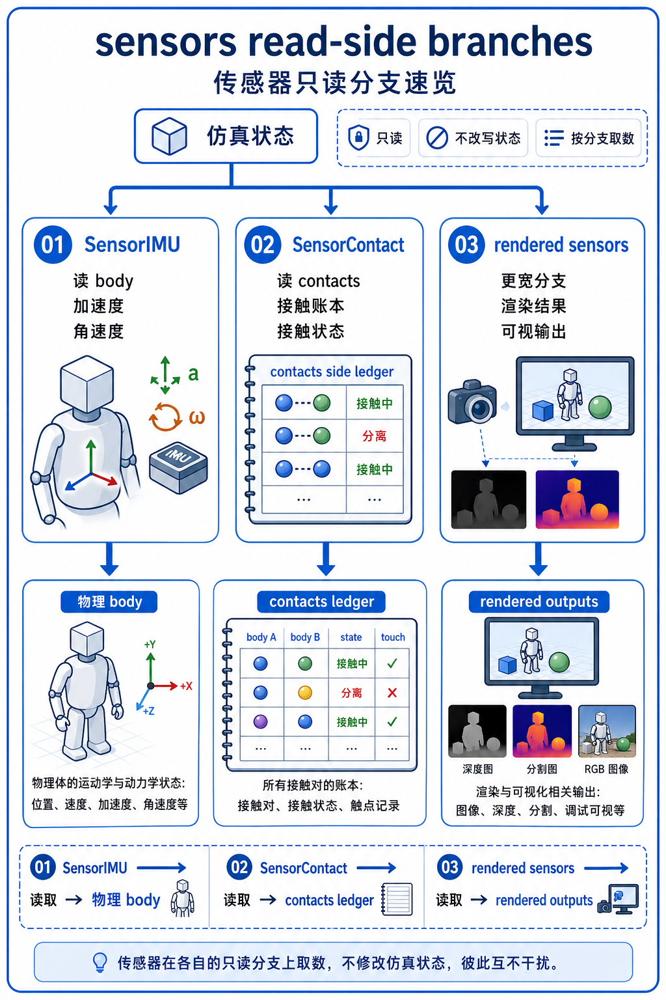
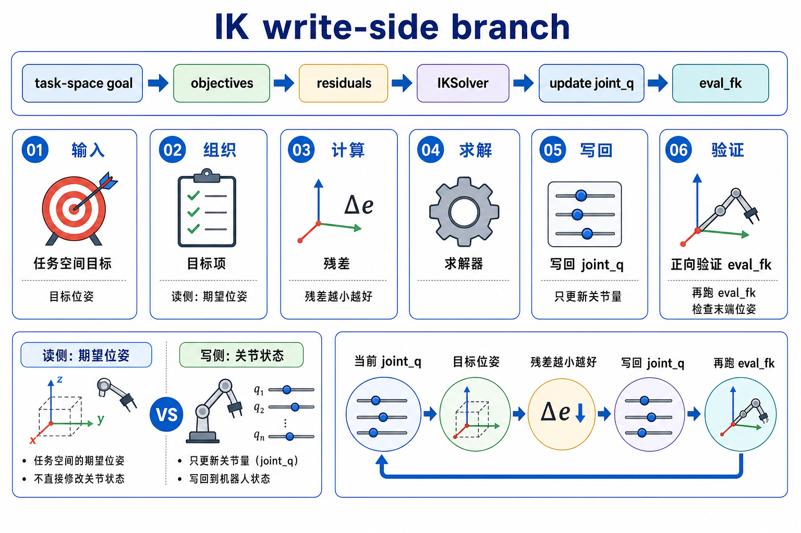
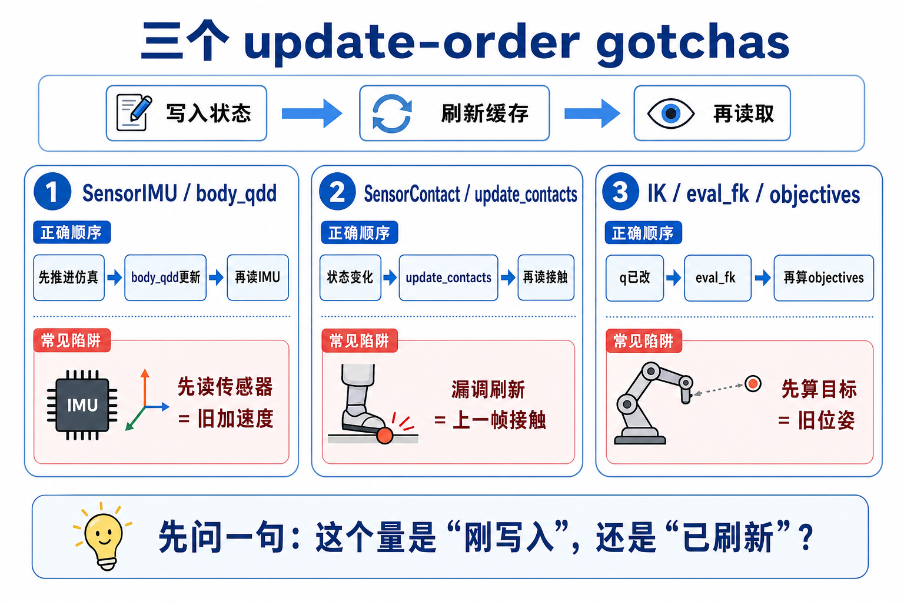
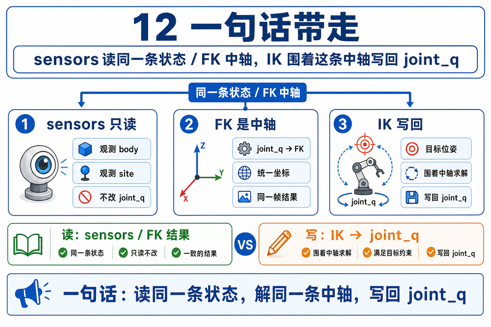

# 12 传感器与逆运动学原理主线：先读，再写回

## 0. 先把 chapter 12 的标题改对



chapter 12 最容易被写坏成两个互不来往的小标题:

```text
传感器大全
+
逆运动学大全
```

这个拆法不稳，因为它让你看不见两者共享的 prerequisite。

更稳的开场只有一句:

```text
状态既然已经存在，
我怎样读它？又怎样朝目标去改它？
```

这就是本章的 read/write 对称关系:

- sensors = `read-side adapters`
- IK = `write-side adapters`

它们都不是孤立的“功能模块 catalog”；它们都站在同一条 articulated-state backbone 上工作。

## 1. `read-side` 和 `write-side` 到底在说什么



先把两边的 job 说短:

```text
Sensors read the world.
IK steers the body toward a goal.
```

### 1.1 sensors 为什么叫 `read-side adapters`

sensor 在 Newton 里最稳的身份，不是“再跑一份物理”，而是:

```text
把已有 simulation state 重新组织成 measurement。
```

这句话有三层意思:

- sensor 读的是已经存在的东西，比如 body pose、body velocity、body acceleration、contacts、或 rendered scene。
- sensor 会换一种表述方式输出它们，比如 IMU 的加速度计/陀螺仪读数、contact sensor 的净接触力、camera 的图像张量。
- sensor 本身通常不决定系统朝哪走；它更像给控制、估计、可视化或测试提供观测接口。

所以第一遍看 sensors，不要先背 `IMU / Contact / Camera / Raycast` 的类型表，而要先问:

```text
它在读哪份已有账本？
又把它改写成了什么 measurement？
```

### 1.2 IK 为什么叫 `write-side adapters`

IK 的 job 则刚好反过来:

```text
把 task-space 的“我想让手到哪里”
改写成 joint-space 的“各个关节该是多少”。
```

这也有三层意思:

- 用户或任务逻辑给的是 link pose goal，而不是每个 joint 的数值。
- objective 把这些 goal 写成 residual。
- solver 迭代更新的是 `joint_q`，所以最终写回的是 joint-space 解，而不是直接改 `body_q`。

这里的 `residual`，第一遍先把它读成“当前姿态和目标姿态之间那份还没消掉的误差”。solver 的工作，就是尽量把这些误差往零推。

换句话说，IK 不是跳过 FK 的捷径，而是围着 FK 反复做这件事:

```text
propose joint_q
-> evaluate FK result
-> compare against task-space goal
-> update joint_q
```

## 2. shared FK/state backbone 才是这章真正的中轴



chapter 12 最重要的记忆式是:

```text
joint_q
-> eval_fk
-> state.body_q / state.body_qd / state.body_qdd / contacts
```

这里最好把它读成一条 `shared backbone shorthand`，而不是字面上“单次 `eval_fk` 调用直接产出四样东西”。更稳的拆法是:

- `joint_q` 给出 articulation 的当前配置。
- `eval_fk` 把这份配置展开成 body-level pose / velocity，也就是 `state.body_q`、`state.body_qd`。
- solver-side state update 再让 `state.body_qdd` 可用；contact pipeline 则让 `contacts` 这份更靠后的账本可用。

第一遍最值得盯的不是哪一步是哪个 kernel，而是 ownership:

| 对象 | 第一遍怎么读 | 谁最关心它 |
|------|--------------|------------|
| `joint_q` | articulation 的写入点 | IK solver |
| `state.body_q` | 各 body 的世界位姿 | sensors、viewer、IK objectives |
| `state.body_qd` | 各 body 的空间速度 | IMU、viewer、下游逻辑 |
| `state.body_qdd` | 各 body 的空间加速度 | IMU |
| `contacts` / `contacts.force` | 接触侧账本 | contact sensor、viewer、测试 |

这张表也解释了为什么 sensors 和 IK 不该被强拆开:

- sensors 需要这些派生状态去做“读取”。
- IK 需要这些派生状态去判断“当前 joint_q 离目标还有多远”。

它们都没有绕开 FK/state backbone。

## 3. sensors 是从同一条中轴分出去的几条读分支



### 3.1 `SensorIMU`: 最干净的 body-state read branch

`example_sensor_imu.py` 是 chapter 12 最好的 read-side anchor，因为它几乎把 sensor 的角色写到了最简单:

```python
self.imu = newton.sensors.SensorIMU(self.model, self.imu_sites)
...
self.solver.step(self.state_0, self.state_1, self.control, None, self.sim_dt)
self.state_0, self.state_1 = self.state_1, self.state_0
self.imu.update(self.state_0)
```

它对应的人话是:

- solver 先把 state 推到下一步。
- `SensorIMU` 再从最新的 `state_0` 里读数据。
- 输出不是原始 `body_q` / `body_qd` / `body_qdd`，而是 sensor frame 下的 accelerometer / gyroscope。

`sensor_imu.py` 内部也把 dependency 写得很直白:

```python
inputs=[
    state.body_q,
    state.body_qd,
    state.body_qdd,
]
```

所以 chapter 12 里 IMU 最该教会你的不是公式，而是这句:

```text
IMU 不是自己“感知”世界，
它是在已有 body state 上做 frame conversion 和 measurement packaging。
```

### 3.2 `SensorContact`: 读的是 `contacts` side ledger，不只是 `body_q`

contact sensor 是本章必须插入的一条 side branch，因为它专门提醒你:

```text
并不是所有 sensor 都只靠 body pose / velocity 就能更新。
```

`SensorContact` 读的是接触侧账本，尤其是 `contacts.force`。

源码文档已经把顺序写死了:

```python
"""
Call solver.update_contacts(contacts) before sensor.update()
so that contact forces are current.
"""
```

这就是为什么 `example_sensor_contact.py` 的稳定顺序是:

```python
self.solver.step(self.state_0, self.state_0, self.control, None, self.sim_dt)
self.solver.update_contacts(self.contacts, self.state_0)
...
self.plate_contact_sensor.update(self.state_0, self.contacts)
```

这里的重点不是 API 名字，而是账本分工:

- `state.body_q` 仍然有用，因为 sensor 也会更新 sensing object 的世界变换。
- 真正的接触力读数来自 `contacts.force`。

所以 `SensorContact` 的教学价值不是“又多一种 sensor”，而是它让你第一次明确看到:

```text
有些 measurement 读的是 body state，
有些 measurement 读的是 contacts side ledger。
```

### 3.3 rendered sensors 是另一条更宽的 read branch

`example_sensor_tiled_camera.py` 不该塞进 first pass mainline，但它很适合在第二遍补一句:

```text
有些 sensor 读的不是低维 state array，
而是渲染过的 scene view。
```

所以 chapter 12 的 sensor family，不该背成一张类型菜单，而该背成三类 read source:

- articulated body state
- contacts side ledger
- rendered scene

## 4. IK 是围着 FK 回写 `joint_q` 的 write branch



### 4.1 task-space goal 先被写成 objective

`example_ik_franka.py` 的 mainline 很干净:

```python
self.pos_obj = ik.IKObjectivePosition(...)
self.rot_obj = ik.IKObjectiveRotation(...)
self.obj_joint_limits = ik.IKObjectiveJointLimit(...)

self.solver = ik.IKSolver(
    model=self.model,
    n_problems=1,
    objectives=[self.pos_obj, self.rot_obj, self.obj_joint_limits],
)
```

这段 setup 的人话不是“创建三种 class”，而是:

- 位置目标说“TCP 要到哪里”。
- 旋转目标说“TCP 要朝哪里”。
- joint limit 说“别为了解 TCP 把关节打穿边界”。

然后每一帧再把最新 target push 进 objective:

```python
self.pos_obj.set_target_position(0, pos)
self.rot_obj.set_target_rotation(0, ...)
```

所以 first pass 下，IK 最稳的读法不是 optimizer，而是:

```text
IK = 把“我想要的 end-effector pose”写成一组 residual blocks。
```

### 4.2 objective 读的仍然是 FK 结果，不是直接改 body

`IKObjectivePosition` 和 `IKObjectiveRotation` 的核心都不是“直接拖动 link”，而是:

- 先拿 FK 产出的 `body_q`。
- 再从里面抽当前 link pose。
- 再和 target 做差，写到 residual buffer。

`IKObjectivePosition.compute_residuals(...)` 的接口已经把这个依赖说明白了:

```python
def compute_residuals(
    body_q,
    joint_q,
    model,
    residuals,
    start_idx,
    problem_idx,
):
```

position objective 内部取的是:

```python
body_tf = body_q[row, link_index]
```

rotation objective 同样也是先取 `body_q[row, link_index]`，再和 target quaternion 比较。

所以 chapter 12 的第二条关键句是:

```text
IK 不会跳过 FK。
它靠 FK 把 candidate joint_q 变成 body pose，
再由 objectives 判断“还差多少”。
```

### 4.3 solver 真正写回的是 `joint_q`

`IKSolver.step(...)` 的 public contract 很短:

```python
self.solver.step(self.joint_q, self.joint_q, iterations=self.ik_iters)
```

注意它的输入输出都是 `joint_q`。这意味着:

- solver 优化的是 joint coordinates。
- 结果先落在 `joint_q_out`。
- external `State` 并不会因为你跑完 IK 自动刷新。

这就是 write-side adapter 的本质: IK 的写入点在 `joint_q`，不是 `state.body_q`。

## 5. 三个 update-order gotcha 必须一次记住



### 5.1 `SensorIMU` 和 `body_qdd`

`SensorIMU` 会在构造时请求 `body_qdd`:

```python
self.model.request_state_attributes("body_qdd")
```

而 `update(...)` 会直接检查:

```python
if state.body_qdd is None:
    raise ValueError(...)
```

这带来 chapter 12 的第一条顺序规则:

```text
先创建 SensorIMU，再创建 State。
```

否则 `model.state()` 生成出来的 state 可能没分配 `body_qdd`，后面 IMU 更新就会报错。

更稳的心智模型是:

- `SensorIMU` 不只是声明“我要一个 sensor”。
- 它还顺手声明“后面的 state 需要带 `body_qdd` 这份账本”。

### 5.2 `SensorContact` 和 `update_contacts`

`SensorContact` 的 construction/update order 也有两层:

1. 最好先创建 `SensorContact`，再创建 `Contacts`，这样 sensor 请求的 `force` attribute 会被自动带上。
2. 每次真正读数前，要先 `solver.update_contacts(...)`，再 `sensor.update(...)`。

这两层分别防的是两类错误:

- contacts 压根没分配 `force`。
- contacts 分配了 `force`，但里面还是上一步或未更新的数据。

所以最稳的模板只有这一种:

```python
sensor = SensorContact(model, ...)
contacts = model.contacts()

solver.step(state_0, state_0, control, None, dt)
solver.update_contacts(contacts, state_0)
sensor.update(state_0, contacts)
```

### 5.3 IK、`eval_fk` 和 objectives 的前后关系

IK 这边最容易犯的错是把 `solver.step(...)` 想成“已经把世界状态全改好了”。

其实更准确的顺序是:

1. 先把最新 task-space goal 推进 objective。
2. `IKSolver.step(...)` 在内部反复做 `joint_q -> FK -> residual -> update`。
3. solver 最终写回的是 `joint_q`。
4. 如果外部 viewer、logger、或下一段逻辑还要读 `state.body_q`，你要再显式 `eval_fk(...)`。

`example_ik_franka.py` 的 render 正是这么做的:

```python
newton.eval_fk(self.model, self.model.joint_q, self.model.joint_qd, self.state)
body_q_np = self.state.body_q.numpy()
```

这条规则很关键，因为它把 read-side 和 write-side 再次接回同一条 backbone:

```text
IK 写回 joint_q
-> eval_fk 刷新 body state
-> viewer / sensor / downstream logic 再继续读取
```

这也是为什么 `example_ik_cube_stacking.py` 能把 IK 结果继续喂进 `control.joint_target_pos`，再进入更大的任务循环: IK 的输出本来就是一份新的 joint-space 命令或解，不是直接改好的终局世界。

## 6. 第一遍只带走一句话也够



```text
sensors 负责从已有 state / contacts / rendered scene 里读出 measurement，
IK 负责把 task-space goal 写回 joint-space 解；
两者都依赖同一条 FK / body-state backbone，
而 update order 决定你读到的是不是“这一步真正有效的账本”。
```

如果这句话已经稳了，下一步就去读 `source-walkthrough.md`，把这条 read/write 对称关系真正串进例子和源码。
