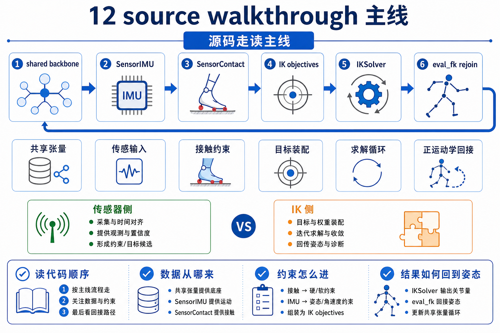
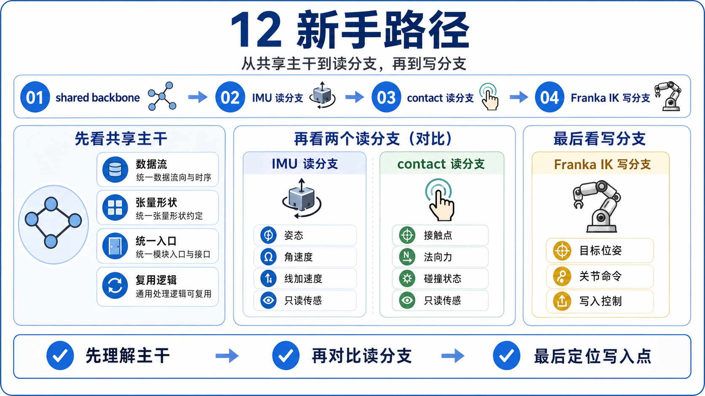
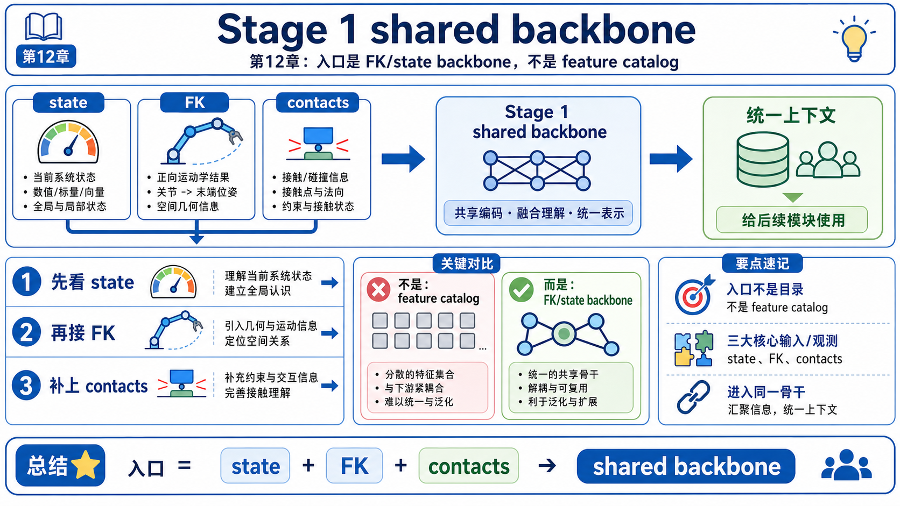
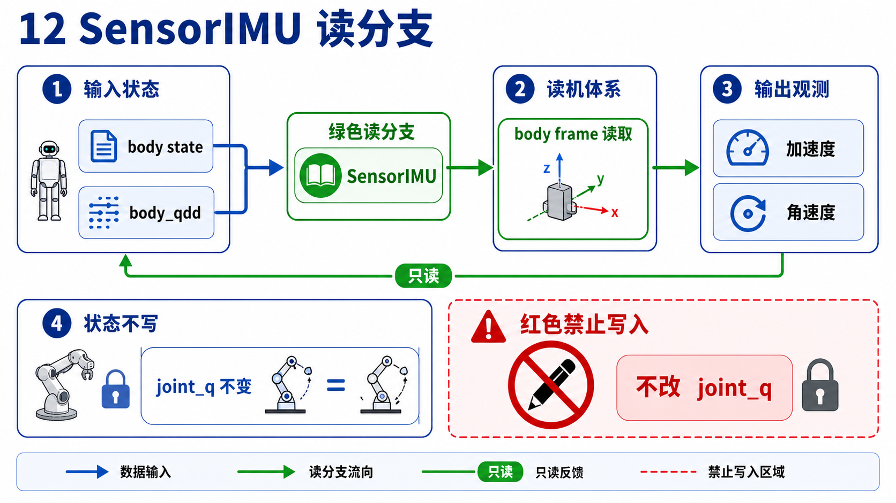
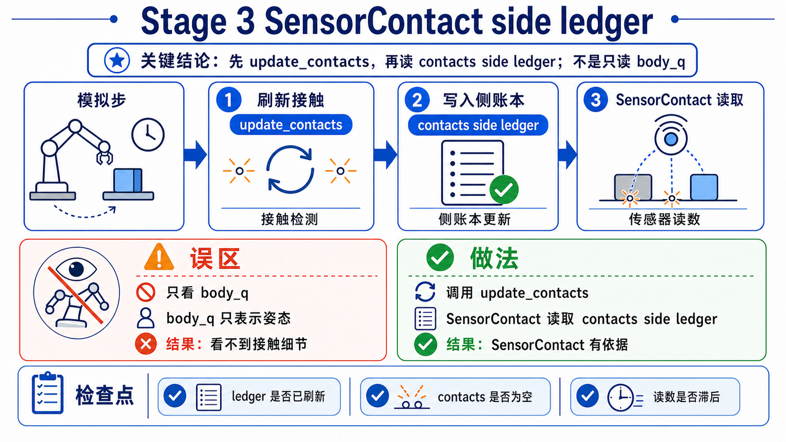
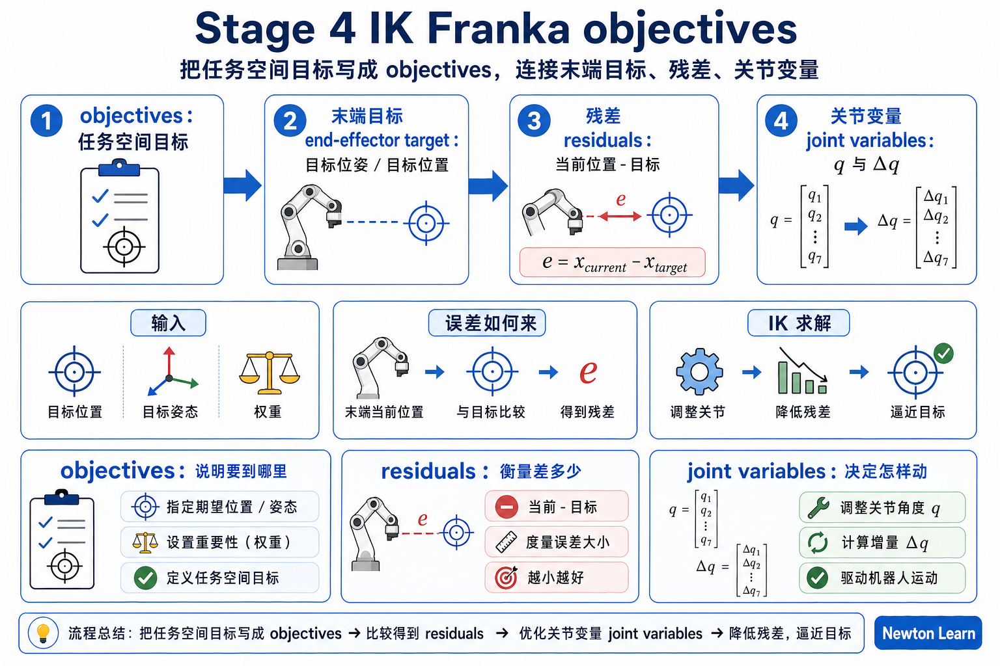
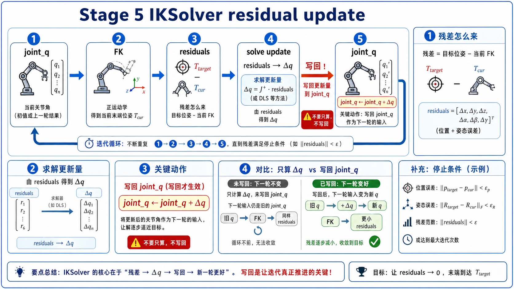
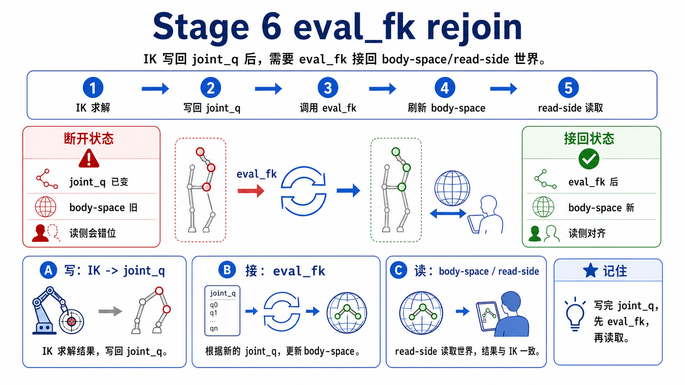
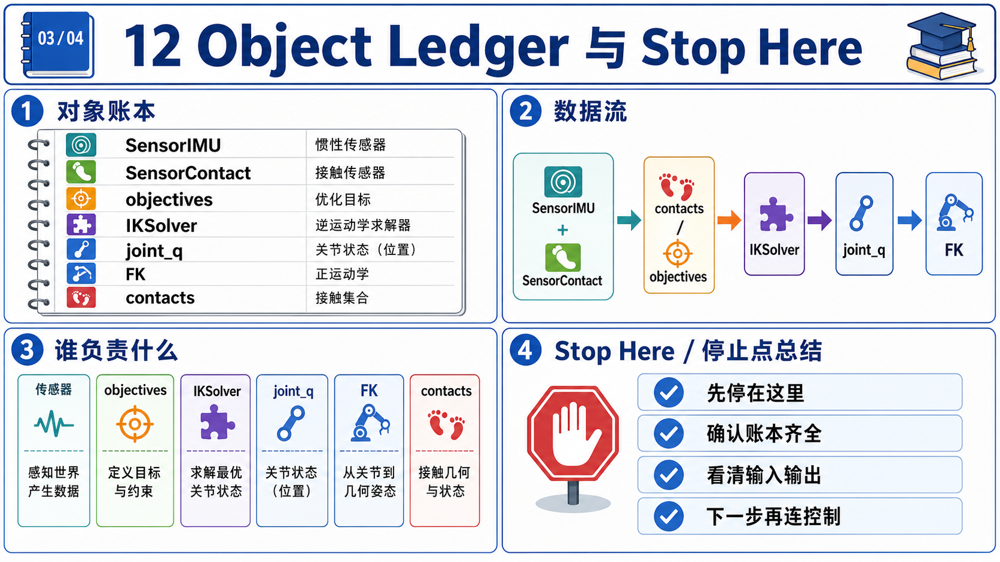

# 12 传感器与逆运动学源码走读

这份 main walkthrough 只回答一个 first-pass 问题: **当 articulated state 已经存在时，Newton 里的 sensors 怎样从它读 measurement，IK 又怎样把 task-space goal 写回 `joint_q`？**

第一遍先不做几件事:

- 不把这章拆成两篇互不来往的小作文。
- 不展开 sensor constructor 参数大全。
- 不展开 LM / L-BFGS / line search / Jacobian backend 细节。
- 不把 `sensor_tiled_camera`、`ik_custom`、`ik_cube_stacking` 塞进 mainline。

## What This Walkthrough Follows

只追这一条主线:

```text
chapter 11: solver step 之后状态已经存在
-> chapter 12: 先确认 shared FK/state backbone
-> SensorIMU 从 body state 读 measurement
-> SensorContact 提醒你 contacts 是 side ledger，更新时间单独受管
-> IK objectives 把 task-space target 写成 residuals
-> IKSolver 反复做 joint_q -> FK -> residuals -> better joint_q
-> external eval_fk 刷新 state，让 viewer / downstream logic 再次读到新姿态
```

这份 walkthrough 刻意不展开四类东西:

- camera sensor 的渲染细节。
- H1、多 world、cube stacking 的系统分支。
- custom objective 的设计模式。
- optimizer / Jacobian backend 的数学细节。

第一遍先守住一句话:

```text
chapter 12 讲的不是“有哪些 sensor”和“有哪些 IK solver”，
而是“同一条 articulated-state backbone 怎样先被读取，再被朝目标写回”。
```

## One-Screen Chapter Map



```text
task-space target / gizmo / task loop
                |
                v
    IKObjectivePosition / Rotation / JointLimit
                |
                v
            IKSolver.step(...)
                |
                v
joint_q ------------------------------+
  |                                   |
  |                      solver-internal eval_fk_batched
  |                                   |
  +----------> newton.eval_fk(...) ---+
                          |
                          v
          state.body_q / state.body_qd / state.body_qdd
                  |             |               |
                  |             |               +--> SensorIMU.update(...)
                  |             |
                  |             +--> viewer / logging / downstream logic
                  |
                  +--> solver.update_contacts(...) -> contacts.force
                                                   |
                                                   v
                                         SensorContact.update(...)
```

这里最该记住的是中间那根竖线: sensors 和 IK 都没有绕开 `joint_q -> FK -> body state` 这条主中轴。

## Beginner Path



1. 先看 Stage 1。想验证什么: 为什么 chapter 12 的入口不是 sensor list 或 optimizer list。看完后应该能说: 这章先站在 shared backbone 上，再分成 read-side 和 write-side。
2. 再看 Stage 2。想验证什么: `SensorIMU` 到底在读哪份账本。看完后应该能说: 它读的是最新的 body state，尤其依赖 `body_qdd`。
3. 再看 Stage 3。想验证什么: 为什么 `SensorContact` 是必要 side branch。看完后应该能说: contact measurement 读的是 `contacts.force`，所以必须先 `update_contacts(...)`。
4. 再看 Stage 4。想验证什么: IK 怎样把“我要手去哪里”改写成可以求解的东西。看完后应该能说: 目标先进入 `IKObjectivePosition / Rotation / JointLimit`。
5. 再看 Stage 5。想验证什么: IKSolver 到底在内部做了什么。看完后应该能说: 它反复做 `joint_q -> FK -> residuals -> update joint_q`。
6. 最后看 Stage 6。想验证什么: 为什么 IK 之后外部还要 `eval_fk(...)`。看完后应该能说: solver 写回的是 `joint_q`，而 `state.body_q` 要靠 FK 再刷新一次才能继续被读取。

## Main Walkthrough

### Stage 1: chapter 12 的真正入口是 shared backbone，不是 feature catalog



**Definitions**

- `joint_q`: articulation 的 joint-space 配置，IK 最终写回这里。
- `state`: 外部世界用来读取 body pose / velocity / acceleration 的账本。
- `contacts`: 接触侧账本，保存接触几何和接触力等信息。

**Claim**

chapter 12 的 mainline 必须先从 shared backbone 开始: `joint_q` 经过 FK/state pipeline 变成 body-level 账本，然后 sensors 和 IK 再分别接到这条 backbone 的两端。

**Why it matters**

如果这一层不先立住，你后面会把 `SensorIMU`、`SensorContact`、`IKObjectivePosition`、`IKSolver` 看成四个孤立功能点，而不是一条连续数据流上的不同接口。

**Source excerpt**

`example_ik_franka.py` 的初始化先把外部 state 准备好:

以下摘录为教学注释版，注释非原源码。

```python
self.state = self.model.state()  # 先分配外部可读的 body-state 账本
newton.eval_fk(self.model, self.model.joint_q, self.model.joint_qd, self.state)  # 把当前 joint_q / joint_qd 展开成这份 state
```

而 `example_sensor_contact.py` 则把 contact side ledger 准备好:

以下摘录为教学注释版，注释非原源码。

```python
self.state_0 = self.model.state()  # contact sensor 也要先有一份当前 state
self.contacts = Contacts(...)  # 再单独准备 contact side ledger
```

如果再往 IK 内部看，`ik_common.py` 里也把这条 backbone 写成了 batched FK helper:

以下摘录为教学注释版，注释非原源码。

```python
def eval_fk_batched(model, joint_q, joint_qd, body_q, body_qd):  # 把一批 candidate joint_q 展开成 body-space buffers
    ...
```

**Verification cues**

- public `newton.sensors` 和 `newton.ik` 只是 barrel re-export；真正的 chapter spine 在 example + source internals。
- `joint_q` 是 write-side 最终落点。
- `state.body_q / body_qd / body_qdd` 和 `contacts` 是 read-side 要消费的账本。
- 这里的记忆式是 shared shorthand，不是说单个 `eval_fk` 调用字面上同时产出所有派生字段。

**Checkpoint**

如果你现在还会把 chapter 12 的标题改成“传感器类型总览”和“IK 求解器总览”，先停一下。第一遍最重要的是接受: 这章先讲 shared backbone，再讲两侧 adapter。

**Output passed to next stage**

既然 mainline 先站在 shared state 上，下一步最干净的 read-side anchor 就应该是一个几乎只读 body state 的 sensor。

### Stage 2: `SensorIMU` 是最干净的 read-side anchor



**Definitions**

- `SensorIMU`: 在 site frame 下输出 accelerometer / gyroscope 的 sensor。
- `body_qdd`: body 空间加速度账本。IMU 需要它，才能把“加速度”这件事说完整。

**Claim**

`example_sensor_imu.py` 展示了 chapter 12 最干净的 read-side pattern: solver 先产出最新 state，`SensorIMU` 再把这份 state 改写成 measurement。

**Why it matters**

只有先把这个最短 read branch 看清，你后面看到 contact sensor、camera sensor 时，才知道它们是在同一类 adapter 思路上变化，而不是各自一套黑箱。

**Source excerpt**

`example_sensor_imu.py` 的骨架非常短:

以下摘录为教学注释版，注释非原源码。

```python
self.imu = newton.sensors.SensorIMU(self.model, self.imu_sites)  # 先创建一个只读 body state 的 IMU adapter
...
self.solver.step(self.state_0, self.state_1, self.control, None, self.sim_dt)  # solver 先把 state 推到下一拍
self.state_0, self.state_1 = self.state_1, self.state_0  # 交换到最新 state
self.imu.update(self.state_0)  # 再从最新 state 打包 measurement
```

`sensor_imu.py` 的 update 又把 dependency 写得很直白:

以下摘录为教学注释版，注释非原源码。

```python
if state.body_qdd is None:
    raise ValueError(...)  # 没有 body 加速度就无法组成完整 IMU 读数

inputs=[
    state.body_q,  # 当前 body pose
    state.body_qd,  # 当前 body velocity
    state.body_qdd,  # 当前 body acceleration
]
```

**Verification cues**

- `SensorIMU` 在构造时会请求 `body_qdd`，所以它最好在 `model.state()` 之前创建。
- `imu.update(...)` 放在 step + swap 之后，说明它要读的是“这一步最新 state”，而不是旧 state。
- 这里的 double-buffer swap 是这个 example 的实现选择；你真正要记的是 `imu.update(...)` 要读“刚刚被 solver 推到最新”的那份 state。
- IMU 输出是在 sensor frame 下的测量，不是原样吐出 `body_q` / `body_qd`。

**Checkpoint**

如果你现在还会把 IMU 读成“又一份小物理引擎”，先停一下。更稳的说法是: `SensorIMU` 从已有 body state 打包出 measurement。

**Output passed to next stage**

现在你已经看到最干净的一条 read branch 了。下一步要补的，就是那条容易把人绊倒的 timing side branch。

### Stage 3: `SensorContact` 说明 contacts 是另一份 side ledger



**Definitions**

- `contacts.force`: contact pipeline 写出来的接触力账本。
- `solver.update_contacts(...)`: 把当前 state 对应的 contact info 刷进 `Contacts` 对象的步骤。

**Claim**

`example_sensor_contact.py` 的真正教学价值，不是“展示更多 sensor 输出形状”，而是告诉你 chapter 12 里有些 measurement 不是直接从 body state 读取，而是从 `contacts` side ledger 读取。

**Why it matters**

如果你错过这一步，后面最常见的误用就是: state 已经 step 了，但 contacts 还没刷新，于是 sensor 读到的不是这一帧真正的接触力。

**Source excerpt**

`example_sensor_contact.py` 的关键顺序是:

以下摘录为教学注释版，注释非原源码。

```python
self.solver.step(self.state_0, self.state_0, self.control, None, self.sim_dt)  # 先把当前 state 原地推进一拍
self.solver.update_contacts(self.contacts, self.state_0)  # 再把这份最新 state 对应的 contacts 刷新出来
...
self.plate_contact_sensor.update(self.state_0, self.contacts)  # 最后 sensor 同时读取 state + contacts
```

`sensor_contact.py` 的文档也直接写道:

```python
"""
SensorContact reads from contacts.force.
Call solver.update_contacts(contacts) before sensor.update()
so that contact forces are current.
"""
```

这里也顺手注意一个和 IMU 例子不同的点：这个 example 选择了 in-place `step(self.state_0, self.state_0, ...)`，没有做 state swap。第一遍不用把这件事读成“必须统一一种 state 模式”，只要记住它们共享的 timing rule：sensor 要读的，必须是刚刚更新完的那份 state / contacts。

**Verification cues**

- `SensorContact` 在 init 时会请求 `force` contact attribute，所以最好先建 sensor，再建 contacts。
- `sensor.update(state, contacts)` 同时用到了 state 和 contacts，但真正的 force data 在 `contacts.force`。
- 这就是 chapter 12 的第一条 timing rule: body state 新了，不代表 contact ledger 也自动新了。

**Checkpoint**

如果你现在还会把 `SensorContact` 当成“只是又一个读 `body_q` 的 sensor”，先停一下。更稳的说法是: 它读的是 `contacts` 侧账本，state 只是辅助它对齐 sensing object transform。

**Output passed to next stage**

现在 read-side 两种最重要的账本都看到了。下一步就该切到 write-side: 任务目标怎样被写成 IK 问题？

### Stage 4: `example_ik_franka.py` 先把 task-space goal 写成 objectives



**Definitions**

- `task-space goal`: 例如 TCP 想到哪个位置、朝哪个方向。
- `objective`: 把 goal 写成 residual rows 的对象。
- `residual`: 当前 pose 和目标 pose 之间那份还没消掉的误差。第一遍把它读成 solver 想压到零的 error rows。

**Claim**

`example_ik_franka.py` 没有直接“拖动 hand link”。它先把目标拆成 position objective、rotation objective 和 joint-limit objective，再交给 `IKSolver`。

**Why it matters**

只有先把“目标先写成 objectives”这层看清，你后面才不会把 IK 误读成“某个 solver 直接替你改 body pose”。实际上 IK 的 write-side 入口在 residual design。

**Source excerpt**

`example_ik_franka.py` 的 setup 骨架是:

以下摘录为教学注释版，注释非原源码。

```python
self.pos_obj = ik.IKObjectivePosition(...)  # 把“TCP 到哪”写成位置残差
self.rot_obj = ik.IKObjectiveRotation(...)  # 把“TCP 朝哪”写成姿态残差
self.obj_joint_limits = ik.IKObjectiveJointLimit(...)  # 把“不要越界”写成关节限制残差

self.solver = ik.IKSolver(
    model=self.model,
    n_problems=1,
    objectives=[self.pos_obj, self.rot_obj, self.obj_joint_limits],  # 把三类目标交给同一个 IK solve
)
```

而每帧 target 更新时，例子先做的是:

以下摘录为教学注释版，注释非原源码。

```python
self.pos_obj.set_target_position(0, pos)  # 每帧先刷新位置目标
self.rot_obj.set_target_rotation(0, ...)  # 再刷新姿态目标
```

**Verification cues**

- `IKObjectivePosition` / `Rotation` 定义的是“目标长什么样”，不是“解法长什么样”。
- `IKObjectiveJointLimit` 把“不要越界”也编码进同一份 residual family。
- mainline 里最该先记住 objective role，而不是 optimizer backend。

**Checkpoint**

如果你现在还会说“`IKSolver` 直接把 TCP 拉到目标上”，先停一下。更稳的说法是: 目标先被写进 objectives，solver 再去找合适的 `joint_q`。

**Output passed to next stage**

现在 goal 已经写成 objectives 了。下一步要问的就是: `IKSolver.step(...)` 在内部到底怎样用这些 objectives？

### Stage 5: `IKSolver` 的核心是 `joint_q -> FK -> residuals -> update joint_q`



**Definitions**

- `eval_fk_batched(...)`: IK 内部对 candidate joint configurations 做 FK 的 helper。
- `residuals`: objectives 写出的误差向量，solver 用它判断“当前解还差多少”。

**Claim**

IK solver 并不是跳过 FK 直接优化 link pose。它每次都是先把 candidate `joint_q` 展开成 `body_q`，再让 objectives 从 `body_q` 里写 residuals，最后再更新 `joint_q`。

**Why it matters**

这一层正是 chapter 12 的 read/write 对称点: sensors 读 FK/state 的结果，IK 也离不开 FK/state 的结果，只是它会在外面再套一层“朝目标更新 `joint_q`”的 loop。

**Source excerpt**

public solver 调用只有一句:

以下摘录为教学注释版，注释非原源码。

```python
self.solver.step(self.joint_q, self.joint_q, iterations=self.ik_iters)  # 让 solver 直接改写 joint_q 解
```

`ik_solver.py` 里会先 sample/reset，再把真正的 solve 委托给 backend。继续往下看 `ik_lm_optimizer.py` 或 `ik_lbfgs_optimizer.py`，核心骨架都一样:

以下摘录为教学注释版，注释非原源码。

```python
eval_fk_batched(  # 先把候选 joint_q 展开成 body-space pose / velocity
    self.model,
    ctx.joint_q,
    ctx.joint_qd,
    ctx.fk_body_q,
    ctx.fk_body_qd,
)

ctx.residuals.zero_()  # 清空这一轮误差向量
self._for_objectives_residuals(ctx)  # 让每个 objective 把自己的 residual rows 写进去
```

而 `_for_objectives_residuals(...)` 又会对每个 objective 调:

以下摘录为教学注释版，注释非原源码。

```python
obj.compute_residuals(  # 每个 objective 从当前 FK 结果里提取自己的误差
    body_q_view,
    joint_q_view,
    model,
    output_residuals,
    offset,
    problem_idx=problem_idx_array,
)
```

`IKObjectivePosition` 和 `IKObjectiveRotation` 再各自从 `body_q[row, link_index]` 取当前 link pose 来计算误差。

**Verification cues**

- solver 真正写回的是 `joint_q_out`，不是 external `State`。
- objectives 看的不是“目标自己”，而是 FK 展开的当前 `body_q`。
- `eval_fk_batched(...)` 是 IK 内部 helper，不是用户态要自己去调用的 API。
- 也正因为如此，这一页可以先不展开 LM / L-BFGS 数学；你先把这条 loop 看对就够了。

**Checkpoint**

如果你现在还会把 IK 读成“直接优化 body pose 的黑箱”，先停一下。更稳的说法是: IK 是一层围着 FK 和 objectives 反复更新 `joint_q` 的 write-side loop。

**Output passed to next stage**

solver 已经写回新的 `joint_q` 了。最后一步只剩下: 外部世界怎样重新读到这份更新后的姿态？

### Stage 6: external `eval_fk(...)` 把 write-side 结果接回 read-side 世界



**Definition**

- external `eval_fk(...)`: 用户态 / viewer 侧为了刷新 `state.body_q`、`state.body_qd` 而显式调用的 FK。

**Claim**

IK 求解结束之后，外部 `State` 并不会自动变新；你还要再 `eval_fk(...)` 一次，才能让 viewer、logger、或后续 read-side 逻辑看到最新 body pose。

**Why it matters**

这一层是 chapter 12 最好的收尾，因为它把 read-side 和 write-side 接回成一个闭环: IK 写回 `joint_q`，FK 再把它翻译回 body state，然后 measurement / visualization / downstream logic 才能继续读取。

**Source excerpt**

`example_ik_franka.py` 的 render 里先刷新 state:

以下摘录为教学注释版，注释非原源码。

```python
newton.eval_fk(self.model, self.model.joint_q, self.model.joint_qd, self.state)  # 先把求出来的 joint_q 重新翻译成 external state
body_q_np = self.state.body_q.numpy()  # viewer 接下来就从这份最新 body pose 读取
```

然后才把 viewer 和 gizmo 对齐到新的 TCP pose:

以下摘录为教学注释版，注释非原源码。

```python
self.viewer.log_gizmo(  # 用最新 TCP pose 对齐目标 gizmo
    "target_tcp",
    self.ee_tf,
    snap_to=wp.transform(*body_q_np[self.ee_index]),
)
self.viewer.log_state(self.state)  # 同时把刷新后的 state 交给 viewer
```

如果再看 advanced systems branch，`example_ik_cube_stacking.py` 则把同样的 solved `joint_q` 继续喂给:

以下摘录为教学注释版，注释非原源码。

```python
wp.copy(dest=joint_target_pos_view[:, :7], src=self.joint_q_ik[:, :7])  # solved joint_q 也可以继续送进控制目标
```

也就是说，write-side 结果既可以回到 viewer，也可以进入 control loop。

**Verification cues**

- `IKSolver.step(...)` 改的是 `joint_q`，render/read-side 看到的是 `eval_fk(...)` 刷新的 body state。
- 这正是 chapter 12 的统一结论: observe 和 steer 共享同一条 backbone，只是站在不同一端。
- 一旦你接受这点，sensor、IK、viewer、control loop 就不会再像四套互不兼容的 API。

**Checkpoint**

如果你现在能顺着说出 “target -> objectives -> IKSolver -> joint_q -> eval_fk -> state -> sensors/viewer”，chapter 12 的 mainline 就已经稳了。

**Output passed to next stage**

到这里，chapter 12 的 first-pass 主链已经闭环: world 先被读，再被朝目标写回，然后又重新变成可读 state。

## Object Ledger



| 对象 | 谁生产 | 谁消费 | 第一遍最该盯什么 |
|------|--------|--------|------------------|
| `joint_q` | model 初值、IK solver、控制逻辑 | `eval_fk(...)`、IK internals | write-side 最终落点 |
| `newton.eval_fk(...)` / `eval_fk_batched(...)` | public API / IK internals | `state.body_q`、IK objectives | shared backbone 的翻译器 |
| `state.body_q` | FK | IMU、viewer、IK objectives、下游逻辑 | body 世界位姿账本 |
| `state.body_qd` | FK | IMU、viewer、下游逻辑 | body 空间速度账本 |
| `state.body_qdd` | solver-side state update | `SensorIMU` | IMU 必需的加速度账本 |
| `contacts.force` | `solver.update_contacts(...)` | `SensorContact` | contact side ledger |
| `IKObjectivePosition / Rotation / JointLimit` | example setup + target updates | `IKSolver` backend | 把 task-space goal 写成 residual blocks |
| `IKSolver.step(...)` | user code 调用 | `joint_q_out` | 围着 FK 和 objectives 更新 joint_q |
| `SensorIMU.accelerometer / gyroscope` | `SensorIMU.update(...)` | 颜色映射、测试、控制 | body-state measurement |
| `SensorContact.total_force / force_matrix` | `SensorContact.update(...)` | UI、测试、事件逻辑 | contacts measurement |

如果只想用一张表记住 chapter 12，就记这张 ledger。

## Stop Here

读到这里已经够 chapter 12 的 first pass 了。

如果你现在能顺着说出这句话，本章主线就已经稳了:

```text
chapter 12 讲的不是一份 sensor 菜单和一份 IK 菜单。
它讲的是: 先通过 FK / state backbone 得到可读的世界账本，
SensorIMU 和 SensorContact 从这些账本里读 measurement；
IK 则把 task-space goal 写成 objectives，
再通过 joint_q -> FK -> residuals -> update 的循环回写 joint-space 解，
最后用 eval_fk 把结果重新变成可读 state。
```

到这一步，你已经不会再把 sensors 和 IK 看成两个互不相关的 API 堆，也不会再漏掉 `body_qdd`、`update_contacts(...)`、`eval_fk(...)` 这三个 update-order 关键点。

## Go Deeper

chapter 12 的 deep walkthrough 还没有写；现在这份就是 main version。

如果你还想继续加深，但暂时不需要 deep 文档，推荐只做这四件事:

- 读 `examples.md`，按 `sensor_imu -> sensor_contact -> ik_franka -> ik_h1` 的顺序补强主线和第二层分支。
- 想看 rendered perception 时，再去看 `example_sensor_tiled_camera.py`，把它当成“read-side rendered branch”，不是 first-pass mainline。
- 想看 objective extensibility 时，再去看 `example_ik_custom.py`，把重点放在 custom residual block，而不是 optimizer 参数。
- 想看 systems integration 时，再去看 `example_ik_cube_stacking.py`，把重点放在 `IK -> control.joint_target_pos -> simulation loop` 这条更大的 write-side chain。
