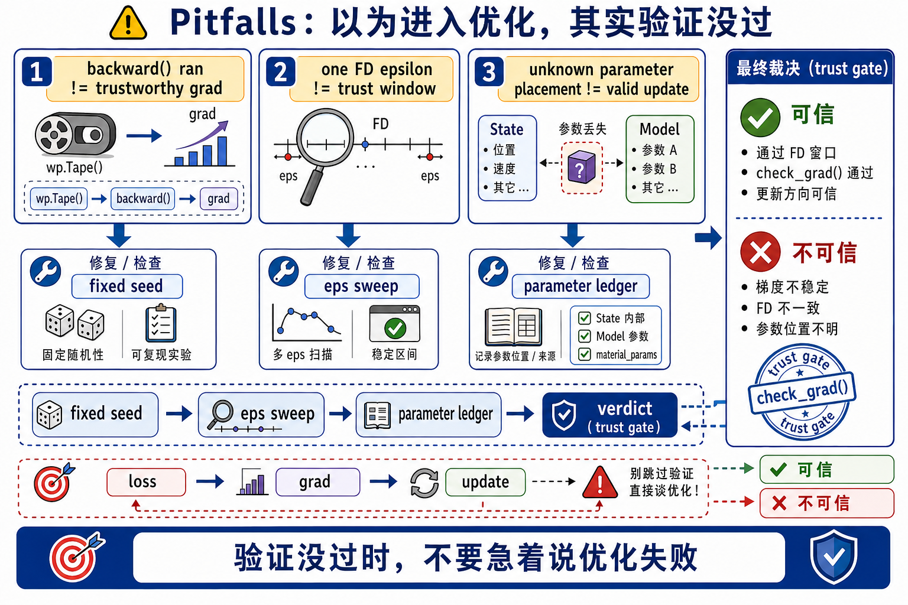
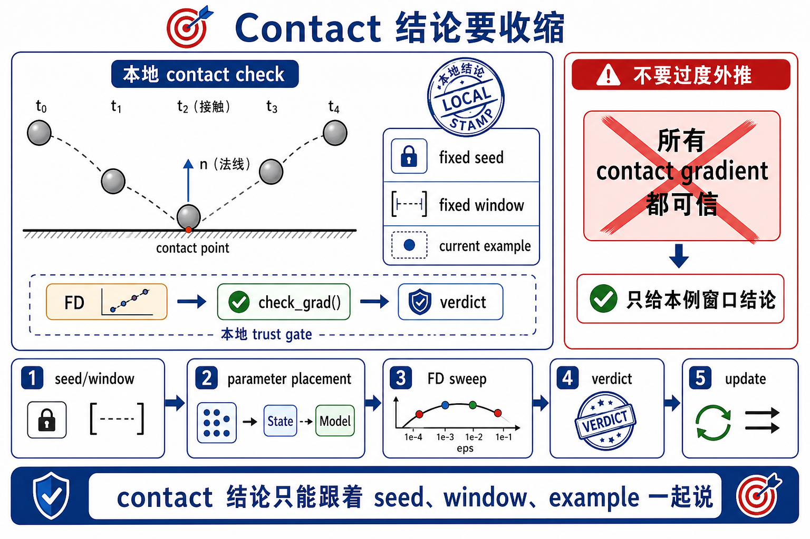

# 13 可微分仿真 Pitfalls

这一页只记录 chapter 13 最容易把人带偏的误判。它们的共同特征是: **你以为自己已经进入 optimization phase 了，但其实 verification phase 还没过。**

## Q1 `backward()` 跑通了，不等于梯度可信

- 症状: loss 在变，`tape.backward(loss)` 也没有报错，但 update 后结果忽好忽坏，换一个 seed 或时间窗口就完全变样。
- 常见触发条件: 看到 `grad` 不为零就立刻开始调学习率；把一次能下降的结果当成梯度正确证明。
- 当前定位证据:
  - 没有做 `conventions/diffsim-validation.md` 里的 fixed-seed 记录。
  - 没有做 FD step-size sweep，只报了一个“analytic grad looks fine”。
  - 没有写出 verdict: `pass` / `suspicious` / `fail`。
- 暂定修正方式:
  - 先把优化停掉，只保留一次 forward、一次 backward 和一张 FD error table。
  - 把 `backward()` 改口叫作 gradient candidate，而不是 final truth。
  - 只有当 best-epsilon 区间稳定落进 trust window，再恢复 update loop。

## Q2 用一个 FD epsilon 就给梯度盖章

- 症状: 你说“FD 通过了”，但其实只试了一个 `eps`，而且这个 `eps` 还是顺手拿 timestep 或某个默认超参凑的。
- 常见触发条件: 想快点进入 optimizer tuning；把 finite difference 当作一次性的 debug checkbox。
- 当前定位证据:
  - 记录里没有 `eps in {1e-3, 1e-4, 1e-5, 1e-6, 1e-7}` 这类 sweep。
  - 误差表只有一个数字，没有最佳区间。
  - seed、window length、metric 没写清。
- 暂定修正方式:
  - 按 `conventions/diffsim-validation.md` 固定 seed、loss metric 和 rollout window。
  - 至少写一张 `eps / analytic / numeric / rel_error / verdict` 表。
  - 把“哪段 epsilon 区间可信”写出来，而不是只报一个最好看的点。

## Q3 没先分清参数放在 `State`、`Model` 还是 external buffer

- 症状: 你能说出 loss 是什么，却说不清“我到底在优化哪一层对象”；最后 update 写到哪里都不确定。
- 常见触发条件: 把 DiffSim 读成“凡是上游量都差不多”；直接从 optimizer 代码倒推参数身份。
- 当前定位证据:
  - 分不清 `ball`、`spring_cage`、`soft_body` 三个例子为什么都保留。
  - 看到 `grad` 后只会说“有梯度了”，不会说“梯度落在 state/model/buffer 的哪一层”。
  - FD 扰动的对象和真正 update 的对象不是同一个。
- 暂定修正方式:
  - 先写一张三列表: `example -> optimized parameter -> parameter placement`。
  - `ball` 先归到 `state parameter`。
  - `spring_cage` 先归到 `model parameter`。
  - `soft_body` 先归到 `external parameter buffer`。
  - 再检查 loss、gradient、update、FD perturbation 是否全都对准同一对象层级。

## Q4 把 `ball` 的一次 contact 通过，当成 contact gradients 普遍可靠

- 症状: 在简单场景里 gradient 和 FD 看起来接近，于是直接下结论说“contact 在 DiffSim 里没问题”。
- 常见触发条件: first-pass 只跑了一个短窗口、一个 seed、一个接触事件；没有主动测试更换窗口或更换接触时序。
- 当前定位证据:
  - 记录里只有一次短 horizon 成功，没有 second seed 或 second window 对照。
  - 没有区分“这个例子的局部通过”与“contact family 的一般结论”。
  - 一旦接触时序或 branch 变化，误差表就显著恶化。
- 暂定修正方式:
  - 把 `ball` 的结论表述成: “在这个固定 seed、固定窗口、固定步长扫描下，当前梯度可用。”
  - 不要把一次通过升级成 contact-wide theorem。
  - 如果后续实验更依赖 contact，就把它当新问题重新做 FD trust 验证。

## 最低回退顺序

当你发现 optimization 行为不可信时，按这个顺序回退，不要先加更复杂的 optimizer:

1. 固定 seed、loss 定义和 rollout window。
2. 说清优化参数到底放在 `State`、`Model` 还是 external buffer。
3. 写 FD step-size sweep，而不是只试一个 `eps`。
4. 给这次梯度写 `pass` / `suspicious` / `fail` verdict。
5. 只有 verdict 稳定之后，才恢复 update loop 或更换 optimizer。
