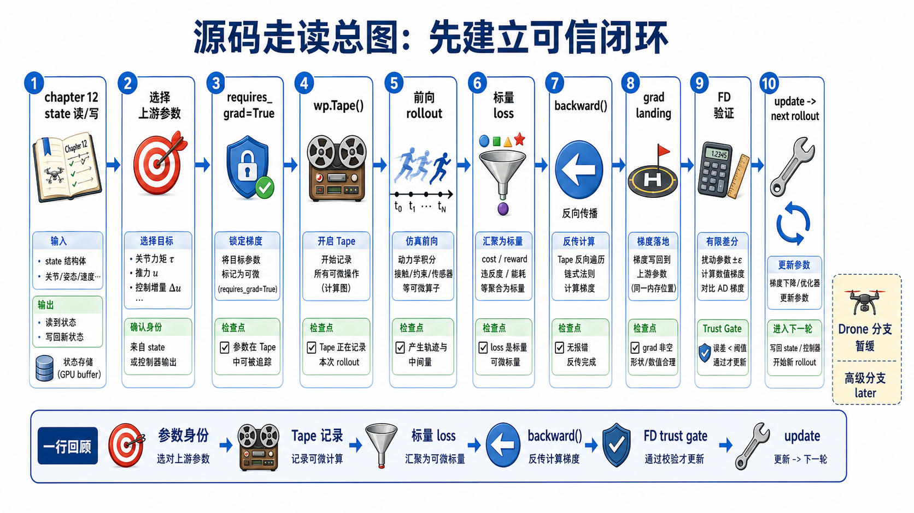
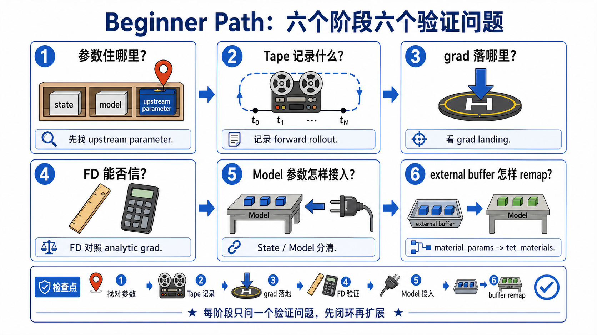
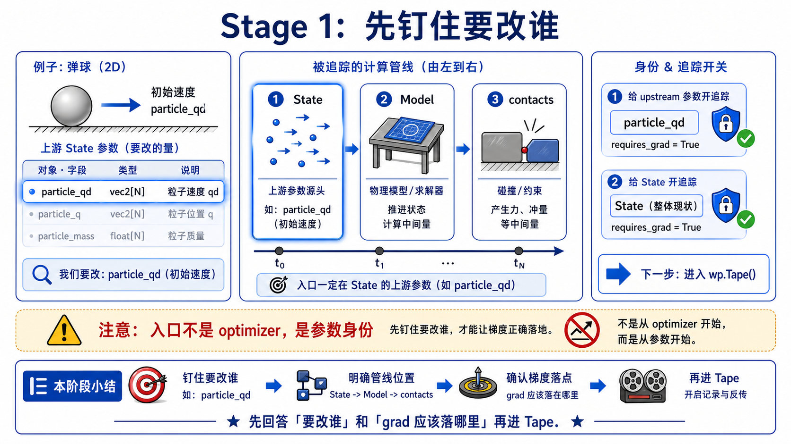
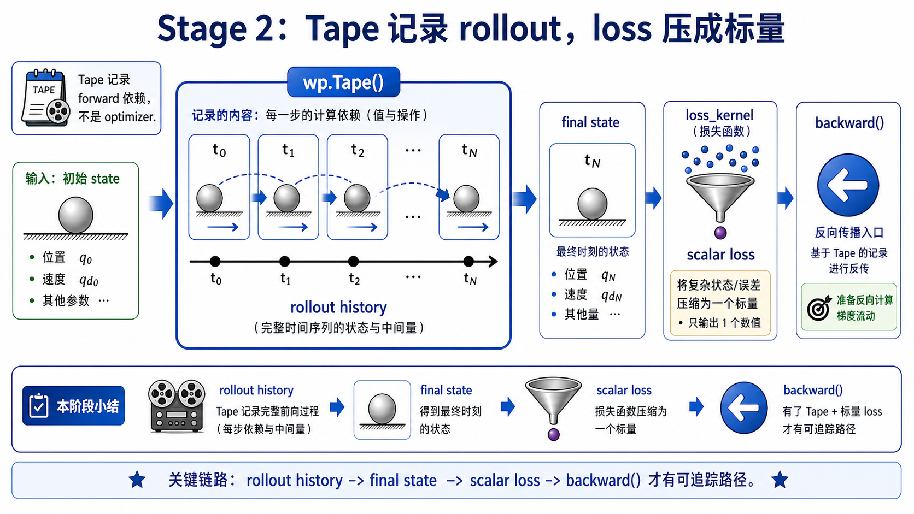
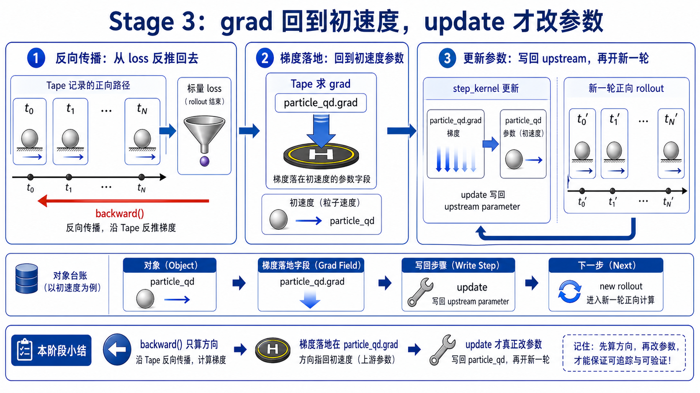
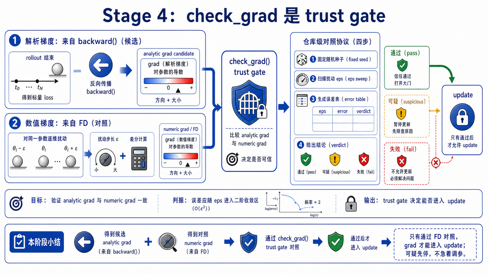
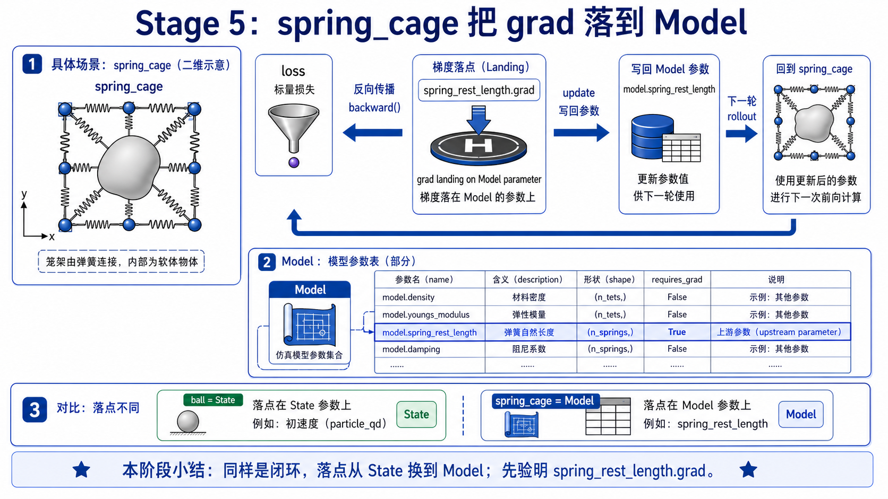
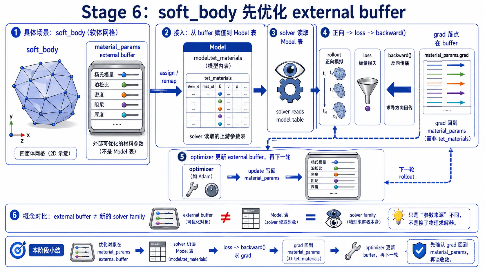
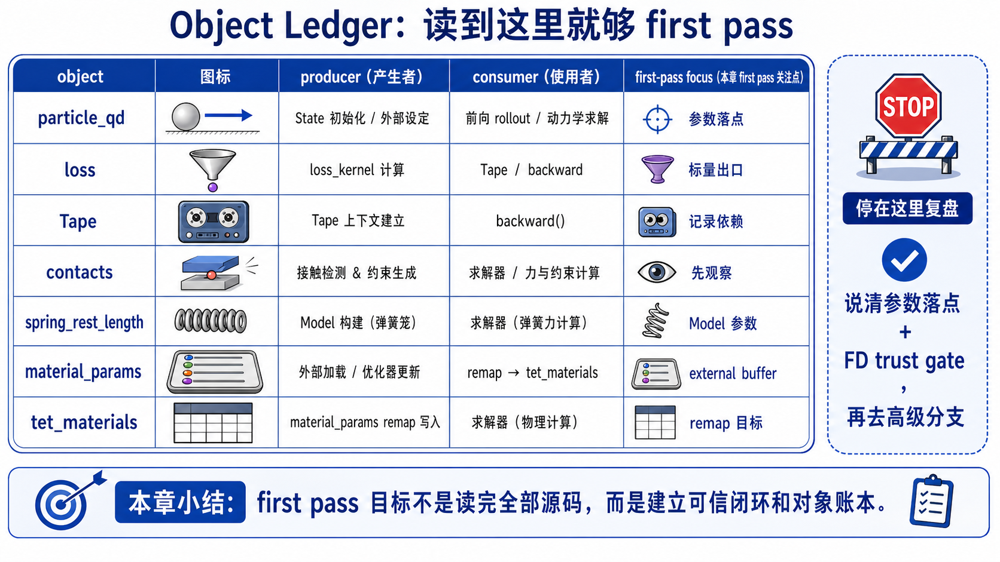

# 13 可微分仿真源码走读

chapter 12 刚讲完一件事：state 已经存在时，Newton 怎样读它、也怎样把目标写回它。chapter 13 的 first-pass 问题则往上游再退一步：**一次 rollout 没打中目标时，我到底该改哪个 upstream parameter，梯度会落在哪里，又怎么知道这个梯度值得拿去优化？**

这一页只追一条最窄主线：用 `newton/examples/diffsim/example_diffsim_ball.py` 先把 `forward -> loss -> backward -> FD trust gate -> update` 这条闭环讲顺，再只用 `spring_cage` 和 `soft_body` 说明“参数到底放在哪里”会怎样改变梯度落点。只要这条线稳了，chapter 13 的 80-90% 心智模型就已经够用了。

## What This Walkthrough Follows

只追这一条 first-pass 主线:

```text
chapter 12: state 已经能被读取和写回
-> chapter 13: 先选一个 upstream parameter
-> `requires_grad=True` 把 model / state / buffer 纳入可追踪闭环
-> `wp.Tape()` 记录 `forward()` rollout
-> `loss_kernel` 把 final state 压成 scalar loss
-> `tape.backward(loss)` 把梯度送回参数位置
-> `check_grad()` 先做 FD 对照，决定这条梯度能不能信
-> 只有 trust gate 过了，gradient descent step 才值得执行
-> 然后再把同一条闭环扩展到 `spring_rest_length` 和外部 `material_params`
```

这一页刻意不展开四类东西:

- 不把 `ball / spring_cage / soft_body / drone` 摊平成 demo catalog。
- 不展开 adjoint、IFT、implicit differentiation 的理论支线。
- 不展开 CUDA graph capture、viewer 绘制和日志细节。
- 不把 `drone` 的 MPC / rollout-batch / control interpolation 分支塞进第一遍主线。

第一遍先守住一句话:

```text
DiffSim 不是又一种 solver family；
它是在已有 forward simulation 上建立一条
必须先验证梯度、再做优化的 trust-first 闭环。
```



## One-Screen Chapter Map

```text
upstream parameter candidate
(`states[0].particle_qd` | `model.spring_rest_length` | `material_params`)
                    |
                    v
      `requires_grad=True` model / buffer setup
                    |
                    v
               `wp.Tape()` capture
                    |
                    v
             `forward()` rollout loop
                    |
                    v
     `loss_kernel` / `compute_loss_kernel`
     turn final state into scalar loss
                    |
                    v
            `tape.backward(loss)`
                    |
          +---------+---------+
          |                   |
          v                   v
`particle_qd.grad`   `spring_rest_length.grad`
                     `material_params.grad`
          |                   |
          +---------+---------+
                    v
        FD validation decides trust window
                    |
                    v
      gradient step / optimizer.step / clamp
                    |
                    v
        next rollout with updated parameter

[defer] `example_diffsim_drone.py`
        -> rollout batches + control trajectories + MPC cost
        -> not the first-pass trust-establishment path
```

## Beginner Path

1. 先看 Stage 1。想验证什么: 为什么 chapter 13 的真正入口不是 optimizer，而是先看 `requires_grad=True` 和“参数住在哪里”。看完后应该能说: `ball` 先把初速度这个 state parameter 暴露出来，并把整条 rollout 做成可追踪版本。
2. 再看 Stage 2。想验证什么: `wp.Tape()` 到底记录了什么。看完后应该能说: 它记录的是一整条 `forward()` rollout，而 `loss_kernel` 负责把终态压成一个可以反传的标量损失。
3. 再看 Stage 3。想验证什么: 梯度具体落到了哪里，更新又发生在哪里。看完后应该能说: `backward()` 之后梯度落在 `states[0].particle_qd.grad`，`step_kernel` 再拿它改初速度。
4. 再看 Stage 4。想验证什么: 为什么 `check_grad()` 不是可有可无的 debug。看完后应该能说: `backward()` 只给出 gradient candidate，FD validation 才是决定能不能进入优化 loop 的 trust gate。
5. 再看 Stage 5。想验证什么: 同一条闭环换成 model parameter 会怎样。看完后应该能说: `spring_cage` 只是把梯度落点从 `State` 换成了 `model.spring_rest_length`。
6. 最后看 Stage 6。想验证什么: 外部 parameter buffer 又和前两类有什么不同。看完后应该能说: `soft_body` 先优化外部 `material_params`，再把它 remap 回 `model.tet_materials`，而 `drone` 因为已经进入控制/MPC 分支所以明确 defer。



## Main Walkthrough

### Stage 1: `ball` 先把“要改谁”这件事钉死在 `requires_grad=True`

**Definitions**

- `upstream parameter`：loss 真正想回传去改的那个上游量。`ball` 第一遍就是初始速度。
- `requires_grad=True`：把 model、state 或外部 buffer 变成可被 Tape 追踪并持有 gradient 的对象。

**Claim**

`example_diffsim_ball.py` 之所以适合作为主锚点，不是因为它最“完整”，而是因为它最早就把 chapter 13 最关键的事说清了：先选好上游参数，再把整条 rollout 的参与对象标成可追踪。



**Why it matters**

如果这一层不先立住，后面你会把 `wp.Tape()`、`backward()`、`optimizer` 都看成某种自动魔法，却说不清“损失到底在朝哪一个参数回传”。

**Source excerpt**

`example_diffsim_ball.py` 的初始化一开始就把 chapter 13 的入口钉死了:

以下摘录为教学注释版，注释非原源码。

```python
self.loss = wp.zeros(1, dtype=wp.float32, requires_grad=True)  # loss 也要是可写、可反传的标量缓冲区

self.model = scene.finalize(requires_grad=True)  # 把 scene 冻结成可微分 model
...
self.states = [self.model.state() for _ in range(self.sim_steps * self.sim_substeps + 1)]

self.collision_pipeline = newton.CollisionPipeline(
    self.model,
    broad_phase="explicit",
    soft_contact_margin=10.0,
    requires_grad=True,  # 连 collision/contact 路径也一起纳入梯度追踪
)
```

而这个例子真正打算优化的参数，在后面的 `step()` 里写得非常直白:

以下摘录为教学注释版，注释非原源码。

```python
x = self.states[0].particle_qd
```

**Verification cues**

- `requires_grad=True` 不是只出现在一个 optimizer 对象上，而是出现在 `model`、`loss`、以及 contact pipeline 这类真正参与 forward/backward 的对象上。
- `self.states` 存的是整段 rollout history，所以 `forward()` 才能从初始状态一路推进到 final state。
- `ball` 的 first-pass 参数位置是 `self.states[0].particle_qd`，也就是 state parameter，不是 model parameter。

**Checkpoint**

如果你现在还会说“chapter 13 就是从 optimizer 开始”，先停一下。更稳的说法是：chapter 13 先决定谁要带梯度、谁是上游优化对象。

**Output passed to next stage**

既然参数位置和可追踪对象都确定了，下一步就该看：这条 rollout 怎样被 `wp.Tape()` 记录，并怎样变成一个 scalar loss？

### Stage 2: `wp.Tape()` 记录的是整条 `forward()`，而 `loss_kernel` 把终态压成标量

**Definitions**

- `forward()`：从初始参数出发，真正执行一次 rollout 并产出 loss 的那条前向路径。
- `scalar loss`：可供 `backward()` 向上游回传的单标量目标。第一遍先把它读成“优化 loop 的唯一出口”。

**Claim**

在 `ball` 里，`wp.Tape()` 不是“直接算梯度”的黑箱；它先忠实记录 `forward()` 里发生过的 kernel 和 solver step，然后 `loss_kernel` 才把最后一拍 state 压缩成一个可反传的标量。



**Why it matters**

如果看不清这层，你会把 `backward()` 误读成“凭空出现的梯度”。其实它必须先有一条被记录下来的前向轨迹，还必须有一个明确的 scalar loss 作为回传起点。

**Source excerpt**

`forward_backward()` 的骨架就是整章主线的最小版本:

以下摘录为教学注释版，注释非原源码。

```python
self.tape = wp.Tape()  # 新建一份只服务本次 rollout 的梯度账本
with self.tape:
    self.forward()  # 先把整条前向 rollout 记下来
self.tape.backward(self.loss)  # 再从 loss 往上游回传
```

而 `forward()` 里真正做的，是“先 rollout，再定义 loss”:

以下摘录为教学注释版，注释非原源码。

```python
for sim_step in range(self.sim_steps):
    self.simulate(sim_step)  # 先把 state 从初始时刻一路推到最后一拍

wp.launch(loss_kernel, dim=1, inputs=[self.states[-1].particle_q, self.target, self.loss])
return self.loss  # 最后才把 final state 压成一个 scalar loss
```

`loss_kernel` 本身也很短，它只负责把“最终位置离目标有多远”写成一个标量:

以下摘录为教学注释版，注释非原源码。

```python
@wp.kernel
def loss_kernel(pos: wp.array[wp.vec3], target: wp.vec3, loss: wp.array[float]):
    delta = pos[0] - target
    loss[0] = wp.dot(delta, delta)  # 用 squared distance 当作反传起点
```

**Verification cues**

- `forward()` 返回的是 `self.loss`，不是最终位置本身；这说明 `backward()` 的起点必须是标量目标。
- `loss_kernel` 读的是 `self.states[-1].particle_q`，说明 chapter 13 的 first pass 先从 final-state objective 开始，而不是把每一步都做成 loss。
- `simulate()` 和 `loss_kernel` 都包在 `with self.tape:` 里，所以 Tape 记到的是一整条“初速度 -> rollout -> final loss”的链条。

**Checkpoint**

如果你现在还会把 `wp.Tape()` 想成“自动替你找 loss”，先停一下。更稳的说法是：`forward()` 负责给 Tape 一条完整前向链，`loss_kernel` 负责给它一个清晰的回传出口。

**Output passed to next stage**

现在 loss 已经落在链条末端了。下一步只剩下一个问题：`backward()` 之后，这个梯度到底落到了哪个参数上，又是怎样被拿去更新的？

### Stage 3: `backward()` 让梯度落回初速度，`step_kernel` 才真正执行更新

**Definitions**

- `analytic gradient`：Tape 通过反传得到的梯度候选值。
- `gradient descent step`：用 `x <- x - alpha * grad` 这种更新去真正改变上游参数。

**Claim**

`ball` 里最该盯住的不是“loss 变小了”，而是 `backward()` 之后梯度明确落回 `self.states[0].particle_qd.grad`，然后 `step_kernel` 用这份梯度去改同一个初速度参数。



**Why it matters**

这一步回答了 chapter 13 的核心问题：loss 不是神秘地“优化仿真”，而是把梯度送回一个具体的 upstream parameter，再由显式更新把下一次 rollout 改掉。

**Source excerpt**

更新内核本身非常直接:

以下摘录为教学注释版，注释非原源码。

```python
@wp.kernel
def step_kernel(x: wp.array[wp.vec3], grad: wp.array[wp.vec3], alpha: float):
    tid = wp.tid()
    x[tid] = x[tid] - grad[tid] * alpha  # 把梯度真的变成参数更新
```

而 `step()` 里把“梯度落点”和“更新对象”绑定得很清楚:

以下摘录为教学注释版，注释非原源码。

```python
if self.graph:
    wp.capture_launch(self.graph)
else:
    self.forward_backward()

x = self.states[0].particle_qd
wp.launch(step_kernel, dim=len(x), inputs=[x, x.grad, self.train_rate])

self.tape.zero()
```

**Verification cues**

- `x` 取自 `self.states[0].particle_qd`，所以 `ball` 的 first-pass 是 state-parameter optimization。
- `x.grad` 不是手写出来的，它来自上一段 `self.tape.backward(self.loss)`。
- 参数更新发生在 Tape 外面；Tape 负责求导，`step_kernel` 才负责把梯度变成下一轮 rollout 的新初值。

**Checkpoint**

如果你现在还会说“`ball` 在优化 final position”，先停一下。更稳的说法是：`ball` 用 final-state loss 去改初始速度这个 upstream state parameter。

**Output passed to next stage**

到这里，优化闭环已经长出来了。但 chapter 13 还差最重要的一道门：这份 analytic gradient 什么时候才配得上被拿去做优化？

### Stage 4: `check_grad()` 不是附加调试，而是进入优化前的 trust gate

**Definitions**

- `gradient candidate`：`backward()` 给出来、但还没经过数值验证的梯度。
- `FD validation`：用 finite difference 和 analytic gradient 做对照，确认方向和量级至少在可信区间内。
- `trust window`：某一段 `eps` 区间里，FD 和 analytic gradient 的误差稳定足够小，说明这条梯度值得继续用。

**Claim**

`ball` 真正的教学价值，不是“它能跑优化”，而是它源码里已经把 `check_grad()` 放在明面上，提醒你：`backward()` 只给出 gradient candidate，FD validation 才是 chapter 13 的第一道硬门槛。



**Why it matters**

优化 loop 会把同一份梯度反复放大成多次参数更新。只要梯度方向错了、尺度飘了，或者 contact 分支在当前步长下不稳定，loss history 看起来再热闹也没有信任价值。所以 trust 必须先于 optimize。

**Source excerpt**

`check_grad()` 先做有限差分，再做解析梯度对照:

以下摘录为教学注释版，注释非原源码。

```python
param = self.states[0].particle_qd  # 还是盯同一个初始速度参数
...
param.assign(x_1)
l_1 = self.forward().numpy()[0]

param.assign(x_0)
l_0 = self.forward().numpy()[0]

dldx = (l_1 - l_0) / (eps * 2.0)  # 用中心差分算 numeric gradient
...

with tape:
    l = self.forward()

tape.backward(l)
x_grad_analytic = param.grad.numpy()[0].copy()  # 再取 analytic gradient 做对照
```

更关键的是，这个例子在入口里就先跑 `check_grad()`，再进入正式循环:

以下摘录为教学注释版，注释非原源码。

```python
example = Example(viewer, args)
example.check_grad()  # 先过一遍 numeric vs analytic 对照
newton.examples.run(example, args)  # 再进入真正的优化 / 渲染循环
```

**Verification cues**

- `check_grad()` 盯的是和 `step()` 完全同一个参数 `self.states[0].particle_qd`，所以它不是旁支测试，而是主线 trust gate。
- 这个 example 自带的是 example-local sanity check：它用单个 `eps = 1e-3` 做 numeric vs analytic 对照。
- `conventions/diffsim-validation.md` 规定的是更严格的 repo-level protocol：固定 seed、扫 `eps in {1e-3, 1e-4, 1e-5, 1e-6, 1e-7}`、记录 `fd_error_table`、给出 `pass/suspicious/fail` verdict，再决定是否优化。
- 也正因为 `ball` 含有 wall / ground contact，它更适合当 first-pass 的提醒：一次 contact 梯度通过，只能说明这条最小闭环先有了可信入口，不能自动推广成“所有 contact gradient 都稳定”。

**Checkpoint**

如果你现在还会说“`tape.backward()` 跑通了，所以梯度一定可信”，先停一下。更稳的说法是：`backward()` 只给 candidate，FD 才决定它配不配进入 update loop。

**Output passed to next stage**

现在 trust gate 也立住了。最后一步就是把同一条闭环迁移到别的参数住所上，看看 chapter 13 真正的比较轴是什么。

### Stage 5: `spring_cage` 说明梯度也可以直接落在 `Model`

**Definitions**

- `state parameter`：直接挂在 `State` 上、通常是一拍初值或状态量的参数。`ball` 属于这一类。
- `model parameter`：直接挂在 `Model` 上、随 rollout 持久存在的结构或物理参数。`spring_cage` 属于这一类。
- `external parameter buffer`：先放在 model 外部的可训练 buffer，每次 `forward()` 时再映射进 model。`soft_body` 属于这一类。

**Claim**

`example_diffsim_spring_cage.py` 的真正任务，是纠正“DiffSim 就是改初始状态”这个误解：同一条 `forward -> loss -> backward -> update` 闭环，也可以把梯度直接落到 `Model` 的持久参数上。



**Why it matters**

如果第一遍不先看 `spring_cage`，你很容易把 chapter 13 记成“ball 那套初始速度调参”。这个例子负责把比较轴掰正：chapter 13 真正在比较的是参数住在 `State`、`Model`，还是 model 外部 buffer。

**Source excerpt**

`example_diffsim_spring_cage.py` 把参数直接放在 model 上:

以下摘录为教学注释版，注释非原源码。

```python
param = self.model.spring_rest_length  # 这里不再改 state，而是直接改 model 里的弹簧静长
...
tape.backward(l)
x_grad_analytic = param.grad.numpy()[0].copy()  # 梯度也直接落在 model parameter 上
```

对应的更新也还是同一条思路:

以下摘录为教学注释版，注释非原源码。

```python
x = self.model.spring_rest_length
wp.launch(
    apply_gradient_kernel,
    dim=self.model.spring_count,
    inputs=[x.grad, self.train_rate],
    outputs=[x],
)  # 用同样的 gradient step 去改 model parameter
```

因此，到 `spring_cage` 这里，你只需要先把第二个落点记成:

```text
ball -> `states[0].particle_qd`
spring_cage -> `model.spring_rest_length`
```

**Verification cues**

- `spring_cage` 的参数落点从 `State` 换成了 `Model`，但 `forward -> loss -> backward -> update` 这条骨架没有变。
- `param = self.model.spring_rest_length` 和 `x = self.model.spring_rest_length` 前后呼应，说明“梯度落点”和“更新对象”还是同一个 parameter。
- 它同样带 `check_grad()`，说明 trust gate 不是 `ball` 的特例，而是 diffsim mainline 的共通要求。

**Checkpoint**

如果你现在还会把 `spring_cage` 看成“只是另一个 ball demo”，先停一下。更稳的说法是：它在教你同一条闭环也能改 `Model` 持久参数。

**Output passed to next stage**

现在你已经看到了 state parameter 和 model parameter 两种落点。最后只剩下一类更接近真实材料优化的放法：参数先住在 model 外部，再在 `forward()` 里灌回 model。

### Stage 6: `soft_body` 把梯度先落在外部 buffer，`drone` 明确 defer

**Definitions**

- `external parameter buffer`：不直接住在 `State` 或 `Model` 上，而是先作为单独的可训练数组存在。
- `remap`：每次 `forward()` 时，把外部参数写回 model 内部实际被 solver 读取的字段。

**Claim**

`example_diffsim_soft_body.py` 的关键新东西不是“更复杂的软体 solver”，而是它把可训练参数拆成了两层：梯度先落在外部 `material_params` buffer，再通过 `assign_param` 映射进 `model.tet_materials`。



**Why it matters**

这是 chapter 13 最接近真实 material optimization 的分支。它告诉你：上游参数不一定要直接挂在 model 上，也可以先住在一个更好管、更好约束、更方便交给 optimizer 的外部 buffer 里。

**Source excerpt**

`example_diffsim_soft_body.py` 先把可训练参数从 model 拿出来，单独建成 buffer:

以下摘录为教学注释版，注释非原源码。

```python
self.material_params = wp.array(
    self.model.tet_materials.numpy()[:, :2].flatten(),
    dtype=wp.float32,
    requires_grad=True,
)  # 可训练参数先住在外部 buffer 里
```

然后每次 `forward()` 先把它 remap 回 model:

以下摘录为教学注释版，注释非原源码。

```python
wp.launch(
    kernel=assign_param,
    dim=self.model.tet_count,
    inputs=(self.material_params,),
    outputs=(self.model.tet_materials,),
)  # solver 真正读取前，先把外部 buffer 写回 model.tet_materials
```

真正被 optimizer 更新的，也还是这个外部 buffer:

以下摘录为教学注释版，注释非原源码。

```python
self.optimizer.step([self.material_params.grad])  # 梯度先落在外部 buffer，再由 optimizer 更新它
wp.launch(... outputs=(self.material_params,))
```

因此，chapter 13 第一遍只要把三个落点记成:

```text
ball -> `states[0].particle_qd`
spring_cage -> `model.spring_rest_length`
soft_body -> external `material_params` -> remap to `model.tet_materials`
```

就已经抓住最重要的比较轴了。

`example_diffsim_drone.py` 则要明确 defer。它不是在教你 first-pass trust gate，而是已经进入下面这条 advanced control branch:

```text
rollout trajectories
-> sampled control points
-> parallel rollout costs
-> MPC-style optimizer loop
-> pick best trajectory for the real drone
```

这条线当然也会用到 `wp.Tape()` 和梯度，但它把“先建立一条可信的最小闭环”这个教学任务淹没在 rollout batch、trajectory buffer、control interpolation 和 MPC cost 里了，所以第一遍不要拿它当入口。

**Verification cues**

- `soft_body` 的关键新东西不是 solver，而是 `material_params -> assign_param -> model.tet_materials` 这条 remap 路径。
- 真正的可训练对象是 `self.material_params`，不是 `model.tet_materials` 本身；后者更像 solver 读取的 model-side working table。
- `soft_body` 虽然没有像 `ball` 那样直接附一个 `check_grad()`，但 trust-first 规则没有消失；参数住所变了，FD gate 仍然必须补上。
- `drone` 的主变量已经变成 control trajectory 和 rollout cost，不再是 chapter 13 first-pass 想建立的最小可信闭环。

**Checkpoint**

如果你现在还会把 chapter 13 总结成“DiffSim 就是改初始状态”，先停一下。更稳的说法是：DiffSim 真正在比较的是梯度最后落在哪一层参数对象上。

**Output passed to next stage**

到这里，chapter 13 的 first-pass 主链已经闭环：先找参数住所，再建立 `forward -> loss -> backward`，先过 FD trust gate，再进入 update loop，然后再扩展到别的参数放置方式。

## Object Ledger

| 对象 | 谁生产 | 谁消费 | 第一遍最该盯什么 |
|------|--------|--------|------------------|
| `self.states[0].particle_qd` | `ball` 初始化时的初始粒子速度 | `backward()`、`check_grad()`、`step_kernel` | chapter 13 的 state-parameter 主锚点 |
| `self.loss` | `loss_kernel` / `compute_loss_kernel` 写出 | `tape.backward(...)`、日志、测试 | rollout 被压缩成的 scalar objective |
| `self.tape` | `wp.Tape()` | `backward()`、`zero()` | 记录一次完整 rollout 并保存梯度 |
| `self.contacts` | `CollisionPipeline.contacts()` + `collide(...)` | `SolverSemiImplicit.step(...)` | `ball` 里 simple contact 也在可微闭环里 |
| `self.model.spring_rest_length` | `spring_cage` model finalize | `check_grad()`、`apply_gradient_kernel` | model-parameter branch 的梯度落点 |
| `self.material_params` | `soft_body` 从 `model.tet_materials` 拷出的外部 buffer | `assign_param`、`optimizer.step(...)` | external-parameter-buffer branch 的真正优化对象 |
| `self.model.tet_materials` | `assign_param` 在 `forward()` 中重写 | `soft_body` solver rollout | 外部 buffer 映射进 model 的 material table |



如果只想用一张表记住 chapter 13，就记这张 ledger。

## Stop Here

读到这里已经够 chapter 13 的 first pass 了。

如果你现在能顺着说出这句话，本章主线就已经稳了:

```text
chapter 13 不是“再学一个 solver”。
它讲的是：先选一个 upstream parameter，
用 `requires_grad=True` 把 rollout 变成可追踪闭环，
让 `wp.Tape()` 记录 `forward()`，让 `loss_kernel` 定义 scalar loss，
再用 `backward()` 把梯度送回参数；
但在真正做 gradient descent 之前，必须先用 `check_grad()` 和 FD protocol
验证这条梯度的可信区间，然后才把同一条逻辑扩展到 model parameter 或外部 parameter buffer。
```

到这一步，你已经不会再把 chapter 13 读成 demo catalog，也不会再把 `tape.backward()` 误当成“梯度已经自动证明正确”的终点。

如果现在还答不上下面这些问题，先别往 `drone` 跳:

- `ball` 里真正被优化的是哪个对象？
- `loss_kernel` 为什么必须把 rollout 压成标量？
- 为什么 `check_grad()` 要先于 update loop？
- `spring_cage` 和 `soft_body` 的梯度分别落在哪里？

## Go Deeper

chapter 13 的 deep walkthrough 还没有写；现在这份就是 main version。

如果你还想继续加深，但暂时不需要 deep 文档，推荐只做这三件事:

- 先对照 `conventions/diffsim-validation.md`，把 `ball` 的单步 `check_grad()` 心智模型升级成固定 seed、步长扫描、误差表和 verdict 的完整 FD protocol。
- 再回看 `example_diffsim_spring_cage.py` 和 `example_diffsim_soft_body.py`，只追 `param -> forward -> loss -> backward -> update` 这条共同骨架，不要先被 solver 细节带走。
- 只有当 `ball / spring_cage / soft_body` 三种参数落点都稳了之后，再去看 `example_diffsim_drone.py`，把重点放在 rollout batch、trajectory buffer 和 MPC-style control optimization，而不是把它当成本章 first-pass 入口。
