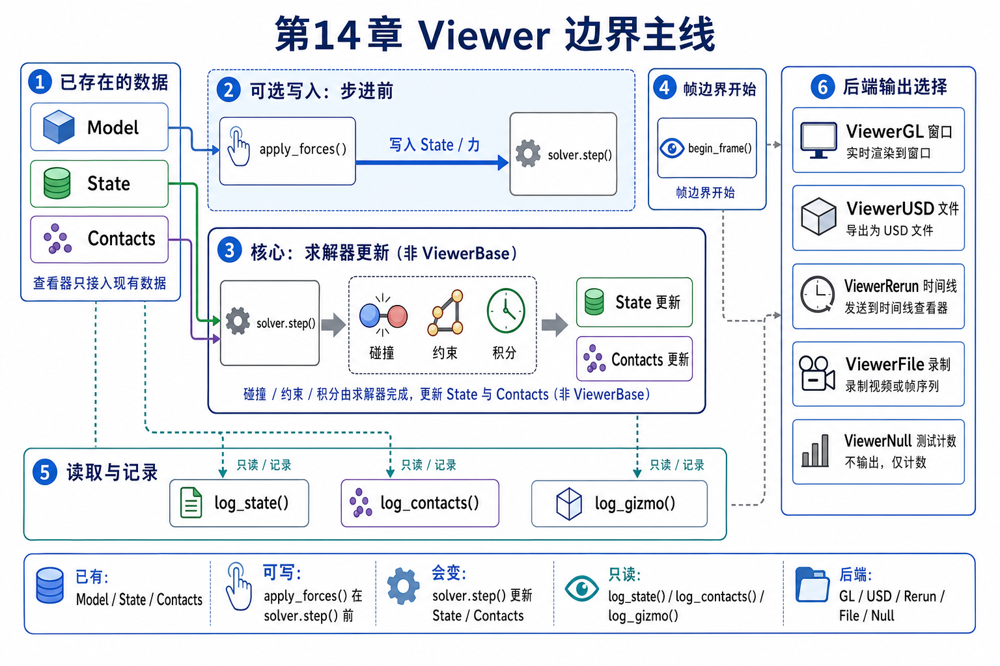
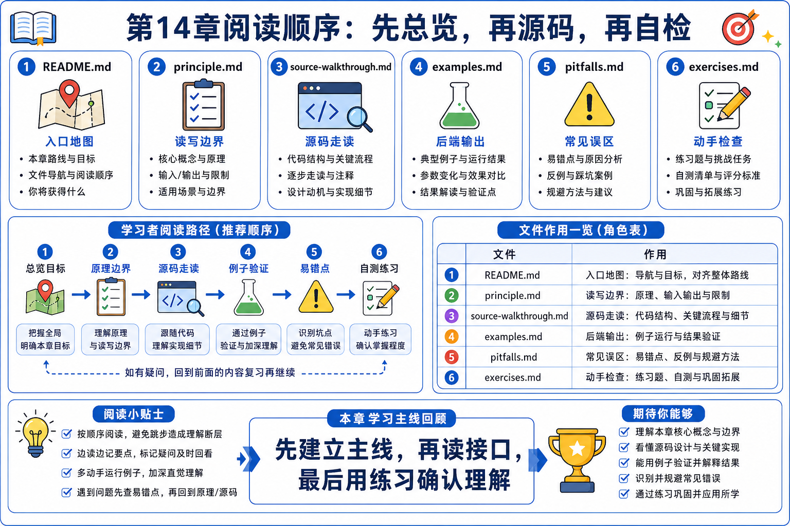
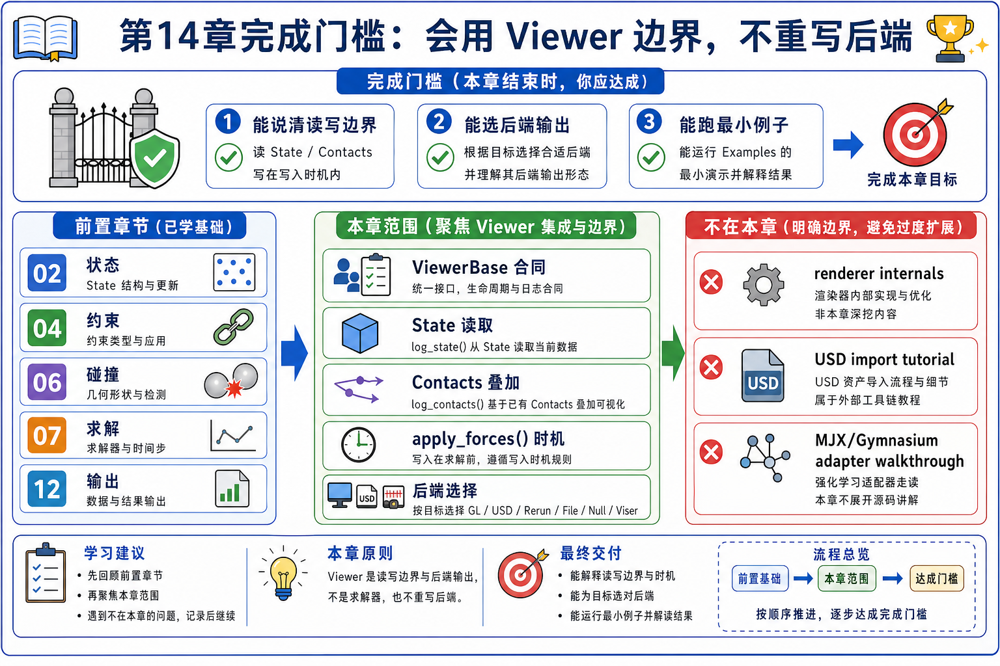

# 14 Viewer 与生态集成：read / log / render boundary

chapter 13 刚把一个优化闭环讲顺：`forward rollout -> loss -> backward -> validation -> update`。chapter 14 不继续扩展 solver 或梯度，而是换一个外侧问题：

```text
solver 已经把 state 推到下一拍之后，
viewer 到底读了什么、记录了什么，
哪些用户输入又会在下一拍之前写回 state？
```

第一遍只守住这句话：

```text
viewer 是读/记录/展示边界，不是第二套 physics。
```

也就是说，`ViewerGL / ViewerUSD / ViewerRerun / ViewerFile / ViewerNull / ViewerViser` 共享一套 viewer contract，但它们的差异主要在输出方式：窗口、USD 文件、Rerun timeline、记录文件、headless 计数器或浏览器服务。它们不负责生成 contact，不负责 solver integration，也不负责证明 state 正确。



## 文件分工

- `README.md`: 立住本章主问题、后端比较轴、完成门槛和阅读顺序。
- `principle.md`: 讲清 viewer 的两条边：read/log/render side 与 optional write-before-step side。
- `source-walkthrough.md`: 沿 `examples.init() -> examples.run() -> example.step() -> example.render() -> ViewerBase / concrete backend` 串源码。
- `examples.md`: 给几个代表性例子分配唯一观察任务。
- `pitfalls.md`: 记录最容易把 viewer 误读成 solver、contact generator 或 source of truth 的地方。
- `exercises.md`: 用最小练习检查你能不能标出 read/write 边界。



迁移记录：本次 preflight 只发现 `main` 上的原始骨架 README，没有旧 Chapter 14 分支、worktree 或正文可迁移；因此本章按当前 Newton 源码锚点重新编写。

## 本章目标

- 把 viewer 读成 simulation loop 外侧的 boundary layer，而不是 physics algorithm。
- 能解释 `examples.run()` 为什么由 `viewer.is_running()` 控制外层生命周期。
- 能解释 `viewer.is_paused()` 只暂停 example stepping，不等于停止所有 frame/render work。
- 能说清 `apply_forces(state)` 为什么在 solver step 之前发生。
- 能说清 `log_state(state)`、`log_contacts(contacts, state)`、`log_gizmo()` 各自读什么。
- 能按输出形态选择 viewer backend，而不是把所有 viewer 当成同一个窗口。
- 能说清 Isaac Lab / Isaac Sim 属于生态边界，当前本地源码里没有 MJX / Gymnasium adapter walkthrough 锚点，因此本章不编造这两类 API。

## First-Pass Spine

```text
Model / State / Contacts already exist
-> examples init selects a viewer backend
-> example runner owns outer lifecycle
-> optional viewer input writes before simulation step
-> collision / solver update State and Contacts
-> render phase begins a frame
-> viewer logs State, Contacts, gizmos, arrays, scalars, overlays
-> backend presents, exports, records, streams, or no-ops
-> close/save/disconnect finishes backend lifecycle
```

## Backend 角色表

| Backend | 第一遍把它记成 | 输出形态 | 典型使用场景 | 第一遍不要误会成 |
|---------|----------------|----------|--------------|------------------|
| `ViewerGL` | interactive debug viewer | OpenGL window 或 headless frame | 本地调试、picking、wind、UI panel、截图 | solver 或 collision pipeline |
| `ViewerUSD` | time-sampled USD exporter | `.usd` stage | Omniverse / Isaac Sim / DCC pipeline 观察输出 | Chapter 04 的 USD importer |
| `ViewerRerun` | timeline logging backend | Rerun app / web viewer / `.rrd` | time scrubbing、数据检查、远程可视化 | 训练框架 |
| `ViewerFile` | recording backend | `.json` 或 `.bin` | replay、分享、离线分析 | renderer |
| `ViewerNull` | headless loop counter | none | test、benchmark、CI | 真的可视化 |
| `ViewerViser` | browser/Jupyter viewer | web interface / `.viser` | notebook、browser visualization | solver |

## 本章范围

第一遍覆盖：

- viewer public exports 与 shared interface。
- `examples.create_parser()` / `examples.init()` 的 backend 选择。
- `examples.run()` 的 outer loop。
- `basic_pendulum` 的 `apply_forces -> collide -> solver.step -> render/log` 闭环。
- `log_state`、`log_contacts`、`log_gizmo` 的 source-truth 边界。
- GL / USD / Rerun / File / Null / Viser 的角色差异。
- Isaac Lab / Isaac Sim 只作为生态边界和外部文档入口。

第一遍不覆盖：

- OpenGL renderer、shader、VBO、UI backend 细节。
- Rerun / Viser / Omniverse / Isaac Lab 的完整使用教程。
- USD authoring 或 import pipeline。Chapter 04 已经负责 scene-to-`Model`。
- MJX / Gymnasium API walkthrough。当前本地 Newton 源码没有可锚定 adapter 文件，本章只记录它们是生态互通问题，不把它们写成已有源码路径。
- performance benchmark 统计学。这里最多解释 `ViewerNull` 和 benchmark mode 为什么能关掉可视化。



## GAMES103 已有 vs 本章新增

| 维度 | GAMES103 已有 | 本章新增 |
|------|----------------|----------|
| 物理 / 数学视角 | 仿真 state、碰撞、约束、积分结果需要可视化来理解。 | 可视化不是新物理；它读取已经存在的 `State / Contacts / Model`。 |
| Newton 工程视角 | 通常只关心“画出来”。 | viewer 是 shared interface 加多个 backend；runner loop 决定 step/render 生命周期。 |
| GPU / Warp 视角 | GPU 仿真结果最后要被观察。 | `log_state()` 会读取 Warp arrays / buffers 并把它们转成 backend 能消费的几何、实例、timeline 或记录。 |
| 生态集成视角 | 传统课程通常不讨论。 | USD / Rerun / File / Viser / Isaac Lab 是输出与生态边界，不改变 solver contract。 |

## 前置依赖

- 建议先读 `02_newton_arch`，知道 `Model / State / Control / Contacts / Solver` 在 Newton 里是什么角色。
- 建议先读 `04_scene_usd`，知道 USD import 是 scene-to-`Model`，避免把 `ViewerUSD` 和 `add_usd()` 混成一件事。
- 建议先读 `06_collision` 和 `07_constraints_contacts_math` 的 contact 主线，知道 contact arrows 只是已有 `Contacts` 的 visual overlay。
- 如果刚读完 `12_sensors_ik`，要特别记住 state freshness：在 `ik_franka` 这种例子里，render 前会用 `eval_fk()` 刷新 state，然后 viewer 才读它。

## 阅读顺序

1. 先读本文件，把 chapter 14 的标题改写成 `viewer is boundary, not physics`。
2. 再读 `principle.md`，把 read/log side 和 write-before-step side 分清。
3. 再读 `source-walkthrough.md`，沿 `examples.init()` 和 `examples.run()` 看真实源码。
4. 再看 `examples.md`，用 `basic_pendulum` 做主例子，其余例子只看它们新增的 viewer 观察点。
5. 最后用 `pitfalls.md` 和 `exercises.md` 检查自己有没有把 viewer 当成 solver、contact generator 或 source of truth。

## 完成门槛

```text
[ ] 我能用一句话解释 viewer 为什么不是第二套 physics
[ ] 我能画出 outer runner loop: is_running -> maybe step -> render -> close
[ ] 我能解释 is_paused() 暂停的是 example.step()，不是整个 viewer lifecycle
[ ] 我能指出 apply_forces(state) 为什么必须在 solver.step() 前观察
[ ] 我能解释 log_state(state) 读的是当前 State，而不是重新求解 physics
[ ] 我能解释 log_contacts(contacts, state) 的箭头来自已有 Contacts buffer
[ ] 我能按输出选择 ViewerGL / ViewerUSD / ViewerRerun / ViewerFile / ViewerNull / ViewerViser
[ ] 我能说出当前源码里 Isaac Lab 有锚点，但 MJX/Gymnasium 没有本章可走读的 adapter 路径
```

## 读完后带走什么

读完 chapter 14 后，你最该带走的不是某个 viewer backend 的所有参数，而是这条边界：

```text
physics inner loop 更新 State / Contacts；
viewer 在外层 loop 里读取、记录、展示这些结果；
只有少量交互输入会在下一次 step 之前写回 state。
```

这条边界会被 chapter 15 复用：多物理 pipeline 一旦变大，最容易失控的不是“能不能画出来”，而是你是否知道每个观察结果来自哪个 state buffer、哪个 contact buffer、哪个 backend 输出。
