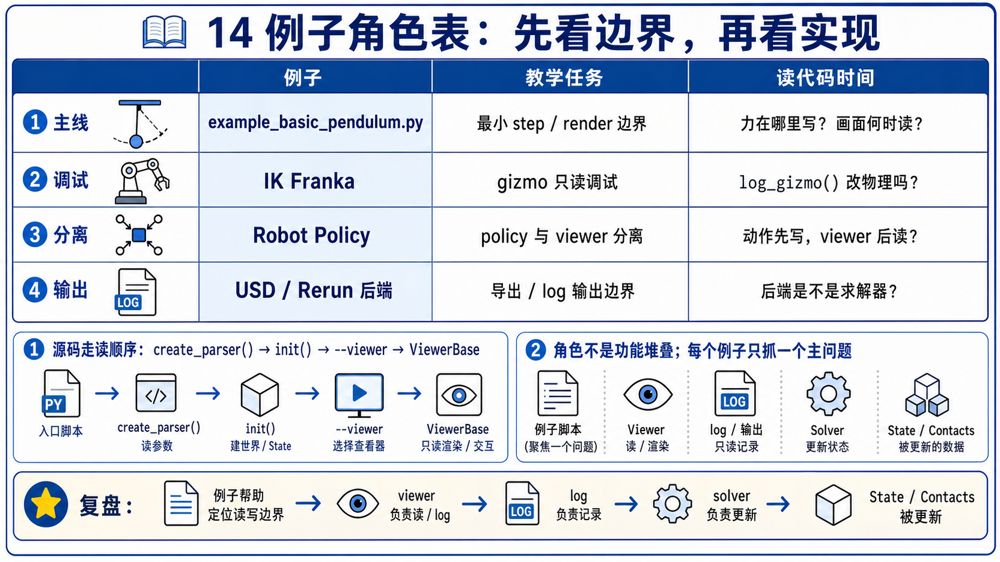
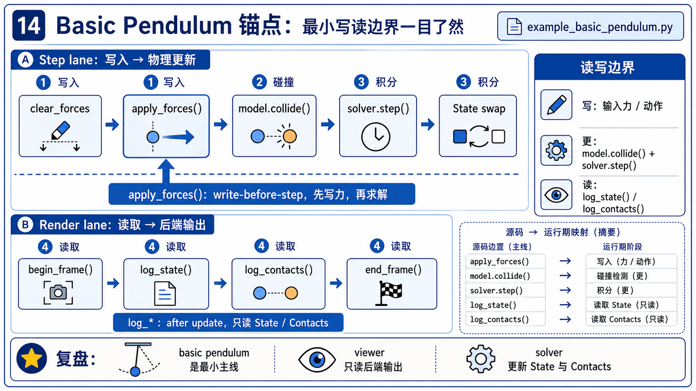

# 14 Viewer 与生态集成例子注释

这页不是 demo catalog。每个例子只保留一个 teaching job，帮助你从不同角度验证同一个边界：

```text
viewer 读/记录/展示当前 state；
只有 step 前的 input write-back 才进入下一拍 physics。
```



## 例子分工

| 例子 | 本章唯一 job | 第一遍看什么 | 可以跳过什么 |
|------|--------------|--------------|--------------|
| `basic_pendulum` | 主锚点：完整 step/render 边界 | `apply_forces -> collide -> solver.step -> log_state/log_contacts` | pendulum 建模细节 |
| `basic_viewer` | 直接 viewer overlay API | `log_shapes / log_lines` 怎样绕开 solver 只画辅助对象 | OpenGL renderer 细节 |
| `recording` | `ViewerFile` 记录边界 | `set_model()` 与 `log_state()` 如何自动记录 | 文件序列化内部格式 |
| `ik_franka` | state freshness + gizmo | `eval_fk()` 后再 `log_gizmo()` / `log_state()` | IK 数学细节 |
| `sensor_tiled_camera` | viewer 与 sensor/rendered output 交界 | sensor output 如何被 UI/display 分支展示 | sensor kernel 细节 |
| `robot_policy` | IsaacLab-trained policy 生态边界 | policy/action/control 与 viewer/debug 的分层 | RL 训练流程 |

## 主例子：`basic_pendulum`



### 用途

`basic_pendulum` 是 Chapter 14 的第一主例子，因为它把 viewer 的两条边都放在一屏附近：

- step 前：`viewer.apply_forces(self.state_0)` 可能写入 viewer-driven force。
- step 中：`model.collide()` 和 `solver.step()` 才更新 physics。
- render 阶段：`log_state()` 和 `log_contacts()` 只读取更新后的 buffers。

### 逐段注释

| 代码段 | 做了什么 | 为什么要这样写 |
|--------|----------|----------------|
| `newton.eval_fk(...)` | 初始化 articulated state | 让初始可视化状态可读。 |
| `viewer.set_model(self.model)` | 把静态结构交给 viewer | viewer 需要知道 body/shape/material/world 布局。 |
| `state_0.clear_forces()` | 清掉上一拍 force | 避免 viewer input 叠错拍。 |
| `viewer.apply_forces(state_0)` | GL picking/wind 可能写回 force | 只有放在 step 前才会影响下一拍。 |
| `model.collide(state_0, contacts)` | 生成/更新 contact buffer | contact source of truth 在这里，不在 viewer。 |
| `solver.step(...)` | 更新 physics state | viewer 不积分。 |
| `viewer.log_state(state_0)` | 读取当前 state 并输出到 backend | render/log side。 |
| `viewer.log_contacts(contacts, state_0)` | 用已有 contacts 画 normal arrows | overlay，不是 collision。 |

## 其余例子差异

### `basic_viewer`

这个例子适合验证：viewer 可以直接画 shapes、lines、points 和坐标轴，这类 overlay 不一定来自 solver。

第一遍看：

- 是否调用了 `viewer.begin_frame()` / `viewer.end_frame()`。
- 哪些 `log_*` API 只是在 viewer 层构造辅助几何。
- 这些辅助几何是不是被任何 solver step 消费。

结论：debug overlay 很有用，但它不是 physics source of truth。

### `recording`

这个例子适合验证：`ViewerFile` 是 recording backend。

第一遍看：

- `ViewerFile(output_path, auto_save=False)` 如何替代 window backend。
- `viewer.set_model(model)` 记录 model structure。
- 每帧 `log_state(state)` 记录 state history。
- `viewer.close()` 才是保存/结束边界。

结论：file viewer 复用 viewer contract，但输出是 recording，不是渲染窗口。

### `ik_franka`

这个例子适合验证 state freshness。

第一遍看：

- render 前先 `newton.eval_fk(...)`。
- `body_q_np = self.state.body_q.numpy()` 读 fresh FK result。
- `viewer.log_gizmo(...)` 和 `viewer.log_state(...)` 都在 FK 之后。

结论：viewer 很诚实，state 旧它就显示旧 state。要先保证 producer 更新了 buffer。

### `sensor_tiled_camera`

这个例子适合验证 viewer 和 sensor/rendered output 的交界。

第一遍看：

- `ViewerGL` 下是否注册 UI callback。
- sensor output 是否通过 viewer/UI 展示，而不是作为 solver step 的替代。
- render 分支是否仍然遵守 `begin_frame -> log_state -> end_frame` 的外形。

结论：sensor visualization 是观察链路的一部分，source of truth 仍要回到 sensor/state buffers。

### `robot_policy`

这个例子适合验证 IsaacLab-trained policy 的生态边界。

第一遍看：

- 文件开头说明 policy 来自 IsaacLab 训练。
- 例子加载 robot assets、policy 和 YAML config，然后在 Newton 里执行 control。
- viewer 仍然只是观察/交互/debug 入口，不是 Isaac Lab integration 的全部。

结论：生态互通通常发生在 asset、policy、control、viewer output 多个层面；Chapter 14 只把它们定位在边界上。

## 改这里会怎样

| 改动点 | 预期现象 | 最值得观察 |
|--------|----------|------------|
| `--viewer gl` 改成 `--viewer null` | 不开窗口，loop 按 frame counter / test 结束 | physics 仍可跑，render no-op。 |
| `--viewer usd --output-path output.usd` | 输出 time-sampled USD | `close()` 保存文件。 |
| 关闭 `show_contacts` | contact arrows 消失 | collision/solver 不因此关闭。 |
| 把 `apply_forces()` 移到 solver 后 | 本拍 solver 读不到 viewer input | input timing 错拍。 |
| render 前不刷新 FK | viewer 可能读旧 articulated state | state freshness。 |
