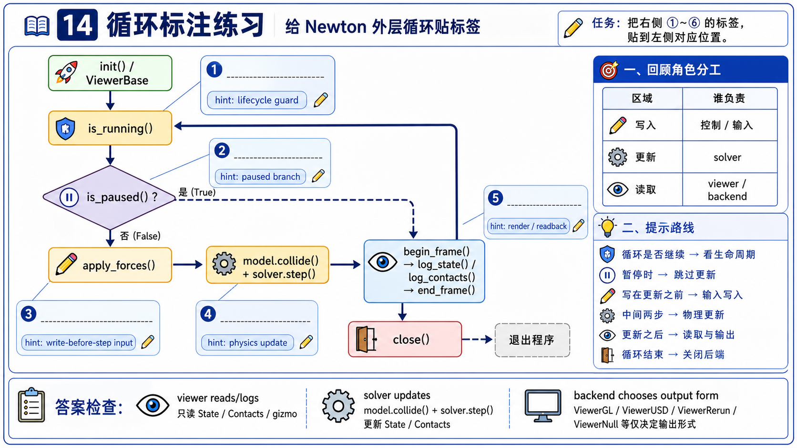

# 14 Viewer 与生态集成练习

这些练习只服务一个目标：你能不能标出 viewer 调用到底是 read、log、render、lifecycle，还是 write-before-step。



## 练习 1：给 outer loop 标颜色

把下面每行标成 `lifecycle`、`physics step`、`render/log` 或 `cleanup`：

```python
while viewer.is_running():
    if not viewer.is_paused():
        example.step()
    example.render()
viewer.close()
```

参考答案：

- `viewer.is_running()`: lifecycle。
- `viewer.is_paused()`: lifecycle/pause gate。
- `example.step()`: physics step。
- `example.render()`: render/log。
- `viewer.close()`: cleanup。

## 练习 2：找出唯一会影响下一拍 physics 的 viewer 调用

在 `basic_pendulum` 的最小循环里，标出哪个 viewer 调用可能写入下一拍 physics：

```python
self.state_0.clear_forces()
self.viewer.apply_forces(self.state_0)
self.model.collide(self.state_0, self.contacts)
self.solver.step(self.state_0, self.state_1, self.control, self.contacts, self.sim_dt)
self.viewer.log_state(self.state_0)
self.viewer.log_contacts(self.contacts, self.state_0)
```

参考答案：

- `apply_forces(self.state_0)` 是 write-before-step candidate。
- `log_state()` 和 `log_contacts()` 是 read/log/render。
- `model.collide()` 和 `solver.step()` 才是 physics producer。

## 练习 3：解释 contact arrows 的 source of truth

用两句话回答：

```text
如果 log_contacts() 画出箭头，
这些箭头的数据源来自哪里？
```

参考答案：

```text
箭头来自已有 Contacts buffer 和当前 State。
Contacts 由 collision/contact pipeline 生成，log_contacts() 只负责把它画出来。
```

## 练习 4：选择 backend

为下面场景选择 backend：

| 场景 | 推荐 backend | 理由 |
|------|--------------|------|
| 本地调试 picking 和 pause | `ViewerGL` | 需要交互窗口。 |
| CI 跑 example test | `ViewerNull` | 不需要窗口，只要 loop/test。 |
| 导出给 Omniverse / Isaac Sim 查看 | `ViewerUSD` | 输出 time-sampled `.usd`。 |
| 需要 timeline scrubbing 和数据检查 | `ViewerRerun` | Rerun 提供 timeline/data inspection。 |
| 需要离线记录并 replay | `ViewerFile` | 记录 model/state history。 |

## 练习 5：state freshness 检查

读 `ik_franka` 的 render 顺序：

```python
newton.eval_fk(self.model, self.model.joint_q, self.model.joint_qd, self.state)
body_q_np = self.state.body_q.numpy()
self.viewer.log_gizmo("target_tcp", self.ee_tf, snap_to=wp.transform(*body_q_np[self.ee_index]))
self.viewer.log_state(self.state)
```

回答：

```text
为什么 log_gizmo/log_state 之前要先 eval_fk()？
```

参考答案：

```text
因为 viewer 只读当前 state。
IK 或 joint state 改过后，需要先把 articulated body pose 刷新进 state，
否则 gizmo snap 和 log_state 可能读旧 body_q。
```

## 练习 6：生态边界判断

判断下面说法是否能写进 Chapter 14 first pass：

| 说法 | 是否可写 | 原因 |
|------|----------|------|
| `ViewerUSD` 可以输出 time-sampled USD。 | 可以 | 当前源码和 upstream docs 有锚点。 |
| Isaac Lab experimental Newton integration 存在。 | 可以 | `docs/faq.rst` 和 `docs/integrations/isaac-lab.rst` 有锚点。 |
| Newton 当前源码有 Gymnasium adapter。 | 不可写 | 当前本地源码没有直接 adapter 路径。 |
| Newton 当前源码有 MJX adapter walkthrough。 | 不可写 | 当前本地源码没有直接 adapter 路径。 |
| `example_robot_policy.py` 展示了 IsaacLab-trained policy usage。 | 可以 | 当前源码文件开头说明了这一点。 |
