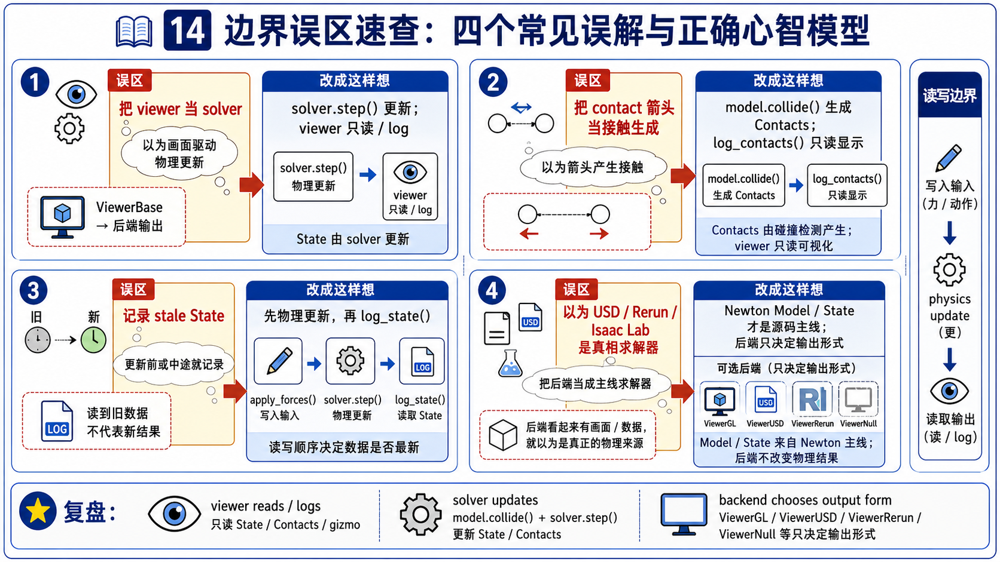

# 14 Viewer 与生态集成易错点



## 1. 把 viewer 当成 solver

错误直觉：

```text
画面动了，所以 viewer 在算 physics。
```

纠正：

```text
solver 更新 State；
viewer 读取 State 并把它输出成窗口、文件、timeline 或记录。
```

检查方法：

- 找 `solver.step()` 或具体 solver 调用。
- 找 `log_state()` 是否只在 render 阶段出现。
- 如果只有 `log_*` 没有 solver step，不要说它更新了 physics。

## 2. 把 contact arrows 当成 collision source

错误直觉：

```text
我看见箭头，所以 log_contacts() 生成了 contact。
```

纠正：

```text
model.collide() / contact pipeline 生成 Contacts；
log_contacts() 读取 Contacts 并画 overlay。
```

检查方法：

- 看 `model.collide(state, contacts)` 是否在 step 中出现。
- 看 `log_contacts(contacts, state)` 是否在 render 中出现。
- 关闭 `show_contacts` 只会影响可见性，不会关闭 collision。

## 3. 忽略 `apply_forces()` 的时序

错误直觉：

```text
apply_forces() 是 viewer API，所以它只是显示用。
```

纠正：

```text
GL backend 的 apply_forces() 可以把 picking/wind 写回 state；
它放在 solver.step() 前才影响下一拍。
```

检查方法：

- 在 example 里找 `clear_forces()`、`apply_forces()`、`solver.step()` 的顺序。
- 如果 `apply_forces()` 在 step 后，效果至少会错拍。
- 如果 backend 是 Rerun/USD/Null，要检查对应方法是否 no-op。

## 4. 忘记 state freshness

错误直觉：

```text
viewer 会自动修正我没更新的 state。
```

纠正：

```text
viewer 忠实读取 caller 给它的 state；
producer 没刷新，viewer 就读旧数据。
```

检查方法：

- IK / articulated example 中看 render 前是否有 `eval_fk()`。
- 自己改了 `joint_q`、target 或 transform 后，先问 state 是否重新计算。
- 不要把 stale visualization 当成 viewer bug。

## 5. 混淆 `ViewerUSD` 和 Chapter 04 import

错误直觉：

```text
USD viewer 和 add_usd() 是同一条 pipeline。
```

纠正：

```text
Chapter 04: scene / asset -> Model。
Chapter 14: State / Model frame logs -> time-sampled USD output。
```

检查方法：

- `add_usd()` 是 import/build side。
- `ViewerUSD` 是 output/export side。
- 两者都用 USD 词汇，但方向相反。

## 6. 把生态名词写成已有源码路径

错误直觉：

```text
结构设计里提到 MJX/Gymnasium，所以当前源码里一定有 adapter。
```

纠正：

```text
本章当前源码锚点能支撑 Viewer、USD output、Rerun、File、Null、Viser、Isaac Lab docs / example。
MJX/Gymnasium 在当前本地源码没有直接 adapter 文件，不能编造 walkthrough。
```

检查方法：

- 先 `rg` 搜源树。
- 没有路径时，只能写成生态边界或未来深入点。
- 图片里不要画出不存在的 API 名。

## 7. 用漂亮画面替代验证

错误直觉：

```text
画面看着对，所以 state/contact/solver 都对。
```

纠正：

```text
viewer 是观察工具，不是验证工具本身。
```

检查方法：

- physics 正确性回到 tests、state predicates、finite values、chapter-specific validation。
- visualization 只能帮助定位问题，不能替代 source-truth checks。
