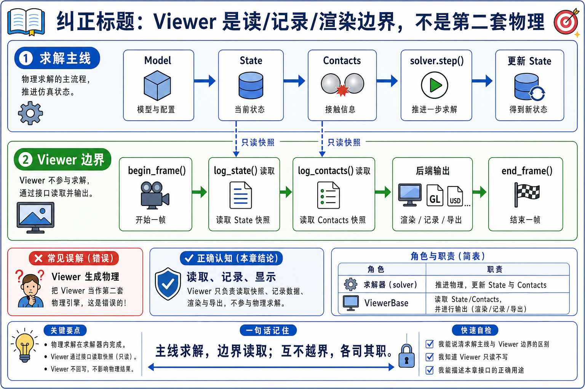
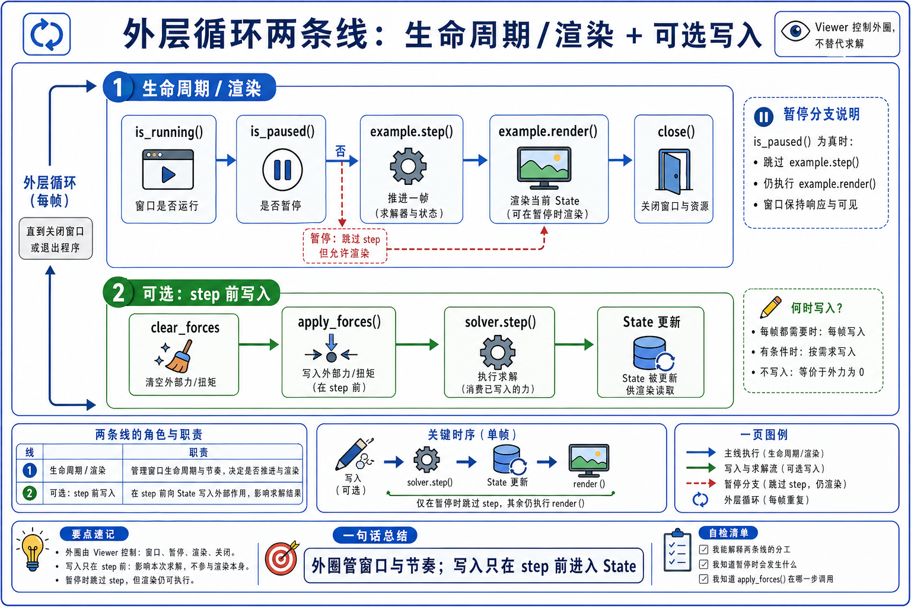
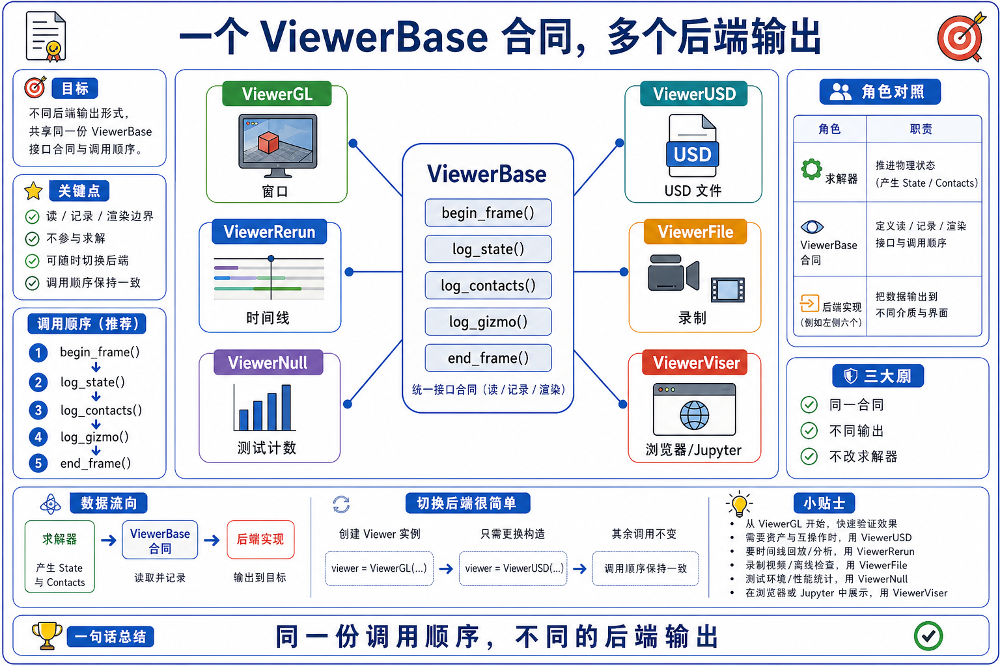
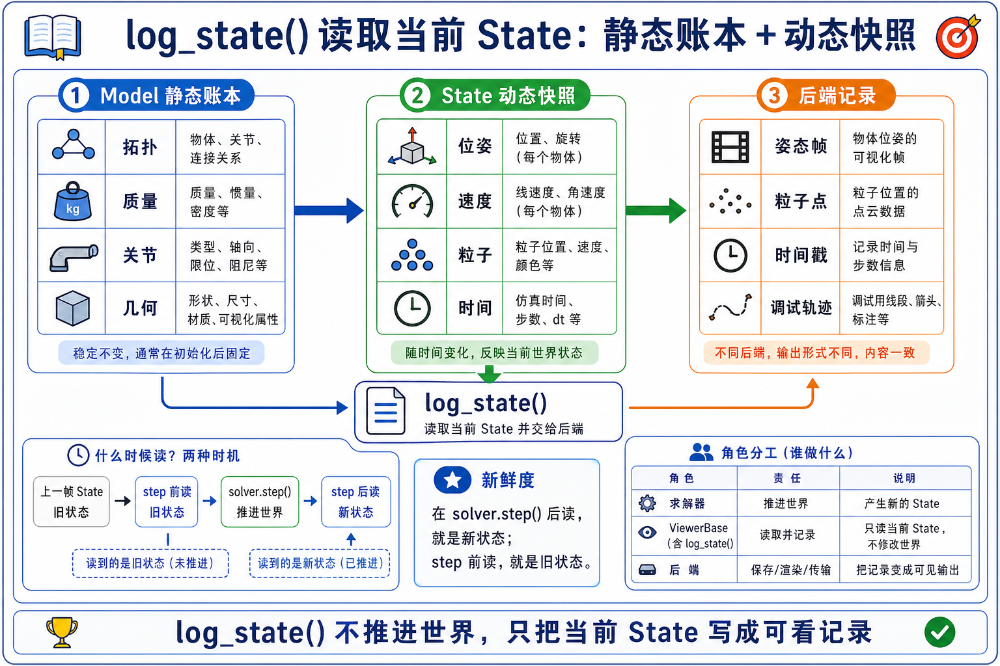
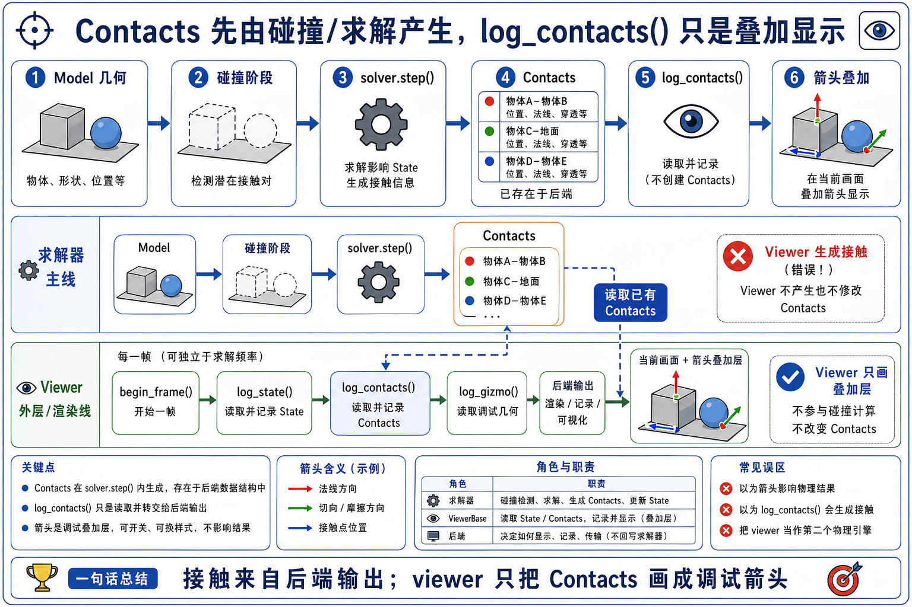
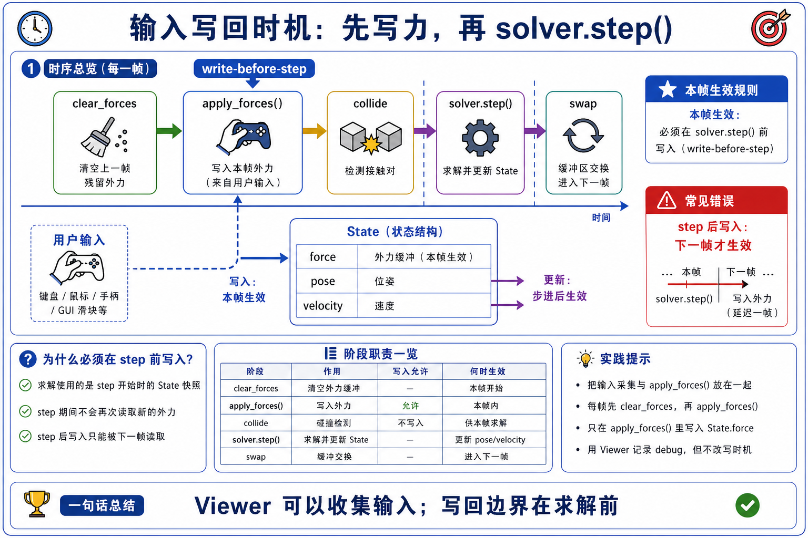
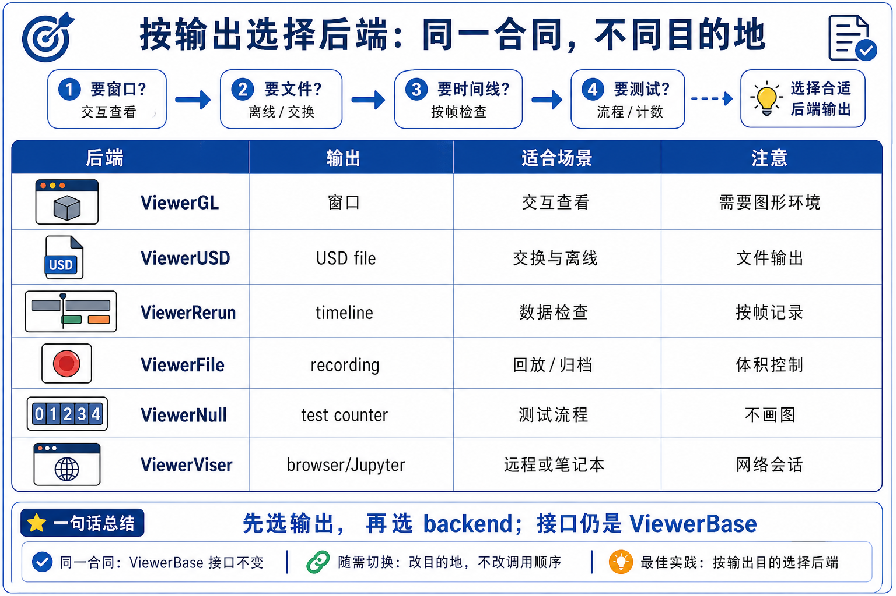
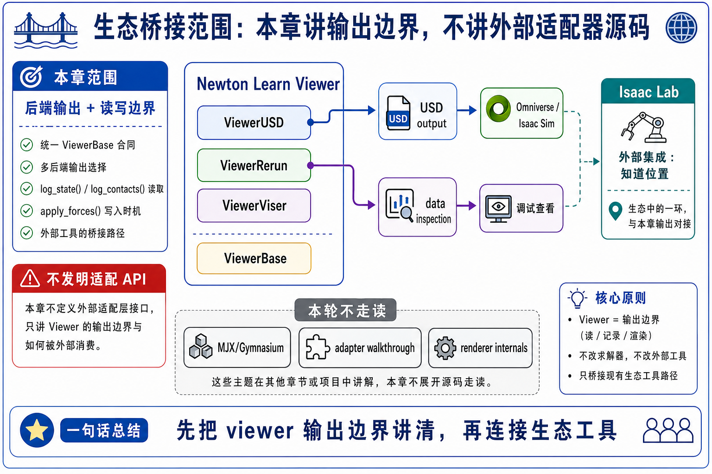

# 14 Viewer 与生态集成原理

chapter 14 的核心不是“怎样做漂亮渲染”，而是把 viewer 放回 Newton 的数据流边界里：

```text
viewer 读/记录/展示 physics 结果；
solver 才更新 physics state。
```

只要这个边界清楚，后面的 GL、USD、Rerun、File、Null、Viser、Isaac Lab 都只是不同出口。



## 0. GAMES103 回顾与 gap

GAMES103 里，可视化通常只是帮助你看懂积分、碰撞、约束、刚体姿态和接触力。Newton 里这件事多了两个工程 gap：

- viewer 有 shared interface，也有多个 backend。
- viewer 有时不只是读，它还可能通过 picking / wind / UI input 在下一拍之前写回 `State`。

所以第一遍不要问“这个 viewer 画得多复杂”，而要问：

```text
这行 viewer 调用是读 state，
还是在下一次 solver.step() 前写 state？
```

## 1. 两条边：read/log/render side 与 write-before-step side

viewer 的大部分 API 都在 read/log/render side：

- `set_model(model)`: 告诉 viewer 静态结构和 shape batches。
- `begin_frame(time)`: 建立当前 frame / timeline。
- `log_state(state)`: 读取当前 `State`，把 body、shape、particle、joint、COM 等变成 backend 可消费的记录。
- `log_contacts(contacts, state)`: 读取已有 `Contacts` 和当前 `State`，画 contact normal overlay。
- `log_gizmo()`、`log_lines()`、`log_points()`、`log_scalar()`、`log_array()`: 记录 debug overlay 或数值信号。
- `end_frame()`: 让 backend 呈现、记录、flush 或递增 frame counter。
- `close()`: 关闭窗口、保存文件、断开服务或 no-op。

少数 API 在 write-before-step side：

- `apply_forces(state)`: GL backend 可把 picking / wind 施加到 state force buffer。
- `is_key_down()`、UI callback、gizmo interaction: 可影响示例自己的 control/reset/target 逻辑。



## 2. Outer loop 不等于 physics inner loop

典型运行结构是：

```text
while viewer.is_running():
    if not viewer.is_paused():
        example.step()
    example.render()
viewer.close()
```

这里有两个不同层次：

- outer loop 由 viewer lifecycle 控制：窗口是否还开着、Null viewer 是否跑够帧数、USD viewer 是否录够 frame、Rerun process 是否还活着。
- physics inner loop 由 example / solver 控制：`clear_forces()`、`apply_forces()`、`collide()`、`solver.step()`、state swap。

`is_paused()` 暂停的是 `example.step()`，不是说 `render()` 一定不执行。暂停时继续 render 很有意义，因为你还要看当前 state、调整 camera、检查 UI 或观察 gizmo。

## 3. Shared interface 是本章的中心抽象

`ViewerBase` 让不同 backend 尽量共享同一套调用顺序：

```text
set_model()
-> begin_frame()
-> log_state()
-> optional log_contacts / log_gizmo / log_lines / log_scalar
-> end_frame()
-> close()
```

不同 backend 的差异在输出，不在 physics contract：

| Backend | `begin/end/log` 的第一遍理解 | 输出 |
|---------|------------------------------|------|
| `ViewerGL` | 维护窗口事件、camera、UI、picking、wind、frame render | OpenGL 窗口或 headless GPU frame |
| `ViewerUSD` | 把 frame time 转成 time code，把 instance transform 写进 USD stage | time-sampled `.usd` |
| `ViewerRerun` | 设置 timeline，把 mesh/instance/array/scalar 写进 Rerun | local/web/remote Rerun session |
| `ViewerFile` | 记录 model 与 state history | `.json` / `.bin` |
| `ViewerNull` | 只递增 frame counter，可用于 test / benchmark | none |
| `ViewerViser` | 把 viewer contract 输出到 browser/Jupyter workflow | web interface / `.viser` |



## 4. `log_state(state)` 读取的是当前 state

`log_state()` 的第一遍读法是：

```text
Model 提供静态 shape / body / material / world 信息；
State 提供当前动态姿态、粒子、速度相关可视化输入；
viewer 把它们转换成 backend 能消费的 mesh instances、points、lines、timeline records。
```

它不重新跑 solver，也不重新生成 contact。它只是消费当前 state。于是 state freshness 很重要：

- 如果 `solver.step()` 刚更新过 state，render 读到的是更新后的结果。
- 如果例子自己改了 joint target、IK target 或 body transform，却没有刷新 FK / state，viewer 可能读到旧姿态。
- `ik_franka` 在 render 里先调用 `newton.eval_fk(...)`，再 `log_gizmo()` 和 `log_state()`，就是一个典型 state freshness 提醒。



## 5. `log_contacts(contacts, state)` 是 overlay，不是 collision

contact arrows 很容易误导新手。它们看起来像“contact 被算出来了”，但真正的顺序是：

```text
model.collide(state, contacts)
-> solver.step(..., contacts, ...)
-> render()
-> viewer.log_contacts(contacts, state)
```

`log_contacts()` 读取的是已经存在的 `Contacts` buffer 和当前 `State`。它把 contact point 和 normal 转成可视化箭头。若 viewer 的 `show_contacts` 关闭，甚至会清空 arrow batch，而不是改 physics。



## 6. `apply_forces(state)` 的时间点决定它是不是 physics input

`apply_forces(state)` 只有在 solver step 前调用，才可能影响下一拍：

```text
clear_forces()
-> viewer.apply_forces(state)
-> model.collide(state, contacts)
-> solver.step(state_0, state_1, control, contacts, dt)
```

在 GL backend 中，picking 和 wind 都可以通过这个入口写到 state force 相关 buffer。Rerun、USD、Null 这类 backend 不做交互力时，这个方法就是 no-op 或不参与。

所以判断一个 viewer 调用是否影响 physics，不看名字里有没有 viewer，而看它是否在 step 前把输入写进 state/control。



## 7. Backend choice 是输出契约，不是算法选择

选 viewer backend 时，第一问题应该是输出要去哪里：

- 需要交互调试：选 `ViewerGL`。
- 需要生成 USD 给 Omniverse / Isaac Sim / DCC 工具：选 `ViewerUSD`。
- 需要 timeline、scrubbing、远程/网页查看：选 `ViewerRerun`。
- 需要记录并回放：选 `ViewerFile`。
- 需要 CI/test/benchmark：选 `ViewerNull`。
- 需要 browser/Jupyter workflow：选 `ViewerViser`。

这不是 solver family 选择，也不是 contact algorithm 选择。physics 仍然由 model/collision/solver 那条线决定。



## 8. 生态集成边界

Chapter 14 可以提生态，但必须控制范围：

- USD output 是 viewer/export boundary：`ViewerUSD` 记录 time-sampled stage。它和 Chapter 04 的 `add_usd()` import 方向相反。
- Rerun / Viser 是 visualization/data-inspection boundary：它们消费 viewer contract，不替代 solver。
- Isaac Lab / Isaac Sim 是外部生态边界：当前 upstream docs 说明 Isaac Lab experimental Newton integration 存在，Isaac Sim physics backend integration 仍在发展中。
- `example_robot_policy.py` 展示了 IsaacLab-trained RL policy 可以被 Newton 示例加载并控制 robot，但这仍是 example-level integration，不是 viewer backend 本身。
- 当前本地源码没有 MJX / Gymnasium adapter 文件；第一遍只把它们当作未来生态互通问题，不写成已有 source walkthrough。



## 9. 本章算子的可微性

viewer 不是 chapter 13 那种可微主线。它通常在训练/优化闭环里作为观察、记录、debug、export 层存在。

| 子流程 | 输入 | 输出 | 可微性第一遍判断 | 备注 |
|--------|------|------|------------------|------|
| `log_state(state)` | `Model` + `State` | backend render/log records | 不作为梯度路径学习 | 读 state，不更新 solver。 |
| `log_contacts(contacts, state)` | `Contacts` + `State` | arrows / lines | 不作为梯度路径学习 | contact 已经由 collision/solver 产生。 |
| `apply_forces(state)` | viewer interaction + current state | force/input side effect | 作为 forward input 看，不作为 viewer gradient | 只有在 step 前写回才影响下一拍。 |
| `ViewerUSD / ViewerRerun / ViewerFile` | frame logs | files / timeline / recordings | 不作为 solver adjoint | 是输出边界。 |

## 10. 与 Newton 实现的映射

| 原理项 | Newton 路径 / 函数 | 为什么对应 | 还需验证什么 |
|--------|---------------------|------------|--------------|
| public viewer exports | `newton/viewer.py` | 用户从这里拿到 `ViewerGL` 等类 | 类名是否仍在 `__all__` 中。 |
| shared interface | `ViewerBase` at `newton/_src/viewer/viewer.py:L30-L1249` | 统一 `set_model / begin_frame / log_state / close` 等方法 | backend override 是否改变行为。 |
| outer loop | `run()` at `newton/examples/__init__.py:L265-L307` | `viewer.is_running()` 包住 step/render | pause 时 render 是否仍执行。 |
| backend selection | `init()` at `newton/examples/__init__.py:L617-L680` | CLI `--viewer` 选择具体 backend | 参数和 choices 是否漂移。 |
| interactive write-back | `ViewerGL.apply_forces()` at `newton/_src/viewer/viewer_gl.py:L1433-L1445` | picking/wind 写回 state force | 其他 backend 多数 no-op。 |
| state logging | `ViewerBase.log_state()` at `newton/_src/viewer/viewer.py:L457-L507` | 读取 state 并写 backend instances | state freshness 由 caller 保证。 |
| contact overlay | `ViewerBase.log_contacts()` at `newton/_src/viewer/viewer.py:L599-L617` | 读取 contact buffer 并画 arrow | `show_contacts` 控制可见性，不控制 collision。 |
| USD output | `ViewerUSD` at `newton/_src/viewer/viewer_usd.py:L67-L190` | time-sampled USD stage | 不要和 Chapter 04 importer 混淆。 |
| Rerun output | `ViewerRerun` at `newton/_src/viewer/viewer_rerun.py:L28-L120` and `L418-L486` | timeline/backend process lifecycle | remote/web/Jupyter 行为需看 Rerun deps。 |
