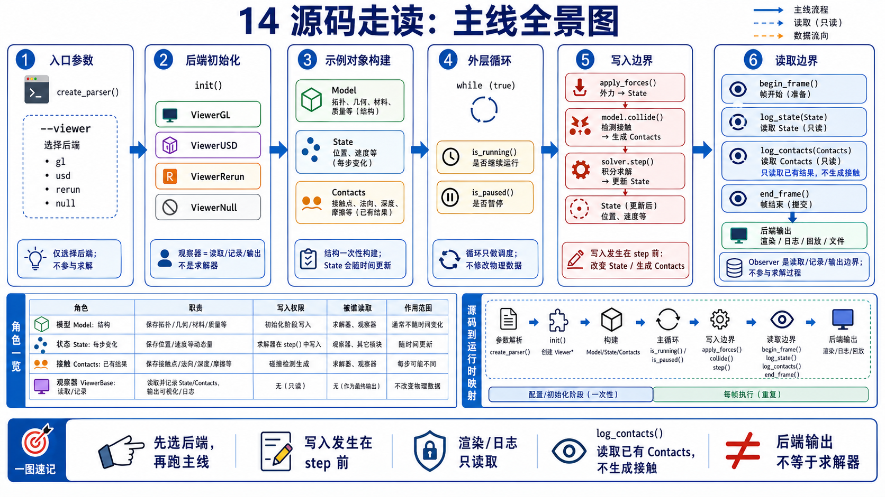
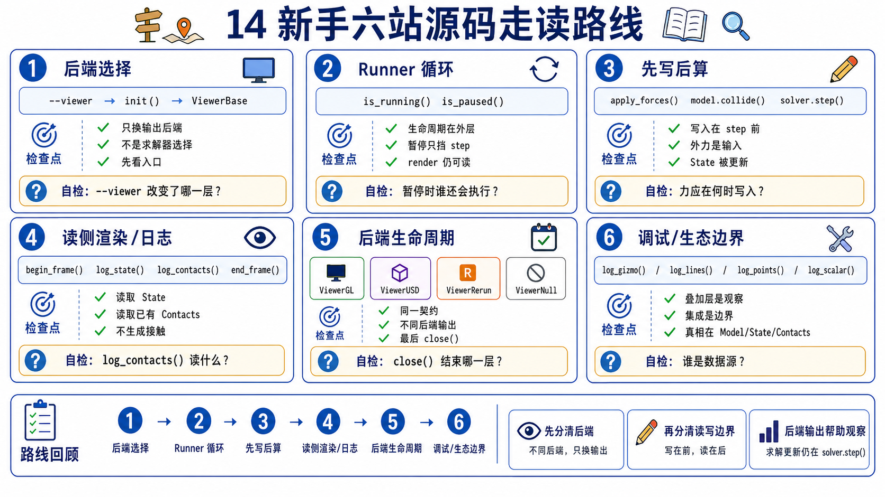
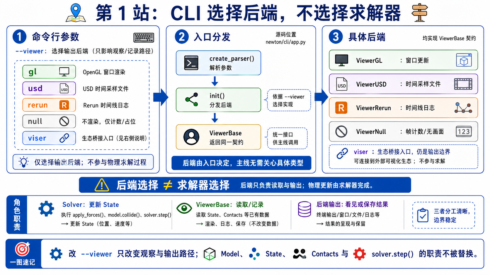
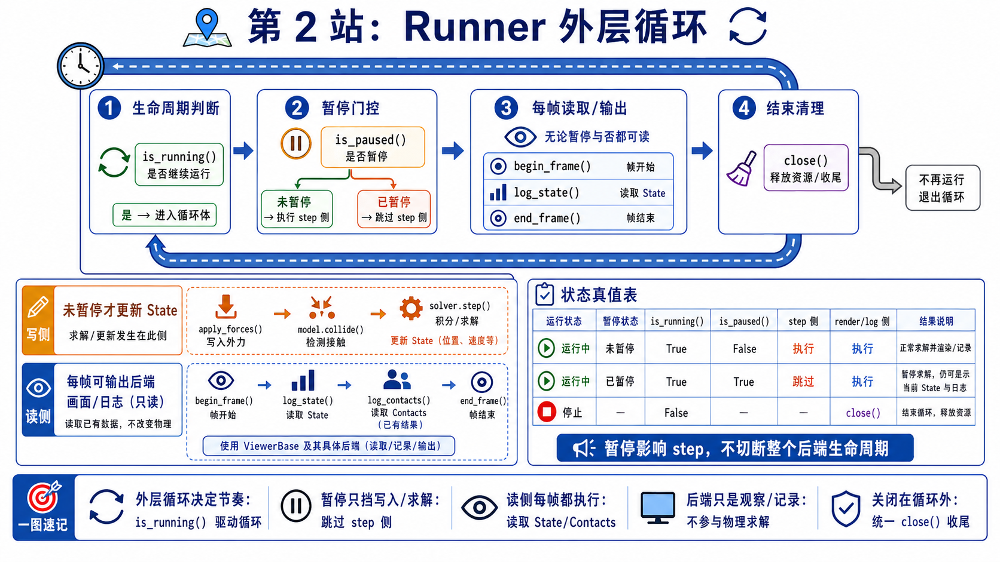
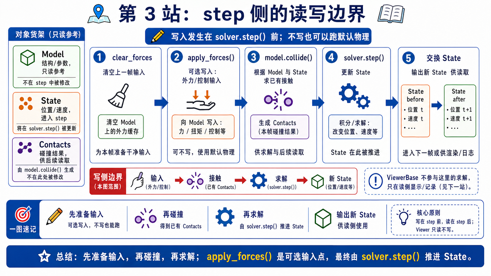
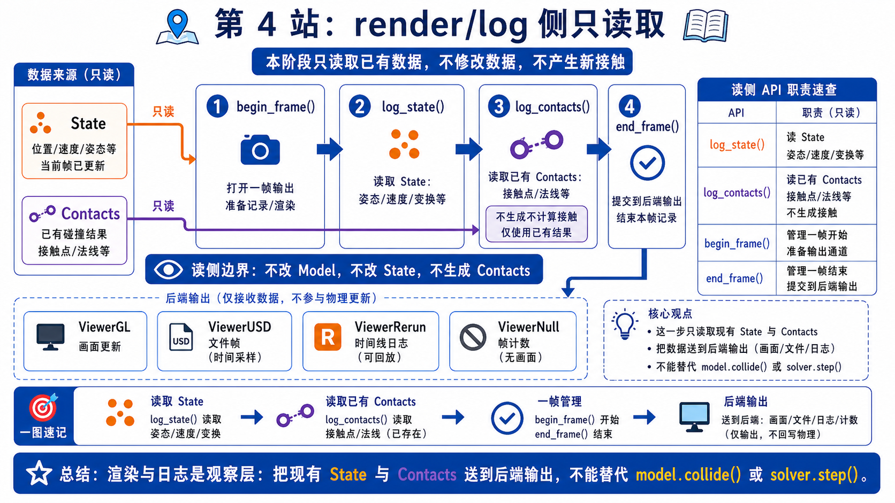
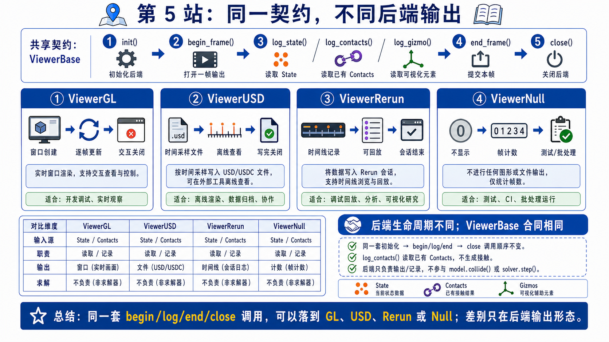
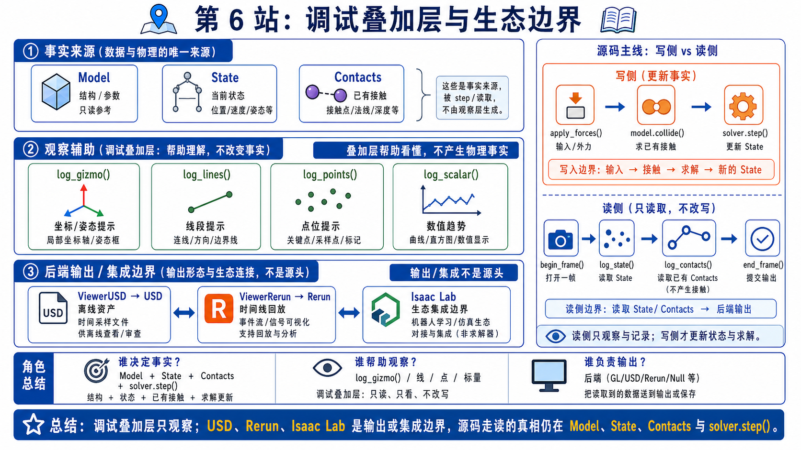
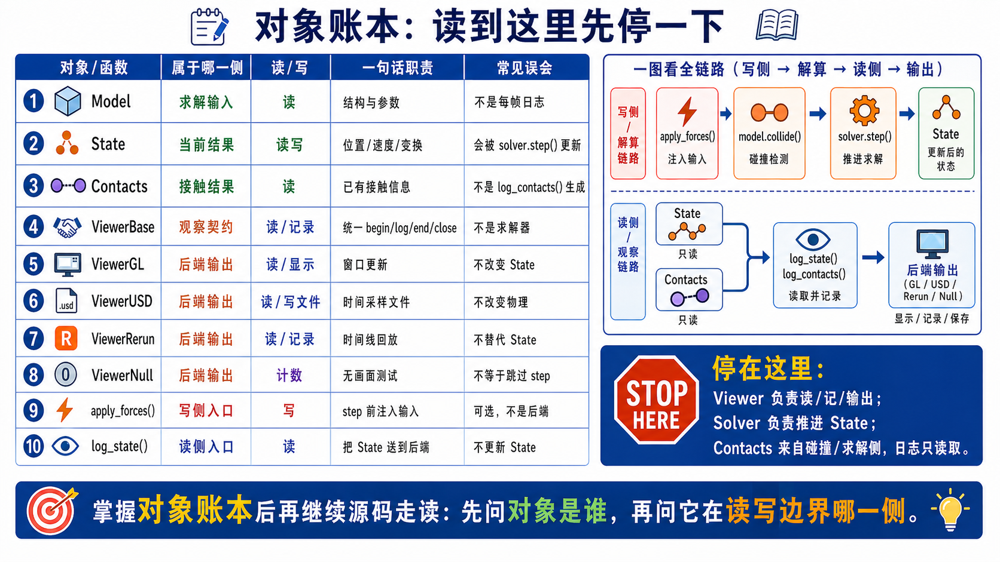

# 14 Viewer 与生态集成源码走读

这份 walkthrough 只追一条 first-pass 主线：Newton 示例如何选择 viewer backend，runner 如何把 `step()` 和 `render()` 放进同一个 outer loop，viewer 又如何在 step 前写入少量交互输入、在 render 阶段读取当前 `State / Contacts`。

只要这条线稳了，你就不会把 viewer 误读成 solver、collision pipeline 或 USD importer。

## What This Walkthrough Follows

```text
CLI args choose viewer backend
-> examples.init() returns viewer + args
-> Example(viewer, args) builds Model / State / Solver / Contacts
-> viewer.set_model(model) binds static structure
-> examples.run() owns outer lifecycle
-> example.step() may call viewer.apply_forces(state) before solver.step()
-> example.render() calls begin_frame(), log_state(), log_contacts(), end_frame()
-> concrete backend presents, exports, records, streams, counts, or no-ops
```

这一页刻意不展开：

- GL shader、OpenGL batch、renderer UI 细节。
- USD stage authoring 语法和 import pipeline。
- Rerun / Viser / Isaac Lab 的完整生态教程。
- MJX / Gymnasium adapter walkthrough，因为当前本地源码没有可锚定路径。

第一遍先守住一句话：

```text
viewer 只在边界上读/记/展示；
只有明确发生在 step 前的 input write-back 才进入下一拍 physics。
```



## One-Screen Chapter Map

```text
newton/examples/__init__.py
  create_parser()
    --viewer gl | usd | rerun | null | viser
    --output-path, --num-frames, --headless, --benchmark

  init()
    args.viewer == "gl"    -> ViewerGL
    args.viewer == "usd"   -> ViewerUSD
    args.viewer == "rerun" -> ViewerRerun
    args.viewer == "null"  -> ViewerNull
    args.viewer == "viser" -> ViewerViser

Example.__init__()
  build model/state/solver/contacts
  viewer.set_model(model)

run(example, args)
  while viewer.is_running():
    if not viewer.is_paused():
      example.step()
    example.render()
  viewer.close()

basic_pendulum.step()
  state.clear_forces()
  viewer.apply_forces(state)
  model.collide(state, contacts)
  solver.step(...)
  swap state buffers

basic_pendulum.render()
  begin_frame(sim_time)
  log_state(state)
  log_contacts(contacts, state)
  end_frame()
```

## Beginner Path

1. 先看 Stage 1。想验证什么：viewer backend 是在哪里被选择的。看完后应该能说：CLI 的 `--viewer` 决定后端，physics 模型还没有因为这个选择变成另一套算法。
2. 再看 Stage 2。想验证什么：outer loop 由谁拥有。看完后应该能说：`examples.run()` 用 `viewer.is_running()` 控制生命周期，`is_paused()` 只挡住 `example.step()`。
3. 再看 Stage 3。想验证什么：viewer 什么情况下写回 physics input。看完后应该能说：`apply_forces(state)` 在 `solver.step()` 前，所以 GL picking/wind 可以影响下一拍。
4. 再看 Stage 4。想验证什么：render 阶段读什么。看完后应该能说：`log_state` 读当前 state，`log_contacts` 读当前 contacts 和 state，它们不生成 physics。
5. 再看 Stage 5。想验证什么：backend 差异在哪里。看完后应该能说：GL、USD、Rerun、Null 的不同主要是 output/lifecycle。
6. 最后看 Stage 6。想验证什么：debug overlay 和生态边界怎么读。看完后应该能说：overlay 是观察层，Isaac Lab / USD / Rerun 是生态出口，不是 solver 替代品。



## Main Walkthrough

### Stage 1: CLI 先选 viewer backend

**Claim**

Chapter 14 的入口不是 renderer 内部，而是 `newton/examples/__init__.py` 的 CLI 选择和 `init()` 分派。



**Why it matters**

如果先钻进 `viewer_gl.py` 的渲染细节，你会错过更重要的事实：同一个 example 可以通过 `--viewer gl/usd/rerun/null/viser` 走不同输出，但它的 `Model / State / Solver / Contacts` 主线没有因此变成另一套 physics。

**Source excerpt**

以下摘录为教学注释版，注释非原源码。

```python
parser.add_argument(
    "--viewer",
    type=str,
    default="gl",
    choices=["gl", "usd", "rerun", "null", "viser"],
    help="Viewer to use (gl, usd, rerun, null, or viser).",
)
```

Source-ref: `newton/examples/__init__.py:L424-L428`.

`init()` 后面把这个字符串分派成具体 backend：

```python
if args.viewer == "gl":
    viewer = newton.viewer.ViewerGL(headless=args.headless)
elif args.viewer == "usd":
    viewer = newton.viewer.ViewerUSD(output_path=args.output_path, num_frames=args.num_frames)
elif args.viewer == "rerun":
    viewer = newton.viewer.ViewerRerun(address=args.rerun_address)
elif args.viewer == "null":
    viewer = newton.viewer.ViewerNull(...)
elif args.viewer == "viser":
    viewer = newton.viewer.ViewerViser()
```

Source-ref: `newton/examples/__init__.py:L660-L678`.

**Verification cues**

- `--viewer` 只决定 backend class。
- `--benchmark` 会强制 `args.viewer = "null"`，这是为了测 loop/solver，不是为了可视化。
- `--output-path` 只对 USD output 有意义。

**Output passed to next stage**

已经选出 viewer 后，下一步看谁拥有 outer loop。

### Stage 2: `examples.run()` 拿 viewer lifecycle 包住 step/render

**Claim**

Newton example 的 outer loop 是 viewer-aware loop：它用 viewer 决定是否继续跑，用 pause 决定是否 step，但 render 仍然在同一轮 loop 里。



**Source excerpt**

以下摘录为教学注释版，注释非原源码。

```python
while viewer.is_running():           # backend 决定生命周期：窗口、frame 数、进程状态
    if not viewer.is_paused():       # pause 只挡住 physics step
        example.step()

    example.render()                 # 暂停时仍可继续展示当前 state

viewer.close()                       # backend 做保存、断开、关闭或 no-op
```

Source-ref: `newton/examples/__init__.py:L278-L307`.

**Verification cues**

- `is_running()` 是 outer loop 条件，不是 solver 收敛条件。
- `is_paused()` 不等于 `is_running()`。
- `render()` 在 pause 外面，说明 viewer 可以继续显示当前 state。

**Output passed to next stage**

现在 outer loop 清楚了，下一步看 step 内部什么时候把 viewer input 写回 state。

### Stage 3: `basic_pendulum.step()` 把 viewer input 放在 solver 前

**Claim**

`apply_forces(state)` 不是 render 调用。它在 simulation step 里、solver 之前，所以 GL picking/wind 这类输入可以影响下一拍 physics。



**Source excerpt**

以下摘录为教学注释版，注释非原源码。

```python
for _ in range(self.sim_substeps):
    self.state_0.clear_forces()

    self.viewer.apply_forces(self.state_0)  # step 前写入 viewer-driven forces

    self.model.collide(self.state_0, self.contacts)
    self.solver.step(self.state_0, self.state_1, self.control, self.contacts, self.sim_dt)

    self.state_0, self.state_1 = self.state_1, self.state_0
```

Source-ref: `newton/examples/basic/example_basic_pendulum.py:L95-L107`.

**Verification cues**

- `apply_forces()` 在 `model.collide()` 和 `solver.step()` 前面。
- 它写的是当前 state 上的 force/input side effect，不是画图。
- 不是所有 backend 都会实际写输入。`ViewerRerun.apply_forces()` 明确是 no-op。

**Output passed to next stage**

state 更新完后，下一阶段才是 render/log。

### Stage 4: `render()` 读取当前 `State / Contacts`

**Claim**

`render()` 里的 `log_state()` 和 `log_contacts()` 是 read/log/render side。它们消费已经更新好的数据。



**Source excerpt**

以下摘录为教学注释版，注释非原源码。

```python
def render(self):
    self.viewer.begin_frame(self.sim_time)
    self.viewer.log_state(self.state_0)                  # 读取当前 State
    self.viewer.log_contacts(self.contacts, self.state_0) # 读取已有 Contacts + State
    self.viewer.end_frame()
```

Source-ref: `newton/examples/basic/example_basic_pendulum.py:L141-L145`.

`ViewerBase.log_state()` 进一步说明它的工作是把 state 转成 shape instances、points、joints、COM 等可视化记录：

```python
def log_state(self, state: newton.State):
    if self.model is None:
        return
    ...
    for shapes in self._shape_instances.values():
        if visible:
            shapes.update(state, world_offsets=self.world_offsets)
        self.log_instances(...)
    self._log_gaussian_shapes(state)
    self._log_non_shape_state(state)
```

Source-ref: `newton/_src/viewer/viewer.py:L457-L507`.

`log_contacts()` 的入口也写得很直接：

```python
def log_contacts(self, contacts: newton.Contacts, state: newton.State):
    if not self.show_contacts:
        self.log_arrows("/contacts", None, None, None)
        return
    max_contacts = contacts.rigid_contact_max
    num_contacts = min(int(contacts.rigid_contact_count.numpy()[0]), max_contacts)
```

Source-ref: `newton/_src/viewer/viewer.py:L599-L617`.

**Verification cues**

- `log_state()` 读 `State`，不调用 solver。
- `log_contacts()` 读已有 `Contacts`，不调用 collision。
- 如果 state freshness 不对，viewer 会 faithfully 读到旧结果。

**Output passed to next stage**

同一批 viewer API 到不同 backend 后，会产生不同输出。

### Stage 5: Backend lifecycle 决定 output

**Claim**

backend override 改的是 lifecycle 和 output，不是 physics contract。



**Source excerpts**

`ViewerGL` 在 frame 结束时处理窗口事件、camera、wind、render/UI，并且 `apply_forces()` 支持 picking/wind：

```python
def end_frame(self):
    self._update()

def apply_forces(self, state):
    if self.picking_enabled and self.picking is not None:
        self.picking._apply_picking_force(state)
    if self.wind is not None:
        self.wind._apply_wind_force(state)
```

Source-ref: `newton/_src/viewer/viewer_gl.py:L1420-L1445`.

`ViewerUSD` 把 frame time 变成 USD time code，并在 close 时保存 stage：

```python
def begin_frame(self, time: float):
    super().begin_frame(time)
    self._frame_index = int(time * self.fps)
    self._frame_count += 1
```

Source-ref: `newton/_src/viewer/viewer_usd.py:L149-L190`.

`ViewerRerun` 在 `begin_frame()` 设置 timeline，`apply_forces()` 是 no-op：

```python
def begin_frame(self, time: float):
    self.time = time
    rr.set_time("time", timestamp=time)

def apply_forces(self, state: newton.State):
    pass
```

Source-ref: `newton/_src/viewer/viewer_rerun.py:L418-L486`.

`ViewerNull` 用 frame counter 结束循环，logging methods 是 no-op：

```python
def end_frame(self):
    self.frame_count += 1

def is_running(self) -> bool:
    if self.frame_count >= self.num_frames:
        return False
    return True
```

Source-ref: `newton/_src/viewer/viewer_null.py:L111-L154`.

**Verification cues**

- GL 是交互和窗口生命周期。
- USD 是 time-sampled export。
- Rerun 是 timeline logging。
- Null 是 loop/test/benchmark utility。
- 这些都复用同一个 `set_model / begin_frame / log_state / end_frame / close` 外形。

**Output passed to next stage**

除了 state/contact 主线，viewer 还可承载 debug overlay 和生态边界。

### Stage 6: Debug overlays 和生态边界

**Claim**

`log_lines / log_points / log_gizmo / log_scalar / log_array` 帮你观察或交互，但它们不是 source of truth。生态集成也要按边界读。



**Source excerpt**

`ik_franka` 的 render 是一个 state freshness 例子：先刷新 FK，再 log gizmo/state。

```python
def render(self):
    self.viewer.begin_frame(self.sim_time)

    newton.eval_fk(self.model, self.model.joint_q, self.model.joint_qd, self.state)
    body_q_np = self.state.body_q.numpy()

    self.viewer.log_gizmo("target_tcp", self.ee_tf, snap_to=wp.transform(*body_q_np[self.ee_index]))
    self.viewer.log_state(self.state)
    self.viewer.end_frame()
```

Source-ref: `newton/examples/ik/example_ik_franka.py:L144-L156`.

**Ecosystem cues**

- `ViewerUSD` output 可以给 Omniverse / Isaac Sim / DCC 工具看，但这是 output boundary，不是 Chapter 04 import boundary。
- `docs/faq.rst:L43-L57` 说明 Isaac Lab experimental Newton integration 存在，Isaac Sim backend integration 在发展中，并且 rich real-time graphics 常与 Isaac Lab 配合。
- `example_robot_policy.py:L5-L18` 展示了 IsaacLab-trained policy 的 example-level 用法。
- 当前源码搜索没有发现 MJX / Gymnasium adapter 文件，因此本章不把它们写成 source walkthrough。

**Checkpoint**

如果你看到 viewer 图像就说“collision 算出来了”，先退回 Stage 4。图像只是 overlay。source of truth 是 collision/solver 生成的 buffers。

## Object Ledger



| 对象 / API | 住在哪里 | 第一遍角色 | 常见误读 |
|------------|----------|------------|----------|
| `Model` | simulation core | 静态结构，viewer 用它建 shape batches | viewer 自己创建 physics |
| `State` | simulation runtime | 当前动态状态，viewer 读取它 | viewer 重新积分 state |
| `Contacts` | collision/runtime buffers | contact overlay 的输入 | `log_contacts()` 生成 contact |
| `ViewerBase` | `newton/_src/viewer/viewer.py` | shared interface | 具体 renderer |
| `ViewerGL` | `viewer_gl.py` | interactive debug backend | solver |
| `ViewerUSD` | `viewer_usd.py` | time-sampled USD output | USD importer |
| `ViewerRerun` | `viewer_rerun.py` | timeline/data-inspection backend | training framework |
| `ViewerNull` | `viewer_null.py` | no-op/test/benchmark backend | broken viewer |
| `apply_forces()` | concrete backend + example step | step-before input write-back | render call |
| `log_state()` | viewer base + backend output | read/log current state | source of truth |

## Stop Here

第一遍读到这里就够了。你应该能把 Chapter 14 讲成下面这句：

```text
Newton viewer 共享一套读/记录/展示接口；
runner 用 viewer 控制外层生命周期；
physics 仍由 collision 和 solver 更新；
少数交互输入只有在 step 前写回 state 时才影响下一拍。
```

## Go Deeper

下一轮深入可以按兴趣选：

- GL renderer internals: `viewer_gl.py`、`gl/opengl.py`、`gl/shaders.py`。
- USD export details: `viewer_usd.py` 的 mesh prototype、point instancer、time samples。
- Rerun / Viser details: timeline、web viewer、Jupyter integration。
- Recording/replay: `viewer_file.py` 与 `example_recording.py` / replay viewer。
- Isaac Lab integration: upstream `docs/integrations/isaac-lab.rst` 和 Isaac Lab 外部文档。
