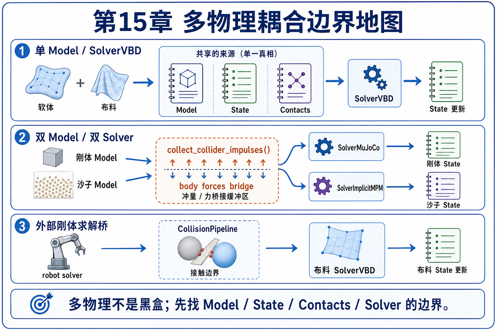
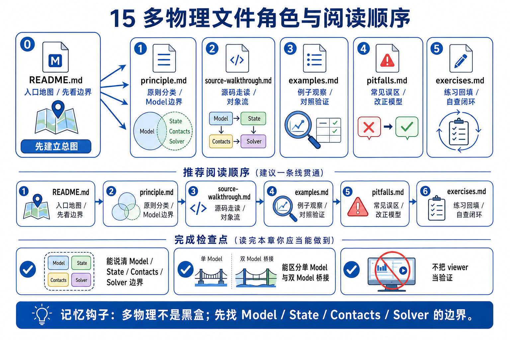
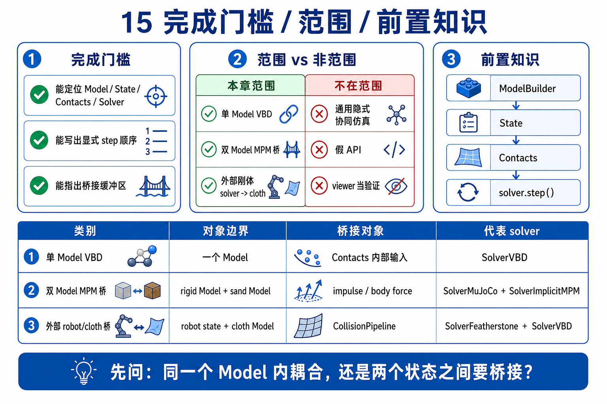

# 15 多物理耦合与端到端流水线：coupling boundary

chapter 14 把 viewer 放回了边界层：它读、记录、展示，不替代 solver。chapter 15 往前再走一步：当一个场景里同时出现 soft body、cloth、rigid body、MPM sand、robot solver 或外部生态 pipeline 时，真正要追的问题不是“画面里有几种物体”，而是：

```text
哪些对象住在同一个 Model / State / Contacts 里？
哪些对象由同一个 solver 一起推进？
哪些耦合只是跨 solver / 跨 model 的显式数据桥？
哪些只是 roadmap 或生态层面的承诺，不能写成当前源码事实？
```

第一遍只守住这句话：

```text
多物理不是把所有东西混成一个黑盒；
它是 Model / State / Contacts / Solver 之间的耦合边界。
```



## 文件分工

- `README.md`: 立住本章主问题、边界分类、完成门槛和阅读顺序。
- `principle.md`: 讲清 single-model coupling、two-model bridge、external-solver bridge 和 roadmap boundary。
- `source-walkthrough.md`: 沿 multiphysics、MPM two-way、cloth-Franka 三条源码路径串 call order。
- `examples.md`: 给代表性例子分配唯一观察任务。
- `pitfalls.md`: 记录最容易把多物理误读成“任意 solver 自动互通”的地方。
- `exercises.md`: 用小练习检查你能不能标出耦合发生在哪一层。



迁移记录：本次 preflight 只发现 `main` 上的原始骨架 README，没有旧 Chapter 15 分支、worktree 或正文可迁移；因此本章按当前 Newton 源码锚点重新编写。

## 本章目标

- 把“多物理”拆成可验证的工程边界，而不是口号。
- 能说清 `newton/examples/multiphysics/` 当前只有两个 VBD-only soft/cloth 示例。
- 能解释 `add_soft_grid()`、`add_cloth_grid()`、`add_soft_mesh()`、`add_cloth_mesh()` 都是在 builder 阶段把材料和拓扑放进 `Model`。
- 能说清 `SolverVBD` 为什么是 single-model soft/cloth/particle-rigid coupling 的主锚点。
- 能解释 `mpm_twoway_coupling` 为什么是 two-model / two-solver / impulse bridge，而不是单个 solver 自动包办。
- 能解释 `cloth_franka` 为什么把 robot solver 和 cloth VBD 通过显式 step order 与 collision pipeline 接起来。
- 能把 FAQ 里的 one-way / two-way / implicit coupling roadmap 和当前源码 walkthrough 区分开。

## First-Pass Spine

```text
choose the coupling category
-> build material systems into Model(s)
-> allocate State / Control / Contacts
-> configure solver(s)
-> decide the data bridge between systems
-> run step order explicitly
-> verify source-of-truth buffers
-> render/log only after physics update
```

## 三种耦合边界

| 边界 | 本章第一遍叫法 | 代表源码 | 关键问题 | 不要误会成 |
|------|----------------|----------|----------|------------|
| single `Model`, single solver | VBD 统一耦合 | `example_softbody_dropping_to_cloth.py`, `example_softbody_gift.py` | soft body 与 cloth 都进同一个 `Model`，由 `SolverVBD` 同步推进 | 任意 solver 都能跑 soft+cloth |
| two `Model`s, two solvers | 显式数据桥 | `example_mpm_twoway_coupling.py` | sand MPM 和 rigid bodies 分别有模型/求解器，通过 collider impulses 和 body forces 交换 | 一个自动隐式 co-sim 黑盒 |
| external rigid solver + cloth VBD | 外部刚体求解器桥 | `example_cloth_franka.py` | robot pose/control 由 rigid solver 处理，cloth VBD 读碰撞和 state 接着求解 | robot 和 cloth 完全同一套方程 |

## 本章范围

第一遍覆盖：

- `newton/examples/multiphysics/` 的两个 soft/cloth 示例。
- builder 阶段如何把 soft tetrahedra 和 cloth triangles 放进模型。
- `SolverVBD` 的 particle/rigid coupling 语义和 step 三阶段。
- `model.collide()` / `CollisionPipeline.collide()` 与 `contacts` 在耦合里的角色。
- `mpm_twoway_coupling` 作为 two-model bridge 的对照例子。
- `cloth_franka` 作为 robot solver 与 cloth solver 的 external bridge 对照例子。
- FAQ 对 one-way / two-way / implicit coupling 的范围说明。

第一遍不覆盖：

- 完整 VBD 数学推导。Chapter 10 / 11 / 13 会分别支撑 soft/cloth/MPM/diffsim 背景。
- 任意 solver pair 的通用 co-simulation 框架。当前源码示例要逐个读。
- 把 FAQ roadmap 写成已经存在的 implicit coupling API。
- 把 visual output 当成多物理正确性证明。Chapter 14 已经把 viewer 边界讲清。



## GAMES103 已有 vs 本章新增

| 维度 | GAMES103 已有 | 本章新增 |
|------|----------------|----------|
| 物理 / 数学视角 | 刚体、软体、布料、粒子系统各自有状态、能量、约束和接触。 | 先判断这些对象是否在同一个 `Model/State/Contacts`，再判断 solver 如何交换数据。 |
| Newton 工程视角 | 之前章节分别讲 builder、collision、solver、viewer。 | 本章把 builder、contacts、solver step、viewer log 串成端到端 pipeline。 |
| GPU / Warp 视角 | kernel / capture / arrays 是执行载体。 | 耦合常体现为显式 buffer bridge：forces、impulses、collider ids、particle/body states。 |
| 生态 / roadmap 视角 | 传统课程很少说明当前实现边界。 | 当前源码 walkthrough、FAQ roadmap、外部生态承诺要分层写清楚。 |

## 前置依赖

- 建议先读 `02_newton_arch`，知道 `Model / State / Control / Contacts / Solver` 的基本分工。
- 建议先读 `10_softbody_cloth_cable`，知道 cloth/soft body 的 particle/FEM 表示。
- 建议先读 `11_mpm`，知道 MPM 的 particle-grid-particle pipeline。
- 建议先读 `14_viewer_integration`，避免把 render/log output 当成耦合 source of truth。

## 阅读顺序

1. 先读本文件，把 Chapter 15 的标题改写成 `coupling boundary, not magic integration`。
2. 再读 `principle.md`，掌握 single-model、two-model、external-solver 三类边界。
3. 再读 `source-walkthrough.md`，沿真实源码看 step order 和数据桥。
4. 再看 `examples.md`，把每个例子的唯一 teaching job 记住。
5. 最后用 `pitfalls.md` 和 `exercises.md` 检查自己有没有把 roadmap、viewer、solver、contact 混在一起。

## 完成门槛

```text
[ ] 我能说出 current multiphysics directory 只有两个 VBD-only soft/cloth 示例
[ ] 我能画出 softbody_dropping_to_cloth 的 builder -> model -> VBD -> state swap 主线
[ ] 我能解释 add_soft_* 和 add_cloth_* 是建模入口，不是 runtime solver
[ ] 我能解释 VBD 的 coupling 发生在同一个 Model / Contacts / SolverVBD 内
[ ] 我能解释 MPM two-way coupling 的 rigid model 和 sand model 为什么是两个 source-of-truth buffer
[ ] 我能解释 collider impulses 如何桥接到 rigid body forces
[ ] 我能解释 cloth_franka 的 robot solver 和 cloth solver 的执行顺序
[ ] 我能区分当前源码事实、FAQ roadmap、viewer visualization 三种边界
```

## 读完后带走什么

读完 Chapter 15 后，最该带走的是一个排查顺序：

```text
先问同不同 Model；
再问同不同 State / Contacts；
再问同不同 solver；
最后问跨系统交换的是 forces、contacts、impulses、poses，还是只是 viewer output。
```

这条边界会服务后面的自制实验：一旦你要改 coupling 参数、换 solver 或写自己的 bridge，最先出错的通常不是图像，而是 source-of-truth buffer 和 step order。
