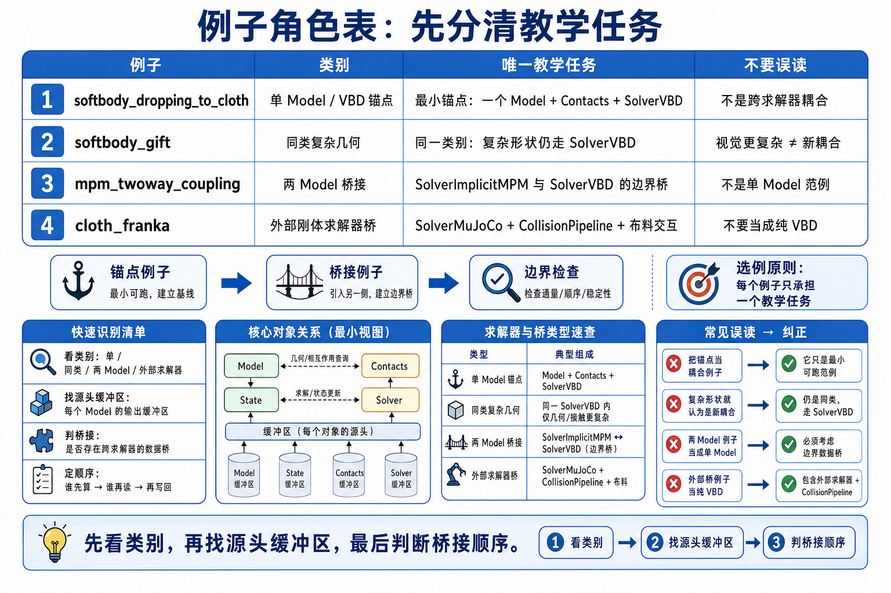
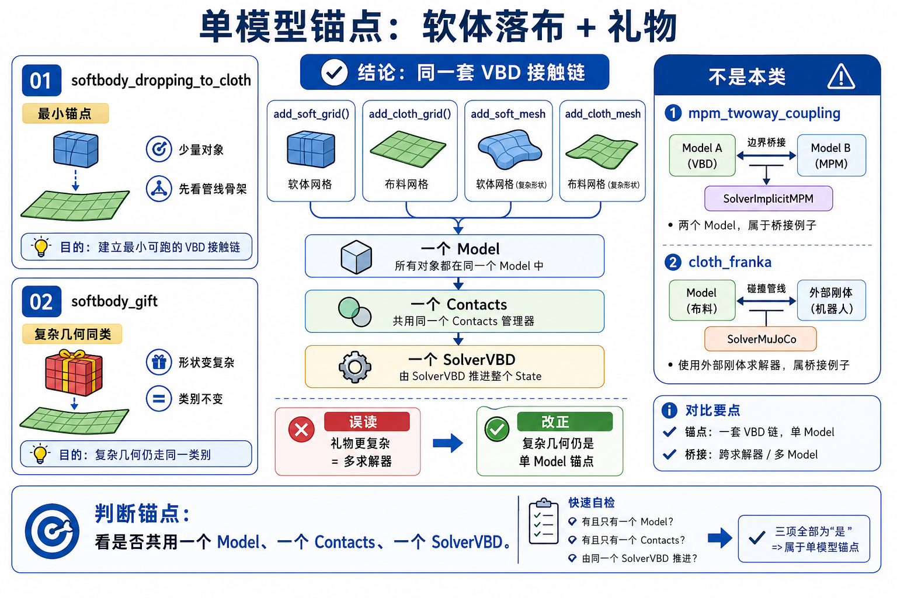

# 15 多物理耦合与端到端流水线例子注释

这页不是 demo catalog。每个例子只保留一个 teaching job，帮助你判断耦合边界在哪里。

## 例子分工

| 例子 | 本章唯一 job | 第一遍看什么 | 可以跳过什么 |
|------|--------------|--------------|--------------|
| `softbody_dropping_to_cloth` | 最小 soft+cloth single-model 主锚点 | `add_soft_grid + add_cloth_grid -> SolverVBD -> contacts -> state swap` | 具体材料参数调优 |
| `softbody_gift` | 复杂几何仍是 same coupling category | custom tet blocks + cloth straps 都进一个 `Model` | cloth loop 几何 helper 的所有细节 |
| `mpm_twoway_coupling` | two-model / two-solver bridge 对照 | rigid model、sand model、impulse bridge | 所有 MPM 内部线性求解细节 |
| `cloth_franka` | external rigid solver + cloth solver 对照 | robot step、collision pipeline、cloth VBD step order | IK/control 全部细节 |

## 主例子：`softbody_dropping_to_cloth`

### 为什么先看它

它是当前 `examples/multiphysics/` 里最小的 Chapter 15 主例子：

- 一个 soft body: `add_soft_grid()`。
- 一个 cloth sheet: `add_cloth_grid()`。
- 一个 finalized `Model`。
- 一个 `SolverVBD`。
- 一个 `Contacts` buffer。
- 一个标准 example loop。

### 逐段注释

| 代码段 | 做了什么 | 为什么要这样读 |
|--------|----------|----------------|
| `builder.add_soft_grid(...)` | 加入 volumetric FEM soft body | 这是建模入口，不是 runtime coupling。 |
| `builder.add_cloth_grid(...)` | 加入 cloth FEM triangle grid | cloth 与 soft body 进入同一个 builder。 |
| `builder.color()` | 生成 VBD 需要的 coloring | 不是单纯 viewer color。 |
| `self.model = builder.finalize()` | 生成 runtime model | single-model boundary 成立。 |
| `self.model.soft_contact_* = ...` | 设置 soft contact 参数 | contact coupling 的材料/接触参数。 |
| `SolverVBD(model=self.model, ...)` | 创建统一求解器 | soft+cloth 由同一个 solver step 推进。 |
| `model.collide(state, contacts)` | 更新 contact buffer | contacts 是 solver 输入。 |
| `solver.step(...)` | 推进 state | coupling 在这里被消费。 |
| `viewer.log_state/log_contacts` | render/log | 只读结果，不证明 coupling 正确。 |

## 对照例子：MPM two-way coupling

`example_mpm_twoway_coupling.py` 的 job 是提醒你：不是所有多物理都在一个 `Model` 里完成。

第一遍看：

- rigid bodies 用 `builder` 和 `self.model`。
- sand particles 用 `sand_builder` 和 `self.sand_model`。
- rigid solver 是 `SolverMuJoCo`。
- MPM solver 是 `SolverImplicitMPM`。
- `setup_collider(model=self.model)` 让 MPM 读 rigid colliders。
- `collect_collider_impulses()` 和 `compute_body_forces` 把 sand 反作用写回 rigid body force。

结论：这是显式 bridge。它很重要，但它不是当前 `examples/multiphysics/` 的 single-VBD 主线。

## 对照例子：Cloth-Franka

`example_cloth_franka.py` 的 job 是展示 external rigid solver bridge。

第一遍看：

- robot control 先生成。
- `robot_solver.step(...)` 更新机器人相关 state。
- `collision_pipeline.collide(...)` 生成 cloth/body contacts。
- `cloth_solver.step(...)` 消费 contacts 推进 cloth。
- VBD 初始化时带 `integrate_with_external_rigid_solver=True`。

结论：这里的耦合靠显式 step order 和 collision pipeline。不要把它写成“所有机器人/布料都自动隐式耦合”。

## 改这里会怎样

| 改动点 | 预期现象 | 最值得观察 |
|--------|----------|------------|
| 改 `particle_self_contact_radius` | self-contact 行为变化 | 粒子是否互穿、是否过硬。 |
| 改 `soft_contact_ke/kd/mu` | 接触刚度、阻尼、摩擦变化 | penetration、振荡、稳定性。 |
| 关掉 `model.collide()` | solver 读不到新 contacts | 接触响应缺失或 stale。 |
| MPM bridge 中不 `collect_collider_impulses()` | rigid 不再收到 sand 反馈 | two-way 变 one-way 或错拍。 |
| Cloth-Franka 中调换 robot/cloth step order | cloth 读到不同 robot pose/contact | source-of-truth 时序改变。 |
