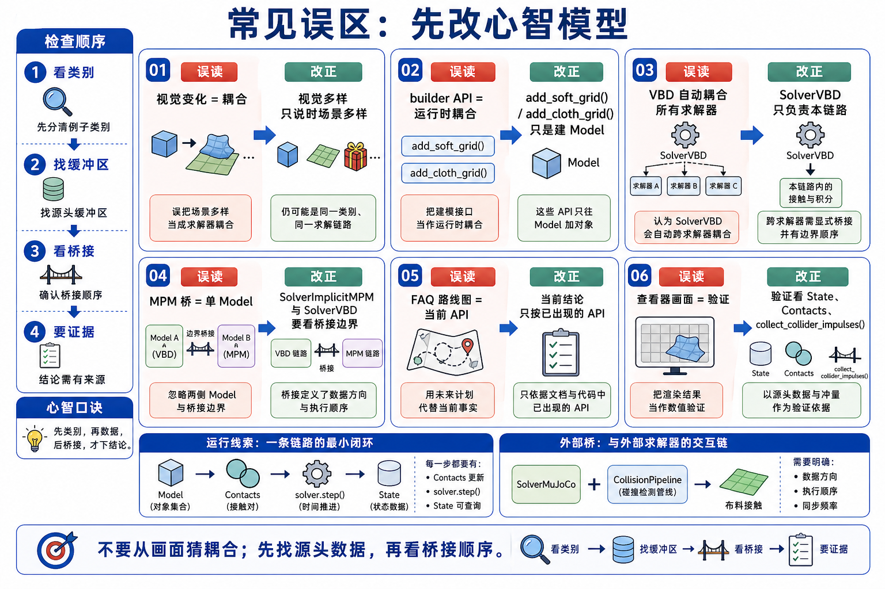

# 15 多物理耦合与端到端流水线易错点



## 1. 把“画面里有多种物体”当成多物理耦合

错误直觉：

```text
画面里有 soft body 和 cloth，所以我已经理解 coupling。
```

纠正：

```text
先问它们是否共享 Model / State / Contacts / Solver。
```

检查方法：

- 找 `builder.finalize()` 出现几次。
- 找有几个 `state_*` 变量族。
- 找 solver 是一个还是多个。

## 2. 把 builder API 当成 runtime coupling

错误直觉：

```text
add_soft_grid() 和 add_cloth_grid() 已经完成耦合。
```

纠正：

```text
builder API 只把拓扑、材料和初始状态写进 Model；
runtime coupling 要看 contacts 和 solver.step()。
```

检查方法：

- builder 阶段看“有什么”。
- simulate 阶段看“谁更新状态”。
- contacts/bridge buffer 看“系统之间交换什么”。

## 3. 把 VBD 示例泛化成任意 solver 自动耦合

错误直觉：

```text
VBD 可以 soft+cloth，所以任何 solver 都可以自动 soft+cloth。
```

纠正：

```text
当前 multiphysics 示例显式限制 solver choices=["vbd"]。
```

检查方法：

- 看 example parser 的 `--solver` choices。
- 看是否 raise only supports VBD。
- 换 solver 前先找源码支持，不要按概念推断。

## 4. 把 MPM two-way bridge 看成 single-model solver

错误直觉：

```text
MPM two-way coupling 应该就是一个 solver.step()。
```

纠正：

```text
该例子有 rigid model 和 sand model，也有 MuJoCo solver 和 MPM solver；
耦合靠 impulses -> body forces 的显式桥。
```

检查方法：

- 找 `self.model` 和 `self.sand_model`。
- 找 `self.solver` 和 `self.mpm_solver`。
- 找 `compute_body_forces()`、`collect_collider_impulses()`。

## 5. 把 FAQ roadmap 写成当前 API

错误直觉：

```text
FAQ 说 two-way / implicit coupling，所以当前源码一定有通用 implicit co-sim API。
```

纠正：

```text
FAQ 是范围和 roadmap 说明；Chapter 15 walkthrough 必须锚定当前源码。
```

检查方法：

- 当前源码有路径才写成 source walkthrough。
- 只有 FAQ 说明就写成边界/roadmap。
- 不画不存在的 API。

## 6. 用 viewer 输出替代 coupling 验证

错误直觉：

```text
动画看起来不错，所以多物理耦合正确。
```

纠正：

```text
viewer 只读结果；正确性要回到 state predicates、contacts、bridge buffers、test_final。
```

检查方法：

- 看 `test_final()` 里检查 bbox、penetration、particle/body state。
- 对 bridge 例子，检查 impulses/forces 是否按预期更新。
- 不把 `log_points()` 或 `log_contacts()` 当成 physics producer。
