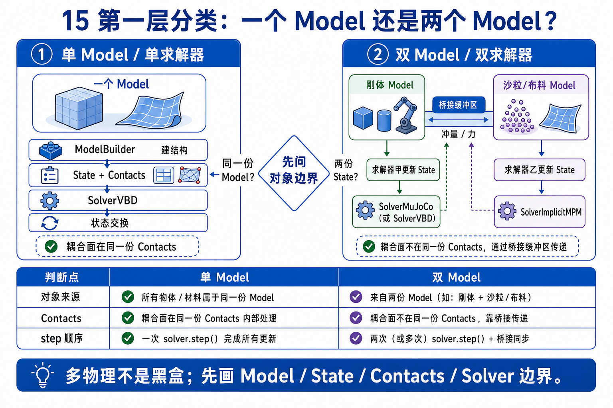
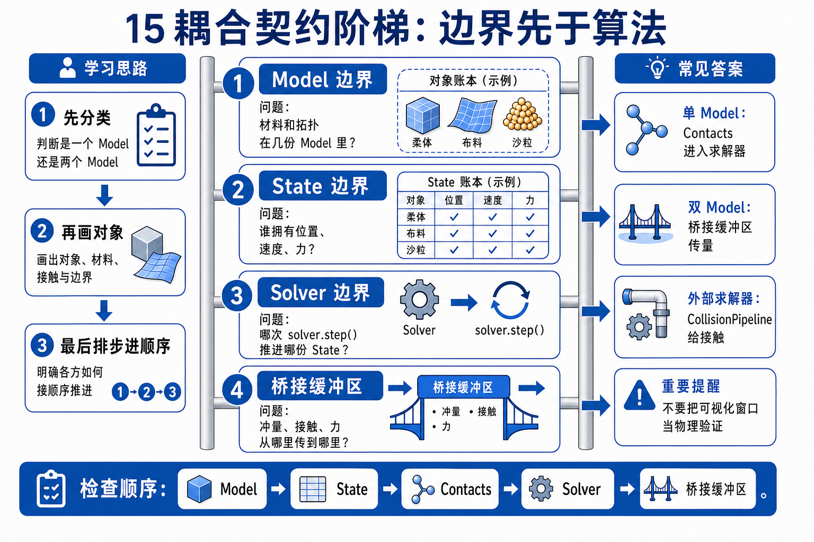
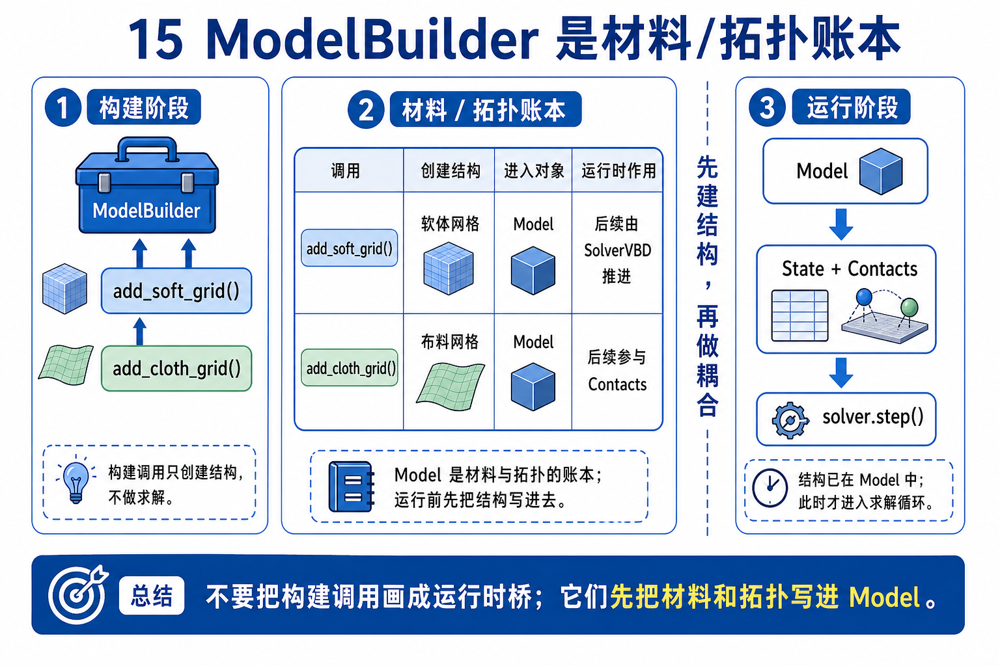
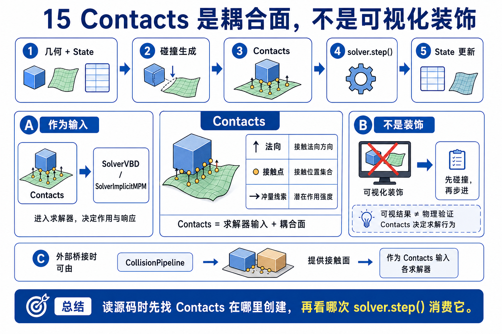
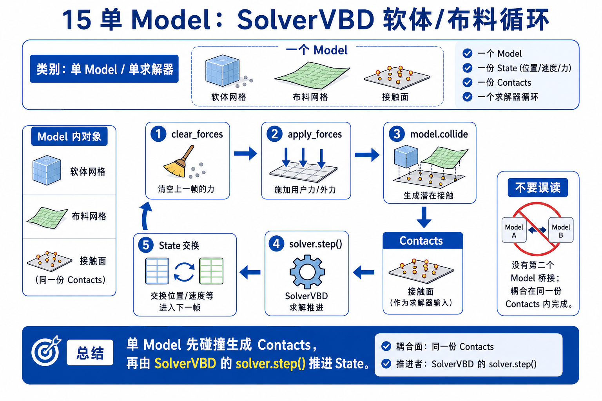
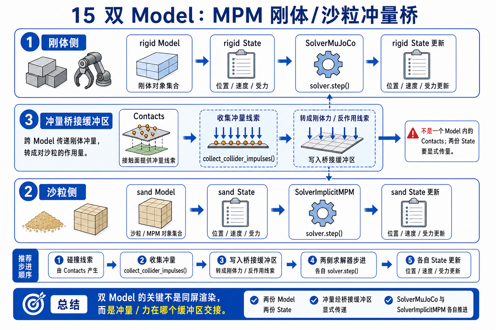
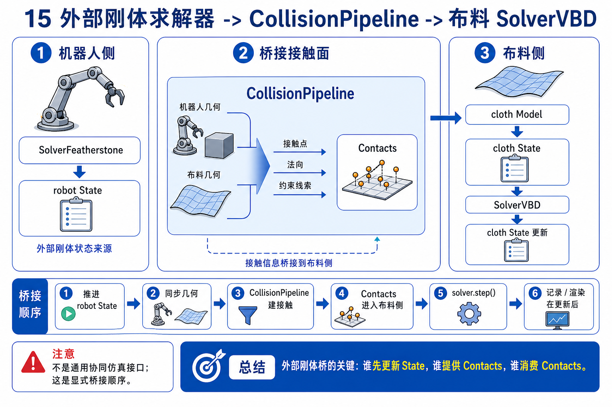
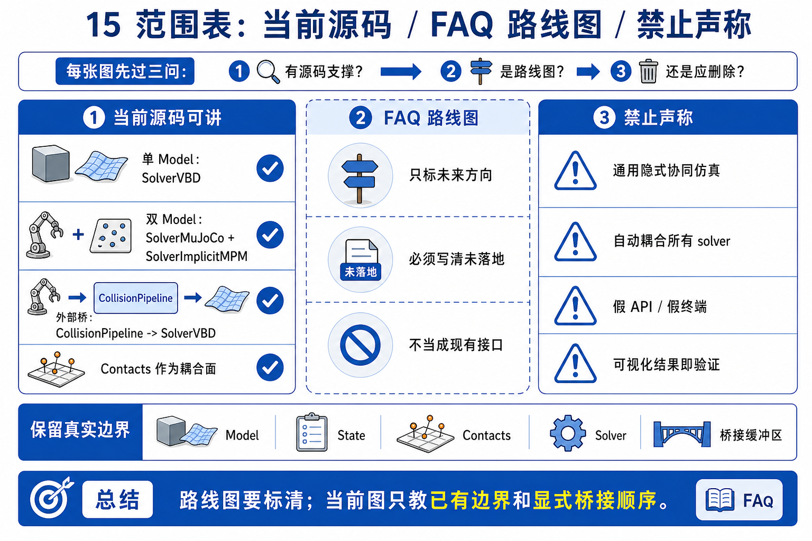

# 15 多物理耦合与端到端流水线原理

Chapter 15 的核心不是“同时有很多物体”，而是“不同物理系统在哪个边界交换数据”。

```text
同一个 Model 内的耦合，看 solver contract；
跨 Model / solver 的耦合，看显式 bridge；
FAQ roadmap，只能写成范围说明，不能写成源码事实。
```



## 0. GAMES103 回顾与 gap

GAMES103 会分别讲刚体、软体、布料、粒子、接触和约束。但工程系统里还有一个 gap：这些物理对象可以被放进同一个 `Model`，也可以分属不同 `Model` 和 solver。它们之间的耦合方式不由“画面上挨在一起”决定，而由数据结构和 step order 决定。

第一遍用三个问题分类：

- 它们是否共享同一个 `Model / State / Contacts`？
- 它们是否由同一个 solver 的 `step()` 推进？
- 如果不是，同步数据从哪里来，写到哪里去？



## 1. Builder 阶段只是建模，不是耦合已经发生

`ModelBuilder` 负责把不同材料和拓扑写进模型：

- `add_soft_grid()` / `add_soft_mesh()`: tetrahedral FEM soft body。
- `add_cloth_grid()` / `add_cloth_mesh()`: triangle FEM cloth with bending/edge elements。
- rigid body / shape / ground plane APIs: 刚体和碰撞形状。
- `builder.color()`: 为 VBD 的 particle/body coloring 准备数据。
- `builder.finalize()`: 产生运行时 `Model`。

这一阶段回答的是“场景里有什么”。真正的耦合要等到 runtime：`State`、`Contacts`、collision、solver iteration 和跨 solver bridge。



## 2. Contacts 是耦合表面，不是 viewer 装饰

在 soft/cloth 示例里，常见顺序是：

```text
state.clear_forces()
viewer.apply_forces(state)
model.collide(state, contacts)
solver.step(state_in, state_out, control, contacts, dt)
state swap
```

`contacts` 在这里是物理输入，不是 Chapter 14 那种 render 后的 overlay。viewer 可以在 render 阶段 `log_contacts()`，但 coupling 发生在 `solver.step()` 消费 contacts 的时候。



## 3. VBD single-model 耦合

`SolverVBD` 是 Chapter 15 的主锚点。源码 docstring 说它支持：

- particle simulation: cloth / soft bodies through VBD。
- rigid body simulation: joints / contacts through AVBD。
- coupled particle-rigid body systems。

第一遍把它记成：

```text
one Model
-> one State pair
-> one Contacts buffer
-> SolverVBD interleaves particle and rigid/body iterations
```

`example_softbody_dropping_to_cloth.py` 和 `example_softbody_gift.py` 都把 soft body 和 cloth 放进同一个 `Model`，再用一个 `SolverVBD` 推进。它们不是 two-solver co-simulation。



## 4. MPM two-model 显式 bridge

`example_mpm_twoway_coupling.py` 是另一类边界：

```text
rigid builder -> model -> SolverMuJoCo
sand builder -> sand_model -> SolverImplicitMPM
MPM solver reads rigid colliders
collected collider impulses become rigid body forces
rigid state updates, then sand state updates
```

这里有两个 source-of-truth state：

- `state_0/state_1`: rigid bodies。
- `sand_state_0`: MPM particles/material state。

耦合不是一个神秘函数，而是显式 bridge：`collect_collider_impulses()`、`compute_body_forces`、`body_sand_forces`、`setup_collider(model=self.model)`。



## 5. External rigid solver bridge

`example_cloth_franka.py` 代表第三类边界。它把 robot solver 和 cloth solver 放在同一大例子里，但 step order 是显式写出来的：

```text
generate robot control
robot_solver.step(...)
collision_pipeline.collide(...)
cloth_solver.step(...)
state swap
```

这里的重点不是“机器人和布料自动融成一个 solver”，而是：

- robot state/control 先更新。
- collision pipeline 在当前 state 上生成 contacts。
- cloth VBD 读这些 contacts 和 state，推进 cloth。
- `integrate_with_external_rigid_solver=True` 说明 VBD 要和外部 rigid solver 的结果配合。



## 6. FAQ / roadmap 边界

Newton FAQ 说明：Newton 设计上支持用户实现 solver coupling，并已展示 one-way coupling；generic solver two-way coupling 和 select-solvers implicit coupling 在 roadmap 上。注意这不否定当前源码里的特定示例：`mpm_twoway_coupling` 已经展示了一个 two-model impulse bridge。

所以 Chapter 15 的写法必须分层：

| 说法 | 本章怎么写 |
|------|------------|
| 当前源码有 VBD soft/cloth 示例 | 可以走读，给 source refs。 |
| 当前源码有 MPM two-way coupling 示例 | 可以作为对照 bridge 走读。 |
| FAQ 说 generic two-way / select-solvers implicit coupling 是 roadmap | 可以引用为边界说明，但不要覆盖当前 `mpm_twoway_coupling` 示例。 |
| 任意 solver pair 已经自动 implicit-coupled | 不可写。 |
| viewer 图像证明 coupling 正确 | 不可写。 |



## 7. 本章可微性第一遍判断

Chapter 15 不重新打开 Chapter 13 的完整梯度话题。第一遍只做边界判断：

| 路径 | 梯度第一遍判断 | 备注 |
|------|----------------|------|
| single-model VBD soft/cloth | 需要回到 VBD solver 与具体 example 是否启用 grad | 本章不承诺所有参数可微。 |
| MPM two-way bridge | bridge 中有显式 kernel / impulse transfer | 梯度路径要逐 kernel / buffer 审查。 |
| cloth-Franka external bridge | rigid solver 与 cloth solver 分段执行 | 梯度和控制路径不能靠 viewer 判断。 |
| viewer render/log | 不作为物理 source of truth | Chapter 14 已经说明。 |

## 8. 与 Newton 实现的映射

| 原理项 | Newton 路径 / 函数 | 第一遍角色 |
|--------|---------------------|------------|
| soft grid builder | `newton/_src/sim/builder.py:L7843-L7876` | tetrahedral FEM grid。 |
| soft mesh builder | `newton/_src/sim/builder.py:L8006-L8034` | raw tet mesh or `TetMesh` input。 |
| cloth grid builder | `newton/_src/sim/builder.py:L7488-L7521` | planar cloth grid。 |
| cloth mesh builder | `newton/_src/sim/builder.py:L7608-L7636` | triangle mesh cloth。 |
| VBD support statement | `newton/_src/solvers/vbd/solver_vbd.py:L88-L157` | particle/rigid coupling solver。 |
| VBD step phases | `newton/_src/solvers/vbd/solver_vbd.py:L1338-L1381` | initialize, iterate, finalize。 |
| softbody to cloth example | `example_softbody_dropping_to_cloth.py:L36-L151` | minimal single-model soft/cloth coupling。 |
| gift example | `example_softbody_gift.py:L148-L283` | custom geometry, soft blocks, cloth straps。 |
| MPM two-way bridge | `example_mpm_twoway_coupling.py:L99-L253` | two models, two solvers, impulse bridge。 |
| cloth-Franka bridge | `example_cloth_franka.py:L229-L258` and `L546-L581` | external rigid solver + cloth VBD。 |
