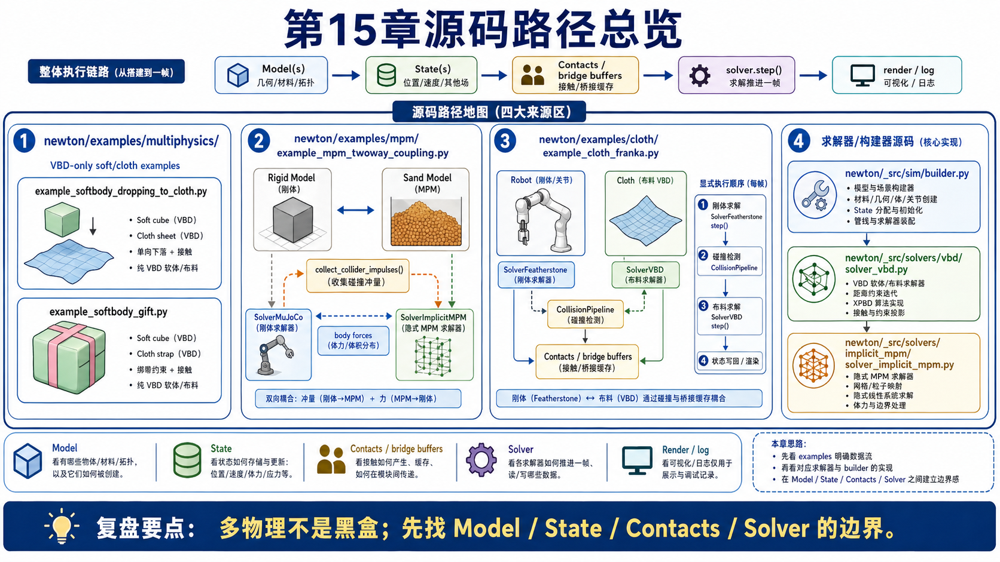
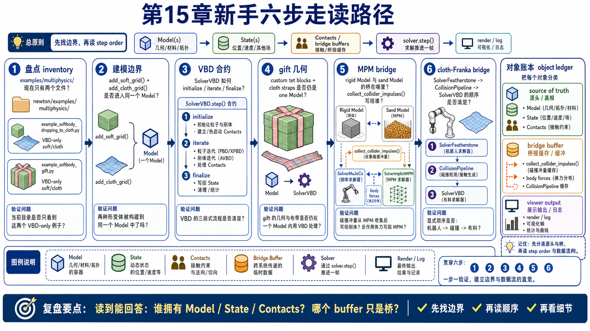
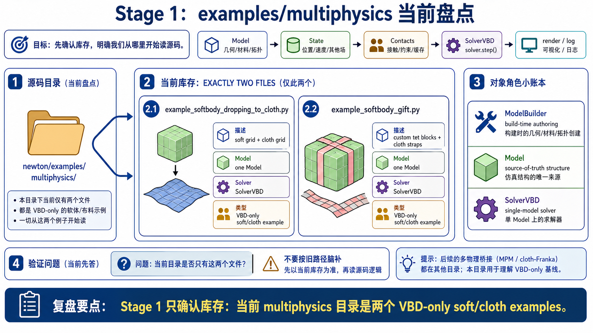
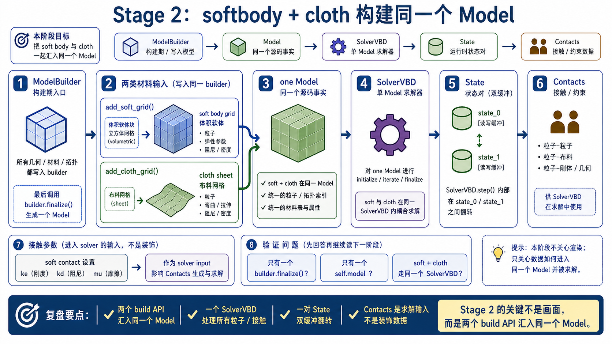
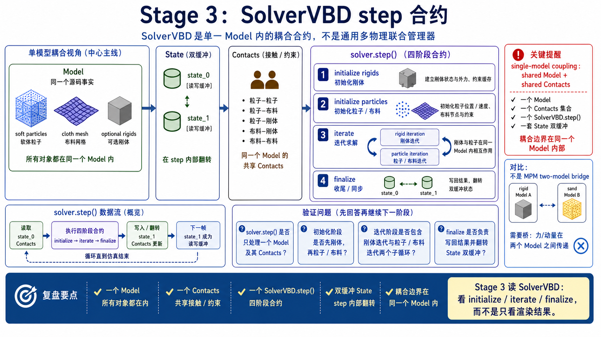
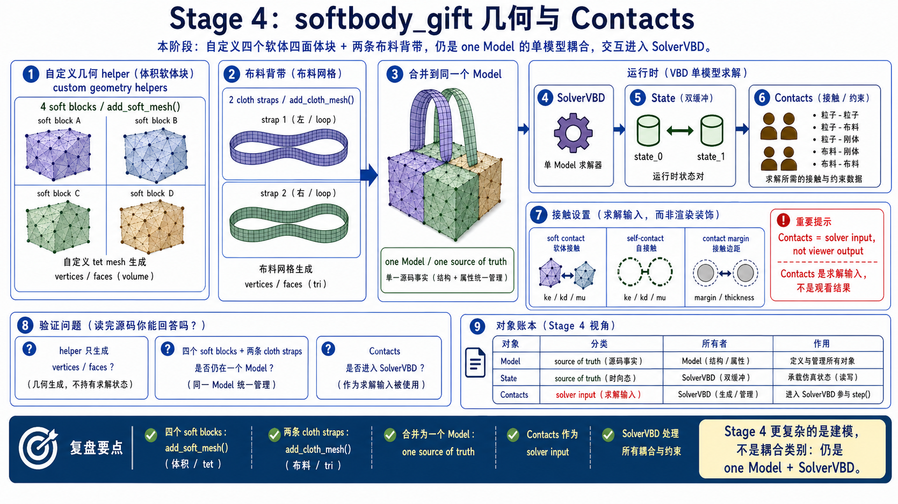
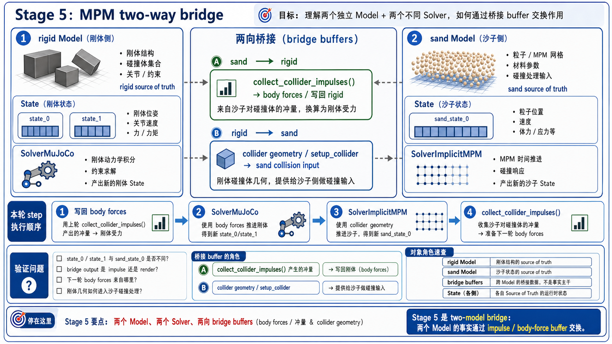
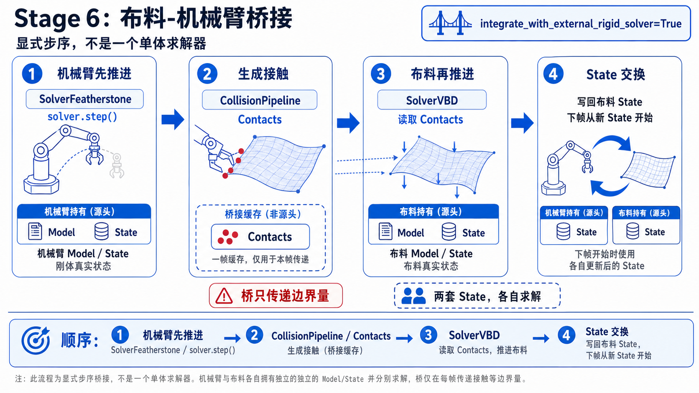
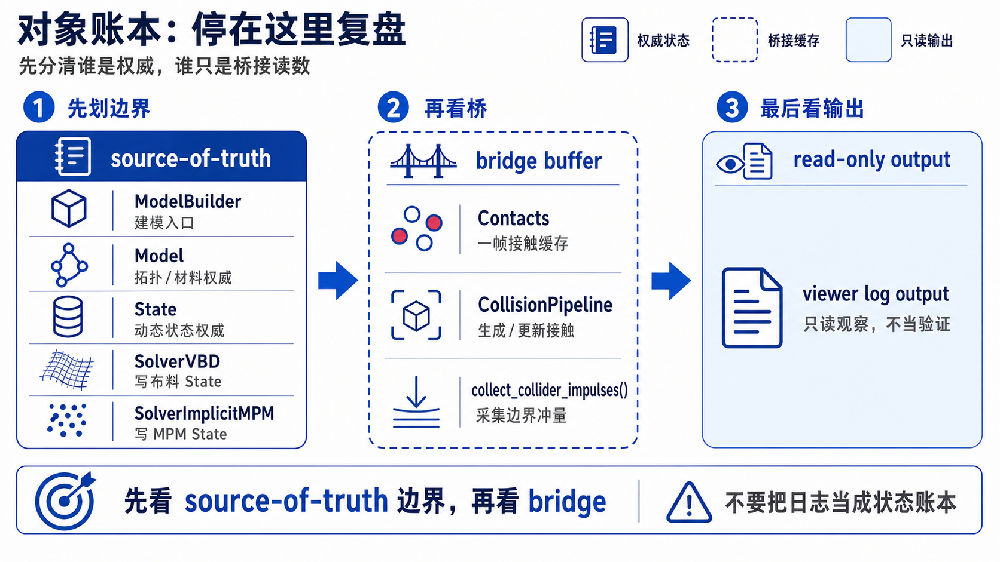

# 15 多物理耦合与端到端流水线源码走读

这份 walkthrough 只追 first-pass 主线：当前 Newton 源码里，多物理耦合到底是同一个 `Model/Solver` 内部完成，还是通过两个 `Model/Solver` 之间的显式 bridge 完成。

不要从画面开始读。先从 source-of-truth buffer 开始读：

```text
Model(s) -> State(s) -> Contacts / bridge buffers -> Solver step order -> render/log
```



## One-Screen Chapter Map

```text
newton/examples/multiphysics/
  example_softbody_dropping_to_cloth.py
    add_soft_grid + add_cloth_grid
    one Model, one SolverVBD

  example_softbody_gift.py
    custom tet blocks + cloth strap meshes
    one Model, one SolverVBD

newton/examples/mpm/example_mpm_twoway_coupling.py
  rigid model + sand model
  SolverMuJoCo + SolverImplicitMPM
  collider impulses -> rigid body forces

newton/examples/cloth/example_cloth_franka.py
  robot SolverFeatherstone + cloth SolverVBD
  collision_pipeline -> cloth contacts
```

## Beginner Path

1. 先看 Stage 1。确认当前 multiphysics 目录到底有什么，不要按旧 spec 脑补路径。
2. 再看 Stage 2。读 softbody-dropping-to-cloth 的 builder 和 runtime loop。
3. 再看 Stage 3。读 `SolverVBD` 的 single-model coupling contract。
4. 再看 Stage 4。读 softbody-gift 的 custom geometry 和 contact settings。
5. 再看 Stage 5。读 MPM two-way coupling 的 two-model bridge。
6. 再看 Stage 6。读 cloth-Franka 的 external rigid solver bridge。
7. 最后看 object ledger，确认每个对象到底是 source of truth、bridge buffer 还是 viewer output。



## Main Walkthrough

### Stage 1: 先盘点 current-source inventory

**Claim**

当前 `newton/examples/multiphysics/` 只有两个文件：

- `example_softbody_dropping_to_cloth.py`
- `example_softbody_gift.py`



**Why it matters**

旧结构设计里写过 `newton/_src/examples/multiphysics/`，但当前源码真实路径不是这个。Chapter 15 不能按旧路径写 walkthrough。

**Verification cue**

```bash
find newton/examples/multiphysics -maxdepth 1 -type f
```

Expected current output is those two example files.

### Stage 2: `softbody_dropping_to_cloth` 建一个 single Model

**Claim**

这个例子把一个 soft body grid 和一个 cloth grid 放进同一个 builder，finalize 成同一个 `Model`。



**Source excerpt**

以下摘录为教学注释版，注释非原源码。

```python
builder = newton.ModelBuilder()
builder.add_ground_plane()

builder.add_soft_grid(...)   # volumetric soft body
builder.add_cloth_grid(...)  # cloth sheet

builder.color()
model = builder.finalize()
```

Source-ref: `newton/examples/multiphysics/example_softbody_dropping_to_cloth.py:L36-L79`.

接着它设置 soft contact 参数、创建 VBD solver、分配 state/control/contacts：

```python
model.soft_contact_ke = 1.0e5
model.soft_contact_kd = 1e-5
model.soft_contact_mu = 1.0

solver = newton.solvers.SolverVBD(model=model, ...)
state_0 = model.state()
state_1 = model.state()
contacts = model.contacts()
```

Source-ref: `example_softbody_dropping_to_cloth.py:L81-L101`.

**Verification cues**

- 只有一个 `builder.finalize()`。
- 只有一个 `self.model`。
- soft body 和 cloth 都走同一个 `SolverVBD`。

### Stage 3: VBD step 是 single-model coupling contract

**Claim**

`SolverVBD` 的文档说它支持 particle simulation、rigid body simulation 和 coupled particle-rigid systems；step 内部按 initialize / iterate / finalize 推进。



**Source excerpt**

```python
class SolverVBD(SolverBase):
    """An implicit solver using Vertex Block Descent (VBD) for particles
    and Augmented VBD (AVBD) for rigid bodies.
    """
```

Source-ref: `newton/_src/solvers/vbd/solver_vbd.py:L88-L157`.

`step()` 的第一遍结构：

```python
_initialize_rigid_bodies(...)
_initialize_particles(...)

for iter_num in range(iterations):
    _solve_rigid_body_iteration(...)
    _solve_particle_iteration(...)

_finalize_rigid_bodies(...)
_finalize_particles(...)
```

Source-ref: `solver_vbd.py:L1338-L1381`.

**Verification cues**

- VBD coupling 是 solver 内部的 shared model / shared contacts problem。
- 它不是 MPM two-model bridge。
- `builder.color()` 是 VBD 运行前的重要准备，不是 visual-only color。

### Stage 4: `softbody_gift` 展示复杂建模，不改变 coupling category

**Claim**

`softbody_gift` 比第一个例子复杂，但 coupling category 仍是 single `Model` + single `SolverVBD`。



**Source excerpt**

```python
strap1_verts, strap1_faces = cloth_loop_around_box(...)
strap2_verts, strap2_faces = cloth_loop_around_box(...)

for i in range(4):
    builder.add_soft_mesh(...)

builder.add_cloth_mesh(...)
builder.add_cloth_mesh(...)
```

Source-ref: `newton/examples/multiphysics/example_softbody_gift.py:L26-L79` and `L148-L200`.

Runtime contract:

```python
self.model = builder.finalize()
self.solver = newton.solvers.SolverVBD(model=self.model, ...)
self.contacts = self.model.contacts()
```

Source-ref: `example_softbody_gift.py:L202-L228`.

**Verification cues**

- 自定义几何 helper 只负责生成 cloth mesh vertices/faces。
- 四个 soft blocks 和两条 cloth straps 最终仍在一个 `Model`。
- contact 参数和 self-contact 配置影响 solver coupling，不是 viewer 配置。

### Stage 5: `mpm_twoway_coupling` 是 two-model bridge

**Claim**

MPM two-way coupling 不是 single VBD-style coupling。它显式维护 rigid model 和 sand model，用 impulse bridge 让两边交换影响。



**Source excerpt**

```python
builder = newton.ModelBuilder()
self._emit_rigid_bodies(builder)
self.model = builder.finalize()

sand_builder = newton.ModelBuilder()
SolverImplicitMPM.register_custom_attributes(sand_builder)
self._emit_particles(sand_builder, voxel_size)
self.sand_model = sand_builder.finalize()

self.mpm_solver = SolverImplicitMPM(self.sand_model, mpm_options)
self.mpm_solver.setup_collider(model=self.model)
self.solver = newton.solvers.SolverMuJoCo(self.model, ...)
```

Source-ref: `newton/examples/mpm/example_mpm_twoway_coupling.py:L99-L136`.

Step order:

```python
compute_body_forces(...)
solver.step(rigid_state)
simulate_sand()
collect_collider_impulses()
```

Source-ref: `example_mpm_twoway_coupling.py:L188-L253`.

**Verification cues**

- `state_0/state_1` 和 `sand_state_0` 是不同 buffers。
- `collect_collider_impulses()` 是 bridge output。
- `compute_body_forces` 把上一轮 sand impulses 写成 rigid body forces。
- render 阶段 `log_points("/sand", ...)` 只是显示 sand particles。

### Stage 6: `cloth_franka` 是 external rigid solver bridge

**Claim**

`cloth_franka` 展示 robot solver 和 cloth solver 的显式执行顺序。



**Source excerpt**

Setup:

```python
self.collision_pipeline = newton.CollisionPipeline(...)
self.contacts = self.collision_pipeline.contacts()
self.robot_solver = SolverFeatherstone(...)
self.cloth_solver = SolverVBD(
    self.model,
    integrate_with_external_rigid_solver=True,
    ...
)
```

Source-ref: `newton/examples/cloth/example_cloth_franka.py:L229-L258`.

Step order:

```python
self.robot_solver.step(...)
self.collision_pipeline.collide(self.state_0, self.contacts)
self.cloth_solver.step(self.state_0, self.state_1, self.control, self.contacts, self.sim_dt)
self.state_0, self.state_1 = self.state_1, self.state_0
```

Source-ref: `example_cloth_franka.py:L546-L581`.

**Verification cues**

- robot step happens before cloth collision/solver in this loop.
- `integrate_with_external_rigid_solver=True` signals a bridge to an external rigid solver.
- This is not proof that every robot/cloth pair shares a single monolithic solver.

## Object Ledger



| 对象 / API | 住在哪里 | 第一遍角色 | 常见误读 |
|------------|----------|------------|----------|
| `ModelBuilder` | `newton/_src/sim/builder.py` | build-time material/topology authoring | runtime solver |
| `add_soft_grid()` | builder | soft body grid authoring | coupling already solved |
| `add_cloth_grid()` | builder | cloth grid authoring | solver step |
| `Model` | simulation runtime | source-of-truth structure | visual scene only |
| `State` | simulation runtime | dynamic state buffers | viewer cache |
| `Contacts` | collision/runtime | solver coupling input | contact arrows |
| `SolverVBD` | VBD solver | single-model particle/rigid coupling | arbitrary co-sim manager |
| `SolverImplicitMPM` | MPM solver | sand/particle-grid-particle system | rigid solver |
| `collect_collider_impulses()` | MPM solver bridge | MPM-to-rigid bridge output | render API |
| `CollisionPipeline` | sim collision | explicit contacts for bridge examples | viewer overlay |

## Stop Here

第一遍读到这里就够了。你应该能把 Chapter 15 讲成下面这句：

```text
多物理耦合先看 source-of-truth 边界：
同一个 Model/Solver 内部耦合是一类；
跨 Model/Solver 的显式 force/impulse/contact bridge 是另一类；
roadmap 和 viewer output 不能替代源码事实。
```

## Go Deeper

下一轮深入可以按兴趣选：

- VBD internals: particle iteration、rigid AVBD iteration、contact warmstarts。
- MPM bridge: collider setup、impulse collection、body force kernel、grid update。
- Cloth-Franka: external rigid solver integration、collision pipeline margin、unit scaling for visualization。
- Own experiment: 改 self-contact radius、contact margin、solver iterations、bridge delay，观察 state predicates 而不是只看画面。
