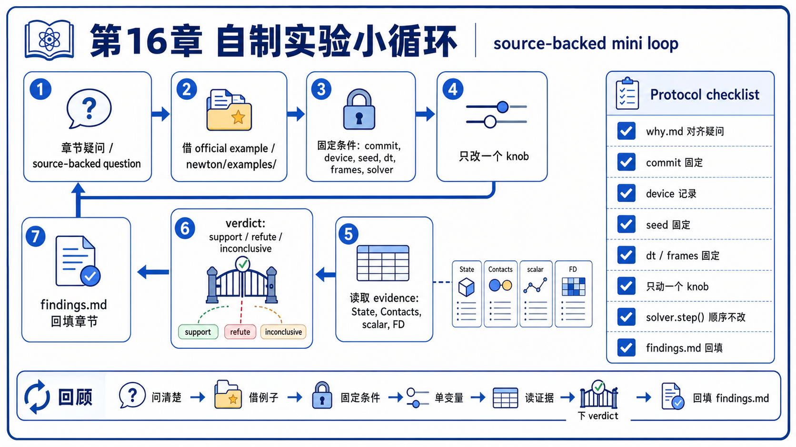
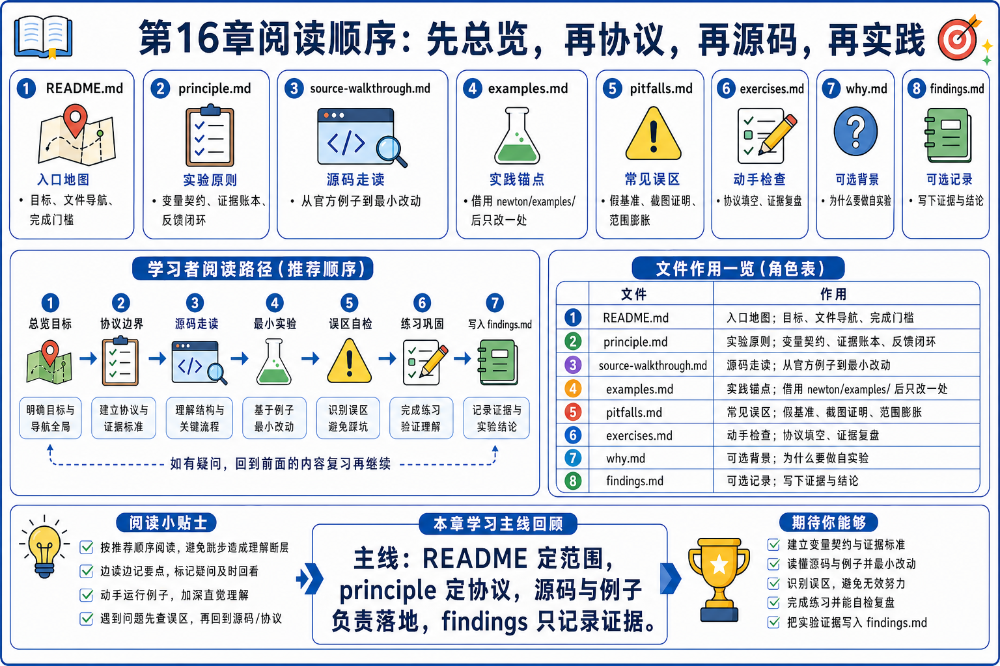
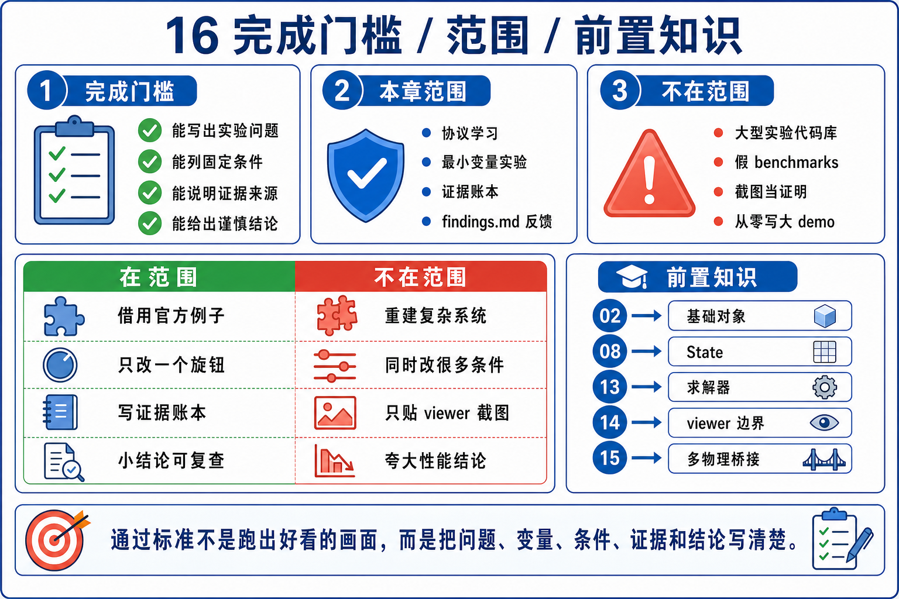

# 16 自制小实验：source-backed mini loop

Chapter 13 讲了 `forward -> loss -> backward -> FD -> update` 的验证闭环。Chapter 14 把 viewer 放回 read / log / render 边界。Chapter 15 又把多物理写成 `Model / State / Contacts / Solver` 的耦合边界。Chapter 16 不再引入一个新物理专题，而是回答最后一个问题：

```text
当我想自己改一个参数、替换一个 solver、加一个指标或扩展一个例子时，
怎样把它缩成一个可复现、可验证、可解释的小实验？
```

第一遍只守住这句话：

```text
自制实验不是另起主线；
它只验证一个 source-backed 问题。
```



## 文件分工

- `README.md`: 立住 Chapter 16 的实验闭环、范围边界、完成门槛和阅读顺序。
- `principle.md`: 讲清 source-of-truth buffer、单变量契约、证据账本和 findings 回流。
- `source-walkthrough.md`: 沿 `basic_pendulum` 串最小源码闭环，再分支到 diagnostics、diffsim 和 multiphysics。
- `examples.md`: 给代表性官方例子分配唯一实验任务。
- `pitfalls.md`: 记录自制实验最容易误判的地方。
- `exercises.md`: 用小题检查能不能把一个想法改写成可验证 protocol。



迁移记录：本次 preflight 只发现 `main` 上的 Chapter 16 骨架 README，没有旧 Chapter 16 分支、worktree 或正文可迁移；因此本章按当前 Newton 源码锚点重新编写。

## 本章目标

- 能从一个 Newton example 里标出 `Model / State / Control / Contacts / Solver / Viewer`。
- 能判断自己要改的是 builder-time、model-time、state-time、control-time、solver-time 还是 viewer-time 变量。
- 能把“我想试试”改写成一个 single-question experiment。
- 能一次只改一个变量，并把固定条件写清楚。
- 能用 `test_body_state()`、`test_particle_state()`、scalar diagnostics、loss / FD check 或 bridge buffer 做证据。
- 能解释 viewer output 为什么只是观察辅助，不是 correctness proof。
- 能把实验结论写回 `findings.md`、pitfalls、exercises 或对应章节完成门槛。

## First-Pass Spine

```text
choose one source-backed question
-> borrow the smallest official example
-> mark source-of-truth buffers
-> freeze commit / device / seed / dt / frames / solver
-> change exactly one knob
-> run a fixed protocol
-> evaluate state predicate / scalar / buffer / FD check
-> write findings
-> feed the result back to the relevant chapter
```

## 本章范围

第一遍覆盖：

- `basic_pendulum` 作为最小主锚点：builder、model、state、contacts、solver、predicate、viewer。
- `examples.run()` 的 fixed-frame / test-mode / NaN guard 外层闭环。
- `State`、`Model.state()`、`Model.control()`、`Model.contacts()`、`Model.collide()` 的 source-of-truth 边界。
- `ViewerBase.log_state()`、`log_contacts()` 和 `apply_forces()` 的读写边界。
- `basic_shapes` 作为 one-knob solver / shape / material variation。
- `basic_plotting` 作为 scalar diagnostics branch。
- `diffsim_ball` 作为 verify-before-optimize advanced branch。
- `softbody_dropping_to_cloth` 与 `mpm_twoway_coupling` 作为 boundary-aware multiphysics branch。

第一遍不覆盖：

- 在本仓库直接创建大型实验代码仓。`experiments/` 只在问题真的需要时创建。
- 重讲所有 solver、MPM、DiffSim 或 viewer 理论。前面章节已经负责。
- 声称任何参数修改都会自动安全或自动生效。
- 声称画面稳定就证明实验正确。
- 用未运行的数据、伪 benchmark、伪命令输出或生成图里的数值当证据。



## GAMES103 已有 vs 本章新增

| 维度 | GAMES103 已有 | 本章新增 |
|------|----------------|----------|
| 物理 / 数学视角 | 理论课会给出现象、方程、稳定性直觉和参数影响。 | 先把直觉改写成可测试假设，再限定变量和证据。 |
| Newton 工程视角 | 前面章节已经讲 `Model / State / Control / Contacts / Solver / Viewer`。 | 本章把这些对象变成实验 protocol：谁是 source of truth，谁只是记录或展示。 |
| GPU / Warp 视角 | kernel、array、capture、tape 是执行机制。 | 实验必须固定 device / graph / seed / frame count，并记录是否比较了同一执行条件。 |
| 学习方法视角 | 传统课程通常只看示例结果。 | 本章要求留下可复现证据账本和 findings，而不是只保存截图。 |

## 前置依赖

- 必读 `02_newton_arch`，知道 `Model / State / Control / Solver` 的基本分工。
- 必读 `08_rigid_solvers` 或至少知道 `XPBD / VBD / MuJoCo` 不能随意互换。
- 建议先读 `13_diffsim`，知道 gradient candidate 必须过 FD hard gate。
- 建议先读 `14_viewer_integration`，避免把 viewer output 当成 proof。
- 建议先读 `15_multiphysics_pipeline`，知道跨系统实验必须先标 buffer ownership。

## 阅读顺序

1. 先读本文件，把 Chapter 16 的标题改写成 `one question, one knob, one evidence loop`。
2. 再读 `principle.md`，掌握自制实验的四个边界：source buffer、single knob、evidence ledger、feedback。
3. 再读 `source-walkthrough.md`，沿 `basic_pendulum` 看最小可复现闭环。
4. 再看 `examples.md`，决定当前想法应该借哪个 official example。
5. 最后用 `pitfalls.md` 和 `exercises.md` 检查自己有没有把截图、roadmap、单次结果或多变量混改当证据。

## 完成门槛

```text
[ ] 我能从 basic_pendulum 标出 Model / State / Control / Contacts / Solver / Viewer
[ ] 我能解释 state_0 / state_1 swap 后应该读哪个 buffer
[ ] 我能说明 viewer.log_state() / log_contacts() 读什么，apply_forces() 何时写入 force
[ ] 我能把一个想法缩成一个单变量实验
[ ] 我能写出固定条件：Newton commit、device、dt、frames、solver、seed 或 world count
[ ] 我能选出一个验证方式：state predicate、particle predicate、scalar、buffer check 或 FD check
[ ] 我能把 findings 写回对应章节，而不是只保存截图
[ ] 我能说出哪些结论不能从当前源码或单次实验推出
```

## 读完后带走什么

读完 Chapter 16 后，最该带走的是一个排查顺序：

```text
先问问题是否来自源码；
再问改的是哪一个变量；
再问结果住在哪个 source-of-truth buffer；
最后才问 viewer 怎么帮助观察。
```

自制小实验的价值不是把 Newton 变成自己的新项目，而是把前面章节的心智模型变成可以复查的证据。
