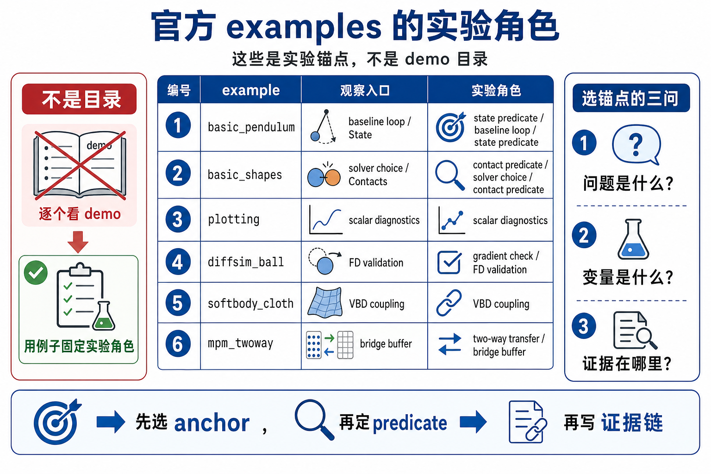
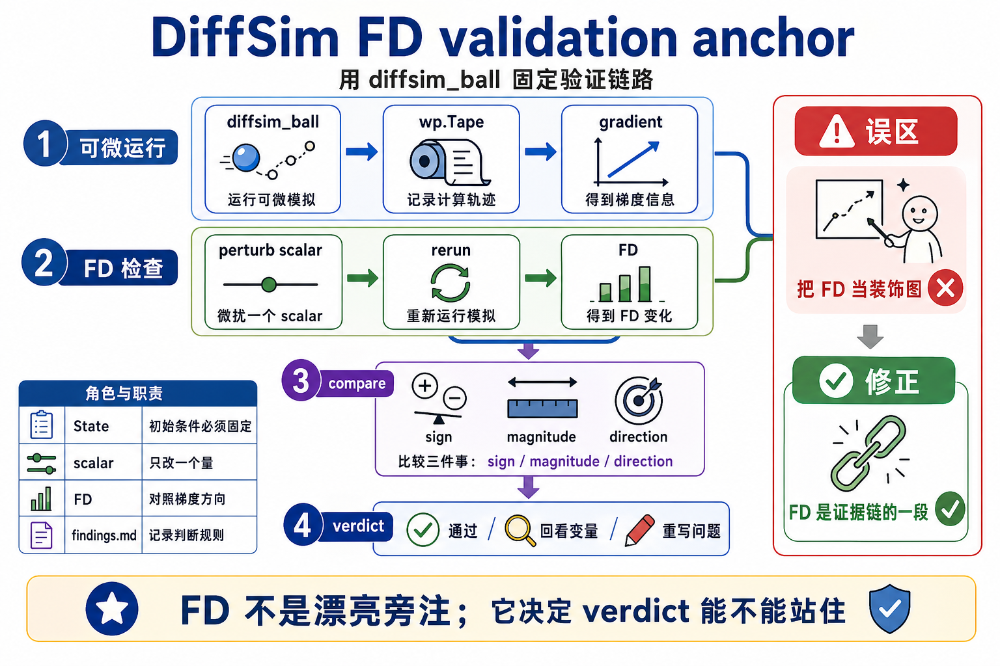

# 16 自制小实验例子注释

这页不是 example catalog。每个例子只保留一个 experiment job，帮助你选最小 baseline。



## 例子分工

| 例子 | 本章唯一 job | 第一遍看什么 | 可以跳过什么 |
|------|--------------|--------------|--------------|
| `basic_pendulum` | 最小 state predicate 闭环 | builder -> state -> solver.step -> `test_body_state()` | 所有复杂 solver 对比 |
| `basic_shapes` | one-knob solver / shape variation | `--solver xpbd/vbd` 与 rest-pose predicates | 把 solver 泛化成任意可换 |
| `basic_plotting` | scalar diagnostics | iterations、energy、active constraints 来源 | 把 plot 当唯一 proof |
| `diffsim_ball` | FD validation anchor | numeric vs analytic gradient | 直接相信 `tape.backward()` |
| `softbody_dropping_to_cloth` | single-model VBD boundary | one model, one VBD solver, particle predicates | 当成任意 solver coupling |
| `mpm_twoway_coupling` | two-model bridge boundary | rigid state、sand state、impulse bridge | 第一遍就改完整 multiphysics |

## 主例子：`basic_pendulum`

它是 Chapter 16 的主锚点，因为它已经包含所有最小元素：

- builder: 创建 links、shapes、joints、articulation 和 ground。
- model: `builder.finalize()`。
- runtime buffers: `state_0/state_1/control/contacts`。
- solver: `SolverXPBD`。
- step loop: `clear_forces -> apply_forces -> collide -> solver.step -> swap`。
- evidence: `test_body_state()`。
- viewer: `log_state()` / `log_contacts()`。

第一遍改动建议：

| 改动 | 固定条件 | 证据 |
|------|----------|------|
| `sim_substeps` | frames、dt、solver、geometry | link area predicate + velocity predicate |
| link size | frames、solver、substeps | body pose / velocity predicate |
| initial transform | frames、solver、substeps | does not explode / remains in plausible region |
| viewer backend | physics settings | state predicate 不应被 viewer 替代 |

## Anchor: DiffSim FD validation



`diffsim_ball` 是进阶 anchor。它不是 Chapter 16 第一主线，但非常适合证明一个原则：

```text
loss 下降不等于 gradient 已可信；
analytic gradient 要过 numeric FD check。
```

第一遍只看四段：

| 代码段 | 做了什么 | 为什么要这样读 |
|--------|----------|----------------|
| `finalize(requires_grad=True)` | 创建可微 model/state | 可微路径从 allocation 就开始。 |
| `wp.Tape()` | 记录 forward | backward 只对 tape 里的计算有效。 |
| `loss_kernel` | 从 final state 写 loss | loss 来源必须明确。 |
| `check_grad()` | numeric vs analytic | 这是 gradient candidate 的验收门。 |

## 对照：`basic_plotting`

`basic_plotting` 的 job 是提醒你：scalar diagnostics 也要有来源。

它的 iterations、energy、active constraints 来自 MuJoCo solver data，再通过 `viewer.log_scalar()` 记录。这个 scalar 可以帮助理解 solver 行为，但结论要写成：

```text
在这个 solver / model / frame count 下，某个诊断指标如何变化。
```

不要写成：

```text
所有 solver 都有相同指标，且图像曲线证明物理正确。
```

## 对照：multiphysics branches

`softbody_dropping_to_cloth` 和 `mpm_twoway_coupling` 都适合做 Chapter 16 后半练习，但它们属于不同 boundary：

| 例子 | boundary | 实验前先标什么 |
|------|----------|----------------|
| `softbody_dropping_to_cloth` | single `Model` + `SolverVBD` | particles, contacts, bbox predicate |
| `mpm_twoway_coupling` | rigid model + sand model + bridge | `state_0`, `sand_state_0`, `collider_impulses`, `body_sand_forces` |

如果还不能画出 buffer ownership，就不要急着改参数。

## 最小 experiment note 模板

```text
Question:
Baseline example:
Changed knob:
Fixed conditions:
Evidence source:
Command or run mode:
Verdict:
Follow-up update:
```

第一遍只要这个模板能填完整，就比新建一个复杂 demo 更有价值。
