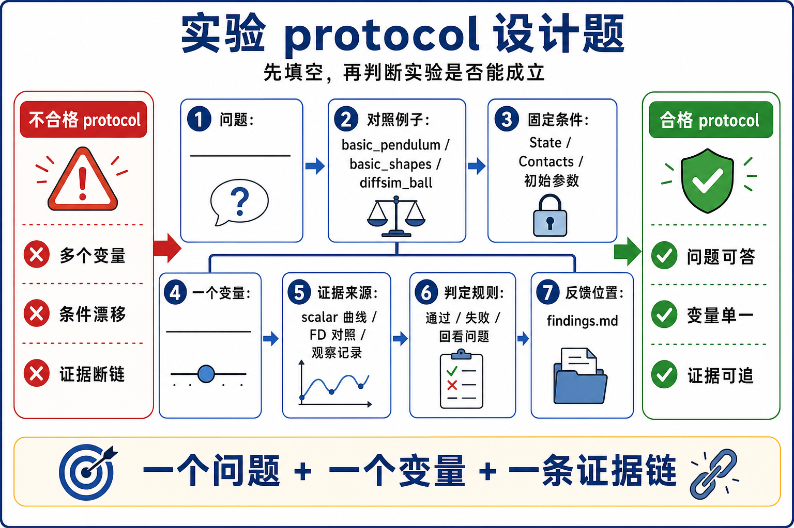

# 16 自制小实验练习

这些练习只服务一个目标：你能不能把“我想试试”改写成一个可验证 protocol。



## 练习 1：把想法缩成一个问题

把下面想法改写成 single-question experiment：

```text
我想看看 basic_pendulum 改小 substeps 会不会坏。
```

参考答案：

```text
Question: 在固定 frame count、dt、solver 和 geometry 下，basic_pendulum 的 sim_substeps 从 10 改到 5 后，links 是否仍通过原有 body position / velocity predicates？
Baseline: basic_pendulum, sim_substeps=10
Changed knob: sim_substeps=5
Evidence: test_body_state() on state_0
Verdict options: support / refute / inconclusive
```

## 练习 2：标 source-of-truth buffer

读下面变量名，判断它属于 source-of-truth、bridge、diagnostic 还是 viewer output：

```python
self.state_0.body_q
self.contacts
self.log_iterations
self.viewer.log_state(self.state_0)
self.collider_impulses
self.loss_history
```

参考答案：

- `self.state_0.body_q`: source-of-truth state buffer。
- `self.contacts`: collision result buffer，前提是当前 step 已 collide。
- `self.log_iterations`: solver diagnostic record，来源要追到 solver data。
- `viewer.log_state(...)`: viewer output，读取 state。
- `self.collider_impulses`: MPM bridge buffer。
- `self.loss_history`: optimization diagnostic，不能替代 FD check。

## 练习 3：给 `basic_shapes` 设计 one-knob 实验

选择一个变量：

```text
solver choice: xpbd -> vbd
shape size: box hx/hy/hz
material parameter: contact stiffness / friction
frame count
```

写出 fixed conditions 和 evidence。

参考答案示例：

```text
Question: 在同样 geometry、dt、substeps、frames 下，把 basic_shapes solver 从 xpbd 改成 vbd 后，sphere / box / bunny 是否仍通过 rest-pose predicates？
Changed knob: --solver vbd
Fixed: geometry、dt、substeps、frames、device、viewer
Evidence: basic_shapes.test_final() 的 per-body predicates
Not evidence: 只看 shape 是否落在地面上
```

## 练习 4：解释 scalar 的来源

`basic_plotting` 记录：

```text
Solver Iterations
Kinetic Energy
Potential Energy
Active Constraints
```

问题：这些 scalar 是 source-of-truth 吗？

参考答案：

```text
它们是 solver diagnostic evidence，来自 MuJoCo solver data 的读取，再通过 viewer.log_scalar() 记录。
它们可以说明这个 solver / model / frame count 下的诊断变化，但不能单独证明所有物理结果正确。
```

## 练习 5：DiffSim FD 验收

解释下面两类 gradient 从哪里来：

```text
analytic gradient
numeric gradient
```

参考答案：

- analytic gradient: `wp.Tape()` 记录 forward 后，通过 `tape.backward(loss)` 得到。
- numeric gradient: 对参数做 `+eps/-eps` 扰动，分别跑 forward，用有限差分估计。
- Verdict: 两者在 tolerances 内接近，才把 analytic gradient 当作可信候选。

## 练习 6：MPM bridge ownership

把下面对象分到 rigid side、sand side 或 bridge：

```python
self.state_0
self.sand_state_0
self.collider_impulses
self.body_sand_forces
self.contacts
self.viewer.log_points("/sand", ...)
```

参考答案：

- rigid side: `self.state_0`, `self.contacts`。
- sand side: `self.sand_state_0`。
- bridge: `self.collider_impulses`, `self.body_sand_forces`。
- viewer output: `viewer.log_points("/sand", ...)`。

## 练习 7：写最小 findings

用下面格式写一个 findings，不需要真实运行数据，但每格必须能回答：

```text
Question:
Baseline:
Changed knob:
Fixed conditions:
Evidence source:
Verdict:
Follow-up update:
```

参考答案的形状：

```text
Question: basic_pendulum substeps=5 是否仍通过 position/velocity predicate？
Baseline: basic_pendulum substeps=10
Changed knob: sim_substeps=5
Fixed conditions: commit 0f583176, SolverXPBD, dt, frames, geometry, device
Evidence source: test_body_state() reading state_0.body_q/body_qd
Verdict: inconclusive until run result is recorded
Follow-up update: 如果失败，回填 pitfalls: substeps changes require predicate threshold review
```
