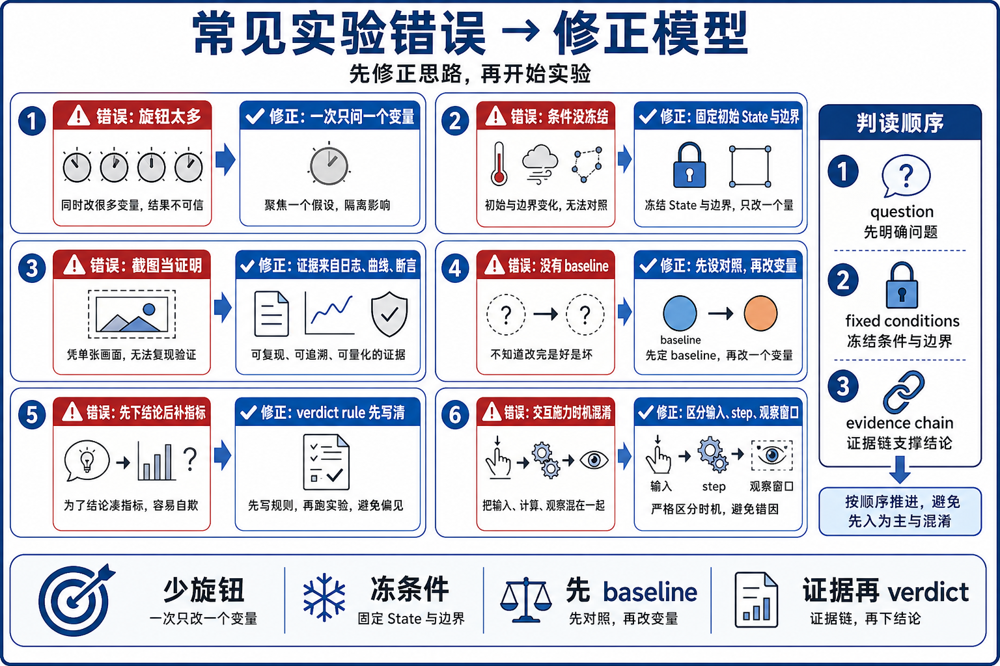

# 16 自制小实验易错点



## 1. 一次改太多变量

错误直觉：

```text
我同时换 solver、改 dt、改几何、开 CUDA graph、换 viewer，更快看到差异。
```

纠正：

```text
第一遍只改一个 knob，其余条件固定。
```

检查方法：

- 写出 baseline。
- 写出 changed knob。
- 如果 changed knob 超过一个，先拆实验。

## 2. 把 viewer output 当 source-of-truth

错误直觉：

```text
动画看起来稳定，所以实验通过。
```

纠正：

```text
viewer.log_state() / log_contacts() 是 read/log/render；实验结论要回到 State、Contacts、solver data 或 FD。
```

额外注意：viewer 不是绝对只读。`apply_forces(state)` 可以在 step 前写 force，因此要说清你讨论的是 viewer output 还是 viewer interaction force。

## 3. 忘记 state swap

错误直觉：

```text
我创建了 state_0 和 state_1，随便读一个都可以。
```

纠正：

```text
多数 example 在 solver.step() 后 swap state_0/state_1；
test_final() 通常读当前 state_0。
```

检查方法：

- 找 `self.state_0, self.state_1 = self.state_1, self.state_0`。
- 写 predicate 前确认读的是 swap 后的 current state。

## 4. 使用 stale contacts

错误直觉：

```text
contacts 已经分配过，随时都代表当前接触。
```

纠正：

```text
Model.contacts() 只是分配 buffer；Model.collide(state, contacts) 才用当前 state 填它。
```

检查方法：

- 在当前 step 里找 `model.collide()` 或自定义 collision pipeline。
- 对 DiffSim 或 external bridge 例子，确认 contacts 是何时更新的。

## 5. 改 model 参数后忘记 solver notification

错误直觉：

```text
我改了 model.gravity 或材料参数，solver 会自动知道。
```

纠正：

```text
某些 runtime model 修改需要通知 solver，例如 set_gravity() 文档提示调用 notify_model_changed(MODEL_PROPERTIES)。
```

检查方法：

- 区分 builder-time、model-time、state-time、control-time。
- 查目标 solver 是否缓存了对应属性。

## 6. 直接相信 gradient

错误直觉：

```text
tape.backward() 跑通了，所以梯度可信。
```

纠正：

```text
backward 给的是 gradient candidate；Chapter 13 / diffsim_ball 都要求 numeric vs analytic FD check。
```

检查方法：

- 找 `check_grad()` 或自己写 epsilon sweep。
- 不要只看 loss 下降。

## 7. 把 solver choice 泛化成任意可替换

错误直觉：

```text
basic_shapes 支持 xpbd/vbd，所以其他例子也可以随便换 solver。
```

纠正：

```text
每个 example 自己定义支持范围。softbody_dropping_to_cloth 明确只支持 VBD。
```

检查方法：

- 看 parser `choices`。
- 看是否有 `raise ValueError`。
- 换 solver 前先找源码支持。

## 8. 多物理实验没标 buffer ownership

错误直觉：

```text
只要画面里有 rigid 和 sand，就是一个大 solver 在耦合。
```

纠正：

```text
mpm_twoway_coupling 有 rigid state、sand state、collider impulses 和 body_sand_forces；
先标 bridge，再谈实验。
```

检查方法：

- 找几个 `ModelBuilder.finalize()`。
- 找几套 state。
- 找 bridge buffers。

## 9. 只存截图，不写 findings

错误直觉：

```text
截图能说明我做过实验。
```

纠正：

```text
截图只能辅助记忆。findings 必须写出 question、baseline、knob、fixed conditions、evidence 和 verdict。
```

检查方法：

- 没有 `Evidence source` 就不算完成。
- 没有 `Verdict` 就不算闭环。
- 没有回填章节就没有服务学习主线。
