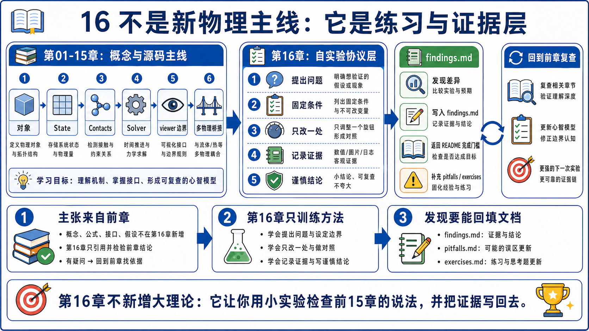
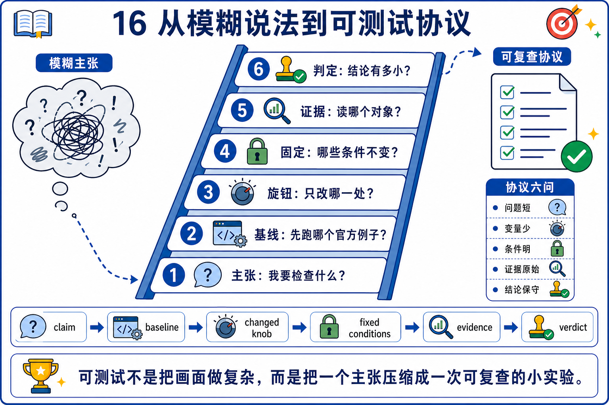
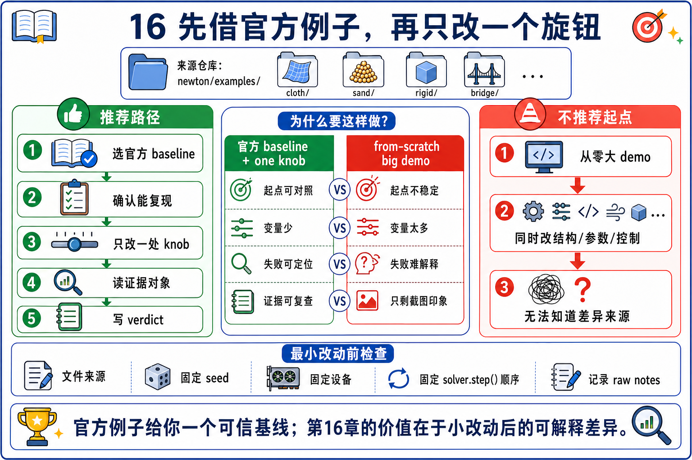
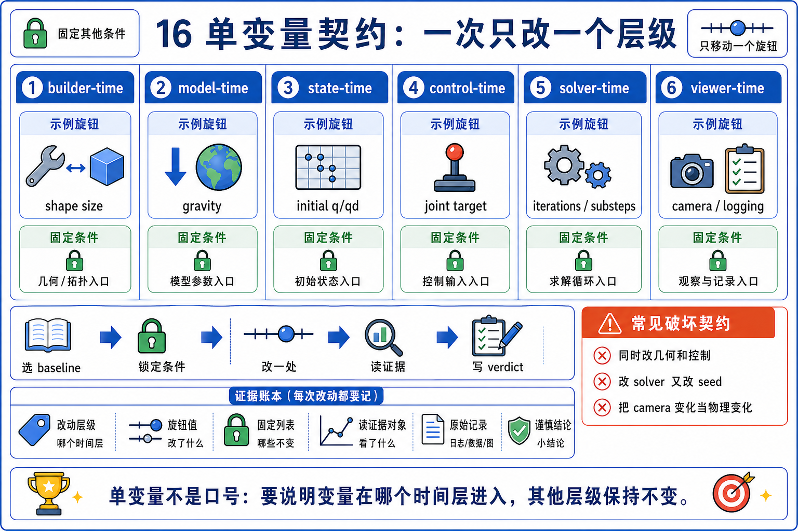
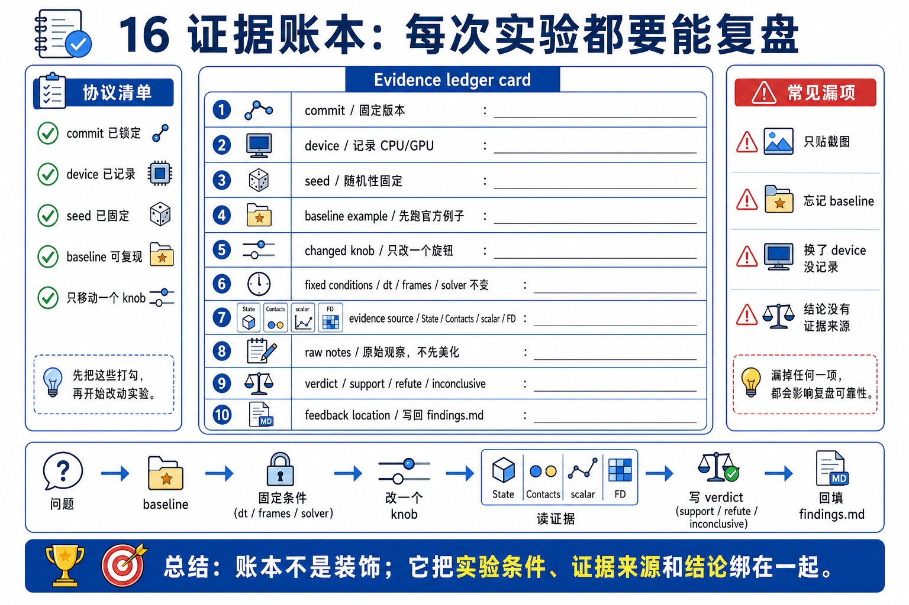
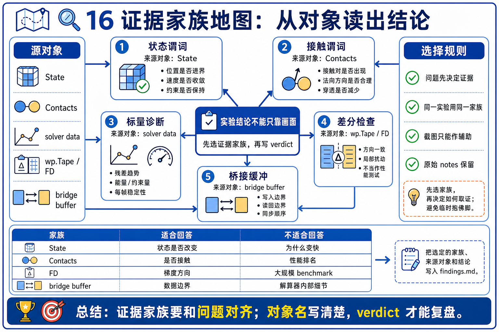
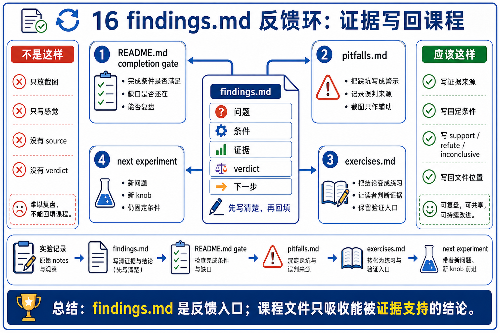
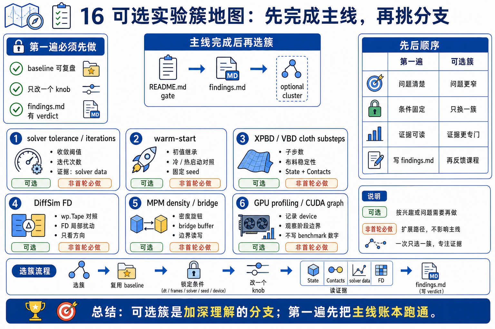

# 16 自制小实验原理

Chapter 16 的核心不是“写更多 demo”，而是把一个学习疑问缩成可验证 protocol。

```text
source-backed question
-> one variable
-> fixed conditions
-> source-of-truth evidence
-> written findings
```



## 0. 它不是新主线

前面章节已经分别讲了架构、几何、scene import、solver、cloth、MPM、DiffSim、viewer 和 multiphysics。Chapter 16 不重新讲一遍这些理论。

它只做一件事：

```text
把章节结论变成一个最小可复现实验，
再把实验发现写回章节理解。
```

如果一个实验需要同时改 solver、collision、viewer、asset、GPU graph、loss 和 benchmark，它第一遍就太大了。先把问题缩小到一个变量。

## 1. 从疑问到 protocol

自制实验的第一步不是开写代码，而是把疑问拆成五格：

| 格子 | 要写清的问题 | 例子 |
|------|--------------|------|
| Claim | 我想验证哪句话 | `substeps` 变少后 pendulum 仍不穿地 |
| Baseline | 借哪个官方例子 | `basic_pendulum` |
| Knob | 只改哪个变量 | `sim_substeps` |
| Fixed | 哪些条件不动 | commit、device、dt、frames、solver |
| Evidence | 用什么判定 | `test_body_state()`、NaN guard、scalar |



## 2. 先借 official example

优先从 `newton/examples/` 反向借鉴，而不是从零写大型 demo。原因很简单：

- 官方 example 已经有 `ModelBuilder -> Model -> State -> Solver -> render/test` 的骨架。
- 很多 example 已经有 `test_final()` 或可复用的 predicate。
- runner 已经提供 fixed-frame、test mode 和 NaN guard。
- 你只需要标出自己要改的变量和证据位置。



第一遍最稳的主锚点是 `basic_pendulum`：

```text
builder.add_link/add_shape/add_joint
-> model = builder.finalize()
-> state_0/state_1/control/contacts
-> clear_forces/collide/solver.step/state swap
-> test_body_state()
-> viewer.log_state/log_contacts()
```

## 3. 一次只改一个变量

单变量契约不是形式主义。它是避免误判的最低成本方法。

| 变量层 | 可以改什么 | 需要小心什么 |
|--------|------------|--------------|
| builder-time | shape size、mass、initial transform、joint layout | 通常要重新 `finalize()` |
| model-time | gravity、contact property、material property | 某些 solver 需要 `notify_model_changed()` |
| state-time | initial q/qd、forces、reset state | state swap 后别读错 buffer |
| control-time | joint target、activation、feedforward force | 要说明控制何时写入 |
| solver-time | iterations、tolerance、substeps、solver choice | 不同 example 不一定支持同样 solver |
| viewer-time | camera、logging、interaction force | viewer output 不是 proof |



## 4. source-of-truth buffer first

实验判断要先找证据住在哪里。

`State` 是 time-varying simulation state：particle/body positions、velocities、forces、joint coordinates。`State.clear_forces()` 会清 force arrays，`State.assign()` 可以复制 state arrays，`State.requires_grad` 说明 state 是否启用梯度。

`Model.state()` 从 model 初始配置创建 state；`Model.control()` 创建 control；`Model.contacts()` 分配 contacts buffer；`Model.collide(state, contacts)` 用当前 state 填 contacts。

这给 Chapter 16 一个固定顺序：

```text
先读 State / Contacts / solver data；
再读 viewer log；
最后才看截图或动画。
```



## 5. 证据家族

不同实验要用不同证据，不能全部归结成“看起来稳定”。

| 实验问题 | 优先证据 | 代表锚点 |
|----------|----------|----------|
| 刚体是否在合理区域 | `test_body_state()` | `basic_pendulum`, `basic_shapes` |
| 粒子/布料是否爆炸或穿透 | particle bbox / z min | `softbody_dropping_to_cloth` |
| solver 是否变难 | iterations / active constraints / energy | `basic_plotting` |
| 梯度是否可信 | numeric vs analytic FD | `diffsim_ball` |
| 多物理 bridge 是否按边界交换 | impulse / body force buffers | `mpm_twoway_coupling` |
| viewer 是否只是显示 | `log_state()` / `log_contacts()` | Chapter 14, viewer base API |



## 6. findings 要回流

实验如果只停在一个截图或一段命令输出，就没有服务学习闭环。

最小 findings 应该写清：

```text
Question
Baseline
Changed knob
Fixed conditions
Evidence read from which buffer
Verdict: support / refute / inconclusive
What to update in README / pitfalls / exercises
```



## 7. 典型实验簇

Chapter 16 可以容纳多种实验，但第一遍只把它们当成模板，不要求立刻创建所有代码。

| 实验簇 | 对应章节 | 第一遍问题 |
|--------|----------|------------|
| solver tolerance / iterations | `08_rigid_solvers` | 收敛和稳定性指标怎么变 |
| warm-start on/off | `08_rigid_solvers` | 是否减少迭代或改善稳定 |
| XPBD / VBD cloth substeps | `09`, `10` | substeps 与穿透/振荡的关系 |
| DiffSim FD validation | `13_diffsim` | analytic gradient 是否可信 |
| MPM density / bridge | `11`, `15` | 粒子密度或 bridge buffer 如何影响结果 |
| GPU profiling / CUDA graph | `01`, `08`, `11` | 同样物理条件下吞吐如何变化 |



## 8. 与 Newton 实现的映射

| 原理项 | Newton 路径 / 函数 | 第一遍角色 |
|--------|---------------------|------------|
| minimal build loop | `newton/examples/basic/example_basic_pendulum.py:L32-L85` | 从 builder 到 viewer setup。 |
| minimal simulate loop | `example_basic_pendulum.py:L95-L107` | clear forces, collide, step, swap。 |
| predicate in example | `example_basic_pendulum.py:L116-L145` | state predicate + render boundary。 |
| runner loop | `newton/examples/__init__.py:L265-L337` | fixed loop, test mode, NaN guard。 |
| body predicate helper | `newton/examples/__init__.py:L50-L125` | `test_body_state()`。 |
| particle predicate helper | `newton/examples/__init__.py:L128-L182` | `test_particle_state()`。 |
| state semantics | `newton/_src/sim/state.py:L9-L190` | time-varying q/qd/f buffers。 |
| model runtime allocation | `newton/_src/sim/model.py:L808-L1003` | state/control/contacts/collide APIs。 |
| viewer read/log boundary | `newton/_src/viewer/viewer.py:L457-L507` and `L599-L645` | state/contact logging。 |
| viewer force hook | `viewer.py:L1238-L1246` | `apply_forces()` can write force before step。 |
