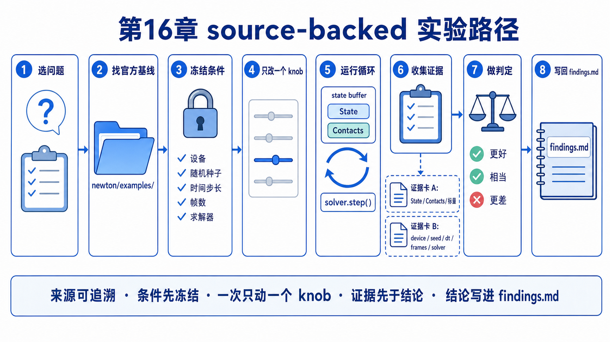
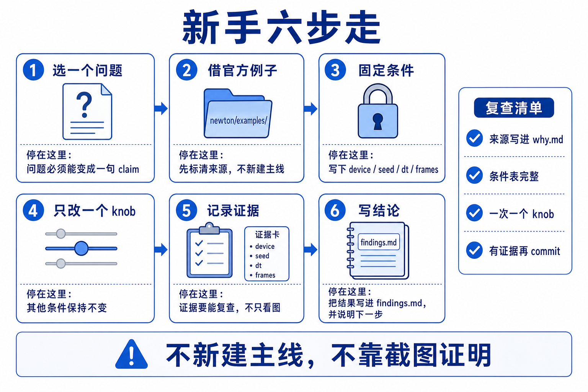
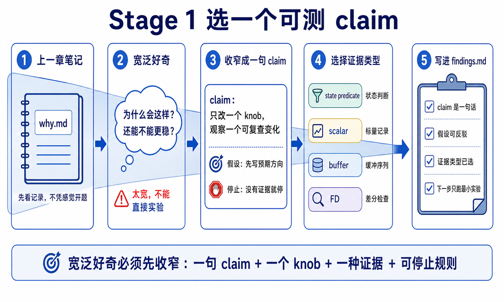
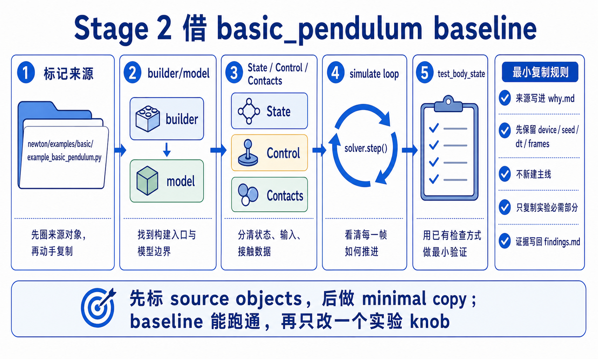
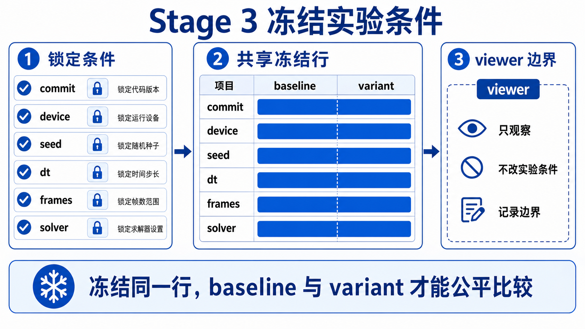
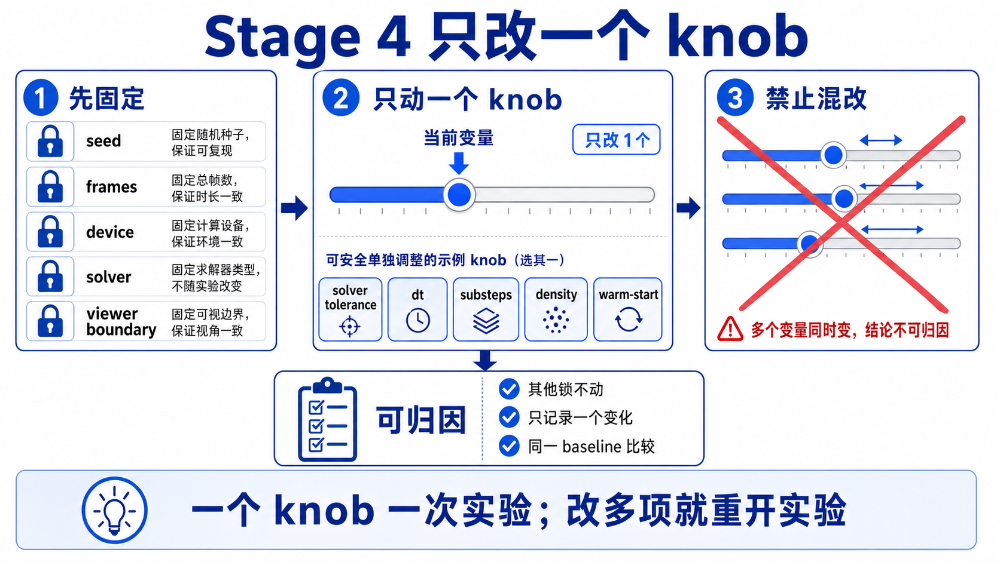
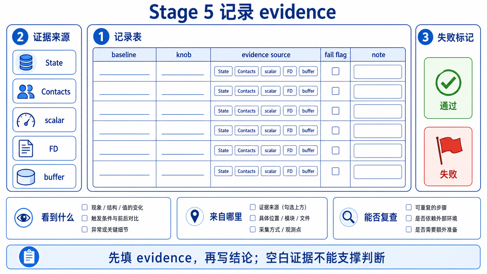
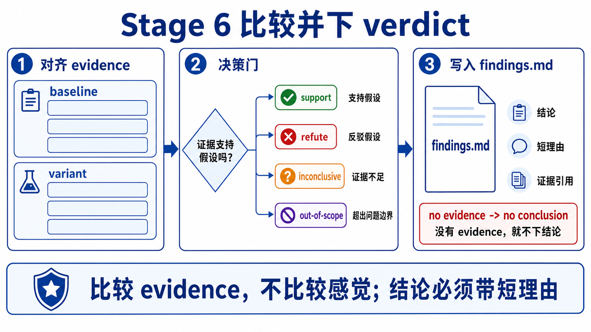
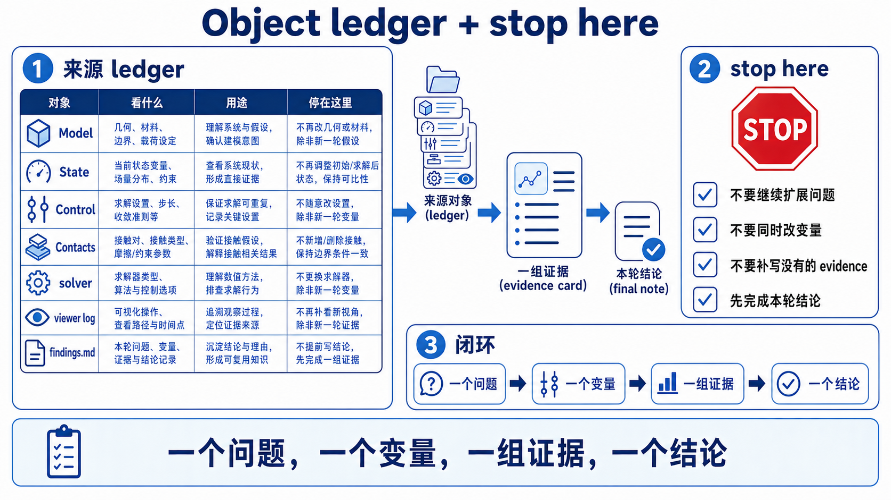

# 16 自制小实验源码走读

这份 walkthrough 只追 first-pass 主线：怎样从一个 official example 借出最小实验闭环，并用 source-of-truth evidence 验证。

```text
official example
-> mark buffers
-> change one knob
-> fixed runner
-> predicate / scalar / buffer check
-> viewer as observation
```



## Beginner Path

1. 先看 Stage 1。把章节结论缩成一个可验证 claim。
2. 再看 Stage 2。从 `newton/examples/` 选最小 baseline。
3. 再看 Stage 3。固定 commit、device、dt、frames、solver 和 seed。
4. 再看 Stage 4。一次只改一个 knob。
5. 再看 Stage 5。记录 state predicate、scalar、FD 或 buffer evidence。
6. 再看 Stage 6。把多次运行变成 verdict。
7. 最后看 object ledger，确认每个文件和 buffer 的 source-of-truth 角色。



## Main Walkthrough: `basic_pendulum`

### Stage 1: 选择一个 claim

**Claim**

不要从“大改 Newton”开始。先从一句章节结论开始：

```text
在 fixed frame count 下，basic_pendulum 的 links 仍应停留在合理空间范围内，
并且不出现离谱的 out-of-plane velocity。
```



这个 claim 可以被 `test_body_state()` 检查，也能回扣 Chapter 02 / 05 / 08 的 `Model -> State -> Solver` 主线。

### Stage 2: 借最小 baseline example

`basic_pendulum` 的构建段很短：

```python
builder = newton.ModelBuilder()
link_0 = builder.add_link()
builder.add_shape_box(link_0, ...)
link_1 = builder.add_link()
builder.add_shape_box(link_1, ...)
builder.add_joint_revolute(...)
builder.add_articulation([j0, j1], label="pendulum")
builder.add_ground_plane()
self.model = builder.finalize()
```

Source-ref: `newton/examples/basic/example_basic_pendulum.py:L32-L70`.



接着它创建 solver 和 runtime buffers：

```python
self.solver = newton.solvers.SolverXPBD(self.model)
self.state_0 = self.model.state()
self.state_1 = self.model.state()
self.control = self.model.control()
self.contacts = self.model.contacts()
self.viewer.set_model(self.model)
```

Source-ref: `example_basic_pendulum.py:L72-L85`.

**Verification cues**

- `model` 是结构和初始配置。
- `state_0/state_1` 是运行时动态状态。
- `contacts` 要等 `model.collide()` 填入。
- viewer 只是接收 model，用于后续观察。

### Stage 3: 固定条件

一次自制实验至少固定这些条件：

```text
newton_commit = 0f583176
example = basic_pendulum
device = fixed
frame_dt / sim_dt = fixed
num_frames = fixed
solver = SolverXPBD
viewer = null / headless / chosen backend
```



runner 外层会在 viewer 运行时重复 step/render；测试模式结束后会跑 `test_final()`，并检查 `state_0/state_1/model/control/contacts` 的 NaN。

Source-ref: `newton/examples/__init__.py:L265-L337`.

### Stage 4: 只改一个 knob

`basic_pendulum` 的 runtime loop 是最小模板：

```python
for _ in range(self.sim_substeps):
    self.state_0.clear_forces()
    self.viewer.apply_forces(self.state_0)
    self.model.collide(self.state_0, self.contacts)
    self.solver.step(self.state_0, self.state_1, self.control, self.contacts, self.sim_dt)
    self.state_0, self.state_1 = self.state_1, self.state_0
```

Source-ref: `example_basic_pendulum.py:L95-L107`.



第一遍可以只改：

- `sim_substeps`
- link size
- initial transform
- solver iterations in another example
- fixed frame count

不要同时改 geometry、solver、dt、viewer backend 和 predicate threshold。

### Stage 5: 记录 evidence

`basic_pendulum.test_final()` 已经给了最小证据：

```python
newton.examples.test_body_state(
    self.model,
    self.state_0,
    "pendulum links in correct area",
    lambda q, qd: abs(q[0]) < 1e-5 and abs(q[1]) < 1.0 and q[2] < 5.0 and q[2] > 0.0,
    [0, 1],
)
```

Source-ref: `example_basic_pendulum.py:L116-L139`.



`test_body_state()` 本身读取 `state.body_q/body_qd`，失败时抛 `ValueError`。这比“截图看起来还行”更适合作为自制实验第一证据。

Source-ref: `newton/examples/__init__.py:L50-L125`.

### Stage 6: verdict 不是单次截图

把结果写成四类之一：

| Verdict | 使用场景 |
|---------|----------|
| support | predicate / scalar / buffer check 在固定条件下支持 claim |
| refute | fixed protocol 下重复失败，且失败来自目标 evidence |
| inconclusive | 结果不稳定、条件未固定、阈值不清或需要更多 seed |
| out of scope | 问题需要更大实验或源码不支持当前说法 |



## Branch A: one-knob `basic_shapes`

`basic_shapes` 比 `basic_pendulum` 多了 solver choice 和多个 shape。它只暴露 `choices=["vbd", "xpbd"]`，不能随意写成所有 solver 可互换。

Source-ref: `newton/examples/basic/example_basic_shapes.py:L25-L126` and `L230-L245`.

它的 `test_final()` 对每个 body 写 rest-pose predicate，适合练习“改一个 shape 或 solver choice 后怎样调整证据”。

Source-ref: `example_basic_shapes.py:L157-L227`.

## Branch B: scalar diagnostics `basic_plotting`

`basic_plotting` 读取 MuJoCo solver data，记录 iterations、energy 和 active constraints：

```python
self.log_iterations.append(...)
self.log_energy_kinetic.append(...)
self.log_energy_potential.append(...)
self.log_nefc.append(...)
self.viewer.log_scalar(...)
```

Source-ref: `newton/examples/basic/example_basic_plotting.py:L74-L132`.

它说明 scalar 可以是证据，但必须说清来源：solver data、state buffer、contacts buffer，还是 viewer cache。

## Branch C: verify-before-optimize `diffsim_ball`

`diffsim_ball` 是 Chapter 13 的进阶回扣：

```text
finalize(requires_grad=True)
-> CollisionPipeline(... requires_grad=True)
-> wp.Tape()
-> forward()
-> tape.backward(loss)
-> step_kernel(initial_velocity, grad)
-> check_grad()
```

Source-ref: `newton/examples/diffsim/example_diffsim_ball.py:L84-L164` and `L210-L255`.

第一遍只把它当成高级实验：gradient descent 之前先做 numeric vs analytic FD。

## Branch D: boundary-aware multiphysics

`softbody_dropping_to_cloth` 明确只支持 VBD，且 soft body 和 cloth 进入同一个 `Model`。

Source-ref: `newton/examples/multiphysics/example_softbody_dropping_to_cloth.py:L33-L99` and `L113-L150`.

`mpm_twoway_coupling` 是两套 model/state/solver 和显式 impulse bridge：

```text
rigid model/state
sand model/state
collider_impulses
body_sand_forces
SolverMuJoCo
SolverImplicitMPM
```

Source-ref: `newton/examples/mpm/example_mpm_twoway_coupling.py:L99-L173` and `L188-L252`.

这两个例子适合做 Chapter 16 的边界练习，不适合作为第一遍从零改的大型实验。

## Object Ledger



| 对象 / 文件 | 第一遍角色 | source-of-truth 风险 |
|-------------|------------|----------------------|
| `why.md` | 写问题、baseline、knob、fixed conditions | 没写清就无法复现 |
| experiment code | 只承载最小改动 | 不要变成大型 demo |
| `State` | dynamic q/qd/f source-of-truth | state swap 后可能读错 |
| `Contacts` | collision result buffer | stale contacts 会误导 |
| solver data | iterations、energy、constraint count 等 | 只对对应 solver 有意义 |
| `viewer.log_*` | read/log/render output | 不替代 predicate |
| `findings.md` | verdict 和回流位置 | 不写就没有学习闭环 |

## Stop Here

第一遍读到这里就够了。你应该能把 Chapter 16 讲成下面这句：

```text
自制小实验就是把一个源码支持的问题，
压成单变量 protocol，
再用 State / Contacts / scalar / FD 证据回答它。
```
